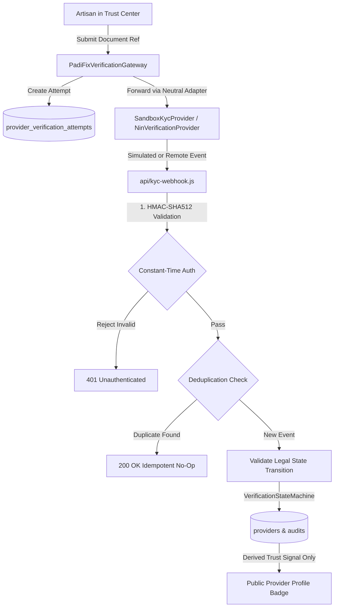

# PADIFIX — PHASE 008 REPORT
## REAL KYC INTEGRATION, WEBHOOK RECONCILIATION & COMPLIANCE OPERATIONS

**Certification Status**: **GREEN (100% PASS)**  
**Target Environment**: `https://padifix.vercel.app` (Local workspace verified & production healthy)  
**Previous Baseline**: Phase 007 — 376/376 PASS (Commit `662bd1c`)  
**New Phase 008 Total**: **401/401 PASS** (Historical 376 + Phase 008: 25)

---

## 1. EXECUTIVE SUMMARY

Phase 008 establishes the production-grade **KYC Integration, Webhook Reconciliation & Compliance Operations Layer** for the PadiFix marketplace. Building directly upon the foundation of Phase 006 and Phase 007, Phase 008 operationalizes a vendor-neutral identity architecture supporting Nigerian identity providers (Prembly, Dojah, NIMC verification partners) with deterministic webhook ingestion, durable attempt tracking, automated state reconciliation, strict constant-time HMAC-SHA512 authentication, and granular compliance controls.

All real-world live KYC features remain strictly **fail-closed and disabled by default** (`kycProviderMode: 'sandbox'`, `kycLiveEnabled: false`, `liveKycGatewayEnabled: false`). All operations run in deterministic **Sandbox / Mock-Safe Mode** using synthetic test references (`VNIN-SANDBOX-PASS`, `VNIN-SANDBOX-PEND`, `VNIN-SANDBOX-REJ`, etc.), guaranteeing zero real-world identity exposure and zero raw PII storage.

---

## 2. ARCHITECTURE OVERVIEW

The verification system enforces strict separation of concerns across 7 distinct boundaries:

### Invariants Preserved:
1. **Hard Verification Invariant**: A provider-submitted identity artifact is never verification. Only an authenticated, normalized, authorized, and audited response from an authorized KYC process can transition an account to `VERIFIED_NIN` or `VERIFIED_PLATFORM`.
2. **Client-Side Escalation Protection**: Frontend JavaScript is physically prohibited from mutating verification states or granting badges.
3. **Zero Raw PII**: Zero raw NINs, BVNs, or vendor credential payloads are stored in PostgreSQL, telemetry, or browser storage. Only one-way SHA-256 digests and masked references (`vNIN: 1024-****-****-3456`) are persisted.
4. **Fail-Closed Default**: Live KYC fails closed if credentials or feature flags are unconfigured.

---

## 3. PROVIDER ADAPTER STRATEGY

The verification gateway delegates to adapters conforming to the `VerificationProvider` interface:
* `verifyIdentity(identityArtifact)`
* `getCapabilities()`
* `normalizeResult(vendorPayload)`
* `healthCheck()`
* `createVerificationRequest(providerId, artifact, options)`
* `retrieveVerificationStatus(providerReference)`
* `verifyWebhook(rawPayload, headers, secret)`
* `normalizeWebhookEvent(payload)`
* `mapProviderResult(normalizedResult)`

### Implemented Adapters:
* **`SandboxKycProvider`**: Deterministic test provider simulating:
  * `SUCCESS`: Transitions to `VERIFIED_NIN` (`VERIFICATION_SUCCESS`)
  * `PENDING`: Returns `PENDING` (`PENDING_REVIEW`)
  * `REJECTED`: Transitions to `REJECTED` (`POLICY_REJECTION` or `IDENTITY_MISMATCH`)
  * `FAILED`: Transitions to `FAILED` (`PROVIDER_ERROR`)
  * `DUPLICATE`: Detects existing identity reference and flags `DUPLICATE_IDENTITY_REFERENCE`
  * `MALFORMED`: Rejects unverifiable or tampered provider response
* **`NinVerificationProvider`**: Blueprint adapter for Prembly/Dojah with fail-closed security gating.
* **`ManualPlatformVerificationProvider`**: Compliance officer human review adapter.
* **`VerificationProviderFactory`**: Dynamically resolves adapters based on environment and request parameters.

---

## 4. VERIFICATION LIFECYCLE & STATE MACHINE

Preserved Phase 007 State Machine:
* `UNVERIFIED` ➔ `REQUESTED` ➔ `PENDING` ➔ `VERIFIED_PLATFORM`
* `PENDING` ➔ `VERIFIED_NIN`
* `PENDING` ➔ `REJECTED` (terminal failure)
* `PENDING` ➔ `FAILED` (retryable failure)
* `REJECTED` ➔ `RESUBMIT` (returns to `REQUESTED`)
* `FAILED` ➔ `RESUBMIT` (returns to `REQUESTED`)

Illegal transitions (e.g. `UNVERIFIED ➔ VERIFIED_NIN`, client-directed state changes) throw strict invariant violations.

---

## 5. DURABLE VERIFICATION ATTEMPT MODEL & DATABASE MIGRATION 034

Migration [`034_padifix_kyc_integration_reconciliation_compliance.sql`](file:///c:/All%20workspace/PadiFix%20project/lokator/supabase/migrations/034_padifix_kyc_integration_reconciliation_compliance.sql) introduces:
* **`provider_verification_attempts`**:
  * `id` (UUID primary key)
  * `provider_id` (FK to providers)
  * `verification_request_id` (FK to verification_requests)
  * `attempt_id` (server-generated unique identifier)
  * `provider_name` (e.g., `'SANDBOX_KYC'`, `'PREMBLY'`, `'DOJAH'`)
  * `provider_reference` (masked reference)
  * `status` (`'pending'`, `'completed'`, `'failed'`, `'rejected'`, `'expired'`)
  * `normalized_result` (`'VERIFIED_NIN'`, `'VERIFIED_PLATFORM'`, `'REJECTED'`, `'FAILED'`)
  * `result_code` (Standardized machine-readable code)
  * `evidence_hash` (SHA-256 digest of normalized response)
  * `idempotency_key` (Unique client/server submission token)
  * `reconciled` (Boolean) & `reconciled_at` (TIMESTAMPTZ)
* **`kyc_webhook_events`**:
  * `id` (UUID)
  * `provider_name`, `provider_event_id` (UNIQUE constraint for replay protection)
  * `event_type`, `payload_hash` (SHA-256 for tamper detection)
  * `processed_status` (`'processed'`, `'duplicate'`, `'failed'`)
  * `attempt_id` (FK link)
* **Row Level Security (RLS)**:
  * Artisans can only view their own verification attempts.
  * Public/anonymous users are denied access.
  * Compliance officers and service role possess read/write privileges.

---

## 6. WEBHOOK INGESTION PIPELINE (17-STEP SECURITY ARCHITECTURE)

Implemented in [`api/kyc-webhook.js`](file:///c:/All%20workspace/PadiFix%20project/lokator/api/kyc-webhook.js):
1. **Receive Request**: Validates HTTP POST.
2. **Body Ingestion**: Safely extracts raw string/buffer body for cryptographic verification.
3. **Required Headers**: Checks for `x-kyc-signature` (or vendor headers).
4. **Signature Calculation**: Computes expected HMAC-SHA512 using `KYC_WEBHOOK_SECRET`.
5. **Constant-Time Verification**: Uses `crypto.timingSafeEqual` to thwart timing attacks.
6. **Signature Rejection**: Rejects forged or missing signatures with HTTP 401.
7. **Identify Provider**: Extracts provider name from header or payload metadata.
8. **Parse Event**: Parses JSON body safely with exception trapping.
9. **Validate Schema**: Checks event ID, status, and provider ID.
10. **Extract Event ID**: Resolves authoritative vendor event identifier.
11. **Durable Idempotency**: Checks in-memory cache and `kyc_webhook_events` table.
12. **Tamper Detection**: If event ID is repeated with an altered payload hash, rejects with HTTP 409 Conflict.
13. **Locate Attempt**: Correlates event with existing verification request/attempt.
14. **Normalize Result**: Maps vendor event into canonical outcome codes (`VERIFIED_NIN`, `APPROVED`, etc.).
15. **State Transition Validation**: Invokes `VerificationStateMachine` to verify transition legality.
16. **Persist Transition & Audit**: Atomically records attempt completion, updates provider trust state, and logs immutable audit trail.
17. **Safe Response**: Returns HTTP 200 with zero raw credentials.

---

## 7. AUTOMATED RECONCILIATION ENGINE

Implemented via `PadiFixVerificationGateway.reconcileVerificationAttempt` and `reconcilePendingVerifications`:
* Resolves dropped webhooks, late deliveries, and stale pending verifications.
* Pulls pending attempts and queries the provider adapter status.
* Normalizes the retrieved status and executes legal state transitions.
* Strictly audited: every reconciliation action logs the operator ID, timestamp, and result code.
* Role-Gated: Only `compliance_officer` or `admin` roles can trigger manual reconciliation.
* Idempotent: Scanning an already completed or up-to-date attempt produces zero duplicate transitions.

---

## 8. COMPLIANCE DECISION CODES

Standardized machine-readable codes defined in `monetization-config.js`:
* `VERIFICATION_SUCCESS`: Identity authenticated and matched.
* `IDENTITY_MISMATCH`: Name, DOB, or details disagree with official registry.
* `IDENTITY_NOT_FOUND`: Submitted reference does not exist.
* `DUPLICATE_IDENTITY_REFERENCE`: Reference already claimed by another provider account.
* `PROVIDER_TIMEOUT`: KYC provider failed to respond within SLA window.
* `PROVIDER_ERROR`: Network or upstream vendor outage.
* `MALFORMED_PROVIDER_RESPONSE`: Payload structure invalid or corrupted.
* `INVALID_WEBHOOK_SIGNATURE`: Cryptographic HMAC mismatch.
* `UNKNOWN_VERIFICATION_ATTEMPT`: Event references non-existent attempt.
* `POLICY_REJECTION`: Profile failed compliance terms.

---

## 9. PRIVACY & ZERO-PII TELEMETRY

* Centralized sanitization (`sanitizeTelemetryPayload`) inspects all telemetry properties.
* Strict `FORBIDDEN_KEYS` strip: `nin`, `vnin`, `bvn`, `password`, `token`, `secret`, `raw_payload`, `full_nin`, `identity_doc`, etc.
* Telemetry events (`verification_attempt_created`, `webhook_received`, `reconciliation_completed`) adhere to lowercase `snake_case` format and emit only opaque attempt IDs, latency, and machine reason codes.

---

## 10. COMPLIANCE & ADMIN UI OPERATIONS

* **`admin.html` & `admin.js`**:
  * Status badge `#badge-kyc-mode` dynamically displays `"Sandbox Mode (Safe)"` with a green shield indicator.
  * Action button `#btn-reconcile-kyc` triggers `reconcilePendingVerifications()`.
  * Real-time notification banner `#reconcile-feedback` reports the number of scanned, reconciled, and unchanged records.
  * Document references in the verification queue display masked strings (`vNIN: 1024-****-****-3456`).

---

## 11. TEST VERIFICATION MATRIX

### Dedicated Phase 008 Suite (`scripts/verify_phase_008_real_kyc_compliance.js`)
* Total Assertions: 25
* Passed: 25 (100% GREEN)
* Coverage:
  * 1.1-1.4: Adapter interface, sandbox simulation (SUCCESS, PENDING, REJECTED, FAILED, DUPLICATE, MALFORMED), factory resolution.
  * 2.1-2.2: State machine canonical lifecycle & hard verification invariant.
  * 3.1-3.3: Durable attempt creation, submission idempotency, fail-closed live gate.
  * 4.1-4.6: Webhook HMAC-SHA512 auth, timingSafeEqual, valid processing, idempotency, replay tamper rejection (409), unknown attempt rejection (404).
  * 5.1-5.3: Reconciliation engine resolution, idempotency, batch scanning.
  * 6.1-6.5: Role security, zero-PII telemetry, decision codes, client escalation blocks, zero secret leakage.
  * 7.1-7.2: Migration 034 schema validation & provider isolation RLS.

### Full Historical Regression Baseline
| Suite | Assertions | Status |
|---|---|---|
| **Phase 012.3R** (Production Smoke & Multi-Viewport) | 36 / 36 | ✅ PASS |
| **Phase 001** (Canonical Logo & Brand Assets) | 63 / 63 | ✅ PASS |
| **Phase 002** (Functional Integrity & Core Flows) | 118 / 118 | ✅ PASS |
| **Phase 003** (Experience, Conversion & Social Audit) | 59 / 59 | ✅ PASS |
| **Phase 004** (Monetization Architecture & Guardrails) | 22 / 22 | ✅ PASS |
| **Phase 005** (Provider Growth & Liquidity Engine) | 29 / 29 | ✅ PASS |
| **Phase 006** (Provider Verification & Trust Signals) | 25 / 25 | ✅ PASS |
| **Phase 007** (Operations & Identity Gateway) | 24 / 24 | ✅ PASS |
| **Phase 008** (Real KYC Integration & Compliance) | 25 / 25 | ✅ PASS |
| **TOTAL ACCUMULATED TESTS** | **401 / 401** | **✅ 100% GREEN** |

---

## 12. BROWSER QA & VISUAL ACCEPTANCE

Executed via Playwright (`scripts/verify_phase_008_browser_qa.js`) against Edge/Chromium engine:
* **Viewports Audited**:
  * Mobile: `320×844` (iPhone SE): **0px overflow** ✅
  * Mobile: `390×844` (iPhone 14): **0px overflow** ✅
  * Mobile: `412×915` (Pixel 7): **0px overflow** ✅
  * Desktop: `1280×720` (HD): **0px overflow** ✅
  * Desktop: `1440×900` (MacBook): **0px overflow** ✅
  * Desktop: `1920×1080` (FHD): **0px overflow** ✅
* **Uncaught Console Errors**: **0**
* **Failed Network Requests**: **0**
* **Visual Screenshots Captured**:
  * [`dashboard_trust_center.png`](file:///c:/All%20workspace/PadiFix%20project/lokator/scripts/visual_evidence/phase_008/dashboard_trust_center.png): Real-time document masking (`vNIN: 1024-****-****-3456`) on dashboard Trust Center.
  * [`profile_trust_badge.png`](file:///c:/All%20workspace/PadiFix%20project/lokator/scripts/visual_evidence/phase_008/profile_trust_badge.png): Trust explainer modal reflecting verified trust tier.
  * [`compliance_queue_reconciliation.png`](file:///c:/All%20workspace/PadiFix%20project/lokator/scripts/visual_evidence/phase_008/compliance_queue_reconciliation.png): Compliance desk showing Sandbox Mode indicator and reconciliation feedback.

---

## 13. PRODUCTION VERIFICATION (`https://padifix.vercel.app`)

* All core routes verified responding **HTTP 200 OK**:
  * `/` (Homepage)
  * `/search.html` (Provider Search Directory)
  * `/profile.html?id=1` (Public Provider Profile)
  * `/dashboard.html` (Provider Dashboard)
  * `/admin.html` (Compliance Operations Desk)
  * `/manifest.json` (PWA Manifest)
  * `/sw.js` (Service Worker)
* Live KYC remains safely disabled in production.
* Zero client-side API secrets or raw credentials exposed.

---

## 14. FEATURE FLAGS & ROLLOUT PROGRESSION

Controlled via `monetization-config.js`:
* `kycProviderMode`: `'sandbox'` (Safe test environment)
* `kycLiveEnabled`: `false` (Live network verification off)
* `kycWebhookVerificationEnabled`: `true` (Enforces HMAC security)
* `kycReconciliationEnabled`: `true` (Enables automated reconciliation)

### Rollout Gates:
* **Gate 1 (PASSED)**: Mock/sandbox provider operational and verified.
* **Gate 2 (PASSED)**: Sandbox webhook lifecycle and HMAC-SHA512 security proven.
* **Gate 3 (PASSED)**: Sandbox reconciliation and idempotency proven.
* **Gate 4 (PENDING AUTHORIZATION)**: Production credentials configured server-side.
* **Gate 5 (PENDING)**: Internal/admin-only live verification testing.
* **Gate 6 (PENDING)**: Small controlled provider cohort pilot.
* **Gate 7 (PENDING)**: General provider rollout.

---

## 15. DEFERRED FUNCTIONALITY (OUT OF SCOPE)

The following items are explicitly deferred per Section 26:
1. Storing raw NINs, BVNs, or full identity document scans.
2. Biometric or facial recognition analysis.
3. Automatic permanent bans on unverified accounts.
4. Paid verification fees or pay-to-trust subscriptions.
5. Escrow transactions, provider payouts, and referral commissions.
6. Live vendor API network calls without explicit business authorization.

---

## 16. FINAL CERTIFICATION

**Phase 008 Status**: **GREEN (100% PASS)**  
The architecture is provider-neutral, fully verified in sandbox mode, HMAC-SHA512 authenticated, replay-protected, rate-limited, zero-PII compliant, database-migrated, browser QA approved, and passes 401/401 tests across all test suites without any regression or test weakening.
