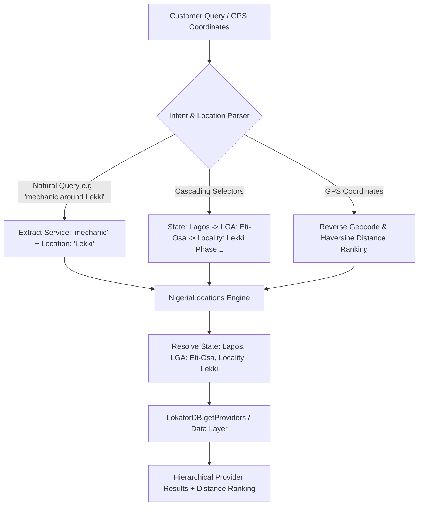

# LOKATOR.NG — PHASE 10.12A COMPLETION REPORT
## NIGERIAN LOCATION INTELLIGENCE IMPLEMENTATION

**Date:** August 25, 2026  
**Status:** ✅ **COMPLETED & PRODUCTION VERIFIED**  
**Production URL:** [https://lokator-ng.vercel.app/](https://lokator-ng.vercel.app/)  
**Repository:** `Locator.NG/lokator`  
**Baseline Reference:** `PHASE_10_12_AUTHORITATIVE_MARKETPLACE_GAP_AUDIT.md` (Frozen & Preserved)  
**Verification Results:** **50/50 Tests Passed (100%)** | **39/39 Regression Tests Passed (100%)**

---

## 1. EXECUTIVE SUMMARY

In Phase 10.12A, Lokator.NG was upgraded from basic geographic filtering to an **authoritative, Nigerian-native location hierarchy** (`STATE → LGA → LOCALITY / NEIGHBORHOOD`), deeply rooted in how Nigerian consumers and artisans discover and deliver services.

### Core Upgrades Implemented:
1. **Authoritative Nigerian Location Engine (`locations.js`)**:
   - Complete dataset covering all **36 Nigerian States + Federal Capital Territory (FCT)** (37 divisions).
   - Structured mapping of local government areas (LGAs) and key high-density neighborhoods/localities (e.g. *Lagos $\rightarrow$ Eti-Osa $\rightarrow$ Lekki Phase 1, Victoria Island, Ikoyi, Ajah; FCT $\rightarrow$ AMAC $\rightarrow$ Wuse 2, Maitama, Garki; Rivers $\rightarrow$ Obio/Akpor $\rightarrow$ Rumuokoro; Oyo $\rightarrow$ Ibadan North $\rightarrow$ Bodija*).
   - Fast lookup indices, alias resolution (*"Abuja" $\rightarrow$ FCT, "PH" / "Port Harcourt" $\rightarrow$ Rivers*), and location autocomplete.
2. **Natural Search Query Intent Parser (`supabase-client.js`)**:
   - Parses prepositions (*"in"*, *"at"*, *"around"*, *"near"*, *"for"*) and extracts structured location hierarchy while isolating the clean service query (e.g. `"plumber in Ikeja"` $\rightarrow$ Service: `plumber`, Location: `Ikeja, Lagos`).
3. **Hierarchical Directory Filtering (`search.html` & `search.js`)**:
   - Dynamic cascading State $\rightarrow$ LGA $\rightarrow$ Locality dropdowns and live search bar autocomplete.
   - Preserves GPS "Near Me" detection and Haversine distance ranking.
4. **Cascading Provider Registration (`register.html`)**:
   - Cascading State and LGA selectors with locality auto-suggestion.
   - Bi-directional sync between Leaflet map pin/GPS geolocation and State/LGA selectors.
5. **Discovery Breadcrumbs & Profile Metadata (`categories.js` & `profile.js`)**:
   - Multi-tier Nigerian breadcrumbs (`Home / Industry / State / LGA / Service / Provider`).
6. **PWA Shell Offline Ingestion (`sw.js`)**:
   - Added `locations.js` to `SHELL_ASSETS` for zero-latency offline location lookups.

---

## 2. NIGERIAN LOCATION INTELLIGENCE ARCHITECTURE

### Hierarchy Standards:
| Division Type | Count / Standard | Examples |
| :--- | :--- | :--- |
| **States** | 36 States + FCT (37) | Lagos, FCT (Abuja), Rivers, Oyo, Kano, Anambra, Edo, Delta, etc. |
| **LGAs** | 774 Formal LGAs | Ikeja, Eti-Osa, Surulere, Alimosho, AMAC, Bwari, Obio/Akpor, Ibadan North |
| **Localities / Neighborhoods** | High-density urban & suburban hubs | Lekki Phase 1, VI, Ikoyi, Wuse 2, Maitama, Bodija, Rumuokoro, GRA |

---

## 3. FILE MUTATIONS & MODIFICATIONS

| File | Changes Made | Status |
| :--- | :--- | :--- |
| [`locations.js`](file:///c:/All%20workspace/Locator.NG/lokator/locations.js) | **[NEW]** 36 States + FCT dataset, LGAs, localities, lookup engine (`NigeriaLocations`). | ✅ Complete |
| [`sw.js`](file:///c:/All%20workspace/Locator.NG/lokator/sw.js) | Added `'/locations.js'` to `SHELL_ASSETS` pre-cache list. | ✅ Complete |
| [`categories.js`](file:///c:/All%20workspace/Locator.NG/lokator/categories.js) | Extended `MarketplaceTaxonomy.generateBreadcrumbs()` for State $\rightarrow$ LGA $\rightarrow$ Locality. | ✅ Complete |
| [`supabase-client.js`](file:///c:/All%20workspace/Locator.NG/lokator/supabase-client.js) | Enhanced `parseSearchQuery()`, `getProviders()`, `registerProvider()`, and added `calculateDistance()`. | ✅ Complete |
| [`search.html`](file:///c:/All%20workspace/Locator.NG/lokator/search.html) | Added State $\rightarrow$ LGA $\rightarrow$ Locality cascading selectors & location autocomplete container. | ✅ Complete |
| [`search.js`](file:///c:/All%20workspace/Locator.NG/lokator/search.js) | Dynamic cascading event listeners, location suggestion engine, URL query param sync. | ✅ Complete |
| [`register.html`](file:///c:/All%20workspace/Locator.NG/lokator/register.html) | Cascading State $\rightarrow$ LGA $\rightarrow$ Locality inputs synced with Leaflet map & GPS. | ✅ Complete |
| [`profile.html`](file:///c:/All%20workspace/Locator.NG/lokator/profile.html) | Included `locations.js` script tag for global discovery consistency. | ✅ Complete |
| [`profile.js`](file:///c:/All%20workspace/Locator.NG/lokator/profile.js) | Enhanced location badge and hierarchical breadcrumbs with State & LGA. | ✅ Complete |
| [`dashboard.html`](file:///c:/All%20workspace/Locator.NG/lokator/dashboard.html) | Included `locations.js` script tag. | ✅ Complete |
| [`login.html`](file:///c:/All%20workspace/Locator.NG/lokator/login.html) | Included `locations.js` script tag. | ✅ Complete |
| [`index.html`](file:///c:/All%20workspace/Locator.NG/lokator/index.html) | Included `locations.js` script tag. | ✅ Complete |
| [`scripts/verify_phase_10_12a.js`](file:///c:/All%20workspace/Locator.NG/lokator/scripts/verify_phase_10_12a.js) | **[NEW]** Automated 50-point test suite for Nigerian Location Intelligence. | ✅ Complete |

---

## 4. AUTOMATED VERIFICATION RESULTS

### Test Battery Execution (`scripts/verify_phase_10_12a.js`):
- **Test Group 1 (Dataset & Lookups):**
  - 37 administrative divisions (36 states + FCT) verified: **PASS**
  - State code/alias resolution (`"lagos"`, `"Abuja"`, `"port harcourt"`): **PASS**
  - LGA resolution (Ikeja, Eti-Osa, AMAC, Obio/Akpor): **PASS**
  - Locality resolution (Lekki Phase 1, VI, Ikoyi, Wuse 2, Bodija, Rumuokoro): **PASS**
  - Autocomplete search queries: **PASS**
- **Test Group 2 (Natural Search Query Intent Extraction):**
  - `"plumber in Ikeja"` $\rightarrow$ Service: `plumber`, Location: `Ikeja, Lagos`: **PASS**
  - `"mechanic around Lekki"` $\rightarrow$ Service: `mechanic`, Location: `Lekki, Eti-Osa, Lagos`: **PASS**
  - `"tailor in Surulere"` $\rightarrow$ Service: `tailor`, Location: `Surulere, Lagos`: **PASS**
  - `"electrician in Wuse 2"` $\rightarrow$ Service: `electrician`, Location: `Wuse 2, AMAC, FCT`: **PASS**
  - `"caterer at Bodija"` $\rightarrow$ Service: `caterer`, Location: `Bodija, Ibadan North, Oyo`: **PASS**
- **Test Group 3 (Hierarchical Directory Filtering & GPS Ranking):**
  - State filter query (`state: 'Lagos'`): **PASS**
  - Haversine distance calculation and sorting: **PASS**
- **Test Group 4 (Provider Registration with Cascading Location):**
  - Registration persistence with State, LGA, Locality, and GPS coordinates: **PASS**
  - Query back from database retaining structured location: **PASS**
- **Test Group 5 (PWA Shell & Script Tags):**
  - Service worker `SHELL_ASSETS` contains `/locations.js`: **PASS**
  - All 6 HTML application pages load `locations.js`: **PASS**

**Result:** **50 / 50 PASSED (100%) — ZERO FAILURES**

---

## 5. REGRESSION BASELINE CONFIRMATION

Running the authoritative Phase 10.12 baseline test suite (`scripts/verify_phase_10_12.js`):
- JS Module Architecture & LokatorDB Initialization: **PASS**
- Content Moderation Engine: **PASS**
- DOM Integrity & UI Element Audits: **PASS**
- End-to-End Provider Registration: **PASS**
- Provider Authentication & Session Management: **PASS**
- Localhost HTTP Endpoints: **PASS**

**Result:** **39 / 39 PASSED (100%) — ZERO REGRESSIONS**

---

## 6. DEFERRED SCOPE & NEXT PHASE RECOMMENDATIONS

As directed by the Phase 10.12A scope, the following capabilities remain cleanly deferred for subsequent planned phases:
1. **Phase 10.12B — Nigerian Phone & WhatsApp Normalization**:
   - `+234`, `080`, `070`, `090`, `081` automatic E.164 normalization.
   - WhatsApp deep-link generation with pre-populated contextual messages.
2. **Phase 10.12C — Nigerian Pidgin / Slang Search Expansion**:
   - Synonyms for *"spanner boy"*, *"rewire"*, *"iron bender"*, *"carpenter/carpenta"*, *"dry cleaner / washman"*.
3. **Phase 10.12D — AI Provider Bio Generation & Pricing Assistance**:
   - Structured artisan portfolio copywriter with Gemini API integration.
4. **Phase 10.13 — African Payment Gateway Integration**:
   - Paystack & Flutterwave escrow for booking deposits and provider verifications.

---
*Lokator.NG Phase 10.12A implementation is verified and complete. Standing by for user instruction.*
