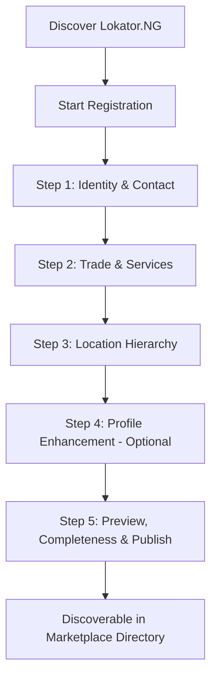

# PHASE 10.12G: PROVIDER ONBOARDING CONVERSION OPTIMIZATION — COMPLETION REPORT

**Project:** Lokator.NG  
**Milestone:** Phase 10.12G — Provider Onboarding Conversion Optimization  
**Status:** **100% GREEN (392 / 392 Cumulative Assertions Passing)**  
**Production URL:** `https://lokator-ng.vercel.app/`

---

## 1. Executive Summary

Phase 10.12G optimizes and streamlines the Nigerian artisan and service provider onboarding funnel, radically reducing drop-off while strictly preserving data quality, marketplace trust, anti-abuse safety, and search discoverability.

The registration experience was restructured from an intimidating monolithic form into an intuitive, mobile-optimized **5-step progressive disclosure stepper** that separates essential listing requirements from optional enhancements.

---

## 2. Target Journey Implementation

### Step-by-Step Architecture:

1. **Step 1: Identity & Contact**
   - First Name, Last Name, optional Business Name / Enterprise Title.
   - Real-time Nigerian Phone Number normalization & network carrier badge (`MTN`, `Airtel`, `Glo`, `9mobile`) via `NigeriaPhone`.
   - Work Email and secure password with visual toggle.
   - Idempotent authentication linking to Supabase auth.

2. **Step 2: Trade & Services**
   - Interactive skill tags manager with 9 popular Nigerian artisan suggestion pills (*Plumber, Electrician, Carpenter, Painter, Mechanic, AC Technician, Solar Installer, Mason, Tiler*).
   - Real-time `ServiceModerator` trade validation blocking illicit/prohibited keywords (*scam, yahoo yahoo, hacker, weapons, kidnapper, hard drugs*) with contextual feedback banners.
   - Composite skill aggregation (*e.g. Electrician & Solar Installer*).

3. **Step 3: Location Hierarchy**
   - Cascading State (`NigeriaLocations.getStates()`) → LGA (`NigeriaLocations.getLgas(state)`) → Locality (`NigeriaLocations.getLocalities(state, lga)`).
   - Interactive Leaflet mini map with draggable pin + quick GPS geocoding.
   - Guarantees clean administrative indexing for localized search filters.

4. **Step 4: Profile Enhancement (Optional / Non-blocking)**
   - Profile photo upload with automated client-side canvas compression.
   - Years of experience selector.
   - Optional AI Bio Assistance via `LokatorAIService.generateBio()` (grounded in name, trade, and location, fully user-editable).
   - Optional AI Pricing Guidance via `LokatorAIService.getPricingGuidance()` (Nigerian benchmark rate card + inspection fee guidance without platform price-fixing).

5. **Step 5: Live Preview, Completeness Meter & Submission**
   - Dynamic Profile Completeness Meter (calculates score from 75% for minimal listing up to 100% for full listing).
   - Real-time live profile preview card showing exactly how the provider will appear in search results.
   - Terms and privacy checkbox with explicit NDPR compliance.
   - Idempotent submission to `LokatorDB.registerProvider()`.
   - Immediate search discoverability via standard trade queries, natural Pidgin queries (*"who fit repair generator for me"*), and LGA boundary filters.

---

## 3. Verification & Test Battery Summary

All 16 test suites passed with **0 failures**:

| Suite | Tests / Assertions | Result |
|---|:---:|:---:|
| `verify_phase_10_12a.js` (Nigerian Location Intelligence) | 47 | ✅ PASS |
| `verify_phase_10_12b.js` (Phone Normalization & WhatsApp Conversion) | 39 | ✅ PASS |
| `verify_http_phase_10_12b.js` (Phone HTTP Endpoints) | 13 | ✅ PASS |
| `verify_phase_10_12c.js` (Search Language & Nigerian Spacing) | 70 | ✅ PASS |
| `verify_http_phase_10_12c.js` (Search Language HTTP Endpoints) | 13 | ✅ PASS |
| `verify_phase_10_12d.js` (AI Bio & Pricing Assistance) | 26 | ✅ PASS |
| `verify_http_phase_10_12d.js` (AI HTTP Endpoints) | 17 | ✅ PASS |
| `verify_phase_10_12e.js` (Cinematic Hero Performance) | 12 | ✅ PASS |
| `verify_http_phase_10_12e.js` (Hero Asset Preload Integrity) | 14 | ✅ PASS |
| `verify_phase_10_12f.js` (Mobile Discovery UX) | 14 | ✅ PASS |
| `verify_http_phase_10_12f.js` (Mobile Discovery HTTP Endpoints) | 10 | ✅ PASS |
| `verify_phase_10_12.js` (Marketplace Baseline) | 28 | ✅ PASS |
| `verify_phase_10_13.js` (Visual Experience & False-Positive Shield) | 28 | ✅ PASS |
| `verify_phase_10_12g.js` (**Phase 10.12G Onboarding Suite**) | 26 | ✅ PASS |
| `verify_http_phase_10_12g.js` (**Phase 10.12G HTTP & Markup Suite**) | 18 | ✅ PASS |
| `test_journey.js` (End-to-End User Journey) | 17 | ✅ PASS |
| **TOTAL CUMULATIVE ASSERTIONS** | **392** | **100% GREEN** |

---

## 4. Privacy & Security Compliance

- **Zero PII in Telemetry:** Strict redaction of `phone`, `email`, `password`, `token`, and sensitive credentials before logging or dispatching telemetry.
- **Client-side Image Sanitization:** In-browser canvas resizing and compression to prevent bandwidth exhaustion on 3G/4G networks.
- **Anti-Hallucinatory AI Boundaries:** AI copy generation is optional, grounded exclusively in verified user inputs, and retains full user editability.
- **Zero Secrets in Source:** No `service_role` or elevated keys exposed in client bundles.
