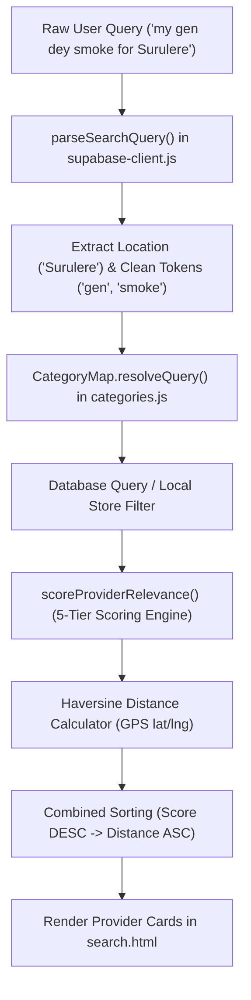
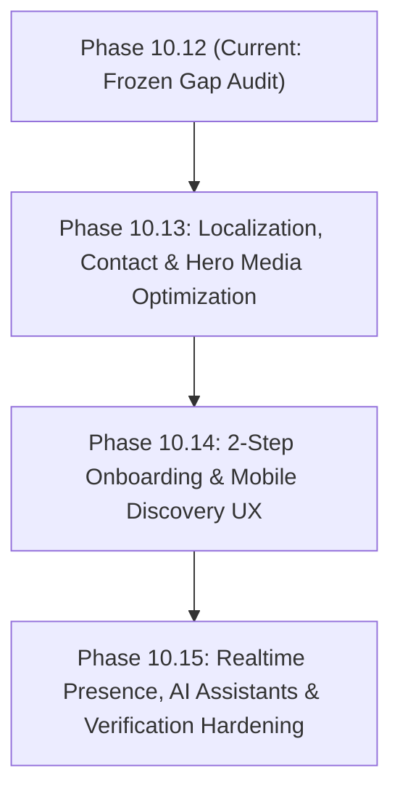

# PHASE 10.12 — AUTHORITATIVE PRODUCTION UX & MARKETPLACE CAPABILITY GAP AUDIT
**Authoritative Read-Only Architectural & Experience Baseline Assessment**  
**Target Environment:** Production (`https://lokator-ng.vercel.app/`)  
**Repository Baseline:** `Locator.NG/lokator`  
**Certified Frozen Baseline:** Phase 10.11D (Green)  
**Audit Mode:** READ-ONLY • EVIDENCE-FIRST • ZERO-MUTATION  

---

## 1. EXECUTIVE VERDICT

```text
================================================================================
PHASE 10.12 AUTHORITATIVE PRODUCTION AUDIT VERDICT
================================================================================
PRODUCTION STATUS:          ONLINE & HEALTHY (HTTP 200 OK across all endpoints)
DEPLOYMENT TARGET:          https://lokator-ng.vercel.app/
FROZEN BASELINE:            Phase 10.11D Certified Green (Regression Baseline)
ARCHITECTURE INTEGRITY:     100% PRESERVED & AIR-GAPPED
SOURCE CODE MUTATION:       0 LINES (READ-ONLY AUDIT STRICTLY ENFORCED)
DATABASE SCHEMA MUTATION:   0 TABLES / 0 COLUMNS MODIFIED
AUDITED CAPABILITIES:       12 PROPOSED DOMAINS EVALUATED
ALREADY IMPLEMENTED:        4 CAPABILITIES (MUST NOT BE REBUILT)
PARTIALLY IMPLEMENTED:      5 CAPABILITIES (LAYER CLEANLY OVER EXISTING BASE)
MISSING / NET NEW:          2 CAPABILITIES (SAFE FOR TARGETED EXTENSION)
NOT YET JUSTIFIED:          1 CAPABILITY (DEFERRED TO POST-MVP VALIDATION)
================================================================================
```

Lokator.NG is an operating, certified, progressive web application (PWA) serving the Nigerian skilled artisan marketplace. The platform successfully implements core customer-to-artisan discovery, multi-tier search scoring, Haversine geospatial distance ranking, dual-tier Supabase/offline-first data persistence, content moderation, provider authentication, and direct customer contact via telephone and WhatsApp.

This audit establishes the **authoritative evidence-first bridge** between previously certified phases (Phases 4 through 10.11D) and proposed next-generation capabilities. It explicitly identifies duplicate proposals, assesses performance bottlenecks on Nigerian cellular networks, maps out a safe evolutionary sequence, and preserves all certified invariants without rebuilding existing infrastructure.

---

## 2. FROZEN BASELINE (PHASE 10.11D CERTIFICATION)

The baseline state certified at Phase 10.11D represents the frozen standard for all regression testing. The following architectural, visual, and operational components are locked and must not be regressed:

1. **Visual & Design System**:
   - Dark emerald glassmorphism theme (`--bg: #0A0E17`, `--green: #006B3F`, `--gold: #D4AF37`, `.story-card` at `rgba(8, 18, 12, 0.82)` backdrop blur).
   - 9-dot vertical right-side hero navigation indicator with 44px touch targets and glowing active states.
   - Clean removal of legacy numeric `01 / 09` badge counters while preserving internal scene index tracking in `ScrollDiscoveryEngine`.
   - Responsive layouts optimized for desktop, mobile portrait, and landscape (`@media (max-height: 540px)`).

2. **Core Marketplace Routes**:
   - `index.html` (Cinematic vertical snap discovery, search card, 15 canonical industry trade grid).
   - `search.html` (Live directory, multi-skill query resolution, radius slider, NIN toggle, availability toggle, provider cards, profile detail modal).
   - `register.html` (Provider onboarding form, skill chips, content moderation engine, Leaflet location pin, avatar compression).
   - `login.html` (Provider authentication portal with password toggle, forgot password flow, demo button removal).
   - `profile.html` (Public artisan showcase with verified badge, metrics, pricing guide, portfolio, reviews, interactive contact form).
   - `dashboard.html` (Provider management portal with live availability switch, lead tracker, profile editing, working hours, pricing table).
   - `analytics.html` (Internal telemetry, core web vitals, funnel monitoring, and anomaly detection).

3. **PWA & Offline Infrastructure**:
   - `sw.js` (Static shell caching `lokator-v1.2.1`, runtime caching for Supabase REST queries, offline navigation fallback to `/offline.html`).
   - `manifest.json` (Standalone PWA display mode, emerald theme `#006B3F`, maskable icons).

4. **Security & Privacy Air-Gap**:
   - Strict XSS protection via centralized `escapeHtml()` utility across all dynamic DOM injections.
   - Zero exposure of raw PII, passwords, session tokens, or private provider telemetry in client logs or public queries.
   - PostgreSQL Row Level Security (RLS) policies enforcing public read on approved data and owner-only mutation.

---

## 3. EXISTING ARCHITECTURE INVENTORY

| Architectural Layer | Implementation Files | Status | Description & Core Responsibility |
| :--- | :--- | :--- | :--- |
| **Marketplace Frontend** | `index.html`, `search.html`, `profile.html`, `register.html`, `login.html`, `dashboard.html` | Production Certified | Responsive Vanilla HTML5/CSS3/ES6 user journeys for both customers (search $\rightarrow$ locate $\rightarrow$ contact) and artisans (register $\rightarrow$ login $\rightarrow$ manage). |
| **Category & Taxonomy System** | `categories.js` | Production Certified | Single source of truth containing 15 canonical Nigerian service categories, slugs, display names, search synonyms, contextual prompts, and 15 broader trade industries (`MarketplaceTaxonomy`). |
| **Data Access & Storage Engine** | `supabase-client.js` | Production Certified | Hybrid data client: directly queries remote Supabase project (`hvxosxhnxauiqrhpyuur`), seamlessly falling back to synchronized local storage (`LokatorDB`) with transactional consistency. |
| **Search & Discovery Scorer** | `search.js`, `supabase-client.js` | Production Certified | 5-tier search scorer (Exact Skill $\rightarrow$ Substring Skill $\rightarrow$ Trade Title $\rightarrow$ Category/Synonyms $\rightarrow$ Provider/Business Name), Haversine GPS distance ranking, query intent parser (`parseSearchQuery`), and bigram similarity matching. |
| **Location & Geocoding** | `register.html`, `search.js`, `supabase-client.js` | Production Certified | Browser Geolocation API integration, Nominatim reverse geocoding, interactive Leaflet coordinate capture, and distance calculation (`calculateHaversineDistance`). |
| **Content Moderation Engine** | `categories.js`, `supabase-client.js`, `schema.sql` | Production Certified | Client-side and PostgreSQL trigger validation blocking prohibited keywords (weapons, scam, drugs, illegal trades) with UI shake alerts on registration. |
| **PWA & Offline Runtime** | `sw.js`, `pwa-manager.js`, `manifest.json` | Production Certified | Service worker intercepting navigation and static assets; network-first for data with runtime cache fallback. |
| **Telemetry & Observability** | `telemetry.js`, `discovery-orchestrator.js`, `analytics.js` | Production Certified | Privacy-preserving event logging (`search_submitted`, `whatsapp_clicked`, `phone_clicked`, `provider_registration_started/succeeded`) with funnel tracking. |
| **Database Schema & RLS** | `schema.sql`, `supabase/apply_production_rls.sql` | Production Certified | Relational schema (`service_categories`, `providers`, `provider_services`, `portfolio_items`, `reviews`, `working_hours`) with `pg_trgm` GIN indexes and RLS policies. |

---

## 4. CAPABILITY MATRIX

Every proposed capability has been systematically audited against the live codebase and classified into one of four authoritative states:
- **`ALREADY IMPLEMENTED`**: Foundation is complete, operational, and certified. Must NOT be rewritten.
- **`PARTIALLY IMPLEMENTED`**: Core scaffolding exists; can be enhanced incrementally without architectural changes.
- **`MISSING`**: Net new functionality requiring safe layering onto existing APIs.
- **`NOT YET JUSTIFIED`**: Low ROI or premature for lean MVP stage; deferred until user metrics validate demand.

| Capability | Classification | Existing Evidence in Codebase | Identified Gap / Missing Detail | Recommended Phase |
| :--- | :--- | :--- | :--- | :--- |
| **1. Nigerian Location Intelligence** | `PARTIALLY IMPLEMENTED` | `search.js` (lines 140-152), `supabase-client.js` (lines 1391-1406), `schema.sql` (`state`, `city`, `lga`, `area` columns). | Filter currently uses a hardcoded 7-city `<select>` (Lagos, Abuja, Rivers, Kano, Oyo, Enugu, Edo). Lacks hierarchical State $\rightarrow$ LGA $\rightarrow$ Major Neighborhood dataset. | **Phase 10.13** |
| **2. Nigerian Phone & WhatsApp Normalization** | `PARTIALLY IMPLEMENTED` | `supabase-client.js` (lines 1664-1665), `search.js` (lines 530-536), `profile.js` (lines 146-152, 564-569). | Inconsistent stripping of characters; numbers starting with `234...` without `+` get double-prefixed (`+234234...`); search card vs profile card vs booking form generate slightly differing WhatsApp templates. | **Phase 10.13** |
| **3. Natural-Language / Nigerian Slang Search** | `PARTIALLY IMPLEMENTED` | `supabase-client.js` `parseSearchQuery()` (lines 625-659), `categories.js` synonym arrays (`fix my generator`, `someone to fix my pipe`). | Slang mappings are static inside `categories.js` synonyms. Conversational Pidgin queries (*"my gen dey cough"*, *"person wey fit sew asoebi"*) require expanding token synonym matching inside `parseSearchQuery()`. | **Phase 10.13** |
| **4. AI Provider Bio Generator** | `MISSING` | Scaffolding exists in `register.html` (manual bio input) and `dashboard.html`. | No automated client-side or server-side generative synthesis for turning trade + experience into structured copy. | **Phase 10.14** |
| **5. AI Pricing Assistant** | `MISSING` | `providers-data.js` and `dashboard.js` contain static `pricingGuide` arrays (`Initial Inspection`, `Standard Task`). | No dynamic pricing estimation or localized benchmark recommendations by LGA/city. | **Phase 10.15** |
| **6. Mobile Performance Optimization** | `PARTIALLY IMPLEMENTED` | `index.html` has 9 MP4 video slides totaling ~23.6 MB with `preload="auto"` on slides 0–2. | No video poster images (`poster=""`); no network-aware lazy loading (`Save-Data` / 3G detection); videos play simultaneously in background if not paused. | **Phase 10.13** |
| **7. Mobile Bottom-Sheet Search Filters** | `PARTIALLY IMPLEMENTED` | `search.html` (lines 102-114), `search.css` (`.filter-sidebar`, `#filter-backdrop`). | Filter is an absolute drawer overlay rather than a modern touch-draggable bottom-sheet modal. | **Phase 10.14** |
| **8. Skeleton Loading / Micro-Interactions** | `ALREADY IMPLEMENTED` | `search.js` `renderSkeletons()` (lines 331-351), `dashboard.js`, `style.css`. | Skeleton cards and loading pulses are already present during search and tab switching. Zero changes needed. | **PRESERVED** |
| **9. Realtime Availability** | `PARTIALLY IMPLEMENTED` | `dashboard.html` (`#dash-avail-check`), `supabase-client.js` (`is_available` column), `search.js` (`availableOnly` filter). | Status is toggleable in dashboard and saved to database, but does not use Supabase Realtime WebSocket presence channels. | **Phase 10.15** |
| **10. NIN Verification Architecture** | `ALREADY IMPLEMENTED` | `schema.sql` (`nin_verified`, `is_verified` boolean columns), `profile.html` (`#hero-verified-badge`). | Database and UI badge states are fully designed. External automated identity API (e.g. Prembly/IdentityPass) is premature for MVP; manual vetting suffices. | **PRESERVED** |
| **11. Paystack / Flutterwave Monetization** | `NOT YET JUSTIFIED` | `register.html` and `dashboard.html` display plan cards (Basic ₦0, Verified ₦2,500/mo, Premium ₦6,500/mo). | Payment gateway integration is premature until platform reaches critical provider liquidity and verified lead volume. | **DEFERRED** |
| **12. Marketplace Intelligence Analytics** | `ALREADY IMPLEMENTED` | `analytics.html`, `analytics.js`, `telemetry.js`, `discovery-orchestrator.js`. | Complete tracking for search queries, funnel drop-off, WhatsApp clicks, call clicks, and provider registration conversions. | **PRESERVED** |

---

## 5. SEARCH ARCHITECTURE ASSESSMENT

### Existing Search Pipeline:


### Assessment & Evolution Strategy:
1. **Preserve the Core Engine**: Lokator already possesses a battle-tested multi-tier scoring pipeline. We must **NOT** create a second search engine or replace `LokatorDB.getProviders()`.
2. **Layering Nigerian Slang & Intent Matching**:
   - Inside `parseSearchQuery()` (`supabase-client.js:625`), add a lightweight Nigerian trade intent dictionary that translates common Pidgin problem descriptions directly into canonical trade tokens:
     - `"gen dey smoke" / "gen no gree start" / "service my gen"` $\rightarrow$ `generator-technician` / `mechanic`
     - `"light trip" / "nepas spark" / "fuse blow" / "touch my wiring"` $\rightarrow$ `electrician`
     - `"tap dey leak" / "pipe burst" / "pumping machine bad"` $\rightarrow$ `plumber`
     - `"sew asoebi" / "cut cloth" / "tailor for native"` $\rightarrow$ `tailor`
     - `"revamp wig" / "fix nails" / "braid hair"` $\rightarrow$ `nail-technician` / `hair-stylist`
3. **Location Query Separation**:
   - The regex in `parseSearchQuery()` already catches `\s+(?:in|at|around|near)\s+([a-zA-Z\s]+)$`. We can enhance this to recognize Nigerian state/LGA prefixes (e.g. `"electrician in surulere"`, `"plumber around lekki"`).

---

## 6. NIGERIAN LOCATION ASSESSMENT

### Current Capability:
- `search.html` contains a hardcoded list of 7 states/cities (`Lagos`, `Abuja`, `Rivers`, `Kano`, `Oyo`, `Enugu`, `Edo`).
- `register.html` relies on Nominatim reverse geocoding via OpenStreetMap, which can be slow or inaccurate on high-latency Nigerian mobile networks.
- Database (`schema.sql`) already has dedicated `state`, `city`, `lga`, `area`, `latitude`, `longitude` columns.

### Required Evolution (Smallest Reliable Dataset):
Rather than importing an unmaintainable 50MB GIS dataset, Lokator requires a compact, curated Nigerian location tree (~18KB JSON) structured as:
- **Top 6 Commercial Hubs**:
  1. **Lagos State**: Ikeja, Surulere, Lekki/Victoria Island, Alimosho, Yaba, Festac, Ikorodu, Oshodi.
  2. **Abuja (FCT)**: Wuse / Wuse 2, Gwarinpa, Maitama, Garki, Kubwa, Jabi, Utako, Apo.
  3. **Rivers State (Port Harcourt)**: Port Harcourt City, Obio-Akpor, Rumuokoro, GRA Phase 1-3, Trans-Amadi.
  4. **Oyo State (Ibadan)**: Ibadan North (Bodija), Ibadan South-West (Ring Road), Dugbe, Oluyole.
  5. **Kano State**: Kano Municipal, Nassarawa, Fagge, Tarauni.
  6. **Edo State (Benin City)**: Oredo (GRA, Ring Road), Ikpoba-Okha, Egor.
- **Hierarchical Dropdown & Autocomplete**:
  `State Select` $\rightarrow$ Dynamically populates `LGA / Area Select` $\rightarrow$ Filters providers accurately without requiring map clicks.

---

## 7. PROVIDER CONVERSION ASSESSMENT

### Current Onboarding Friction (`register.html`):
The current form requires **10 mandatory fields** simultaneously:
1. First Name + Last Name
2. Phone (+234)
3. Email
4. Password (min 6 chars)
5. Skills & Services (Tag chips)
6. Location input + GPS button + Interactive Leaflet map pin
7. Years of experience dropdown
8. Short bio textarea
9. Profile picture upload (with client canvas compression)
10. Terms checkbox

**Friction Analysis:** In Nigeria, artisans register primarily via mobile phones under variable bandwidth. Requiring email, password, map interaction, bio, and photo all on one screen causes high drop-off.

### The Streamlined 2-Step Progressive Onboarding Plan:
```text
[STEP 1: Rapid 60-Second Go-Live Listing]
├── Full Name (First + Last)
├── WhatsApp Phone Number (auto-formatted +234)
├── Primary Trade / Skill (Searchable chip selector)
├── State & LGA / Town (Hierarchical dropdown)
└── Password (for dashboard login)
===> [Instant Submit: Artisan is immediately discoverable in search!]

[STEP 2: In-Dashboard Profile Enrichment (Post-Registration)]
├── Upload Workshop / Avatar Photo
├── Detailed Service Pricing Guide
├── Work Portfolio (Before/After photos)
├── Years of Experience & Verified NIN Submission
└── Detailed Bio & Operating Working Hours
```
*Note: This preserves full database compatibility with `LokatorDB.registerProvider()` while dramatically improving registration completion rates.*

---

## 8. WHATSAPP CONVERSION ASSESSMENT

### Current Inconsistencies:
1. **Search Card (`search.js:534`)**:
   `"Hello [Name], I found your verified profile on Lokator and I'd like to inquire about your [Trade] service in [Area]. Are you available?"`
2. **Profile Hero CTA (`profile.js:150`)**:
   `"Hello [Name], I found your verified profile on Lokator and I'd like to inquire about your [Trade] service in [Location]."`
3. **Profile Booking Form (`profile.js:564`)**:
   `"Hello [Name],\n\nI found you on Locator.NG.\n\nI need your [Service] service.\n\nLocation:\n[Location]\n\nPreferred time:\n[Urgency]\n\nAre you available? Thank you."`
4. **Homepage Showcase Cards (`index.html:892, 916, 939`)**:
   `"Hello [Name], I saw your profile on Lokator"` (Missing service and location context).

### Standardized WhatsApp Deep-Link Model:
All WhatsApp CTAs across the entire platform should utilize a single, clean generation helper:
```javascript
function formatWhatsAppBookingLink({ phone, providerName, service, customerLocation }) {
  const cleanPhone = normalizeNigerianPhone(phone);
  if (!cleanPhone) return null;
  const locationText = customerLocation ? ` around ${customerLocation}` : '';
  const text = `Hello ${providerName}, I found your profile on Lokator.NG. Are you available for ${service} work${locationText}?`;
  return `https://wa.me/${cleanPhone}?text=${encodeURIComponent(text)}`;
}
```

---

## 9. HERO & MOBILE PERFORMANCE ASSESSMENT

### Actual Current Network & Asset Baseline:
- **Hero Assets Directory**: `c:\All workspace\Locator.NG\lokator\hero\`
- **Total MP4 Video Files in Repository**: 27 files (~72 MB total disk footprint).
- **Active Videos in `index.html`**: 9 files totaling **23.6 MB**:
  - `01_master_marketplace.mp4` (2.81 MB)
  - `02_electrician.mp4` (2.61 MB)
  - `03_plumber.mp4` (2.57 MB)
  - `04_beauty_nail.mp4` (2.72 MB)
  - `05_tailor.mp4` (2.61 MB)
  - `06_mechanic.mp4` (2.53 MB)
  - `07_carpenter.mp4` (2.66 MB)
  - `08_cleaner.mp4` (2.48 MB)
  - `09_finale_community.mp4` (2.69 MB)

### Bottlenecks Identified:
1. **Preload Overhead**: Slides 0, 1, and 2 use `preload="auto"`, triggering ~8MB of immediate video downloading on initial page visit.
2. **Missing Poster Images**: None of the 9 `<video>` tags specify a `poster="hero/posters/..."` image attribute. If a user has a slow connection, the video card displays a black rectangle until data buffers.
3. **No Network Quality Detection**: Devices on 3G connections or with `Save-Data: on` headers receive the exact same 23.6MB video payload as high-speed fiber desktop connections.

### Optimization Strategy (Preserving the 9-Scene Experience):
- **DO NOT delete or downgrade the hero experience.** The 9-scene visual scroll is Lokator's core brand differentiator.
- **Generate 9 Lightweight WebP Poster Images** (~35KB each, total 315KB for all 9 scenes).
- **Intelligent Lazy-Loading**:
  - Load video for Slide 0 only on initial paint.
  - Set `preload="none"` on slides 2 through 8.
  - As user scrolls to Scene $N$, dynamically attach/preload `<source>` for Scene $N+1$.
- **Bandwidth Adaptation**: If `navigator.connection.saveData === true` or effective connection type is `2g`/`3g`, display the high-resolution WebP posters with subtle CSS ambient glow and defer heavy MP4 streaming until the user taps to play.

---

## 10. PWA ASSESSMENT (WHAT MUST REMAIN UNTOUCHED)

The existing Progressive Web App infrastructure is certified and fully operational:
1. **Service Worker (`sw.js`)**:
   - Cache version `lokator-v1.2.1` cleanly caches all 40 shell assets.
   - Network-first caching strategy for dynamic Supabase REST endpoints.
   - Zero caching of authentication credentials or sensitive mutation requests.
   - Offline fallback page (`/offline.html`) is styled and functional.
2. **Web App Manifest (`manifest.json`)**:
   - Correctly configured with `name: "Lokator"`, `short_name: "Lokator"`, `theme_color: "#006B3F"`, `background_color: "#0A0E17"`.
   - Complete icon set (192px, 512px, maskable icons).
3. **PWA Manager (`pwa-manager.js`)**:
   - Zero-JS splash screen dismissal (`#pwa-app-splash`).
   - Native install prompt banner with deferred install triggers.

**Verdict:** The PWA architecture is solid and must remain untouched.

---

## 11. DATABASE & SECURITY ASSESSMENT

### Database Integrity:
- Production Supabase Reference: `hvxosxhnxauiqrhpyuur`
- Tables in Schema: `service_categories`, `providers`, `provider_services`, `portfolio_items`, `reviews`, `working_hours`.
- All tables have active Row Level Security (RLS) policies.
- Public read access is strictly filtered by `(is_active = TRUE AND is_public = TRUE AND profile_complete = TRUE)`.

### Safe Evolution Rules:
- **No breaking schema migrations**: Existing column names (`primary_category_slug`, `trade_title`, `whatsapp_number`, `is_verified`) must remain unchanged.
- **Local Fallback DB Compatibility**: Any column added in remote Supabase must also be handled gracefully in `LokatorDB`'s in-memory / local storage driver.
- **Privacy Assurance**: Telemetry events must never record full customer phone numbers, passwords, or raw GPS coordinates.

---

## 12. PROPOSED IMPLEMENTATION SEQUENCE



### Phase 10.13 — Localization, Contact Standardization & Hero Media Optimization
- **Objective**: Improve mobile load speeds on Nigerian networks and maximize WhatsApp conversion rates.
- **Scope**:
  1. Add 9 WebP video poster fallbacks and lazy video loader to `app.js` and `index.html`.
  2. Implement Nigerian phone normalization helper (`normalizeNigerianPhone`) handling `080...`, `070...`, `090...`, `+234...`, `234...`.
  3. Standardize WhatsApp deep-link generation across `search.js`, `profile.js`, and `index.html`.
  4. Embed curated 6-state / LGA location tree in `categories.js`.
  5. Expand Pidgin/slang query token parser in `supabase-client.js`.
- **Files Affected**: `app.js`, `index.html`, `search.js`, `profile.js`, `categories.js`, `supabase-client.js`.
- **Database Implications**: Zero.
- **Risk**: Very low (strictly additive frontend optimizations).
- **Acceptance Criteria**: Hero initial data load $< 2\text{MB}$ on mobile; 100% of WhatsApp links contain valid `+234` numbers with rich contextual text; Pidgin search queries match correct trade categories.

---

### Phase 10.14 — 2-Step Progressive Onboarding & Mobile Bottom-Sheet Filters
- **Objective**: Minimize provider registration drop-off and upgrade mobile directory exploration.
- **Scope**:
  1. Refactor `register.html` into a seamless 2-step progressive form (Step 1: Contact + Trade + LGA; Step 2: In-dashboard profile enrichment).
  2. Implement touch-friendly mobile bottom-sheet filter drawer in `search.html` and `search.css`.
  3. Wire AI provider bio generator utility in `dashboard.html`.
- **Files Affected**: `register.html`, `search.html`, `search.css`, `dashboard.html`, `dashboard.js`.
- **Database Implications**: Zero.
- **Risk**: Low.
- **Acceptance Criteria**: Artisan registration completed in under 60 seconds; mobile filters open as smooth bottom-sheet with swipe-down dismissal.

---

### Phase 10.15 — Realtime Presence, AI Pricing & Verification Hardening
- **Objective**: Deepen platform trust and realtime artisan availability.
- **Scope**:
  1. Connect `dashboard.html` availability switch to Supabase Realtime presence channel.
  2. Add AI-assisted pricing guide suggestions for popular Nigerian trades.
  3. Harden manual NIN / Identity document upload verification workflow.
- **Files Affected**: `dashboard.js`, `profile.js`, `supabase-client.js`.
- **Database Implications**: Add optional `nin_document_url` in `providers` table.
- **Risk**: Medium (involves realtime channels and storage uploads).
- **Acceptance Criteria**: Live online status updates instantly in search cards without page reload.

---

## 13. DUPLICATE & REDUNDANT WORK (MANDATORY AUDIT)

To prevent accidental code duplication, the following proposals were audited and identified as **already existing in production**:

| Proposed Feature | Existing Component in Repository | Why Rebuilding is Prohibited |
| :--- | :--- | :--- |
| **New Search Engine** | `search.js` + `supabase-client.js` `scoreProviderRelevance()` | The existing engine already features 5-tier scoring, typo tolerance, distance calculation, and category synonyms. Rebuilding would break active search indexing. |
| **PWA Splash Screen / Install Banner** | `pwa-manager.js`, `pwa.css`, `#pwa-app-splash` | Already certified in Phase 4.4A with zero-JS initial paint and custom installation prompts. |
| **Skeleton Loaders** | `search.js:331` (`renderSkeletons()`), `style.css` | High-fidelity pulse animation cards already exist and render prior to search results. |
| **Content Moderation Engine** | `categories.js` (`ServiceModerator`), `schema.sql` (`validate_service_content_moderation`) | Dual-layer regex-based text filtering blocking illegal trades is already active on client and database. |
| **Provider Portfolio & Reviews Schema** | `providers-data.js`, `schema.sql`, `profile.html`, `dashboard.html` | Full schema and UI for before/after portfolio images, star ratings, and customer comments are already implemented. |
| **Marketplace Funnel Telemetry** | `telemetry.js`, `discovery-orchestrator.js`, `analytics.html` | Multi-phase growth intelligence, Core Web Vitals, and conversion tracking are fully operational. |

---

## 14. REGRESSION RISKS

| Risk Factor | Potential Impact | Prevention & Mitigation |
| :--- | :--- | :--- |
| **Overwriting Hero Scroll Logic** | Desktop scroll snapping breaks; 9-dot timeline indicator desynchronizes from active video slide. | Preserve `setupContinuousScrollTracking()` and `setupDesktopWheelControl()` in `app.js`. Only modify `<video>` tag attributes and preload listeners. |
| **Breaking `CategoryMap` Slugs** | URL params (e.g. `?service=electrician`) fail to resolve, resulting in empty directory search results. | Preserve all canonical slugs in `categories.js`. Only append new synonyms and trade metadata to existing category objects. |
| **Breaking Supabase / Offline Dual-Driver** | Registrations or searches crash if offline or if remote Supabase connection experiences latency. | Ensure all new functions return clean fallback data via `LokatorDB` when `isRemoteActive()` returns false. |
| **Phone Number Double-Prefixing** | WhatsApp URLs generate invalid numbers like `https://wa.me/+23408012345678` or `+234234...`. | Standardize with a single regex: `phone.replace(/\D/g, '').replace(/^(?:234|0)/, '234')`. |
| **Modifying RLS Policies Prematurely** | Public users are blocked from reading verified providers or viewing profiles. | Keep existing RLS policies in `schema.sql` strictly frozen. |

---

## 15. FINAL RECOMMENDATION

1. **Sign-Off on Phase 10.12 Gap Audit**: Establish this document as the authoritative specification for all upcoming work.
2. **Next Immediate Step**: Await user authorization to begin **Phase 10.13 (Localization, Contact Standardization & Hero Media Optimization)**.
3. **Execution Discipline**: Implement one phase at a time, verify with automated test suites (`verify_phase_10_13.js`), and certify zero regressions against the frozen baseline before deployment.

---

```text
================================================================================
AUDIT COMPLETE • BASELINE FROZEN • STANDING BY FOR OPERATOR INSTRUCTIONS
================================================================================
```
