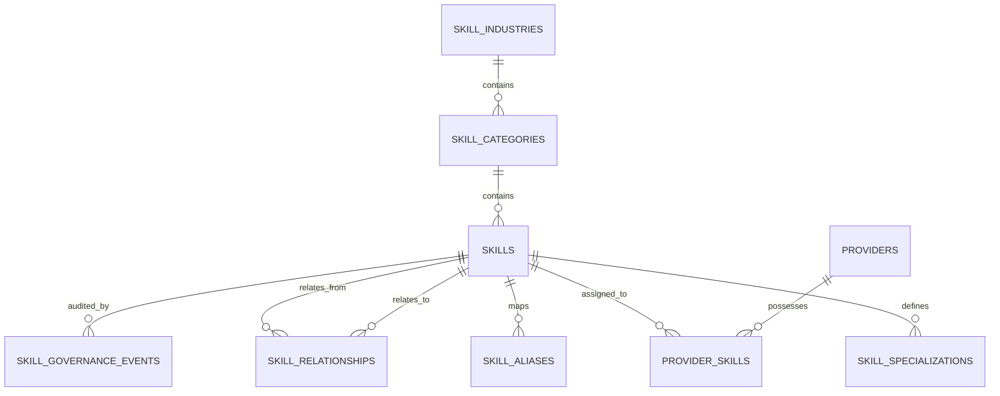

# LOKATOR.NG — PHASE 10.8 NIGERIAN SKILLS DATABASE ARCHITECTURE

**Document:** `PHASE_10_8_NIGERIA_SKILLS_DATABASE_ARCHITECTURE.md`  
**Phase:** 10.8 Architecture & Discovery Gate  
**Status:** TARGET SCHEMA SPECIFICATION — DESIGN ONLY (READ-ONLY)  
**Model Version:** `NSMT-1.0.0`  

---

## 1. ENTITY-RELATIONSHIP ARCHITECTURE

---

## 2. PROPOSED ENTITY SPECIFICATIONS (DESIGN ONLY)

### 1. `skill_industries` (Level 1)
- **Purpose:** Macroeconomic sectors grouping trade categories.
- **Columns:**
  - `id`: `TEXT PRIMARY KEY` (e.g. `home-repairs`, `beauty-wellness`, `auto-transport`).
  - `name`: `TEXT NOT NULL`
  - `description`: `TEXT`
  - `icon`: `TEXT NOT NULL`
  - `display_order`: `INT NOT NULL DEFAULT 0`
  - `is_active`: `BOOLEAN NOT NULL DEFAULT TRUE`
  - `created_at`: `TIMESTAMPTZ DEFAULT NOW()`

### 2. `skill_categories` (Level 2)
- **Purpose:** Functional trade clusters within an industry.
- **Columns:**
  - `id`: `TEXT PRIMARY KEY` (e.g. `electrical-power`, `hair-styling`, `mechanical-diagnostics`).
  - `industry_id`: `TEXT NOT NULL REFERENCES skill_industries(id)`
  - `name`: `TEXT NOT NULL`
  - `description`: `TEXT`
  - `icon`: `TEXT NOT NULL`
  - `display_order`: `INT NOT NULL DEFAULT 0`
  - `is_active`: `BOOLEAN NOT NULL DEFAULT TRUE`
  - `created_at`: `TIMESTAMPTZ DEFAULT NOW()`

### 3. `skills` (Level 3 - Canonical Unit)
- **Purpose:** Primary canonical skill entity.
- **Columns:**
  - `id`: `TEXT PRIMARY KEY` (canonical slug, e.g. `electrician`, `solar-installer`, `plumber`, `nail-technician`).
  - `category_id`: `TEXT NOT NULL REFERENCES skill_categories(id)`
  - `name`: `TEXT NOT NULL`
  - `display_name`: `TEXT NOT NULL`
  - `icon`: `TEXT NOT NULL`
  - `prompt_text`: `TEXT`
  - `cta_text`: `TEXT`
  - `search_weight`: `NUMERIC(3,2) DEFAULT 1.00`
  - `governance_status`: `TEXT NOT NULL DEFAULT 'ACTIVE' CHECK (governance_status IN ('PROPOSED', 'REVIEW', 'APPROVED', 'ACTIVE', 'DEPRECATED', 'ARCHIVED'))`
  - `seo_meta_title`: `TEXT`
  - `seo_meta_description`: `TEXT`
  - `model_version`: `TEXT DEFAULT 'NSMT-1.0.0'`
  - `created_at`: `TIMESTAMPTZ DEFAULT NOW()`
  - `updated_at`: `TIMESTAMPTZ DEFAULT NOW()`

### 4. `skill_specializations` (Level 4)
- **Purpose:** Specific sub-skills, equipment specializations, or vehicle makes.
- **Columns:**
  - `id`: `UUID PRIMARY KEY DEFAULT gen_random_uuid()`
  - `skill_id`: `TEXT NOT NULL REFERENCES skills(id) ON DELETE CASCADE`
  - `slug`: `TEXT NOT NULL UNIQUE` (e.g. `toyota-diagnostic-specialist`, `knotless-braids`)
  - `name`: `TEXT NOT NULL`
  - `description`: `TEXT`
  - `is_active`: `BOOLEAN DEFAULT TRUE`
  - `created_at`: `TIMESTAMPTZ DEFAULT NOW()`

### 5. `skill_aliases`
- **Purpose:** Multi-dialect and colloquial Nigerian search terms mapped to canonical skills.
- **Columns:**
  - `id`: `UUID PRIMARY KEY DEFAULT gen_random_uuid()`
  - `skill_id`: `TEXT NOT NULL REFERENCES skills(id) ON DELETE CASCADE`
  - `alias`: `TEXT NOT NULL UNIQUE` (lowercased, normalized)
  - `language`: `TEXT NOT NULL DEFAULT 'EN' CHECK (language IN ('EN', 'PIDGIN', 'YORUBA', 'HAUSA', 'IGBO'))`
  - `confidence_score`: `NUMERIC(3,2) NOT NULL DEFAULT 1.00`
  - `alias_type`: `TEXT NOT NULL CHECK (alias_type IN ('SYNONYM', 'COLLOQUIAL', 'MISSPELLING', 'LOCAL_NAME'))`
  - `created_at`: `TIMESTAMPTZ DEFAULT NOW()`

### 6. `provider_skills` (Normalized Junction)
- **Purpose:** Links verified providers to canonical skills without unconstrained text arrays.
- **Columns:**
  - `id`: `BIGSERIAL PRIMARY KEY`
  - `provider_id`: `BIGINT NOT NULL REFERENCES public.providers(id) ON DELETE CASCADE`
  - `skill_id`: `TEXT NOT NULL REFERENCES skills(id) ON DELETE RESTRICT`
  - `years_of_experience`: `INT CHECK (years_of_experience >= 0)`
  - `is_primary`: `BOOLEAN DEFAULT FALSE`
  - `verification_status`: `TEXT DEFAULT 'UNVERIFIED' CHECK (verification_status IN ('UNVERIFIED', 'SELF_DECLARED', 'DOCUMENT_VERIFIED', 'TRADE_TESTED'))`
  - `created_at`: `TIMESTAMPTZ DEFAULT NOW()`
  - `CONSTRAINT uq_provider_skill UNIQUE (provider_id, skill_id)`

### 7. `skill_relationships`
- **Purpose:** Graph of complementary services (e.g., Plumber $\leftrightarrow$ Tiler, Painter $\leftrightarrow$ POP Installer).
- **Columns:**
  - `id`: `UUID PRIMARY KEY DEFAULT gen_random_uuid()`
  - `skill_id_a`: `TEXT NOT NULL REFERENCES skills(id) ON DELETE CASCADE`
  - `skill_id_b`: `TEXT NOT NULL REFERENCES skills(id) ON DELETE CASCADE`
  - `relationship_type`: `TEXT NOT NULL CHECK (relationship_type IN ('COMPLEMENTARY', 'SUBSTITUTE', 'PREREQUISITE'))`
  - `strength_score`: `NUMERIC(3,2) NOT NULL DEFAULT 0.80`

### 8. `skill_governance_events`
- **Purpose:** Append-only audit record of administrative taxonomy lifecycle modifications.
- **Columns:**
  - `id`: `UUID PRIMARY KEY DEFAULT gen_random_uuid()`
  - `skill_id`: `TEXT NOT NULL REFERENCES skills(id) ON DELETE CASCADE`
  - `actor_id`: `UUID NOT NULL REFERENCES auth.users(id)`
  - `action`: `TEXT NOT NULL CHECK (action IN ('CREATE', 'STATUS_CHANGE', 'ALIAS_ADD', 'MERGE', 'DEPRECATE'))`
  - `previous_state`: `JSONB`
  - `new_state`: `JSONB`
  - `rationale`: `TEXT NOT NULL`
  - `created_at`: `TIMESTAMPTZ DEFAULT NOW()`

---

## 3. UNTOUCHED PRODUCTION BUSINESS TRUTH TABLES

The following existing production tables must remain **completely untouched**:
- `public.providers`: Core profile, coordinates, bio, WhatsApp contact details.
- `public.reviews`: Verified customer feedback and rating aggregations.
- `public.provider_services`: Existing backward-compatible multi-skill price rows.
- `public.portfolio_items`: Provider image and video assets.
