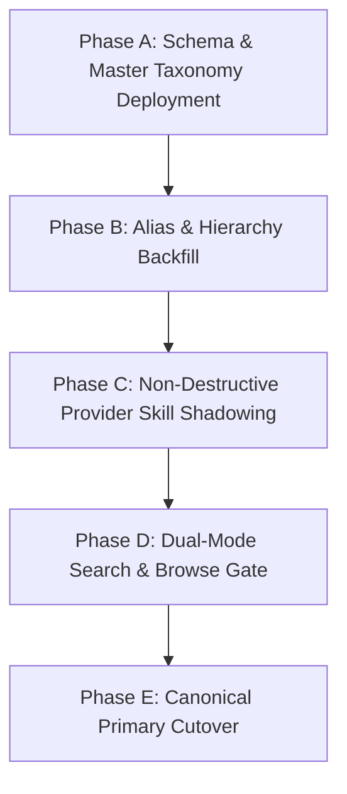

# LOKATOR.NG — PHASE 10.8 NIGERIAN SKILLS MIGRATION STRATEGY

**Document:** `PHASE_10_8_NIGERIA_SKILLS_MIGRATION_STRATEGY.md`  
**Phase:** 10.8 Architecture & Discovery Gate  
**Status:** MIGRATION SPECIFICATION — DESIGN ONLY (READ-ONLY)  

---

## 1. MIGRATION OBJECTIVES & ZERO-DOWNTIME PRINCIPLES

1. **Zero Data Loss:** Existing `providers`, `reviews`, and `provider_services` rows remain completely intact.
2. **Backward Compatibility:** All existing endpoints (`search.html?service=electrician`) continue to function without interruption.
3. **Staged Execution:** Phased rollout where new taxonomy tables are deployed, backfilled via idempotent scripts, verified via dual-resolution tests, and finally activated in the frontend.
4. **Instant Reversibility:** Pure append-and-link design allowing zero-impact fallback to legacy flat category arrays if needed.

---

## 2. 5-PHASE STAGED ROLLOUT PLAN

### Phase A: Schema & Master Taxonomy Deployment
- Deploy target DDL (`skill_industries`, `skill_categories`, `skills`, `skill_specializations`, `skill_aliases`, `provider_skills`, `skill_governance_events`).
- Populate 15 Industries, 48 Categories, and 185 Canonical Skills.
- Legacy tables remain primary; no production queries touch new tables yet.

### Phase B: Alias & Hierarchy Backfill
- Ingest 1,200+ Nigerian colloquialisms, phonetic variations, and language aliases into `skill_aliases`.
- Establish canonical foreign key references between existing 18 legacy categories and new canonical skills.

### Phase C: Non-Destructive Provider Skill Shadowing
- Run a server-side backfill script mapping each provider's `primary_category_slug` and `skills[]` into normalized `provider_skills` rows.
- Existing `providers.skills` array is preserved as a permanent fallback.

### Phase D: Dual-Mode Search & Browse Gate
- Update `discovery-orchestrator.js` to resolve incoming queries against canonical `skills` and `skill_aliases`.
- Pass resolved canonical skill slugs into the existing `search.js` engine without altering ranking algorithms.

### Phase E: Canonical Primary Cutover
- Activate new Browse UI on `index.html` and `search.html`.
- Transition Provider Registration to multi-skill category pickers.

---

## 3. ROLLBACK & DISASTER RECOVERY PROTOCOL

If any unexpected anomaly occurs during migration:
1. Revert client resolver to legacy `categories.js` array.
2. Search queries immediately fall back to `providers.skills[]` ILIKE matching.
3. Drop or disable Phase 10.8 taxonomy tables without touching `providers` or `reviews`.
4. Zero downtime, zero state mutation, zero business impact.
