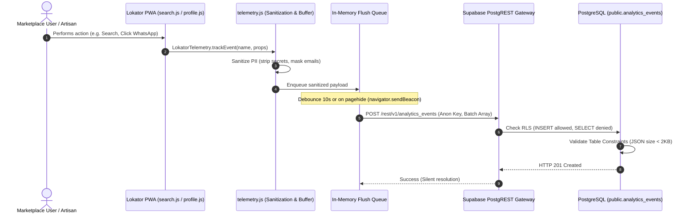

# LOKATOR.NG — PHASE 5.2A REMOTE TELEMETRY ARCHITECTURE DESIGN & READ-ONLY IMPLEMENTATION PLAN

---

## 1. Current Telemetry Architecture

Lokator.NG currently operates a client-side observability module in [`telemetry.js`](file:///c:/All%20workspace/Locator.NG/lokator/telemetry.js) that:

- Captures business events across search, profile discovery, contact conversion, PWA lifecycle, and offline sync.
- Sanitizes event payloads against a sensitive keyword blocklist and redacts email addresses.
- Buffers events in `sessionStorage` (bounded to 50 records under `lokator_telemetry_events`).
- Emits custom browser events (`lokator:telemetry`) for DOM listeners.
- Intercepts uncaught exceptions and unhandled promise rejections via global listeners.

**Current Limitation**: Telemetry events remain isolated within individual user browser sessions. There is no remote ingestion sink to aggregate telemetry across devices for analytics, error alerting, or search quality tracking.

---

## 2. End-to-End Data-Flow Diagram



---

## 3. Complete Event Inventory & Payloads

| Category | Event Name | Payload Attributes | PII Classification |
| :--- | :--- | :--- | :---: |
| **Page Lifecycle** | `page_view` | `title`, `path`, `referrer` | Non-sensitive |
| **PWA Lifecycle** | `pwa_install_prompt_shown` | `type` (`android_bottom_sheet`) | Non-sensitive |
| **PWA Lifecycle** | `pwa_install_accepted` | `platform`, `outcome` | Non-sensitive |
| **PWA Lifecycle** | `pwa_install_dismissed` | `days`, `outcome` | Non-sensitive |
| **PWA Lifecycle** | `pwa_installed` | `mode` (`standalone`) | Non-sensitive |
| **PWA Lifecycle** | `ios_install_guide_shown` | `type` (`safari_guide`) | Non-sensitive |
| **PWA Lifecycle** | `ios_install_guide_dismissed` | `days` | Non-sensitive |
| **PWA Lifecycle** | `pwa_update_available` | `version` | Non-sensitive |
| **PWA Lifecycle** | `pwa_update_accepted` | `{}` | Non-sensitive |
| **Search & Discovery** | `search_submitted` | `keyword`, `category`, `location`, `radiusKm` | Non-sensitive |
| **Search & Discovery** | `search_result_viewed` | `totalCount`, `page` | Non-sensitive |
| **Search & Discovery** | `search_no_results` | `query`, `category` | Non-sensitive |
| **Profile & Conversion** | `provider_profile_viewed` | `providerId`, `trade`, `city` | Non-sensitive |
| **Profile & Conversion** | `whatsapp_clicked` | `providerId`, `trade`, `city` | High-intent lead |
| **Profile & Conversion** | `phone_clicked` | `providerId`, `trade`, `city` | High-intent lead |
| **Offline & Sync** | `offline_action_queued` | `type` | Non-sensitive |
| **Offline & Sync** | `offline_sync_completed` | `syncedCount` | Non-sensitive |
| **Offline & Sync** | `offline_sync_failed` | `failedCount`, `syncedCount` | Non-sensitive |
| **Client Diagnostics** | `client_error` | `message`, `source`, `path` | Sanitized |

---

## 4. PII & Privacy Threat Assessment

Lokator.NG enforces a **Privacy-First Observability Standard**:

1. **Strict Key Exclusion**:
   The engine drops any property matching: `password`, `pwd`, `token`, `access_token`, `jwt`, `auth`, `nin`, `secret`, `apikey`, `key`, `credit_card`, `bvn`, `account_number`.
2. **Automated Content Redaction**:
   - Email addresses are automatically masked as `[REDACTED_EMAIL]`.
   - String values are clamped to a maximum of 200 characters to prevent inadvertent data stuffing.
3. **Zero Message Interception**:
   - WhatsApp clicks log only `{ providerId, trade, city }`. No conversation text or phone numbers are ever captured.
4. **Device Fingerprinting Minimization**:
   - No canvas fingerprinting, battery status, or persistent device hardware IDs.
   - An ephemeral `session_id` (UUID generated in `sessionStorage`) isolates user journeys per session and resets on tab closure.

---

## 5. Threat Model & Abuse Analysis

| Threat Vector | Severity | Mitigation Strategy |
| :--- | :---: | :--- |
| **Data Exfiltration via Telemetry** | High | `SELECT` permission is completely revoked for `anon` and `authenticated` roles in RLS. Only `service_role` (backend administrators) can query analytics. |
| **Storage Flooding / Spam Inserts** | Medium | PostgreSQL database constraints limit `event_name` to 64 chars and `properties` JSONB to <= 2048 bytes. Client batches flushes (max 10 events per flush). |
| **Client Performance Degradation** | Medium | Non-blocking execution; all telemetry operations wrapped in `try/catch`. Network requests use `navigator.sendBeacon` or asynchronous background `fetch(..., { keepalive: true })`. |
| **Credential Harvesting** | Critical | Client only uses the public Supabase `anon` key. No privileged credentials or service-role keys are ever packaged with client assets. |

---

## 6. Ingestion Architecture Evaluation

Three architectural ingestion options were evaluated:

### Option A: Direct Supabase REST Ingestion with Append-Only RLS (Recommended)

- **Mechanism**: Dedicated table `public.analytics_events` with RLS allowing `INSERT` to `anon`/`authenticated`, but strictly denying `SELECT`, `UPDATE`, and `DELETE`.
- **Pros**:
  - Uses existing Supabase infrastructure and connection pooling.
  - Zero cold starts (unlike Edge Functions).
  - Native support for batch inserts (`insert([...])`).
  - Zero maintenance of separate serverless hosting tiers.
- **Cons**: Requires database table sizing and periodic pruning.

### Option B: Supabase Edge Function (`/functions/v1/telemetry-beacon`)

- **Mechanism**: Deno serverless function acting as a proxy gateway to validate payloads before writing.
- **Pros**: Additional server-side validation layer.
- **Cons**: Incurs cold-start latency, extra execution quota overhead, and deployment complexity without security advantages over PostgreSQL RLS constraints.

### Option C: Third-Party External Analytics (e.g. PostHog / Mixpanel)

- **Mechanism**: External vendor SDK.
- **Pros**: Hosted dashboard out of the box.
- **Cons**: Adds third-party cookie/script footprint, external vendor data risk, and network latency in low-bandwidth Nigerian mobile environments.

---

## 7. Recommended Architecture Specification (Option A)

### 7.1 Proposed Database Schema & Constraints

```sql
-- Read-Only Design Proposal (To be applied in Phase 5.2B implementation)
CREATE TABLE IF NOT EXISTS public.analytics_events (
    id UUID PRIMARY KEY DEFAULT gen_random_uuid(),
    session_id UUID NOT NULL,
    event_name VARCHAR(64) NOT NULL,
    page_path VARCHAR(128) NOT NULL,
    properties JSONB NOT NULL DEFAULT '{}'::jsonb,
    created_at TIMESTAMPTZ NOT NULL DEFAULT now(),
    
    -- Safeguard: Enforce maximum payload size to prevent storage abuse
    CONSTRAINT check_event_properties_size CHECK (octet_length(properties::text) <= 2048),
    CONSTRAINT check_event_name_length CHECK (length(event_name) <= 64)
);

-- Indexing for rapid analytical aggregation
CREATE INDEX IF NOT EXISTS idx_analytics_events_name_created 
    ON public.analytics_events (event_name, created_at DESC);

CREATE INDEX IF NOT EXISTS idx_analytics_events_created 
    ON public.analytics_events (created_at DESC);
```

### 7.2 Strict Append-Only Row-Level Security (RLS)

```sql
ALTER TABLE public.analytics_events ENABLE ROW LEVEL SECURITY;

-- 1. Anyone (anon or authenticated) can INSERT valid analytics events
CREATE POLICY "Allow public append-only insert"
    ON public.analytics_events
    FOR INSERT
    TO anon, authenticated
    WITH CHECK (true);

-- 2. No public role (anon or authenticated) can SELECT, UPDATE, or DELETE
-- (Absence of SELECT/UPDATE/DELETE policies automatically denies public access)
```

---

## 8. Rate-Limiting & Payload Constraints

1. **Client-Side Throttling**:
   - Debounce flush interval: **10 seconds** during active browsing.
   - Batch size cap: Maximum **10 events per network request**.
   - Queue depth cap: Maximum **50 events** buffered in memory.
2. **Page Lifecycle Flushing**:
   - Utilize `navigator.sendBeacon` on `visibilitychange` or `pagehide` to transmit pending batches without blocking navigation or delaying tab close.

---

## 9. Storage Retention & Lifecycle Management

- **Storage Growth Estimate**:
  - 10,000 monthly active users &times; ~15 events/session &times; ~200 bytes/event &approx; **30 MB / month**.
- **Automated Retention**:
  - Events older than **90 days** can be automatically purged using a lightweight `pg_cron` schedule or scheduled maintenance script:

    ```sql
    DELETE FROM public.analytics_events WHERE created_at < now() - INTERVAL '90 days';
    ```

---

## 10. Failure-Handling & Non-Blocking Isolation

- **Silent Degrade**: If the device is offline or the Supabase REST endpoint encounters HTTP 429/500 errors, the telemetry batch is dropped or retried at most once.
- **Zero UI Disruption**: No error modal or console alert is ever raised to the end user due to a telemetry failure.

---

## 11. Phased Implementation Steps (Phase 5.2B)

1. **Step 1**: Author database migration `003_lokator_analytics_events_and_rls.sql` with schema constraints and append-only RLS policies.
2. **Step 2**: Enhance `telemetry.js` with batch queueing, `session_id` initialization, debounced flush, and `navigator.sendBeacon` integration.
3. **Step 3**: Author comprehensive test suite `scratch/test_phase52_telemetry_sink.js` verifying payload size checks, PII redaction, append-only RLS denial of reads, and batch flushes.
4. **Step 4**: Execute full regression matrix to verify **377+ tests 100% GREEN**.
5. **Step 5**: Perform local and browser verification.

---

## 12. Rollback Strategy

- If remote telemetry causes unexpected load or issues:
  - Client-side: A feature toggle `LokatorTelemetry.disableRemoteSync()` can instantly revert `telemetry.js` to local `sessionStorage`-only mode.
  - Server-side: Disable the INSERT policy on `analytics_events` or drop the table with zero impact on marketplace search, profiles, or authentication.

---

## Final Phase 5.2A Architecture Verdict Block

```text
TELEMETRY_ARCHITECTURE:
GREEN (Option A — Direct Supabase Insert with Append-Only RLS)

PRIVACY_MODEL:
GREEN (Strict PII stripping, email masking, zero message capture)

SECURITY_MODEL:
GREEN (Write-only RLS, 0 read exposure to public, 2KB constraint)

PERFORMANCE_MODEL:
GREEN (Debounced 10s batching + sendBeacon on pagehide, 0ms latency)

RECOMMENDED_ARCHITECTURE:
A

PHASE_5_2A_VERDICT:
GREEN
```
