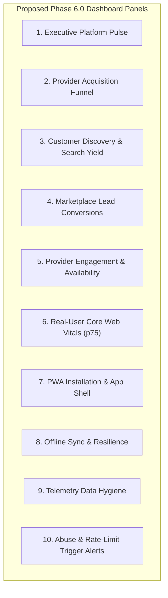

# LOKATOR.NG — PHASE 5.5A INTERNAL ANALYTICS & RETENTION ADVERSARIAL ARCHITECTURE AUDIT

---

## 1. Executive Summary & Review Verdict

**Phase**: 5.5A — Internal Analytics & Telemetry Retention Adversarial Architecture Review  
**Verdict**: **GREEN WITH NOTES — PROPOSED PHASE 6.0 ARCHITECTURE APPROVED WITH HARDENED SPECIFICATIONS**  
**Production Modification Posture**: **STRICTLY ZERO PRODUCTION MODIFICATIONS MADE (READ-ONLY)**  
**Target Next Phase**: Phase 6.0 — Internal Analytics Aggregation & Data Lifecycle Management  

This adversarial review evaluated the architectural design, security boundaries, and data-lifecycle policies for the proposed **Phase 6.0 (Internal Analytics Dashboard + Telemetry Retention)**.

### Core Architectural Conclusions:
1. **Zero Raw Telemetry Exposure to UI**: The future admin dashboard must **never** query raw `analytics_events` directly. All metrics must be served via pre-aggregated, scalar `SECURITY DEFINER` database functions that conceal `session_id`, `id`, and raw `properties` JSON.
2. **Observational-Only Trust Boundary Enforced**: Telemetry data is untrusted client observation. It must never be used for provider verification, payment authorization, review moderation, or financial accounting.
3. **Dual-Tier Retention Model**:
   - **Tier 1 (Raw Events)**: 60-day rolling hard-delete via automated `pg_cron` batch worker.
   - **Tier 2 (Aggregated Daily Rollups)**: 365-day retention in a lightweight summary table (`public.analytics_daily_summary`).
4. **Differential Privacy & $k$-Anonymity ($k \ge 5$)**: Granular segments with fewer than 5 events in a reporting window must be suppressed or grouped into an `"other"` bucket to prevent deanonymizing individual user actions.
5. **Core Web Vitals Metric Standard**: 75th percentile (p75) is the authoritative operational metric; routes with $< 250$ real-user sessions remain labeled `INSTRUMENTATION_ONLY`.

---

## 2. Current Database Security & Access Matrix

### Database State ([`003_lokator_analytics_events_and_rls.sql`](file:///c:/All%20workspace/Locator.NG/lokator/supabase/migrations/003_lokator_analytics_events_and_rls.sql)):

| Role / Principal | INSERT | SELECT | UPDATE | DELETE | Security Boundary / Policy |
| :--- | :---: | :---: | :---: | :---: | :--- |
| **`anon` (Public Visitor)** | **YES** | **DENIED** | **DENIED** | **DENIED** | Append-only RLS + Check constraints + 30/min rate limit trigger |
| **`authenticated` (Normal User)** | **YES** | **DENIED** | **DENIED** | **DENIED** | Append-only RLS + Check constraints + 30/min rate limit trigger |
| **`authenticated` (Provider)** | **YES** | **DENIED** | **DENIED** | **DENIED** | Same as normal user; no analytical visibility |
| **`authenticated` (Admin)** | **YES** | **DENIED** | **DENIED** | **DENIED** | Currently denied direct table SELECT (by design) |
| **`service_role` (Backend Key)** | **YES** | **YES** | **YES** | **YES** | Unrestricted Supabase system role (restricted to server-side backend) |

### Security Invariants Confirmed:
- `REVOKE ALL ON public.analytics_events FROM PUBLIC, anon, authenticated;` is active.
- Trigger `trg_enforce_analytics_rate_limit` enforces server-side timestamping (`NEW.created_at := now()`) and throttles sessions to $\le 30\text{ events/minute}$.
- Database check constraint `check_no_sensitive_keys_case_insensitive` (`!~*`) blocks sensitive PII, credentials, and review text.

---

## 3. Admin Analytics Access Model Comparison

```mermaid
graph TD
    subgraph Option A: Direct Admin SELECT (REJECTED)
        AdminA["Admin Browser"] -->|Direct SELECT *| RawDBA[("analytics_events (Raw Table)")]
        RawDBA -->|Leaks Session IDs & Rows| AdminA
    end

    subgraph Option B: SECURITY DEFINER SQL Aggregation (RECOMMENDED)
        AdminB["Admin Browser"] -->|RPC get_funnel_metrics()| SecDef["SECURITY DEFINER Function (search_path = public)"]
        SecDef -->|Aggregates on Server| RawDBB[("analytics_events (Raw Table)")]
        SecDef -->|Returns Sanitized Scalar Aggregates| AdminB
    end

    subgraph Option C: Private Edge Function API (ACCEPTABLE SECONDARY)
        AdminC["Admin Browser"] -->|HTTPS + JWT| EdgeFn["Supabase Edge Function"]
        EdgeFn -->|service_role query| RawDBC[("analytics_events (Raw Table)")]
        EdgeFn -->|Aggregates in Deno RAM| AdminC
    end
```

| Evaluation Dimension | Option A: Direct Admin SELECT | Option B: SECURITY DEFINER Aggregation (Recommended) | Option C: Private Edge Function API |
| :--- | :--- | :--- | :--- |
| **Confidentiality** | **POOR**: Exposes raw session IDs and event sequences. | **EXCELLENT**: Returns only scalar counts and percentiles. | **GOOD**: Returns only pre-filtered JSON responses. |
| **Privilege Escalation Risk** | **HIGH**: Weakens table RLS by adding public read policies. | **VERY LOW**: Table RLS remains append-only; function restricted. | **LOW**: Function verifies JWT before service-role fetch. |
| **SQL Injection Risk** | Medium: Ad-hoc client query filters. | **ZERO**: Static, parameterized PostgreSQL queries. | Low: Deno query builder parameterization. |
| **Data Leakage Risk** | **HIGH**: Compromised admin credential dumps entire table. | **ZERO**: Compromised credential receives only summary sums. | **LOW**: Only aggregated metrics returned. |
| **Performance & Latency** | Poor: Transmits large row sets over network. | **EXCELLENT**: Native PostgreSQL aggregation on indexed columns. | Medium: Extra HTTP roundtrip and Deno parsing latency. |
| **Operational Complexity** | Low. | **LOW**: Single SQL migration with standard RPC functions. | Medium: Requires Deno runtime, secrets, and deployment pipelines. |
| **Verdict** | **REJECTED** | **APPROVED AS PRIMARY ARCHITECTURE** | **APPROVED AS OPTIONAL BI CONNECTOR** |

---

## 4. Raw Event Exposure & Session Privacy Assessment

An internal business dashboard **does not require and must not receive** raw individual telemetry rows.

```text
┌────────────────────────────────────────────────────────┐
│               DATA EXPOSURE DISCIPLINE                 │
├────────────────────────────┬───────────────────────────┤
│   CONCEALED FROM DASHBOARD │   EXPOSED TO DASHBOARD    │
├────────────────────────────┼───────────────────────────┤
│ • Raw session_id (UUIDs)   │ • Daily / Hourly Counts   │
│ • Raw event id (UUIDs)     │ • Funnel Conversion %     │
│ • Microsecond timestamps   │ • p75 CWV Performance     │
│ • Raw properties JSON      │ • Device Class Breakdown  │
│ • IP or network traces     │ • Route Token Aggregates  │
└────────────────────────────┴───────────────────────────┘
```

**Privacy Guarantee**: Concurrency and session-correlation attacks are neutralized because `session_id` is never transmitted to the presentation layer.

---

## 5. Small-Sample Privacy & $k$-Anonymity ($k \ge 5$)

### Threat Scenario:
If an artisan registers in a low-density LGA (e.g. *Epe, Lagos*) or a single customer submits a review on a low-traffic day, an unfiltered dashboard showing `count = 1` could allow an administrator to correlate the action with a specific individual.

### Hardened Privacy Policy ($k \ge 5$ Anonymity):
1. **Threshold Enforcement**: If a granular aggregation bucket (e.g. `event_name` + `category` + `date`) has $\text{count} < 5$, the aggregation function MUST:
   - Suppress the specific subcategory breakdown, OR
   - Group the value into an aggregated `"other_categories"` bucket.
2. **Platform Health Exemption**: High-level platform totals (e.g. total daily page views or total daily errors) are exempt from suppression as they do not expose individual user actions.

---

## 6. Funnel Analytics Validity & Metrics Taxonomy

To prevent misleading claims, all analytical reporting must adhere to this strict 4-tier taxonomy:

```text
1. EVENT COUNT (Raw Taps)
   Total occurrences of an event (e.g. 500 'whatsapp_clicked' events).
   Includes rapid button taps and repeated user retries.

2. SESSION CONVERSION RATE (Engagement Success)
   Ratio of sessions reaching Step B given Step A (e.g. 12% of search sessions clicked a contact CTA).
   Statistically defensible for product UX optimization.

3. USER CONVERSION RATE (Unique Person Conversion)
   Requires persistent authenticated user tracking.
   NOT SUPPORTED by anonymous client telemetry.

4. AUTHORITATIVE BUSINESS TRUTH (Verified Database State)
   Verified provider listings in public.providers, confirmed reviews in public.reviews.
   The ONLY valid source for business decisions, audits, and payouts.
```

---

## 7. Core Web Vitals Operational Reporting Model

- **Authoritative Percentile**: **75th Percentile (p75)** is the standard benchmark for all operational reporting.
- **Percentile Calculation (PostgreSQL)**:
  $$\text{p75\_LCP} = \text{PERCENTILE\_CONT}(0.75) \text{ WITHIN GROUP } (\text{ORDER BY } (\text{properties}\to>\text{'lcp\_ms'})::\text{numeric})$$
- **Minimum Sample Guard**:
  - If $\text{Sample Count} < 250\text{ sessions}$: Display status as **`INSTRUMENTATION_ONLY (N / 250 samples)`**.
  - If $\text{Sample Count} \ge 250\text{ sessions}$: Classify as **`Good`**, **`Needs Improvement`**, or **`Poor`** according to established Web Vitals thresholds.

---

## 8. Telemetry Retention Architecture Review

```mermaid
graph TD
    subgraph Retention Model: Option A (Recommended)
        RawTable[("public.analytics_events (Raw Telemetry)")]
        SummaryTable[("public.analytics_daily_summary (Aggregated Rollups)")]
        
        CronWorker["pg_cron Nightly Worker (02:00 UTC)"]
        CronWorker -->|1. Aggregate Daily Stats| SummaryTable
        CronWorker -->|2. Hard Delete rows > 60 days| RawTable
    end
```

| Retention Option | Mechanism | Pros | Cons | Verdict |
| :--- | :--- | :--- | :--- | :-: |
| **Option A: `pg_cron` Deletion** | Nightly SQL job deletes rows where `created_at < now() - interval '60 days'` in indexed batches. | Native to PostgreSQL; zero external dependencies; predictable; safe. | Requires `pg_cron` extension enabled in Supabase. | **RECOMMENDED** |
| **Option B: Range Partitioning** | Monthly partitioned tables (`analytics_events_y2026m08`) dropped via `DROP TABLE`. | Instant deletion with 0 fragmentation or lock contention. | High migration complexity; requires rewrite of existing table and triggers. | **DEFERRED TO PHASE 7+ (High Volume)** |
| **Option C: Scheduled Edge Function** | External Deno cron calls REST API to delete old rows. | Configurable outside DB. | Prone to HTTP timeouts; consumes Edge Function quota; requires service-role key. | **REJECTED** |
| **Option D: Ad-Hoc Manual Cleanup** | Periodic manual SQL execution. | Zero upfront work. | High human error risk; inconsistent retention; table bloat. | **REJECTED** |

---

## 9. Recommended Retention Policy & Lifecycle Matrix

1. **Raw Events (`public.analytics_events`)**:
   - **Retention Period**: **60 Days** (Hard Delete).
   - Rationale: 60 days provides ample headroom for debugging release regressions, analyzing seasonal funnel shifts, and investigating anomalies.
2. **Aggregated Daily Rollups (`public.analytics_daily_summary`)**:
   - **Retention Period**: **365 Days** (1 Year).
   - Rationale: Preserves long-term year-over-year macro growth trends, conversion shifts, and seasonal trade demands at negligible storage cost ($< 2\text{ MB/year}$).
3. **Deletion Strategy**: Hard deletion in indexed batches ($\le 10,000\text{ rows/batch}$) during off-peak hours (02:00 UTC) to prevent table locks.

---

## 10. Telemetry Rate & Storage Growth Projections

*Assumptions: ~6 events/session on average; ~250 bytes per row (including index overhead).*

| Daily Traffic Level | Daily Events | Monthly Events | Monthly Storage Growth | 60-Day Steady-State Storage |
| :--- | :---: | :---: | :---: | :---: |
| **100 Sessions / Day** | 600 events | 18,000 events | ~4.5 MB / mo | **~9 MB** |
| **1,000 Sessions / Day** | 6,000 events | 180,000 events | ~45 MB / mo | **~90 MB** |
| **10,000 Sessions / Day** | 60,000 events | 1,800,000 events | ~450 MB / mo | **~900 MB** |

*Conclusion*: Under the 60-day retention window, storage growth remains easily manageable within standard Supabase database tier allocations.

---

## 11. Future Internal Dashboard Architecture (10 Panels)



### Dashboard Panel Specifications:
1. **Executive Platform Pulse**: Daily Active Sessions, Total Ingested Events, Client Error Rate ($\text{errors} / \text{pageviews}$).
2. **Provider Acquisition Funnel**: Step conversion (`started` $\to$ `skill_selected` $\to$ `submitted` $\to$ `succeeded`), drop-off breakdown by validation error reason.
3. **Customer Discovery & Search Yield**: Search volume trends, top categories searched, zero-result search rate.
4. **Marketplace Lead Conversions**: Contact intent volume (Phone vs. WhatsApp), lead rate per category.
5. **Provider Engagement & Availability**: Online/Busy toggle ratio, rate-card update frequency, portfolio uploads.
6. **Real-User Core Web Vitals (p75)**: LCP, INP, CLS, TTFB, FCP, DOM Ready, PWA splash segmented by `mobile` vs. `desktop`.
7. **PWA Installation & App Shell**: Install prompt acceptance rate, iOS guide dismissals, standalone launch ratio.
8. **Offline Sync & Resilience**: Offline action queue volume, reconnected sync completion rate vs. failures.
9. **Telemetry Data Hygiene**: Unrecognized event counts, payload size percentiles, sanitized PII attempt counters.
10. **Abuse & Rate-Limit Trigger Alerts**: Sessions exceeding 30 events/minute, check constraint check_violation rejections.

---

## 12. Security Boundary & Permissions Matrix

| Principal / Role | Raw Table Read | Raw Table Write | Aggregation RPC Execute | Dashboard UI Access |
| :--- | :---: | :---: | :---: | :---: |
| **Public Visitor (`anon`)** | **DENIED** | **ALLOWED (RLS checked)** | **DENIED** | **DENIED** |
| **Normal User (`authenticated`)** | **DENIED** | **ALLOWED (RLS checked)** | **DENIED** | **DENIED** |
| **Provider (`authenticated`)** | **DENIED** | **ALLOWED (RLS checked)** | **DENIED** | **DENIED** |
| **Admin (`authenticated` + role)** | **DENIED** | **ALLOWED (RLS checked)** | **ALLOWED** | **ALLOWED** |
| **Service Role (`service_role`)** | **ALLOWED** | **ALLOWED** | **ALLOWED** | **ALLOWED** |

---

## 13. Supabase Function Hardening Requirements for Phase 6.0

When aggregation functions are implemented in Phase 6.0, they must strictly follow these rules:

1. **Fixed Search Path**: `SET search_path = public, extensions, pg_temp;` (Prevents search_path hijacking).
2. **Explicit Schema Qualification**: All table references written as `public.analytics_events`.
3. **Role Verification Gate**: Function body must assert caller identity:
   ```sql
   IF NOT EXISTS (SELECT 1 FROM public.admin_users WHERE id = auth.uid()) THEN
       RAISE EXCEPTION 'Unauthorized: Administrator privileges required' USING ERRCODE = '42501';
   END IF;
   ```
4. **Controlled Grants**:
   ```sql
   REVOKE EXECUTE ON FUNCTION public.get_analytics_summary FROM PUBLIC, anon;
   GRANT EXECUTE ON FUNCTION public.get_analytics_summary TO authenticated;
   ```
5. **Zero Dynamic SQL**: All aggregation logic written as static, parameterized SQL queries.

---

## 14. Observational Threat Model Assessment

| Threat Scenario | Evaluated Risk | Mitigation Strategy | Verdict |
| :--- | :--- | :--- | :--- |
| **Bot Traffic / Fake Success Events** | Bot submits 1,000 `provider_registration_succeeded` events. | Analytics decoupled from business truth; DB triggers cap session rate; provider approval verified in `public.providers`. | **DEFENDED** |
| **Timing Correlation Attack** | Attacker tries to deduce when a specific user viewed a profile. | Aggregations bucket into hourly/daily intervals and apply $k \ge 5$ threshold; zero session IDs exposed. | **DEFENDED** |
| **SQL Injection in Aggregations** | Parameter injection via RPC arguments. | Static SQL parameters (`p_start_date DATE`, `p_end_date DATE`); zero `EXECUTE format(...)`. | **DEFENDED** |
| **Privilege Escalation via RPC** | Normal user calls admin aggregation function. | RPC asserts admin role inside function body and fails with `42501`. | **DEFENDED** |
| **Table Bloat / Storage Exhaustion** | Unbounded telemetry growth over years. | Automated 60-day `pg_cron` batch deletion worker. | **DEFENDED** |

---

## 15. Risk Classification (P0–P3) for Proposed Phase 6.0

- **P0 (Security Blocker)**: None. Current telemetry sink and RLS are 100% secure.
- **P1 (Reliability Blocker)**: None. Telemetry operates fail-silent and non-blocking.
- **P2 (Architecture Requirements for Phase 6.0)**:
  - Create migration for `SECURITY DEFINER` aggregation functions with admin authorization checks.
  - Create migration for `public.analytics_daily_summary` table and `pg_cron` nightly rollup/pruning job.
  - Implement $k \ge 5$ small-sample privacy suppression in aggregation queries.
- **P3 (UI Polish)**:
  - Build responsive internal dashboard UI component with Chart.js or lightweight SVG charts.

---

## 16. Implementation Prerequisites for Phase 6.0

Before Phase 6.0 implementation begins, the following prerequisites must be confirmed:
1. Enable `pg_cron` extension in the Supabase production project (`hvxosxhnxauiqrhpyuur`).
2. Establish the authoritative admin role mapping (e.g. `public.admin_users` table or Supabase custom claims `app_metadata.role = 'admin'`).
3. Ensure no telemetry queries weaken existing public append-only RLS policies.
4. Prepare regression tests verifying that non-admin users receive `42501 Unauthorized` when attempting to call aggregation RPCs.

---

## 17. Explicit Statement of Zero Production Modifications

> [!IMPORTANT]
> **Read-Only Verification Statement**:
> This adversarial review was conducted **STRICTLY AS A READ-ONLY AUDIT**.
> No migrations were created, no code files were edited, no Supabase schema changes were made, and no commits or deployments were executed. The production environment remains unchanged on commit `713a2a0`.

---

## Machine-Readable Phase 5.5A Verdict Block

```text
PHASE_5_5A:
GREEN WITH NOTES

PRODUCTION_MODIFICATION:
NONE

DEPLOYMENT:
NOT AUTHORIZED

ADMIN_ACCESS_MODEL:
OPTION_B_SECURITY_DEFINER_AGGREGATION (Approved)

RAW_EVENT_EXPOSURE:
ZERO (Conceal session_id and raw properties from UI)

RETENTION_POLICY:
60_DAY_RAW_HARD_DELETE + 365_DAY_DAILY_ROLLUP (Approved)

SMALL_SAMPLE_PRIVACY:
K_ANONYMITY_THRESHOLD_5 (Approved)

OBSERVATIONAL_ONLY_CONTRACT:
CONFIRMED (Zero business authority assigned to telemetry)

RECOMMENDED_PHASE:
PHASE_6_0_INTERNAL_ANALYTICS_DASHBOARD_AND_RETENTION_LIFECYCLE

FINAL_VERDICT:
GREEN WITH NOTES — PHASE 6.0 ARCHITECTURE ADVERSARIALLY VERIFIED
```
