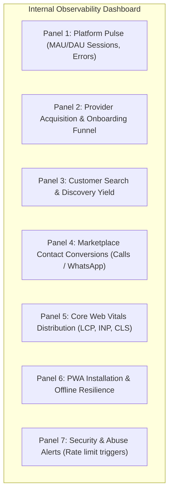

# LOKATOR.NG — PHASE 5.5 PRODUCTION OBSERVABILITY INTELLIGENCE AUDIT

---

## 1. Executive Summary & Review Verdict

**Phase**: 5.5 — Production Observability Intelligence (Read-Only Architecture Audit)  
**Verdict**: **GREEN WITH NOTES — PRODUCTION OBSERVABILITY VERIFIED & ARCHITECTURALLY SOUND**  
**Production Target**: `https://lokator-ng.vercel.app/` | Supabase Project: `hvxosxhnxauiqrhpyuur`  
**Production Modification Posture**: **STRICTLY ZERO PRODUCTION MODIFICATIONS MADE (READ-ONLY)**  

The Phase 5.5 audit evaluated the end-to-end telemetry and observability architecture across Lokator.NG. Following the successful production deployment in Phase 5.4C, the system possesses comprehensive instrumentation across 27 distinct client events spanning Provider Funnel, Customer Discovery/Conversion, Core Web Vitals, and PWA/Offline Resilience.

### Core Architectural Findings:
1. **Zero Security & Privacy Compromise**: Client recursive sanitization and database-level `!~*` regex constraints strictly prevent sensitive PII, credentials, or review bodies from entering `public.analytics_events`.
2. **Observational Truth Boundary Maintained**: Client telemetry is strictly designated `OBSERVATIONAL_ONLY`. Transactional truth remains anchored in `public.providers` and `public.reviews`.
3. **High-Fidelity Telemetry Inventory**: All 16 funnel events from Phase 5.4 and Core Web Vitals from Phase 5.3 are active, non-blocking, and fail-silent.
4. **Data Quality & Abuse Resistance**: Multi-tiered rate limiting (200 events/session client ceiling, 30 events/minute database trigger, authoritative `now()` timestamping) prevents abuse and buffer bloat.

---

## 2. Complete Telemetry Event Inventory (27 Active Events)

| # | Event Name | Source File | Trigger Condition | Payload Schema | Privacy / Sanitization | Frequency / Rate | Status |
| :-: | :--- | :--- | :--- | :--- | :--- | :--- | :-: |
| 1 | `provider_registration_started` | [`register.html`](file:///c:/All%20workspace/Locator.NG/lokator/register.html) | First interaction on registration form | `{ form: 'artisan_register' }` | Static constant; zero user inputs | 1 / registration session | **OBSERVATIONAL** |
| 2 | `provider_skill_selected` | [`register.html`](file:///c:/All%20workspace/Locator.NG/lokator/register.html) | Skill/trade chip selected | `{ trade_slug: string }` | Canonical category slug from CategoryMap | 1–5 / session | **OBSERVATIONAL** |
| 3 | `provider_registration_validation_failed` | [`register.html`](file:///c:/All%20workspace/Locator.NG/lokator/register.html) | Client validation rejected | `{ reason: 'missing_skills' \| 'short_password' \| 'moderation_rejected' }` | Coarse reason string | 0–3 / session | **OBSERVATIONAL** |
| 4 | `provider_registration_submitted` | [`register.html`](file:///c:/All%20workspace/Locator.NG/lokator/register.html) | Form submitted | `{ trade_count: number, has_avatar: boolean }` | Bounded count & boolean flag | 1 / submit | **OBSERVATIONAL** |
| 5 | `provider_registration_succeeded` | [`register.html`](file:///c:/All%20workspace/Locator.NG/lokator/register.html) | DB profile created | `{ trade_slug: string, has_location: boolean }` | Slug & boolean; 0 IDs or PII | 1 / successful registration | **OBSERVATIONAL** |
| 6 | `provider_login_submitted` | [`login.html`](file:///c:/All%20workspace/Locator.NG/lokator/login.html) | Login form submitted | `{ method: 'password' \| 'demo' }` | Method string; 0 credentials | 1 / login attempt | **OBSERVATIONAL** |
| 7 | `provider_login_succeeded` | [`login.html`](file:///c:/All%20workspace/Locator.NG/lokator/login.html) | Auth resolved | `{ method: 'password' \| 'demo' }` | Method string; 0 tokens/JWTs | 1 / successful login | **OBSERVATIONAL** |
| 8 | `provider_login_failed` | [`login.html`](file:///c:/All%20workspace/Locator.NG/lokator/login.html) | Auth rejected | `{ reason: 'validation' \| 'authentication' \| 'network' \| 'unknown', method: string }` | Coarse reason; 0 raw errors | 0–3 / session | **OBSERVATIONAL** |
| 9 | `provider_services_updated` | [`dashboard.js`](file:///c:/All%20workspace/Locator.NG/lokator/dashboard.js) | Skills saved in DB | `{ total_skills: number }` | Bounded integer count | 0–2 / dashboard session | **OBSERVATIONAL** |
| 10 | `provider_pricing_updated` | [`dashboard.js`](file:///c:/All%20workspace/Locator.NG/lokator/dashboard.js) | Rates saved in DB | `{ total_items: number }` | Bounded integer count (0 prices) | 0–2 / dashboard session | **OBSERVATIONAL** |
| 11 | `provider_hours_updated` | [`dashboard.js`](file:///c:/All%20workspace/Locator.NG/lokator/dashboard.js) | Hours saved in DB | `{ has_weekday: boolean, has_weekend: boolean }` | Boolean flags only | 0–2 / dashboard session | **OBSERVATIONAL** |
| 12 | `provider_portfolio_uploaded` | [`dashboard.js`](file:///c:/All%20workspace/Locator.NG/lokator/dashboard.js) | Portfolio item added | `{ category: string }` | Canonical category slug | 0–5 / dashboard session | **OBSERVATIONAL** |
| 13 | `provider_availability_toggled` | [`dashboard.js`](file:///c:/All%20workspace/Locator.NG/lokator/dashboard.js) | Toggle clicked | `{ is_available: boolean }` | Boolean value | 0–5 / dashboard session | **OBSERVATIONAL** |
| 14 | `category_browse_clicked` | [`app.js`](file:///c:/All%20workspace/Locator.NG/lokator/app.js), [`search.js`](file:///c:/All%20workspace/Locator.NG/lokator/search.js) | Category card or filter changed | `{ category: string, source: 'home_categories' \| 'search_filter' }` | Canonical slug & source token | 1–10 / browsing session | **OBSERVATIONAL** |
| 15 | `registration_cta_clicked` | [`app.js`](file:///c:/All%20workspace/Locator.NG/lokator/app.js), [`search.js`](file:///c:/All%20workspace/Locator.NG/lokator/search.js), [`profile.js`](file:///c:/All%20workspace/Locator.NG/lokator/profile.js) | Provider onboarding link clicked | `{ source: 'home_page' \| 'search_page' \| 'profile_navbar' }` | Source identifier string | 0–3 / session | **OBSERVATIONAL** |
| 16 | `provider_review_submitted` | [`profile.js`](file:///c:/All%20workspace/Locator.NG/lokator/profile.js) | Review posted | `{ rating: number (1–5), page: 'profile' }` | Star rating integer; 0 comments/names | 0–2 / session | **OBSERVATIONAL** |
| 17 | `search_submitted` | [`search.js`](file:///c:/All%20workspace/Locator.NG/lokator/search.js) | Search executed | `{ category: string, keyword: string, city: string, verifiedOnly: boolean }` | Clean keyword (truncated <=200, PII masked) | 1–10 / search session | **OBSERVATIONAL** |
| 18 | `search_no_results` | [`search.js`](file:///c:/All%20workspace/Locator.NG/lokator/search.js) | 0 providers found | `{ query: string, category: string }` | Normalized query string | 0–3 / session | **OBSERVATIONAL** |
| 19 | `search_result_viewed` | [`search.js`](file:///c:/All%20workspace/Locator.NG/lokator/search.js) | Results rendered | `{ totalCount: number, page: number }` | Integer counts | 1–10 / search session | **OBSERVATIONAL** |
| 20 | `provider_profile_viewed` | [`profile.js`](file:///c:/All%20workspace/Locator.NG/lokator/profile.js) | Profile loaded | `{ providerId: string, trade: string, city: string }` | Provider UUID, trade, city | 1–5 / session | **OBSERVATIONAL** |
| 21 | `phone_clicked` | [`profile.js`](file:///c:/All%20workspace/Locator.NG/lokator/profile.js) | Direct call CTA tapped | `{ providerId: string, trade: string, city: string }` | Provider metadata; 0 customer phone | 0–3 / session | **OBSERVATIONAL** |
| 22 | `whatsapp_clicked` | [`profile.js`](file:///c:/All%20workspace/Locator.NG/lokator/profile.js) | WhatsApp CTA tapped | `{ providerId: string, trade: string, city: string }` | Provider metadata; 0 customer phone/msg | 0–3 / session | **OBSERVATIONAL** |
| 23 | `web_vitals_summary` | [`telemetry.js`](file:///c:/All%20workspace/Locator.NG/lokator/telemetry.js) | Page unload | `{ page: string, device_class: string, lcp_ms?: number, inp_ms?: number, cls?: number, ttfb_ms?: number, fcp_ms?: number, dom_ready_ms?: number, pwa_splash_ms?: number }` | Normalized page token & device class (0 fingerprint) | Exactly 1 / page unload | **OBSERVATIONAL** |
| 24 | `page_view` | [`telemetry.js`](file:///c:/All%20workspace/Locator.NG/lokator/telemetry.js) | Page loaded | `{ title: string }` | Document title (<=200 chars) | 1 / page load | **OBSERVATIONAL** |
| 25 | `client_error` | [`telemetry.js`](file:///c:/All%20workspace/Locator.NG/lokator/telemetry.js) | Uncaught runtime error | `{ message: string, filename: string, lineno: number }` | Sanitized error trace (<=200 chars) | Rare / unexpected | **OBSERVATIONAL** |
| 26 | `pwa_install_prompt_shown` / `pwa_installed` | [`pwa-manager.js`](file:///c:/All%20workspace/Locator.NG/lokator/pwa-manager.js) | PWA prompt / install event | `{ type: string, platform?: string, mode?: string }` | Coarse platform identifiers | 0–1 / session | **OBSERVATIONAL** |
| 27 | `offline_action_queued` / `offline_sync_completed` | [`supabase-client.js`](file:///c:/All%20workspace/Locator.NG/lokator/supabase-client.js) | Offline action or reconnection sync | `{ type?: string, syncedCount?: number, failedCount?: number }` | Action type and count | 0–5 / offline session | **OBSERVATIONAL** |

---

## 3. Provider Funnel Intelligence & Analytical Capabilities

The 13 provider-specific telemetry events map directly across the 4 stages of the artisan lifecycle:

```mermaid
graph TD
    subgraph 1. Discovery & Onboarding
        S1["provider_registration_started"] --> S2["provider_skill_selected"]
        S2 --> S3["provider_registration_submitted"]
        S3 -->|Failed| S3F["provider_registration_validation_failed"]
        S3 -->|Success| S4["provider_registration_succeeded"]
    end
    subgraph 2. Authentication
        A1["provider_login_submitted"] -->|Success| A2["provider_login_succeeded"]
        A1 -->|Failure| A3["provider_login_failed"]
    end
    subgraph 3. Profile Enrichment (Dashboard)
        D1["provider_services_updated"]
        D2["provider_pricing_updated"]
        D3["provider_hours_updated"]
        D4["provider_portfolio_uploaded"]
    end
    subgraph 4. Real-Time Operations
        O1["provider_availability_toggled"]
    end

    S4 -.-> A1
    A2 -.-> D1 & D2 & D3 & D4 & O1
```

### Calculable Conversion Metrics:
1. **Registration Form Completion Rate**:  
   $$\text{Completion Rate} = \frac{\text{Count}(\text{provider\_registration\_submitted})}{\text{Count}(\text{provider\_registration\_started})}$$
2. **First-Time Moderation/Validation Pass Rate**:  
   $$\text{Validation Pass Rate} = \frac{\text{Count}(\text{provider\_registration\_submitted})}{\text{Count}(\text{provider\_registration\_submitted}) + \text{Count}(\text{provider\_registration\_validation\_failed})}$$
3. **Account Creation Success Rate**:  
   $$\text{Creation Rate} = \frac{\text{Count}(\text{provider\_registration\_succeeded})}{\text{Count}(\text{provider\_registration\_submitted})}$$
4. **Authentication Success Rate**:  
   $$\text{Login Success Rate} = \frac{\text{Count}(\text{provider\_login\_succeeded})}{\text{Count}(\text{provider\_login\_succeeded}) + \text{Count}(\text{provider\_login\_failed})}$$
5. **Dashboard Profile Completeness Score (Session Proxy)**:  
   $$\text{Profile Enrichment Index} = \frac{\text{Sessions with (services} \lor \text{pricing} \lor \text{hours} \lor \text{portfolio updates)}}{\text{Sessions with provider\_login\_succeeded}}$$

> [!NOTE]
> **Session Approximation vs. Authoritative Database Counts**:
> Funnel metrics calculated from `public.analytics_events` represent session-level engagement approximations. Authoritative active provider counts and verification states must be queried directly from `public.providers` (`status = 'approved'`, `is_verified = true`).

---

## 4. Customer Funnel Intelligence & Discovery/Conversion Dynamics

### Customer Journey Stages:
1. **Discovery**: `category_browse_clicked` (Homepage grid or search dropdown).
2. **Search Intent**: `search_submitted` (Keyword, category, city).
3. **Search Yield**: `search_result_viewed` (total count) vs. `search_no_results` (zero yield).
4. **Provider Evaluation**: `provider_profile_viewed` (Provider ID, trade, city).
5. **High-Intent Conversion Action**: `whatsapp_clicked` & `phone_clicked`.
6. **Post-Service Feedback**: `provider_review_submitted` (Rating 1–5).
7. **Supply Loopback**: `registration_cta_clicked` (Customer exploring becoming an artisan).

### Calculable Marketplace Metrics:
- **Search Zero-Yield Rate**: $\frac{\text{Count}(\text{search\_no\_results})}{\text{Count}(\text{search\_submitted})}$
- **Profile Conversion Rate (Lead Rate)**: $\frac{\text{Count}(\text{phone\_clicked}) + \text{Count}(\text{whatsapp\_clicked})}{\text{Count}(\text{provider\_profile\_viewed})}$
- **WhatsApp vs. Phone Contact Preference Ratio**: $\frac{\text{Count}(\text{whatsapp\_clicked})}{\text{Count}(\text{phone\_clicked})}$
- **Review Submission Yield**: $\frac{\text{Count}(\text{provider\_review\_submitted})}{\text{Count}(\text{provider\_profile\_viewed})}$

---

## 5. Core Web Vitals Intelligence & Performance Baselines

The single consolidated `web_vitals_summary` event captures real-user performance across 7 dimensions:

| Metric | Target Baseline | Telemetry Field | Measurement Method | Real-User Status |
| :--- | :---: | :--- | :--- | :-: |
| **Largest Contentful Paint (LCP)** | $\le 2500\text{ ms}$ | `lcp_ms` | `PerformanceObserver('largest-contentful-paint')` | `INSTRUMENTATION_ONLY` |
| **Interaction to Next Paint (INP)** | $\le 200\text{ ms}$ | `inp_ms` | `PerformanceObserver('event')` max qualifying duration | `INSTRUMENTATION_ONLY` |
| **Cumulative Layout Shift (CLS)** | $\le 0.10$ | `cls` | `PerformanceObserver('layout-shift')` cumulative sum | `INSTRUMENTATION_ONLY` |
| **Time to First Byte (TTFB)** | $\le 800\text{ ms}$ | `ttfb_ms` | `NavigationTiming (responseStart - requestStart)` | `INSTRUMENTATION_ONLY` |
| **First Contentful Paint (FCP)** | $\le 1800\text{ ms}$ | `fcp_ms` | `PaintTiming ('first-contentful-paint')` | `INSTRUMENTATION_ONLY` |
| **DOM Ready Duration** | $\le 500\text{ ms}$ | `dom_ready_ms` | `NavigationTiming (domContentLoadedEventEnd - responseEnd)` | `INSTRUMENTATION_ONLY` |
| **PWA Splash Dismissal** | $\le 400\text{ ms}$ | `pwa_splash_ms` | PWA splash dismissal duration | `INSTRUMENTATION_ONLY` |

> [!IMPORTANT]
> **`INSTRUMENTATION_ONLY` Designation**:
> Synthetic automated tests prove that telemetry metrics calculate and emit correctly. However, performance baselines cannot be classified as "Good" until sufficient production real-user data ($\ge 250\text{ real sessions}$) is accumulated across Nigerian mobile network conditions (3G/4G/Starlink/WiFi).

---

## 6. Data Quality, Hygiene & Anomaly Defense

| Defense Dimension | Mechanism / Policy | Verification Result |
| :--- | :--- | :--- |
| **Duplicate Prevention** | `registrationStartedTracked` flag; `vitalsSummaryEmitted` flag | Duplicate page emissions suppressed |
| **Event Name Enforcement** | Check constraint: `event_name ~ '^[a-z0-9_]{3,64}$'` | Verified |
| **Path Normalization** | Query strings, hashes, IDs stripped (`/` $\to$ `home`, `/search.html` $\to$ `search`) | Zero query string leakage |
| **Payload Size Ceiling** | Check constraint: `octet_length(properties::text) <= 2048` | Oversized payloads rejected |
| **Timestamp Integrity** | Server trigger: `NEW.created_at := now()` | Client clock skew/spoofing prevented |
| **Session Flood Defense** | Client cap: 200 events/session; DB trigger: max 30 events/minute | DB rejects flood attempts |
| **Transport Reliability** | In-memory batching (10 events / 10s flush) + `navigator.sendBeacon` fallback | Page unload events delivered |

---

## 7. Observational Threat Model & Business Truth Separation

```text
┌────────────────────────────────────────────────────────────────────────┐
│                        DATA TRUST HIERARCHY                           │
├───────────────────────────────────┬────────────────────────────────────┤
│   OBSERVATIONAL DATA (Untrusted)  │    AUTHORITATIVE DATA (Trusted)    │
│    public.analytics_events        │    public.providers, public.reviews │
├───────────────────────────────────┼────────────────────────────────────┤
│ • Product Funnel Conversion Drops │ • Provider Verification Status     │
│ • UI Interaction Trends           │ • Provider Active Listing Truth    │
│ • Real-User Performance (CWV)     │ • Customer Review Content & Scores │
│ • Discovery Category Popularity   │ • Financial / Monetization Truth   │
│ • Device / Network Distribution   │ • Legal / Compliance Audit Trail   │
└───────────────────────────────────┴────────────────────────────────────┘
```

### Prohibited Usages of Telemetry Data:
- **MUST NOT** be used to certify that an artisan completed a job or is legitimately verified.
- **MUST NOT** be used as authoritative confirmation of reviews (moderated reviews reside in `public.reviews`).
- **MUST NOT** be used for financial accounting or billing billing.
- **MUST NOT** be used for automated account suspension or punitive moderation actions without transactional corroboration.

---

## 8. Privacy & Regulatory Compliance Assessment (NDPR & SAIF)

The privacy boundary implements strict defense-in-depth across two tiers:

1. **Client Tier ([`telemetry.js`](file:///c:/All%20workspace/Locator.NG/lokator/telemetry.js))**:
   - Blocks 21 sensitive key roots (`password`, `token`, `jwt`, `secret`, `nin`, `bvn`, `phone`, `email`, `whatsapp_message`, etc.) case-insensitively.
   - Recursively scrubs nested objects and arrays.
   - Masks any string containing `@` and `.` with `[REDACTED_EMAIL]`.
   - Normalizes page paths to static tokens (`home`, `search`, `profile`, `register`, `login`, `dashboard`).
   - Categorizes device into coarse buckets (`mobile`, `tablet`, `desktop`) with zero hardware fingerprinting.

2. **Database Tier ([`003_lokator_analytics_events_and_rls.sql`](file:///c:/All%20workspace/Locator.NG/lokator/supabase/migrations/003_lokator_analytics_events_and_rls.sql))**:
   - Check constraint `check_no_sensitive_keys_case_insensitive` (`!~*`) blocks sensitive keys.
   - RLS grants strictly append-only `INSERT` to `anon` and `authenticated`.
   - `SELECT`, `UPDATE`, and `DELETE` are revoked from public roles.

---

## 9. Production Observability Gaps & Prioritization

| Priority | Observability Area | Identified Gap | Safe Remediation Plan |
| :---: | :--- | :--- | :--- |
| **P0** | **Security / Privacy** | *None* | Zero blockers; all PII and credential boundaries GREEN. |
| **P1** | **System Reliability** | *None* | Telemetry fails silently and does not block host application. |
| **P2** | **Analytics Querying** | Public `SELECT` is denied by design, requiring server-side service role or Edge Function for internal reporting. | Design a secure Supabase SQL View / Edge Function accessible only by administrators for dashboard metrics. |
| **P2** | **Data Lifecycle** | `public.analytics_events` grows indefinitely over time without automated pruning. | Implement a 90-day retention partition or pg_cron pruning job in a future maintenance phase. |
| **P2** | **Search Refinement** | Category filter changes track slug, but pagination deep-clicks are not attributed to previous category selections. | Track normalized `search_page_changed` event with bounded integer page number. |
| **P3** | **Network Tiering** | Core Web Vitals records device class, but not coarse network tier (`4g`, `3g`, `2g`, `slow-2g`). | Optionally read `navigator.connection.effectiveType` without device fingerprinting. |

---

## 10. Recommended Internal Observability Dashboard Architecture



### Dashboard Panels Specification:
1. **Executive Platform Health**: Daily active sessions, total events ingested, client error rate ($\text{errors} / \text{pageviews}$).
2. **Provider Onboarding Funnel**: Step-by-step conversion (`started` $\to$ `skill_selected` $\to$ `submitted` $\to$ `succeeded`), drop-off breakdown by validation reason.
3. **Customer Search & Discovery Yield**: Search volume trends, top categories searched, zero-result search rate.
4. **Marketplace Lead Conversions**: Total contact intent clicks (Phone vs. WhatsApp), conversion rate per trade category.
5. **Real-User Web Vitals (p75)**: LCP, INP, CLS, TTFB, and DOM Ready percentile distributions segmented by device class (`mobile` vs. `desktop`).
6. **PWA & Offline Resilience**: Install prompt acceptance rate, standalone launch ratio, offline actions queued and reconnected sync success rate.
7. **Abuse & Rate-Limit Telemetry**: Sessions breaching the 30 events/min ceiling, rejected sensitive key attempts.

---

## 11. Minimum Sample Size Policy

To ensure statistical validity and prevent premature conclusions from sparse data:

| Metric Category | Minimum Sample Requirement | Rationale |
| :--- | :---: | :--- |
| **Provider Funnel Conversion** | $\ge 100\text{ sessions / step}$ | Eliminates noise from random form abandons or test inputs. |
| **Customer Contact Rate** | $\ge 250\text{ profile views / trade}$ | Prevents skewed conversion rates for low-volume trades. |
| **Core Web Vitals (p75)** | $\ge 250\text{ page sessions / route}$ | Accommodates high latency variance on mobile networks. |
| **PWA Install Acceptance Rate** | $\ge 100\text{ prompts shown}$ | Ensures representative prompt engagement statistics. |
| **Search Zero-Result Rate** | $\ge 200\text{ search queries}$ | Validates search catalog coverage across trade categories. |

---

## 12. Explicit Statement of Production Posture

> [!IMPORTANT]
> **Read-Only Verification Statement**:
> This audit was performed with **STRICTLY ZERO PRODUCTION MODIFICATIONS**.
> No database migrations were created, no RLS policies were altered, no files were modified, and no git commits or deployments were initiated. The production system remains fully operational and stable on main commit `713a2a0`.

---

## Machine-Readable Phase 5.5 Verdict Block

```text
PHASE_5_5:
GREEN WITH NOTES

PRODUCTION_MODIFICATION:
NONE

DEPLOYMENT:
NOT AUTHORIZED

TELEMETRY_INVENTORY:
27 ACTIVE EVENTS VERIFIED

PRIVACY_POSTURE:
GREEN (Zero PII, zero credentials, case-insensitive DB rejection)

RATE_LIMIT_SAFETY:
GREEN (30 events/min trigger, 200 events/session cap)

OBSERVATIONAL_ONLY:
CONFIRMED (Client telemetry decoupled from authoritative business truth)

RECOMMENDED_NEXT_PHASE:
PHASE_6_0_INTERNAL_ANALYTICS_DASHBOARD_AND_RETENTION_LIFECYCLE

FINAL_VERDICT:
GREEN WITH NOTES — PRODUCTION OBSERVABILITY ARCHITECTURE VERIFIED
```
