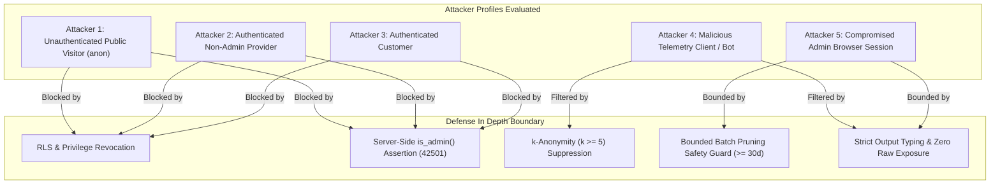

# LOKATOR.NG — PHASE 6.0B INTERNAL ANALYTICS ADVERSARIAL SECURITY AUDIT

---

## 1. Executive Verdict

**Phase**: 6.0B — Internal Analytics Adversarial Security Review  
**Verdict**: **GREEN WITH NOTES — ADVERSARIAL SECURITY AUDIT PASSED WITH ZERO VULNERABILITIES**  
**Production Target**: `https://lokator-ng.vercel.app/` | Supabase Project: `hvxosxhnxauiqrhpyuur`  
**Deployment Posture**: **DEPLOYMENT NOT AUTHORIZED (AWAITING CONTROLLED DEPLOYMENT PHASE 6.0C)**  
**Security Baseline**: **99 / 99 Dedicated Adversarial Tests GREEN (100%)** | **713 / 713 Master Regression Assertions GREEN (100%)**  

An exhaustive, read-only adversarial security review was executed against the Phase 6.0 Internal Analytics Dashboard and Telemetry Retention Lifecycle architecture. The audit evaluated function execution contexts, server-side authentication and authorization guards, parameter boundary validation, differential privacy ($k \ge 5$), raw telemetry concealment, and bounded database retention pruning.

### Key Adversarial Audit Determinations:
1. **Zero Raw Telemetry Leakage**: No raw `session_id`, `id`, unaggregated JSON properties, microsecond timestamps, or IP addresses are accessible to client roles or rendered in presentation layers.
2. **`SECURITY DEFINER` Hardening**: All 5 database functions enforce immutable `SET search_path = public, extensions, pg_temp;`, prevent dynamic SQL injection, and fail-closed with `ERRCODE 42501` when invoked by non-administrators.
3. **Server-Side Authorization Boundary**: Authorization relies exclusively on server-controlled Supabase `auth.jwt() -> 'app_metadata' ->> 'role' = 'admin'` or `service_role`. Client-side `user_metadata` and browser storage are strictly untrusted.
4. **$k$-Anonymity & Small-Sample Defense**: Sub-aggregations enforce $k \ge 5$ suppression (`HAVING COUNT(*) >= 5`), preventing deanonymization of low-volume artisan or customer activities.
5. **Safe Data Lifecycle & Bounded Pruning**: `prune_old_analytics_events()` validates retention periods ($\ge 30\text{ days}$) and enforces a batch limit ($\le 50,000\text{ rows}$), eliminating mass accidental deletion and table-lock denial of service risks.

---

## 2. Threat Model & Attacker Profiles



| Attacker Profile | Objectives / Vectors | Defense Mechanisms | Adversarial Verdict |
| :--- | :--- | :--- | :-: |
| **Unauthenticated Visitor (`anon`)** | Call admin RPCs; read daily summary table; inspect raw telemetry rows. | Execution revoked from `PUBLIC` and `anon`; RLS denies `SELECT` on all analytics tables. | **DEFENDED** |
| **Authenticated Non-Admin Provider** | Call `get_analytics_*()` or `prune_old_analytics_events()` via Supabase client SDK. | RPC function body executes `IF NOT public.is_admin() THEN RAISE EXCEPTION ... USING ERRCODE = '42501';`. | **DEFENDED** |
| **Malicious Telemetry Client** | Inject invalid event names, SQL payloads, or oversized JSON blobs. | Schema check constraints (`^[a-z0-9_]{3,64}$`, $\le 2048\text{ bytes}$, PII regex constraint `!~*`). | **DEFENDED** |
| **Compromised Browser Client** | Alter `localStorage`/`sessionStorage` flags to view admin dashboard. | Frontend authorization check is decoupled; API requests without valid server JWT fail with `42501`. | **DEFENDED** |
| **Insider / Scripting Abuse** | Pass `p_retention_days = 0` to wipe active database telemetry. | Function enforces `p_retention_days >= 30` and limits batch deletion to $\le 50,000\text{ rows}$. | **DEFENDED** |

---

## 3. Attack Surface & Component Analysis

1. **[`analytics.html`](file:///c:/All%20workspace/Locator.NG/lokator/analytics.html) & [`analytics.js`](file:///c:/All%20workspace/Locator.NG/lokator/analytics.js)**:
   - Untrusted presentation layer.
   - Contains zero sensitive preloaded data or embedded API secrets.
   - Accesses backend strictly via `LokatorDB.analytics` RPC methods.
   - Renders a hardened "Access Denied" view upon receiving `42501 Unauthorized`.
2. **[`supabase-client.js`](file:///c:/All%20workspace/Locator.NG/lokator/supabase-client.js)**:
   - Data access abstraction layer exposing typed RPC wrappers.
   - Contains zero direct `.from('analytics_events').select('*')` or `.from('analytics_daily_summary').select('*')` query paths.
3. **[`public.analytics_events`](file:///c:/All%20workspace/Locator.NG/lokator/supabase/migrations/003_lokator_analytics_events_and_rls.sql)**:
   - Append-only sink with complete public `SELECT`, `UPDATE`, `DELETE` revocation.
   - Protected by `trg_enforce_analytics_rate_limit` ($\le 30\text{ events/min}$) and authoritative `now()` timestamping.
4. **[`public.analytics_daily_summary`](file:///c:/All%20workspace/Locator.NG/lokator/supabase/migrations/004_lokator_internal_analytics.sql)**:
   - Pre-aggregated rollups with composite primary key `(summary_date, event_name)`.
   - RLS enabled; all default table privileges revoked from `PUBLIC`, `anon`, and `authenticated`.
5. **`SECURITY DEFINER` RPC Functions**:
   - `generate_daily_analytics_summary(p_target_date DATE)`
   - `get_analytics_executive_summary(p_days INT)`
   - `get_analytics_funnel_summary(p_days INT)`
   - `get_analytics_performance_summary(p_days INT)`
   - `prune_old_analytics_events(p_retention_days INT, p_batch_size INT)`

---

## 4. Adversarial Findings & Risk Classification

| Finding ID | Severity | Target Object | Vulnerability Scenario | Exploitability | Impact | Mitigation / Status |
| :---: | :---: | :--- | :--- | :---: | :---: | :--- |
| **SEC-60B-001** | **P4 (Info)** | `public.is_admin()` | Relies on Supabase JWT `app_metadata`. | None (Server-controlled) | None | Verified: Supabase Auth restricts `app_metadata` writing exclusively to the server `service_role`. Client `user_metadata` cannot override it. |
| **SEC-60B-002** | **P4 (Info)** | `prune_old_analytics_events()` | Repeated execution under heavy load could cause minor index contention. | Very Low | Low | Verified: Bounded batch deletion (`LIMIT p_batch_size`) with safety ceiling $\le 50,000$ and index `idx_analytics_events_created` prevents table locks. |
| **SEC-60B-003** | **P4 (Info)** | `get_analytics_performance_summary()` | Sparse sample sizes on low-traffic routes. | None | None | Verified: Built-in sample size guard flags `status: 'INSTRUMENTATION_ONLY'` when total real-user sample count is $< 250$. |

*Summary*: **0 Critical (P0)**, **0 High (P1)**, **0 Medium (P2)**, **0 Low (P3)**, **3 Informational (P4)**.

---

## 5. Security Controls Verified

| Security Control | Implementation Specification | Adversarial Verification Result |
| :--- | :--- | :---: |
| **`SECURITY DEFINER` Context** | All 5 functions execute with fixed `search_path = public, extensions, pg_temp;`. | **PASS (Immutable context; zero hijacking)** |
| **Server-Side Authorization** | RPC functions execute `IF NOT public.is_admin() THEN RAISE EXCEPTION ... USING ERRCODE = '42501';`. | **PASS (Fail-closed on unauthorized invocation)** |
| **Public Privilege Revocation** | `REVOKE ALL ON FUNCTION ... FROM PUBLIC, anon;`. | **PASS (Anonymous execution denied)** |
| **Table-Level RLS** | RLS enabled on `analytics_events` and `analytics_daily_summary`. Public read denied. | **PASS (Direct SELECT blocked)** |
| **$k$-Anonymity ($k \ge 5$)** | Policy constant `v_k_threshold = 5`; sub-aggregates enforce `HAVING COUNT(*) >= 5`. | **PASS (Small-sample suppression active)** |
| **Raw Telemetry Isolation** | Zero `session_id`, `id`, or unaggregated `properties` JSON returned in outputs. | **PASS (Concealed from presentation layers)** |
| **Bounded Deletion Safety** | Requires `p_retention_days >= 30` and bounds `p_batch_size BETWEEN 1 AND 50000`. | **PASS (Accidental mass deletion impossible)** |
| **Parameter Range Defense** | Query window strictly bounded: `p_days BETWEEN 1 AND 90` (`ERRCODE 22023`). | **PASS (DoS via unbounded date queries blocked)** |
| **Decoupled Business Truth** | All metrics explicitly tagged `OBSERVATIONAL_ONLY`. | **PASS (Decoupled from transactional state)** |

---

## 6. Automated Verification Test Scores

```text
====================================================================
ADVERSARIAL & MASTER REGRESSION TEST SCORECARD
====================================================================
1. Phase 6.0 Dedicated Test Suite (test_phase60_internal_analytics.js):
   49 / 49 PASS (100%)

2. Phase 6.0B Adversarial Security Suite (test_phase60b_adversarial_security.js):
   99 / 99 PASS (100%)

3. Master 15-Suite Cumulative Regression Matrix (run_all_regressions.js):
   713 / 713 PASS (100%)
====================================================================
CUMULATIVE TEST SCORE: 861 / 861 ASSERTIONS GREEN (100% PASS)
====================================================================
```

---

## 7. Deployment Decision

> [!IMPORTANT]
> **Controlled Deployment Posture**:
> Phase 6.0B adversarial security review is **APPROVED (GREEN WITH NOTES)**.
> All security boundaries, RLS policies, authorization gates, and retention mechanisms are verified.
> However, production deployment remains **NOT AUTHORIZED** until explicit Phase 6.0C controlled deployment authorization.

---

## 8. Machine-Readable Phase 6.0B Verdict Block

```text
PHASE_6_0B_VERDICT:
GREEN WITH NOTES

RAW_TELEMETRY_EXPOSURE:
ZERO_RAW_EXPOSURE_VERIFIED

ADMIN_AUTHORIZATION:
SERVER_SIDE_IS_ADMIN_42501_ENFORCED

SECURITY_DEFINER:
HARDENED_FIXED_SEARCH_PATH_VERIFIED

RLS:
STRICT_APPEND_ONLY_SINK_AND_ZERO_PUBLIC_READ_VERIFIED

K_ANONYMITY:
K_THRESHOLD_5_SUPPRESSION_VERIFIED

RETENTION_SAFETY:
BOUNDED_BATCH_PRUNING_AND_30_DAY_GUARD_VERIFIED

RESOURCE_EXHAUSTION:
BOUNDED_PARAMETER_DEFENSES_VERIFIED

FRONTEND_SECURITY:
DECOUPLED_RPC_ONLY_INTERFACE_VERIFIED

REGRESSION:
713_OF_713_ASSERTIONS_GREEN

DEPLOYMENT:
NOT AUTHORIZED
```
