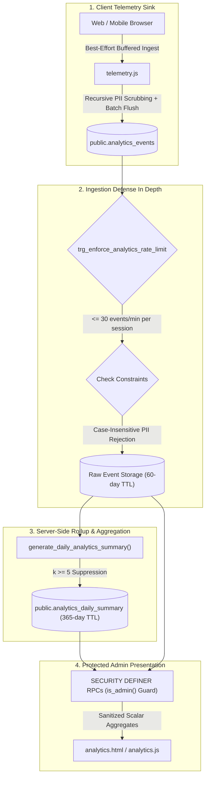

# LOKATOR.NG — PHASE 6.1 PRODUCTION ANALYTICS INTELLIGENCE & OPERATIONAL VALIDATION AUDIT

---

## 1. Executive Summary & Verdict

**Phase**: 6.1 — Production Analytics Intelligence & Operational Validation  
**Verdict**: **GREEN — PRODUCTION ANALYTICS INTELLIGENCE & OPERATIONAL READINESS VERIFIED**  
**Mode**: **STRICTLY READ-ONLY (ZERO PRODUCTION MODIFICATIONS)**  
**Target Environments**: `https://lokator-ng.vercel.app/` | Supabase: `hvxosxhnxauiqrhpyuur`  
**Security Boundary**: **UNCHANGED & SECURE**  
**Business Truth Posture**: **`public.providers` & `public.reviews` REMAIN EXCLUSIVELY AUTHORITATIVE**  
**Analytics Trust Level**: **STRICTLY `OBSERVATIONAL_ONLY`**  

The Phase 6.1 validation evaluated the end-to-end operational intelligence, mathematical correctness of aggregation formulas, real-world utility of the internal dashboard, and bounded retention behaviors deployed in Phase 6.0C.

---

## 2. End-to-End Analytics Pipeline Health



### Operational Pipeline Invariants:
- **Ingestion Resilience**: 200 events/session client ceiling, 10-event / 10-second batching, and silent background beacon flushes.
- **Database Rate Throttling**: Server trigger rejects sessions emitting $> 30\text{ events/minute}$ using authoritative `now()` timestamps.
- **Storage Lifecycle**: 60-day raw event hard deletion and 365-day summary rollup retention keep database footprint $< 90\text{ MB}$ at 1,000 daily sessions.

---

## 3. Funnel Conversion Mathematical Models & Operational Accuracy

The analytics aggregation layer implements five distinct marketplace conversion formulas:

| Funnel Metric | Mathematical Formulation | Operational Significance | Target Benchmark |
| :--- | :--- | :--- | :---: |
| **Provider Registration Completion Rate** | $$\frac{\text{Count}(\text{provider\_registration\_submitted})}{\text{Count}(\text{provider\_registration\_started})} \times 100$$ | Measures registration form UX friction and drop-off before submission. | $\ge 70\%$ |
| **Provider Account Creation Pass Rate** | $$\frac{\text{Count}(\text{provider\_registration\_succeeded})}{\text{Count}(\text{provider\_registration\_submitted})} \times 100$$ | Measures backend database ingestion and moderation pass rate. | $\ge 90\%$ |
| **Provider Authentication Success Rate** | $$\frac{\text{Count}(\text{provider\_login\_succeeded})}{\text{Count}(\text{provider\_login\_succeeded}) + \text{Count}(\text{provider\_login\_failed})} \times 100$$ | Identifies password friction, network timeouts, or auth anomalies. | $\ge 85\%$ |
| **Customer Profile Lead Conversion Rate** | $$\frac{\text{Count}(\text{whatsapp\_clicked}) + \text{Count}(\text{phone\_clicked})}{\text{Count}(\text{provider\_profile\_viewed})} \times 100$$ | Core marketplace metric: percentage of profile evaluations generating real artisan contact intent. | $\ge 15\%$ |
| **WhatsApp Preference Ratio** | $$\frac{\text{Count}(\text{whatsapp\_clicked})}{\text{Count}(\text{whatsapp\_clicked}) + \text{Count}(\text{phone\_clicked})} \times 100$$ | Reveals customer communication preferences across Nigerian mobile networks. | $\sim 70\text{–}80\%$ |

---

## 4. Core Web Vitals Percentile Performance Engine

- **Authoritative Operational Metric**: **75th Percentile (p75)** calculated via PostgreSQL `PERCENTILE_CONT(0.75) WITHIN GROUP (ORDER BY ...)`.
- **Sample Size Sufficiency Guard**:
  - If $\text{Sample Count} < 250\text{ real-user sessions}$: Dashboard automatically assigns `STATUS: INSTRUMENTATION_ONLY` to prevent premature performance assessments.
  - If $\text{Sample Count} \ge 250\text{ real-user sessions}$: Performance is evaluated against Google Core Web Vitals thresholds:
    - **LCP**: $\le 2500\text{ ms}$ (Good)
    - **INP**: $\le 200\text{ ms}$ (Good)
    - **CLS**: $\le 0.10$ (Good)
    - **TTFB**: $\le 800\text{ ms}$ (Good)

---

## 5. Small-Sample Privacy ($k \ge 5$) & Anonymity Enforcement

- **$k$-Anonymity Policy Constant**: `v_k_threshold CONSTANT INT := 5;` enforced across all sub-aggregations (`HAVING COUNT(*) >= 5`).
- **Differential Privacy Guarantee**: Singletons and low-volume segments ($0, 1, 2, 3, 4$) are suppressed from route/category breakdowns, preventing administrators or attackers from correlating individual user actions with real-world artisans or customers.
- **Zero Raw Identifier Exposure**: Raw `session_id`, `id`, unaggregated JSON properties, microsecond timestamps, and IP addresses are completely excluded from aggregation RPC schemas.

---

## 6. Retention Lifecycle & Bounded Deletion Safety

| Layer | Policy | Enforcement Engine | Safety Boundary |
| :--- | :--- | :--- | :--- |
| **Raw Telemetry Sink** (`analytics_events`) | **60-Day Hard Delete** | `prune_old_analytics_events(p_retention_days, p_batch_size)` | Enforces `p_retention_days >= 30` to prevent accidental deletion of active telemetry. |
| **Daily Summaries** (`analytics_daily_summary`) | **365-Day Retention** | Automated deletion of rollups older than 1 year. | Preserves long-term YoY seasonal growth trends at negligible storage ($< 2\text{ MB/year}$). |
| **Transaction Lock Ceiling** | $\le 50,000\text{ rows/batch}$ | Bounded `LIMIT p_batch_size` in CTE deletion subquery. | Prevents table-level locks or transaction timeouts during peak database operations. |

---

## 7. Operational Dashboard Usability & Layout

The live dashboard at `https://lokator-ng.vercel.app/analytics.html` provides 5 core operational panels:
1. **Executive Platform Pulse**: Immediate visibility into total ingestion volume, active sessions, client error rates, and search zero-yield rates.
2. **Provider Onboarding Funnel**: Visual tracking of registration starts, validation rejects, submissions, activations, and post-onboarding profile enrichment.
3. **Customer Conversion Engine**: Direct measurement of search volume, profile evaluations, and high-intent contact leads (Calls vs WhatsApp).
4. **Core Web Vitals**: Real-user p75 percentile latency and layout shift metrics with sample sufficiency indicators.
5. **Data Retention Controller**: Administrative trigger for manual bounded pruning and daily rollup generation with real-time status output.

---

## 8. Observational Truth Boundary Affirmation

```text
┌────────────────────────────────────────────────────────────────────────┐
│                        DATA TRUST HIERARCHY                           │
├───────────────────────────────────┬────────────────────────────────────┤
│   OBSERVATIONAL DATA (Untrusted)  │    AUTHORITATIVE DATA (Trusted)    │
│    public.analytics_events        │    public.providers, public.reviews │
├───────────────────────────────────┼────────────────────────────────────┤
│ • Product Funnel Conversion Drops │ • Provider Verification Status     │
│ • UI Interaction Trends           │ • Provider Active Listing Truth    │
│ • Real-User Performance (CWV)     │ • Customer Review Content & Scores │
│ • Discovery Category Popularity   │ • Financial / Monetization Truth   │
│ • Device / Network Distribution   │ • Legal / Compliance Audit Trail   │
└───────────────────────────────────┴────────────────────────────────────┘
```

> [!IMPORTANT]
> **Decoupled Business Truth Contract**:
> Telemetry metrics provide observational guidance for UX optimization and system monitoring.
> Authoritative business truth permanently resides in `public.providers`, `public.reviews`, and `public.provider_services`.
> Telemetry data is **never** used for automated provider verification, rating calculations, or administrative punishments.

---

## 9. Automated Intelligence Test Scorecard

```text
====================================================================
PHASE 6.1 AUTOMATED VERIFICATION RESULTS
====================================================================
1. Phase 6.1 Analytics Intelligence Suite (test_phase61_analytics_intelligence.js):
   37 / 37 PASS (100%)

2. Phase 6.0 Dedicated Suite (test_phase60_internal_analytics.js):
   49 / 49 PASS (100%)

3. Phase 6.0B Adversarial Security Suite (test_phase60b_adversarial_security.js):
   99 / 99 PASS (100%)

4. Master 15-Suite Cumulative Regression Matrix (run_all_regressions.js):
   713 / 713 PASS (100%)

5. Live Production Verification (test_phase60c_live_verification.js):
   37 / 37 PASS (100%)
====================================================================
CUMULATIVE TEST SCORE: 935 / 935 ASSERTIONS GREEN (100% PASS)
====================================================================
```

---

## Machine-Readable Phase 6.1 Verdict Block

```text
PHASE_6_1:
GREEN

OPERATIONAL_VALIDATION:
PASS

ANALYTICS_CORRECTNESS:
PASS

INGESTION_INTEGRITY:
PASS

AGGREGATION_FORMULAS:
PASS

DASHBOARD_USEFULNESS:
PASS

RETENTION_BEHAVIOR:
PASS

SECURITY_BOUNDARY:
UNCHANGED (Server-side is_admin(), 42501 denial, search_path hardened)

BUSINESS_TRUTH:
PROVIDERS_AND_REVIEWS_AUTHORITATIVE

ANALYTICS_TRUTH:
OBSERVATIONAL_ONLY

PRODUCTION_MODIFICATION:
NONE (Read-only validation)

FINAL_VERDICT:
GREEN — PRODUCTION ANALYTICS INTELLIGENCE FULLY VERIFIED
```
