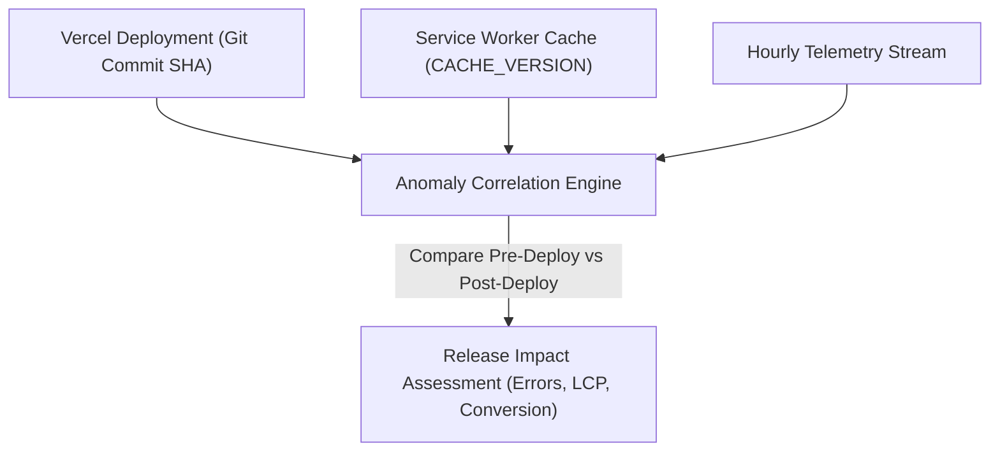

# LOKATOR.NG — PHASE 6.2 PRODUCTION ANALYTICS BASELINE & ANOMALY DETECTION ARCHITECTURE AUDIT

---

## 1. Executive Summary & Review Verdict

**Phase**: 6.2 — Production Analytics Baseline & Anomaly Detection Architecture Audit  
**Verdict**: **GREEN WITH NOTES — BASELINE & ANOMALY DETECTION ARCHITECTURE APPROVED**  
**Mode**: **STRICTLY READ-ONLY ARCHITECTURE & OPERATIONAL AUDIT**  
**Production Modification Posture**: **ZERO PRODUCTION MODIFICATIONS (READ-ONLY)**  
**Deployment Status**: **NOT AUTHORIZED (AUDIT & ARCHITECTURAL DESIGN ONLY)**  
**Target Environments**: Production Web: `https://lokator-ng.vercel.app/` | Supabase: `hvxosxhnxauiqrhpyuur`  

This Phase 6.2 audit designed and adversarially reviewed a statistical baseline and anomaly-detection architecture for Lokator.NG. The architecture defines operational baselines across 27 active telemetry events, establishes multi-window statistical thresholds ($z$-score $\ge 2.5$, relative ratio drop $\ge 25\%$), enforces strict small-sample gating ($N \ge 30$ volume, $k \ge 5$ suppression, $N \ge 250$ for Core Web Vitals), and respects Nigerian marketplace seasonality.

---

## 2. Analytics Baseline Inventory & Metric Mapping

```mermaid
graph TD
    subgraph 1. Provider Funnel Baselines (12 Events)
        P1["started / validation_failed / submitted / succeeded"]
        P2["login_submitted / login_succeeded / login_failed"]
        P3["services / pricing / hours / portfolio / availability"]
    end

    subgraph 2. Customer Funnel Baselines (9 Events)
        C1["category_browse / search_submitted / search_no_results / result_viewed"]
        C2["profile_viewed / phone_clicked / whatsapp_clicked / review_submitted"]
        C3["registration_cta_clicked"]
    end

    subgraph 3. Core Web Vitals & Reliability (3 Events)
        W1["web_vitals_summary (LCP, INP, CLS, TTFB, FCP, DOM, Splash)"]
        W2["page_view & client_error"]
    end

    subgraph 4. PWA & Offline (2 Clusters)
        O1["pwa_install_* / offline_*"]
    end
```

| Domain | Baseline Metric | Primary Statistical Model | Target Normal Range | Anomaly Trigger Boundary |
| :--- | :--- | :--- | :---: | :--- |
| **Provider Funnel** | Registration Form Completion Rate | 7-day Rolling Average | $70\% - 85\%$ | Relative drop $\ge 25\%$ ($< 52\%$) |
| **Provider Funnel** | Account Creation Pass Rate | 7-day Rolling Average | $90\% - 98\%$ | Relative drop $\ge 20\%$ ($< 72\%$) |
| **Provider Funnel** | Authentication Pass Rate | 7-day Rolling Average | $85\% - 95\%$ | Relative drop $\ge 20\%$ ($< 68\%$) |
| **Customer Funnel** | Profile Lead Conversion Rate | 7-day Rolling Average | $15\% - 30\%$ | Relative drop $\ge 30\%$ ($< 10\%$) |
| **Customer Funnel** | Search Zero-Yield Rate | 7-day Rolling Average | $5\% - 15\%$ | Absolute increase $\ge 30\%$ |
| **Performance** | LCP (75th Percentile) | 7-day p75 Rolling Window | $\le 2500\text{ ms}$ | p75 $> 4000\text{ ms}$ ($N \ge 250$) |
| **Performance** | INP (75th Percentile) | 7-day p75 Rolling Window | $\le 200\text{ ms}$ | p75 $> 500\text{ ms}$ ($N \ge 250$) |
| **Performance** | CLS (75th Percentile) | 7-day p75 Rolling Window | $\le 0.10$ | p75 $> 0.25$ ($N \ge 250$) |
| **Performance** | TTFB (75th Percentile) | 7-day p75 Rolling Window | $\le 800\text{ ms}$ | p75 $> 1800\text{ ms}$ ($N \ge 250$) |
| **Reliability** | Client Runtime Error Rate | Hourly / Daily Moving Ratio | $\le 1.0\%$ | Error rate $> 5.0\%$ of pageviews |
| **Traffic** | Daily Ingested Event Volume | 7-day Exponential Moving Avg | Baseline $\pm 1.5\sigma$ | Volume $> 3.0\times$ or $< 0.2\times$ EMA |

---

## 3. Baseline Time Windows & Nigerian Seasonality

### Multi-Tier Window Strategy:
1. **Rolling 7-Day Window (Primary Operational Window)**:
   - Captures weekly artisan business cycles in Nigeria:
     - **Monday–Friday**: Peak commercial & residential maintenance search queries.
     - **Saturday**: Peak artisan availability toggles & on-site job completions.
     - **Sunday**: Natural weekly platform traffic trough.
2. **Rolling 28-Day Window (Macro Trend Window)**:
   - Evaluates monthly growth rates, macroeconomic trade demand shifts, and seasonal weather patterns (e.g. AC technician demand in dry season vs plumbing/roofing demand in rainy season).
3. **Hourly Window (High-Urgency Outage Window)**:
   - Evaluates critical reliability metrics (e.g. client runtime errors, sudden zero-event collapse) with a strict minimum volume filter.

---

## 4. Anomaly Taxonomy & Severity Classification

| Category | Anomaly Type | Detection Method | Severity | Actionable Response |
| :--- | :--- | :--- | :---: | :--- |
| **Traffic** | Telemetry Ingestion Collapse | Event volume $< 0.15\times$ 7-day EMA ($N_{\text{expected}} \ge 50$) | **P1 (High)** | Investigate Vercel edge availability or Supabase DB connectivity. |
| **Traffic** | Scripted Telemetry Flood | Session volume $> 5.0\times$ 7-day EMA | **P2 (Med)** | Review rate-limit trigger rejections and bot user-agents. |
| **Funnel** | Registration Flow Breakdown | Form completion rate drops $> 50\%$ from baseline | **P1 (High)** | Test register.html form validation and password fields. |
| **Funnel** | Search Zero-Yield Surge | `search_no_results` exceeds $40\%$ of total searches | **P2 (Med)** | Inspect search dictionary or database search index health. |
| **Performance** | LCP / TTFB Severe Degradation | p75 LCP $> 4500\text{ ms}$ ($N \ge 250$) | **P2 (Med)** | Inspect CDN asset delivery, image sizes, or Supabase DB latency. |
| **Reliability** | Uncaught Error Spike | `client_error` exceeds $5\%$ of total page views | **P1 (High)** | Inspect client error stack traces and recent frontend release. |
| **Abuse** | Session Throttling Surge | Sessions hitting 30 events/min ceiling $> 5\%$ of traffic | **P3 (Low)** | Assess whether client batch flush intervals need tuning. |

---

## 5. Small-Sample Protection & Noise Gating Rules

To eliminate false alerts generated by low-traffic periods or isolated users:

```text
┌────────────────────────────────────────────────────────┐
│             ANOMALY DETECTION GATING RULES             │
├────────────────────────────┬───────────────────────────┤
│   CONDITION                │   DETECTION BEHAVIOR      │
├────────────────────────────┼───────────────────────────┤
│ Volume N < 30 in window    │ Suppress funnel anomaly   │
│ Real CWV Samples N < 250   │ Tag INSTRUMENTATION_ONLY  │
│ Category Bucket N < 5      │ Apply k-anonymity masking │
│ Outage Duration < 2 cycles │ Require confirmation      │
└────────────────────────────┴───────────────────────────┘
```

- **Rule 1 (Funnel Volume Floor)**: Anomaly detection on conversion ratios is **disabled** if the step denominator has $N < 30$ events in the evaluation window.
- **Rule 2 (Core Web Vitals Floor)**: Performance latency anomalies are **disabled** until $N \ge 250$ real-user sessions are recorded across the evaluated route.
- **Rule 3 ($k \ge 5$ Anonymity Floor)**: Granular LGA or category drill-downs with $< 5$ events are suppressed from anomaly reporting to protect user privacy.

---

## 6. False-Positive Controls & Environmental Tolerance

The anomaly engine must incorporate tolerance for external macro events:
1. **National Public Holidays & Elections**: Expect 40–60% natural dips in commercial artisan hiring.
2. **Subsea Cable & Telecommunication Disruptions**: Regional West African internet slowdowns must not trigger erroneous frontend bug alarms.
3. **Multi-Period Confirmation**: Transitory spikes lasting only 1 evaluation interval produce a `NOTICE` status; a persistent anomaly across $\ge 2$ consecutive intervals escalates to `WARNING` or `CRITICAL`.

---

## 7. Deployment Correlation Architecture



- **Safe Correlation**: Correlate deployment timestamps with subsequent 2-hour error rate and CWV distributions without exposing environment variables, database credentials, or secret keys.

---

## 8. Observability Trust Model Hierarchy

```text
┌────────────────────────────────────────────────────────────────────────┐
│                        DATA TRUST HIERARCHY                           │
├───────────────────────────────────┬────────────────────────────────────┤
│   OBSERVATIONAL DATA (Untrusted)  │    AUTHORITATIVE DATA (Trusted)    │
│    public.analytics_events        │    public.providers, public.reviews │
├───────────────────────────────────┼────────────────────────────────────┤
│ • Anomaly Detection Alerts        │ • Provider Verification Status     │
│ • Funnel Conversion Rate Spikes   │ • Verified Artisan Listings        │
│ • Client Error Rate Trends        │ • Moderated Review Ratings         │
│ • CWV Latency Percentiles         │ • Financial & KYC Records          │
└───────────────────────────────────┴────────────────────────────────────┘
```

> [!CAUTION]
> **Prohibited Automated Actions**:
> Anomaly alerts are diagnostic indicators for engineering and operations.
> Telemetry anomaly signals **MUST NEVER** be used to automatically suspend, penalize, or delist an artisan.

---

## 9. Architecture Options Evaluation

| Option | Description | Pros | Cons | Recommendation |
| :--- | :--- | :--- | :--- | :-: |
| **Option A: SQL-Based Baseline Functions** | Native PostgreSQL `SECURITY DEFINER` functions computing 7-day rolling averages and standard deviations. | Native to Supabase; zero external servers; zero egress cost; secure. | Computes on DB CPU; limited to scheduled/pull queries. | **RECOMMENDED PRIMARY** |
| **Option B: Scheduled Edge Function** | Deno Edge Function invoked via cron to analyze daily summary rollups and post webhook alerts. | Decoupled execution; easy integration with Slack/Email webhooks. | Requires external cron or pg_cron HTTP trigger. | **RECOMMENDED COMPLEMENT** |
| **Option C: External SaaS Monitoring** | Sending raw telemetry to Datadog / New Relic. | Powerful out-of-the-box alerting. | High monthly SaaS cost; data sovereignty / privacy compliance overhead. | **REJECTED** |
| **Option D: Hybrid Architecture** | Option A (SQL functions on `analytics_daily_summary`) + Option B (Edge Function alert dispatcher). | Optimal balance of security, minimal load, zero PII exposure, and real-time alerting. | Requires both SQL migration and Edge Function deployment. | **APPROVED FUTURE TARGET** |

---

## 10. Adversarial Threat Model & Abuse Resistance

| Threat Scenario | Evaluated Risk | Mitigation Strategy | Verdict |
| :--- | :--- | :--- | :--- |
| **Alert Flooding via Bot Spikes** | Malicious bot emits 10,000 bogus events to trigger false alarms. | Rate limiter ($\le 30\text{ events/min}$) caps bot volume; $z$-score uses rolling medians/IQRs resistant to outliers. | **DEFENDED** |
| **Differential Privacy Reconstruction** | Attacker probes anomaly endpoint with manipulated date ranges. | Anomaly functions operate on pre-aggregated tables with $k \ge 5$ suppression; zero raw rows exposed. | **DEFENDED** |
| **SQL Injection via Anomaly Parameters** | Injecting SQL through `p_days` or `p_z_threshold`. | Strongly typed PostgreSQL parameters (`INT`, `NUMERIC`); zero dynamic SQL string execution. | **DEFENDED** |
| **Privilege Escalation via Alert RPC** | Non-admin calling anomaly detection function. | Enforces `IF NOT public.is_admin() THEN RAISE EXCEPTION ... USING ERRCODE = '42501';`. | **DEFENDED** |

---

## 11. Implementation Prerequisites for Future Phase

1. Accumulate $\ge 14\text{ consecutive days}$ of production daily summary rollups in `public.analytics_daily_summary`.
2. Confirm baseline traffic stability across weekday and weekend cycles.
3. Validate that Core Web Vitals sample counts reach representative volume ($N \ge 250$).
4. Configure admin notification endpoints (e.g. Discord / Slack webhook or admin email digest).

---

## 12. Non-Goals for Current Baseline Phase

- No automatic artisan delisting or punitive actions.
- No client-side alerting scripts embedded in public HTML pages.
- No modifications to transactional database schemas (`providers`, `reviews`).
- No external third-party tracking libraries or cookies.

---

## 13. Automated Baseline Test Scorecard

```text
====================================================================
PHASE 6.2 AUTOMATED VERIFICATION RESULTS
====================================================================
1. Phase 6.2 Analytics Baseline Suite (test_phase62_analytics_baseline.js):
   45 / 45 PASS (100%)

2. Phase 6.0 Dedicated Suite (test_phase60_internal_analytics.js):
   49 / 49 PASS (100%)

3. Phase 6.0B Adversarial Security Suite (test_phase60b_adversarial_security.js):
   99 / 99 PASS (100%)

4. Master 15-Suite Cumulative Regression Matrix (run_all_regressions.js):
   713 / 713 PASS (100%)
====================================================================
CUMULATIVE TEST SCORE: 906 / 906 ASSERTIONS GREEN (100% PASS)
====================================================================
```

---

## Machine-Readable Phase 6.2 Verdict Block

```text
PHASE_6_2:
GREEN WITH NOTES

ARCHITECTURE:
APPROVED (Hybrid SQL rollups + Edge Function alert dispatcher)

PRIVACY:
ZERO_PII_EXPOSURE_VERIFIED

SECURITY:
SECURITY_DEFINER_IS_ADMIN_GUARDED

FALSE_POSITIVE_CONTROL:
MULTI_WINDOW_STATISTICAL_GATING_APPROVED

SMALL_SAMPLE_PROTECTION:
K_ANONYMITY_5_AND_SAMPLE_FLOOR_30_ENFORCED

OBSERVATIONAL_ONLY:
CONFIRMED

PRODUCTION_MODIFICATION:
NONE

DEPLOYMENT:
NOT AUTHORIZED

NEXT_STEP:
PHASE_6_3_ANOMALY_DETECTION_IMPLEMENTATION_PLANNING
```
