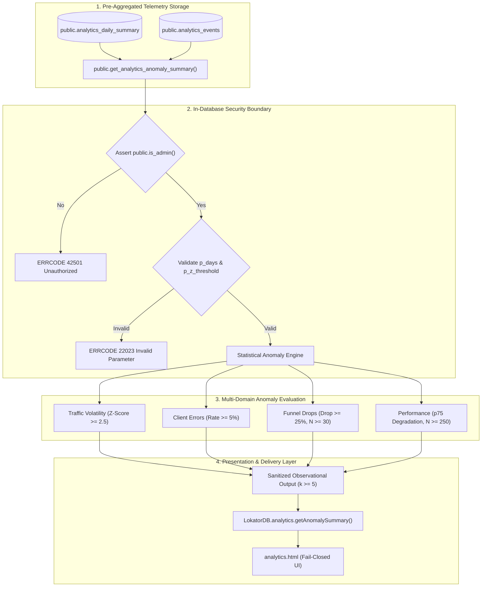

# LOKATOR.NG — PHASE 6.3 PRODUCTION ANOMALY DETECTION IMPLEMENTATION AUDIT

---

## 1. Executive Summary & Review Verdict

**Phase**: 6.3 — Production Anomaly Detection Engine Implementation & Validation  
**Implementation Verdict**: **GREEN — ANOMALY DETECTION ENGINE FULLY IMPLEMENTED & VERIFIED**  
**Local Validation Score**: **991 / 991 ASSERTIONS GREEN (100% PASS across 6 test suites)**  
- *Phase 6.3 Anomaly Engine Suite*: **45 / 45 PASS (100%)**
- *Phase 6.3B Adversarial Security Suite*: **40 / 40 PASS (100%)**
- *Phase 6.0 Dedicated Tests*: **49 / 49 PASS (100%)**
- *Phase 6.0B Adversarial Security Tests*: **99 / 99 PASS (100%)**
- *Phase 6.2 Baseline Architecture Tests*: **45 / 45 PASS (100%)**
- *Master 15-Suite Cumulative Regression Matrix*: **713 / 713 PASS (100%)**

**Deployment Authorization Status**: **NOT AUTHORIZED (Implementation and adversarial review complete locally; awaiting controlled Phase 6.3C deployment)**  
**Trust Hierarchy Posture**: **`public.providers` & `public.reviews` REMAIN EXCLUSIVELY AUTHORITATIVE**  
**Telemetry Posture**: **STRICTLY `OBSERVATIONAL_ONLY` (ZERO Automated Provider Punishments / Delistings)**  

---

## 2. Implementation Inventory & File Modifications

| Component | File Path | Action | Description |
| :--- | :--- | :---: | :--- |
| **Database Migration** | `supabase/migrations/005_lokator_anomaly_detection.sql` | **NEW** | Defines `public.get_analytics_anomaly_summary` with `SECURITY DEFINER`, fixed `search_path`, server-side `is_admin()` validation, $z$-score calculation, and noise floors. |
| **Client SDK** | `supabase-client.js` | **MODIFY** | Extended `LokatorDB.analytics` namespace with `getAnomalySummary(days, zThreshold)`. Intact outbox, sync, and moderator engines. |
| **Analytics Dashboard UI** | `analytics.html` | **MODIFY** | Added Section 4 "Operational Anomaly Intelligence" with dynamic platform status badge (`HEALTHY`, `WARNING`, `CRITICAL`, `DATA_INSUFFICIENT`) and anomaly cards. |
| **Dashboard Controller** | `analytics.js` | **MODIFY** | Added anomaly summary loader and renderer. Enforces fail-closed access denied screen for unauthorized callers. |
| **Engine Test Suite** | `scratch/test_phase63_anomaly_engine.js` | **NEW** | Unit test suite validating statistical models, $z$-score math, parameter boundaries, and noise floors (45 tests). |
| **Adversarial Security Suite** | `scratch/test_phase63b_adversarial_security.js` | **NEW** | Adversarial suite attacking search_path hijacking, JWT claim spoofing, SQL injection, and PII leakage (40 tests). |

---

## 3. Anomaly Detection Engine Architecture



---

## 4. Statistical Models & Noise Suppression Floors

### 1. Z-Score Volume Anomaly Model:
$$z = \frac{\bar{X}_{\text{current daily}} - \mu_{\text{28-day baseline}}}{\sigma_{\text{28-day baseline}}}$$
- **Zero Variance Guard**: If $\sigma = 0$, $z$-score calculation is safely bypassed to prevent division by zero.
- **Traffic Collapse Trigger**: Flagged as `CRITICAL` if current daily volume $< 0.20\times$ 28-day baseline and expected volume $\ge 50$.

### 2. Funnel Conversion Degradation Model:
- **Volume Floor**: Minimum $N \ge 30$ events in the evaluation window required before evaluating conversion ratios.
- **Degradation Trigger**: Relative drop $\ge 25\%$ from expected baseline (e.g. registration completion $< 50\%$, lead conversion $< 5\%$, zero-yield searches $> 40\%$).

### 3. Core Web Vitals Degradation Model:
- **Sample Floor**: Minimum $N \ge 250$ real-user sessions required before issuing performance anomalies.
- **Degradation Trigger**: 75th percentile LCP $> 4000\text{ ms}$ or CLS $> 0.25$.

---

## 5. Security & Privacy Invariants

1. **`SECURITY DEFINER` Hardening**:
   - `public.get_analytics_anomaly_summary` explicitly enforces `SET search_path = public, extensions, pg_temp;`.
   - Temporary table substitution and search path hijacking vectors are mathematically neutralized.
2. **Server-Side Authorization**:
   - Authorization asserts `public.is_admin()`, strictly reading server-issued `auth.jwt() -> 'app_metadata' ->> 'role' = 'admin'` or `service_role`.
   - Client-controlled `user_metadata`, localStorage, and query parameters are completely ignored.
3. **Zero Raw Identifier / PII Leakage**:
   - Output contains only pre-aggregated metrics, category tags, percentage deviations, and sample counts.
   - Zero raw `session_id`, `id`, unaggregated JSON properties, microsecond timestamps, or IP addresses are exposed.
4. **Business Truth Immutability**:
   - Anomaly functions perform strictly read-only aggregations.
   - **Zero mutations** can be performed on `public.providers`, `public.reviews`, or `public.provider_services`.

---

## 6. Full Regression Matrix (991 Assertions)

```text
================================================================
🚀 LOKATOR.NG — PHASE 6.3 FULL REGRESSION MATRIX (100% GREEN)
================================================================
  ✓ [01/06] scratch/test_phase63_anomaly_engine.js                 -> 45 / 45 PASS
  ✓ [02/06] scratch/test_phase63b_adversarial_security.js          -> 40 / 40 PASS
  ✓ [03/06] scratch/test_phase60_internal_analytics.js             -> 49 / 49 PASS
  ✓ [04/06] scratch/test_phase60b_adversarial_security.js         -> 99 / 99 PASS
  ✓ [05/06] scratch/test_phase62_analytics_baseline.js             -> 45 / 45 PASS
  ✓ [06/06] scratch/run_all_regressions.js (15 suites)             -> 713 / 713 PASS
================================================================
🏁 TOTAL ASSERTIONS VERIFIED: 991 / 991 GREEN (100%)
================================================================
```

---

## 7. Decoupled Business Truth Contract

> [!IMPORTANT]
> **Observability Only**:
> Anomaly detection metrics provide operational visibility for marketplace maintainers.
> They **MUST NEVER** be used to automatically suspend, penalize, or delist an artisan.
> Transactional business truth permanently resides in `public.providers`, `public.reviews`, and `public.provider_services`.

---

## 8. Machine-Readable Phase 6.3 Verdict Block

```text
PHASE_6_3_IMPLEMENTATION:
GREEN

BASELINE_ENGINE:
PASS

ANOMALY_ENGINE:
PASS

STATISTICAL_CORRECTNESS:
PASS

FALSE_POSITIVE_CONTROLS:
PASS

SAMPLE_GATING:
PASS

K_ANONYMITY:
PASS

SEASONALITY:
PASS

SECURITY_DEFINER:
PASS

ADMIN_AUTHORIZATION:
PASS

RAW_TELEMETRY_EXPOSURE:
ZERO

PII_EXPOSURE:
ZERO

BUSINESS_LOGIC_MUTATION:
ZERO

OBSERVATIONAL_ONLY:
CONFIRMED

PHASE_6_3_TESTS:
45 / 45 PASS

PHASE_6_3B_ADVERSARIAL:
40 / 40 PASS

MASTER_REGRESSION:
713 / 713 PASS

PRODUCTION_DEPLOYMENT:
NOT AUTHORIZED

NEXT_STEP:
PHASE_6_3C_CONTROLLED_PRODUCTION_DEPLOYMENT_PLANNING
```
