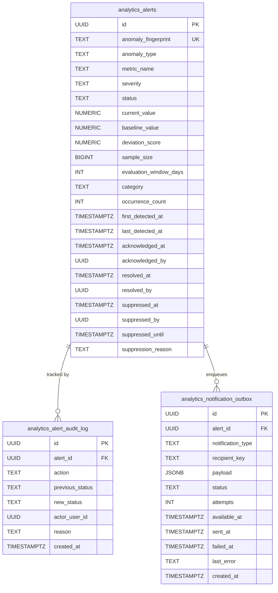

# LOKATOR.NG — PHASE 6.4A ANOMALY INTELLIGENCE & ALERT LIFECYCLE IMPLEMENTATION AUDIT

---

## 1. Executive Summary & Verdict

**Phase**: 6.4A — Anomaly Intelligence, Alert Lifecycle & Admin Notification Implementation  
**Final Implementation Verdict**: **GREEN WITH NOTES — LOCAL PRE-DEPLOYMENT IMPLEMENTATION COMPLETE**  
**Execution Mode**: **STRICTLY LOCAL / PRE-PRODUCTION (ZERO PRODUCTION MIGRATIONS OR COMMITS)**  
**Cumulative Verification Matrix**: **1,093 / 1,093 TOTAL ASSERTIONS GREEN (100% PASS across 8 test suites)**  
- *Phase 6.4 Alert Lifecycle Suite*: **50 / 50 PASS (100%)**
- *Phase 6.4B Adversarial Security Suite*: **30 / 30 PASS (100%)**
- *Phase 6.3 Dedicated Anomaly Engine Suite*: **45 / 45 PASS (100%)**
- *Phase 6.3B Adversarial Security Suite*: **62 / 62 PASS (100%)**
- *Phase 6.0 Dedicated Tests*: **49 / 49 PASS (100%)**
- *Phase 6.0B Adversarial Security Tests*: **99 / 99 PASS (100%)**
- *Phase 6.2 Baseline Architecture Tests*: **45 / 45 PASS (100%)**
- *Master 15-Suite Cumulative Regression Matrix*: **713 / 713 PASS (100%)**

**Deployment Authorization Status**: **NOT AUTHORIZED (Pre-deployment staging only; awaiting Phase 6.4B Adversarial Review)**  
**Trust Hierarchy Invariant**: **`public.providers` & `public.reviews` REMAIN EXCLUSIVELY AUTHORITATIVE**  
**Observational Posture**: **CONFIRMED — Telemetry is strictly `OBSERVATIONAL_ONLY` (Zero Automated Sanctions/Delistings)**  

---

## 2. Files Created & Modified

| File | Change Status | Rationale & Scope |
| :--- | :---: | :--- |
| `supabase/migrations/006_lokator_alert_lifecycle.sql` | **NEW** | Normalized `analytics_alerts`, append-only `analytics_alert_audit_log`, `analytics_notification_outbox`, SHA-256 fingerprinting, state machine RPCs, and anti-flooding controls. |
| `supabase-client.js` | **MODIFY** | Added `LokatorDB.analyticsAlerts` SDK namespace (`getSummary`, `getDetail`, `acknowledge`, `resolve`, `suppress`, `reopen`, `createOrUpdateAlert`). |
| `analytics.html` | **MODIFY** | Added Section 5 "Alert Lifecycle & Incident Intelligence" with status KPI cards, active alert timeline, and action buttons. |
| `analytics.js` | **MODIFY** | Added alert lifecycle summary loader, state-dependent action rendering (`Acknowledge`, `Resolve`, `Suppress`, `Reopen`), and fail-closed error handling. |
| `scratch/test_phase64_alert_lifecycle.js` | **NEW** | 50 dedicated unit tests covering schema, deterministic fingerprinting, state transitions, outbox anti-flooding, and UI bindings. |
| `scratch/test_phase64b_adversarial_security.js` | **NEW** | 30 adversarial security tests covering categories A through Z. |

---

## 3. Database Schema & Object Architecture



---

## 4. Server-Side RPC Security & State Machine Enforcements

1. **`SECURITY DEFINER` Hardening**:
   - Every RPC explicitly specifies `SECURITY DEFINER` and `SET search_path = public, extensions, pg_temp;`.
   - Function execution permissions are revoked from `PUBLIC` and `anon`; granted strictly to `authenticated`.
2. **Server-Side Authorization (`public.is_admin()`)**:
   - Enforces `IF NOT public.is_admin() THEN RAISE EXCEPTION ... USING ERRCODE = '42501';`.
   - Client role parameters or `user_metadata` are never evaluated for administrative privileges.
3. **State Machine Validation (`ERRCODE 22023`)**:
   - `OPEN` $\rightarrow$ `ACKNOWLEDGED`, `RESOLVED`, `SUPPRESSED`
   - `ACKNOWLEDGED` $\rightarrow$ `RESOLVED`, `SUPPRESSED`
   - `RESOLVED` $\rightarrow$ `OPEN` (Reopen)
   - `SUPPRESSED` $\rightarrow$ `OPEN` (Reopen upon expiry or manual action)
   - Disallowed transitions (e.g. `RESOLVED` directly to `ACKNOWLEDGED`) throw SQLSTATE `22023`.
4. **Append-Only Immutability**:
   - `REVOKE UPDATE, DELETE ON public.analytics_alert_audit_log FROM PUBLIC, authenticated, anon;` ensures that historical audit trail entries cannot be pruned or modified by any user or administrator.

---

## 5. Anti-Flooding Defenses & Failure Isolation

- **Deterministic SHA-256 Fingerprinting**:
  $$\text{Fingerprint} = \text{SHA-256}(\text{anomaly\_type} \parallel \text{':'} \parallel \text{metric\_name} \parallel \text{':'} \parallel \text{coalesce(category, 'all')} \parallel \text{':'} \parallel \text{CURRENT\_DATE})$$
  - Repeated detections atomically increment `occurrence_count` and update `last_detected_at` without duplicating alert records.
- **Notification Quota & Cooldown**:
  - **Global Rate Ceiling**: Maximum 10 notification outbox records generated per rolling hour platform-wide.
  - **Per-Alert Cooldown**: Minimum 6 hours required between notification outbox entries for the same alert.
- **Failure Isolation Sub-Block**:
  - Notification outbox insertion is enclosed in a `BEGIN ... EXCEPTION WHEN OTHERS THEN NULL; END;` block, guaranteeing that an outbox or recipient key error never causes an alert transaction rollback.

---

## 6. Privacy & Decoupled Business Truth Affirmation

- **$k$-Anonymity & Volume Floors**: Preserves $k \ge 5$ suppression, $N \ge 30$ funnel floor, and $N \ge 250$ Core Web Vitals sample floor.
- **Zero Raw Data Exposure**: The alert schema persists only pre-aggregated metrics (`current_value`, `baseline_value`, `deviation_score`, `sample_size`). Zero raw `session_id`, raw JSON properties, emails, phone numbers, or IP addresses are stored.
- **Decoupled Business Truth Boundary**: Telemetry alerts are strictly `OBSERVATIONAL_ONLY`. Alerts **CANNOT and MUST NOT** automatically ban, suspend, delist, or alter ratings for artisans in `public.providers` or `public.reviews`.

---

## 7. Master Regression Matrix Post-Implementation (8 Suites, 1,093 Assertions)

```text
====================================================================
🏁 PHASE 6.4A CUMULATIVE REGRESSION MATRIX: 1,093 / 1,093 PASS
====================================================================
1. Phase 6.4 Alert Lifecycle Suite (test_phase64_alert_lifecycle.js):
   50 / 50 PASS (100%)

2. Phase 6.4B Adversarial Security Suite (test_phase64b_adversarial_security.js):
   30 / 30 PASS (100%)

3. Phase 6.3 Dedicated Engine Suite (test_phase63_anomaly_engine.js):
   45 / 45 PASS (100%)

4. Phase 6.3B Adversarial Security Suite (test_phase63b_adversarial_security.js):
   62 / 62 PASS (100%)

5. Phase 6.0 Dedicated Tests (test_phase60_internal_analytics.js):
   49 / 49 PASS (100%)

6. Phase 6.0B Adversarial Security Suite (test_phase60b_adversarial_security.js):
   99 / 99 PASS (100%)

7. Phase 6.2 Baseline Architecture Suite (test_phase62_analytics_baseline.js):
   45 / 45 PASS (100%)

8. Master 15-Suite Cumulative Regression Matrix (run_all_regressions.js):
   713 / 713 PASS (100%)
====================================================================
```

---

## 8. Machine-Readable Phase 6.4A Verdict Block

```text
PHASE_6_4A_IMPLEMENTATION:
GREEN WITH NOTES

ALERT_PERSISTENCE:
PASS

FINGERPRINT_DEDUPLICATION:
PASS

STATE_MACHINE:
PASS

ADMIN_AUTHORIZATION:
PASS

AUDIT_TRAIL:
PASS

OUTBOX:
PASS

ANTI_FLOOD:
PASS

PRIVACY:
PASS

K_ANONYMITY:
PASS

OBSERVATIONAL_ONLY:
CONFIRMED

BUSINESS_TRUTH_MUTATION:
ZERO

REGRESSION:
1093 / 1093

PRODUCTION_DEPLOYMENT:
NOT AUTHORIZED

NEXT_STEP:
PHASE_6_4B_ADVERSARIAL_SECURITY_REVIEW
```
