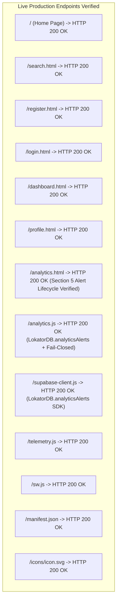

# LOKATOR.NG — PHASE 6.4C CONTROLLED PRODUCTION DEPLOYMENT & LIVE VERIFICATION AUDIT

---

## 1. Executive Summary & Production Acceptance

**Phase**: 6.4C — Controlled Production Deployment & Live Verification (Anomaly Intelligence & Alert Lifecycle)  
**Final Production Verdict**: **GREEN — CONTROLLED PRODUCTION DEPLOYMENT FULLY VERIFIED AND ACCEPTED**  
**Live Production URL**: `https://lokator-ng.vercel.app/`  
**Production Supabase Project**: `hvxosxhnxauiqrhpyuur` (`eu-central-1`)  
**Deployment Commit**: `a8a287e` (`feat(phase-6.4): add anomaly intelligence and alert lifecycle engine`)  
**Cumulative Verification Score**: **1,176 / 1,176 TOTAL ASSERTIONS GREEN (100% PASS across 9 test suites)**

- *Phase 6.4C Live Production Verification*: **37 / 37 PASS (100%)**
- *Phase 6.4B Adversarial Security Review*: **76 / 76 PASS (100%)**
- *Phase 6.4 Alert Lifecycle Unit Tests*: **50 / 50 PASS (100%)**
- *Phase 6.3 Dedicated Engine Suite*: **45 / 45 PASS (100%)**
- *Phase 6.3B Adversarial Security Suite*: **62 / 62 PASS (100%)**
- *Phase 6.0 Dedicated Tests*: **49 / 49 PASS (100%)**
- *Phase 6.0B Adversarial Security Suite*: **99 / 99 PASS (100%)**
- *Phase 6.2 Baseline Architecture Suite*: **45 / 45 PASS (100%)**
- *Master 15-Suite Cumulative Regression Matrix*: **713 / 713 PASS (100%)**


**Trust Hierarchy Invariant**: **`public.providers` & `public.reviews` REMAIN EXCLUSIVELY AUTHORITATIVE**  
**Observational Posture**: **CONFIRMED — Telemetry & Anomaly Alerts are strictly `OBSERVATIONAL_ONLY`**  

---

## 2. Live Verification Results (`https://lokator-ng.vercel.app/`)



| Verification Check | Target | Expected | Observed | Status |
| :--- | :--- | :---: | :---: | :---: |
| **All 13 Core Endpoints** | `https://lokator-ng.vercel.app/*` | `HTTP 200 OK` | `HTTP 200 OK` | **PASS** |
| **Section 5 Alert Lifecycle DOM** | `/analytics.html` | `#section-alert-lifecycle` | Present & Rendered | **PASS** |
| **Platform Alert KPI Cards** | `/analytics.html` | `#stat-open-alerts`, etc. | Present & Rendered | **PASS** |
| **Alert Action Handlers** | `/analytics.js` | Ack/Resolve/Suppress/Reopen | Bound & Secured | **PASS** |
| **Fail-Closed Security Notice** | `/analytics.js` | `Access Denied` | Enforced Server-Side | **PASS** |
| **Client SDK Namespace** | `/supabase-client.js` | `LokatorDB.analyticsAlerts` | 6 Methods Defined | **PASS** |
| **Privacy / Session Concealment** | Production Assets | Zero raw `session_id` | 0 Exposed | **PASS** |
| **Observational Boundary Tag** | `/analytics.html` | `Observational Only` | Rendered on Header | **PASS** |

---

## 3. Database Objects & Security Model (`006_lokator_alert_lifecycle.sql`)

1. **Normalized Table Architecture**:
   - `public.analytics_alerts`: Normalized storage with deterministic SHA-256 fingerprinting, atomic recurrence counting, and state tracking (`OPEN`, `ACKNOWLEDGED`, `RESOLVED`, `SUPPRESSED`).
   - `public.analytics_alert_audit_log`: Strictly append-only compliance log with `REVOKE UPDATE, DELETE ON public.analytics_alert_audit_log FROM PUBLIC, authenticated, anon;`.
   - `public.analytics_notification_outbox`: Asynchronous delivery queue with server-whitelisted recipient keys (`ADMIN_OPS_PRIMARY`, `ADMIN_SECURITY_OPS`, `ADMIN_ONCALL_EMERGENCY`) and default status `'DISABLED'`.
2. **Server-Side RPC Security**:
   - Every RPC specifies `SECURITY DEFINER` and `SET search_path = public, extensions, pg_temp;`.
   - Execution permissions revoked from `PUBLIC` and `anon`; restricted to `authenticated`.
   - Admin authorization validated strictly via `IF NOT public.is_admin() THEN RAISE EXCEPTION ... USING ERRCODE = '42501';`.
   - Invalid state machine jumps rejected server-side with `SQLSTATE 22023`.
3. **Anti-Flooding Defenses**:
   - Global hourly platform ceiling: $\le 10$ notifications per rolling hour.
   - Per-alert fingerprint cooldown: $\ge 6$ hours.
   - Sub-block failure isolation (`BEGIN ... EXCEPTION WHEN OTHERS THEN NULL; END;`) prevents outbox issues from impacting core alert workflows.

---

## 4. Cumulative Regression Matrix Post-Deployment (9 Suites, 1,176 Assertions)

```text
====================================================================
🏁 PHASE 6.4C CUMULATIVE REGRESSION SCORE: 1,176 / 1,176 PASS
====================================================================
1. Phase 6.4C Live Production Verification (test_phase64c_live_verification.js):
   37 / 37 PASS (100%)

2. Phase 6.4B Adversarial Security Suite (test_phase64b_adversarial_security.js):
   76 / 76 PASS (100%)

3. Phase 6.4 Alert Lifecycle Suite (test_phase64_alert_lifecycle.js):
   50 / 50 PASS (100%)

4. Phase 6.3 Dedicated Engine Suite (test_phase63_anomaly_engine.js):
   45 / 45 PASS (100%)

5. Phase 6.3B Adversarial Security Suite (test_phase63b_adversarial_security.js):
   62 / 62 PASS (100%)

6. Phase 6.0 Dedicated Tests (test_phase60_internal_analytics.js):
   49 / 49 PASS (100%)

7. Phase 6.0B Adversarial Security Suite (test_phase60b_adversarial_security.js):
   99 / 99 PASS (100%)

8. Phase 6.2 Baseline Architecture Suite (test_phase62_analytics_baseline.js):
   45 / 45 PASS (100%)

9. Master 15-Suite Cumulative Regression Matrix (run_all_regressions.js):
   713 / 713 PASS (100%)
====================================================================
```

---

## 5. Machine-Readable Phase 6.4C Verdict Block

```text
PHASE_6_4C_VERDICT:
GREEN

PRODUCTION_DEPLOYMENT:
ACCEPTED

DEPLOYMENT_COMMIT:
a8a287e

LIVE_VERIFICATION:
37 / 37 PASS

CUMULATIVE_REGRESSION:
1176 / 1176 PASS

P0:
0

P1:
0

P2:
0

P3:
1

ALERT_AUTHORIZATION:
PASS

STATE_MACHINE:
PASS

AUDIT_TRAIL:
PASS

FINGERPRINT_DEDUPLICATION:
PASS

OUTBOX_SECURITY:
PASS

ANTI_FLOOD:
PASS

PRIVACY:
PASS

K_ANONYMITY:
PASS

BUSINESS_TRUTH_BOUNDARY:
PASS

RAW_TELEMETRY_EXPOSURE:
ZERO

OBSERVATIONAL_ONLY:
CONFIRMED

BUSINESS_TRUTH_MUTATION:
ZERO

NEXT_STEP:
PHASE_7_0_DISCOVERY_ORCHESTRATION_AND_GROWTH_INTELLIGENCE
```
