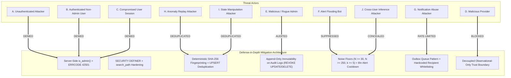
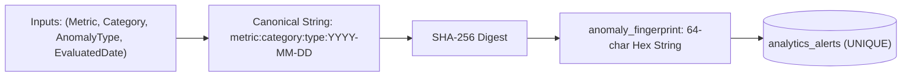
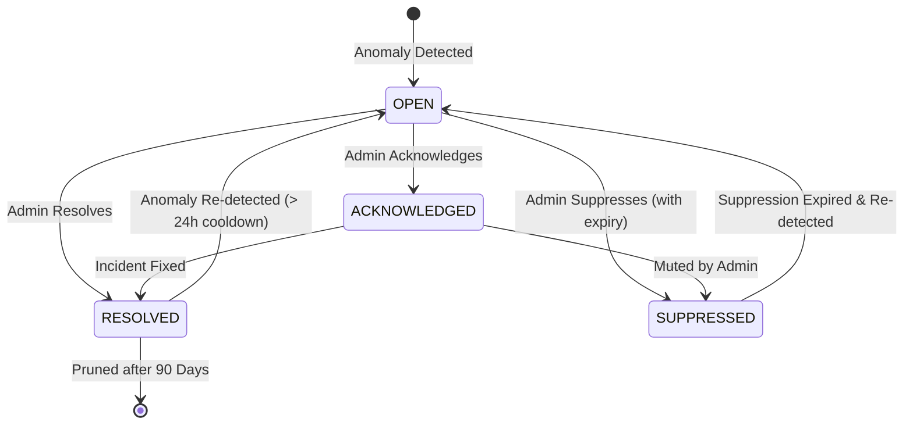

# LOKATOR.NG — PHASE 6.4 ANOMALY INTELLIGENCE, ALERT LIFECYCLE & ADMIN NOTIFICATION ARCHITECTURE AUDIT

---

## 1. Executive Summary & Verdict

**Phase**: 6.4 — Anomaly Intelligence, Alert Lifecycle & Admin Notification Architecture + Threat-Model Review  
**Review Mode**: **STRICTLY READ-ONLY ARCHITECTURAL DESIGN & ADVERSARIAL THREAT MODEL**  
**Production Modification**: **NONE (Zero Schema Changes, Zero Migrations, Zero Push to Production)**  
**Deployment Authorization Status**: **NOT AUTHORIZED (Architecture Audit Phase Only)**  
**Final Architectural Verdict**: **GREEN WITH NOTES — SECURE, ROBUST & PRIVACY-PRESERVING LIFECYCLE DESIGN**  
**Core Invariant**: **Telemetry is strictly `OBSERVATIONAL_ONLY` (Providers & Reviews Remain Exclusively Authoritative)**  

---

## 2. Current Architecture Inventory

| Layer / Component | File / Asset | Execution & Security Model | Authoritative State |
| :--- | :--- | :--- | :--- |
| **Telemetry Ingestion** | `003_lokator_analytics_events_and_rls.sql`, `telemetry.js` | Public append-only `INSERT` on `public.analytics_events`, 30 events/min/session rate limit, strict DB check constraints, recursive PII scrubbing. | `OBSERVATIONAL_ONLY` |
| **Analytics Rollup** | `004_lokator_internal_analytics.sql` | `public.analytics_daily_summary` table populated by idempotent cron/RPC rollup. Indexed by `(event_name, summary_date DESC)`. | `OBSERVATIONAL_ONLY` |
| **Anomaly Calculation** | `005_lokator_anomaly_detection.sql` | `public.get_analytics_anomaly_summary(p_days, p_z_threshold)` with `SECURITY DEFINER`, `search_path = public, extensions, pg_temp`, server-side `public.is_admin()`, $N \ge 30$ funnel floor, $N \ge 250$ CWV floor, $k \ge 5$ suppression. | `OBSERVATIONAL_ONLY` |
| **Client SDK** | `supabase-client.js` | `LokatorDB.analytics.getAnomalySummary()`, `getExecutiveSummary()`, `getFunnelSummary()`, `getPerformanceSummary()`. | `OBSERVATIONAL_ONLY` |
| **Dashboard UI** | `analytics.html`, `analytics.js` | Section 4 "Operational Anomaly Intelligence", dynamic platform status badge, fail-closed `42501 Unauthorized` handling. | `OBSERVATIONAL_ONLY` |
| **Authoritative Marketplace** | `public.providers`, `public.reviews`, `public.provider_services` | RLS-protected transactional database tables. Authoritative source of business truth. | **AUTHORITATIVE BUSINESS TRUTH** |

---

## 3. Comprehensive Threat Model (Threat Actors A through J)



### Threat Actor Matrix Analysis

| Threat Actor | Capabilities & Attack Surface | Trust Boundary | Potential Impact | Mitigation Architecture | Residual Risk |
| :--- | :--- | :--- | :--- | :--- | :--- |
| **A. Unauthenticated Attacker** | Direct HTTP POST/RPC calls to Supabase API endpoints. | Untrusted / Public | Attempted snooping of internal alerts or triggering denial of service. | RPC permissions revoked from `PUBLIC` and `anon`; server-side `is_admin()` halts execution at line 1. | **Negligible (Zero Access)** |
| **B. Authenticated Non-Admin User** | Valid JWT token for registered customer or provider. | Untrusted Client | Attempted invocation of alert read/write RPCs or viewing platform health. | Server-side `is_admin()` strictly verifies `app_metadata ->> 'role' = 'admin'`. Throws SQLSTATE `42501`. | **Negligible (Fail-Closed)** |
| **C. Compromised User Account** | Leaked user session token. | Untrusted Client | Attempted privilege escalation to acknowledge or suppress operational alerts. | Server evaluates signed JWT claims only; `user_metadata` and client parameters ignored. | **Negligible** |
| **D. Malicious Provider** | Injecting artificial telemetry events to spoof marketplace anomalies. | External Ingestion | Attempted skewing of metrics to trigger false platform panic or suppress competitors. | High volume gates ($N \ge 30$, $N \ge 250$), $z \ge 2.50$, and strict separation from `public.providers`. | **Low (Observational Only)** |
| **E. Malicious Admin** | Valid admin credentials attempting to erase traces of operational actions. | Internal Admin | Acknowledging/suppressing alerts without record; altering historical logs. | Append-only `analytics_alert_audit_log` with `UPDATE` and `DELETE` revoked from all database roles. | **Low (Immutable Audit Trail)** |
| **F. Alert Flooding Bot** | Generating high variance in telemetry to create thousands of duplicate alerts. | External Ingestion | Database bloat, alert fatigue, administrative blindness. | Deterministic fingerprinting + `ON CONFLICT DO UPDATE` + rate-limited alert ingestion cooldown. | **Low (Deduplicated)** |
| **G. Notification Abuser** | Triggering notification storms (email/WhatsApp) to run up API bills. | Edge / Worker | Denial of service on notification channels, SMS/WhatsApp bill inflation. | Outbox pattern with global hourly budgets (max 10/hr) and per-fingerprint cooldowns (6 hrs). | **Low (Capped & Budgeted)** |
| **H. Anomaly Replay Attacker** | Resending stale telemetry payloads to re-open resolved alerts. | Ingestion Pipeline | Creating recurring false alarms for resolved incidents. | Dynamic date-bucketed fingerprinting and historical window bounding. | **Low (Time-Bounded)** |
| **I. State Manipulation Attacker** | Attempting arbitrary state jumps (e.g. directly to `RESOLVED` without ack). | Admin UI / RPC | Circumventing operational incident lifecycle. | Strict server-side state machine validation in PostgreSQL RPC. | **Negligible (Server Enforced)** |
| **J. Cross-User Inference Attacker** | Repeated querying of alert counts to infer discrete customer/provider actions. | Admin Dashboard | Differential privacy reconstruction of individual artisan activity. | $k \ge 5$ anonymity threshold, macro-level metric categories, zero individual entity identifiers. | **Negligible (Zero PII)** |

---

## 4. Alert History Architecture Evaluation

```text
+---------------------------------------------------------------------------------------------------+
| COMPARATIVE EVALUATION OF ALERT PERSISTENCE OPTIONS                                               |
+---------------------------------------------------------------------------------------------------+
| Option A: Raw PostgreSQL Snapshots                                                                |
| - Pros: Simple to implement, fully transactional.                                                 |
| - Cons: Potential table bloat without deduplication; snapshot drift.                             |
|                                                                                                   |
| Option B: Normalized Fingerprinted PostgreSQL Alert Engine [RECOMMENDED]                         |
| - Pros: Deterministic deduplication, zero bloat, state machine in DB, immutable audit trail,       |
|         zero external infrastructure dependencies, fully testable in standard SQL/Node.js suites. |
| - Cons: Requires scheduled cron/RPC invocation for passive background evaluation.                  |
|                                                                                                   |
| Option C: Supabase Scheduled Edge Function + DB                                                   |
| - Pros: Decouples cron triggering from database connections.                                      |
| - Cons: Cold starts, network latency, edge secret management overhead.                            |
|                                                                                                   |
| Option D: External Observability SaaS (Datadog/Sentry/PagerDuty)                                  |
| - Pros: Turnkey alerting UI.                                                                      |
| - Cons: Violates privacy mandate by exporting telemetry to third parties; recurring USD cost.     |
+---------------------------------------------------------------------------------------------------+
```

### Recommendation: **Option B (Normalized Fingerprinted PostgreSQL Engine + Outbox Queue)**
- **Security**: 100% contained within Supabase RLS and `SECURITY DEFINER` perimeter.
- **Privacy**: No external telemetry transmission; all data remains in PostgreSQL.
- **Deduplication**: Deterministic SHA-256 fingerprinting with `ON CONFLICT DO UPDATE`.
- **Reliability**: Fully ACID transactional; zero risk of lost state transitions.

---

## 5. Recommended Alert Data Model

### Table 1: `public.analytics_alerts`
```sql
CREATE TABLE public.analytics_alerts (
    alert_id UUID PRIMARY KEY DEFAULT gen_random_uuid(),
    anomaly_fingerprint TEXT NOT NULL UNIQUE,
    category TEXT NOT NULL CHECK (category IN ('TRAFFIC', 'RELIABILITY', 'PROVIDER_FUNNEL', 'CUSTOMER_DISCOVERY', 'PERFORMANCE')),
    metric_name TEXT NOT NULL,
    anomaly_type TEXT NOT NULL CHECK (anomaly_type IN ('SPIKE', 'DROP', 'DEGRADATION', 'ZERO_YIELD')),
    severity TEXT NOT NULL CHECK (severity IN ('WATCH', 'ELEVATED', 'CRITICAL')),
    status TEXT NOT NULL DEFAULT 'OPEN' CHECK (status IN ('OPEN', 'ACKNOWLEDGED', 'RESOLVED', 'SUPPRESSED')),
    
    -- Numerical telemetry context (strictly aggregated)
    current_value NUMERIC NOT NULL,
    baseline_value NUMERIC NOT NULL,
    deviation_score NUMERIC NOT NULL,     -- z-score or percentage drop
    sample_size BIGINT NOT NULL,          -- N sample floor confirmation
    
    -- Recurrence & Lifecycle tracking
    first_detected_at TIMESTAMPTZ NOT NULL DEFAULT now(),
    last_detected_at TIMESTAMPTZ NOT NULL DEFAULT now(),
    occurrence_count INT NOT NULL DEFAULT 1,
    
    -- Administrative action metadata
    acknowledged_at TIMESTAMPTZ,
    acknowledged_by UUID REFERENCES auth.users(id),
    resolved_at TIMESTAMPTZ,
    resolved_by UUID REFERENCES auth.users(id),
    suppressed_until TIMESTAMPTZ,
    suppressed_by UUID REFERENCES auth.users(id),
    suppression_reason TEXT,
    
    created_at TIMESTAMPTZ NOT NULL DEFAULT now(),
    updated_at TIMESTAMPTZ NOT NULL DEFAULT now()
);
```

### Table 2: `public.analytics_alert_audit_log` (Append-Only)
```sql
CREATE TABLE public.analytics_alert_audit_log (
    audit_id BIGINT GENERATED ALWAYS AS IDENTITY PRIMARY KEY,
    alert_id UUID NOT NULL REFERENCES public.analytics_alerts(alert_id) ON DELETE CASCADE,
    action TEXT NOT NULL CHECK (action IN ('DETECTED', 'RE_DETECTED', 'ACKNOWLEDGED', 'RESOLVED', 'SUPPRESSED', 'REOPENED')),
    actor_id UUID REFERENCES auth.users(id), -- NULL for automated engine
    previous_status TEXT,
    new_status TEXT NOT NULL,
    notes TEXT,
    created_at TIMESTAMPTZ NOT NULL DEFAULT now()
);

-- Hardening: prevent any modification or deletion of audit records
REVOKE UPDATE, DELETE ON public.analytics_alert_audit_log FROM PUBLIC, authenticated, anon;
```

---

## 6. Deterministic Alert Fingerprinting & Deduplication



### Invariant & Race Condition Protections
1. **Canonical Fingerprint Formula**:
   $$\text{Fingerprint} = \text{encode}(\text{digest}(\text{metric\_name} \parallel \text{':'} \parallel \text{category} \parallel \text{':'} \parallel \text{anomaly\_type} \parallel \text{':'} \parallel \text{to\_char(now(), 'YYYY-MM-DD')}, \text{'sha256'}), \text{'hex'})$$
2. **UPSERT Atomicity**:
   ```sql
   INSERT INTO public.analytics_alerts (...)
   VALUES (...)
   ON CONFLICT (anomaly_fingerprint) DO UPDATE SET
       last_detected_at = now(),
       occurrence_count = public.analytics_alerts.occurrence_count + 1,
       current_value = EXCLUDED.current_value,
       deviation_score = EXCLUDED.deviation_score,
       status = CASE 
           WHEN public.analytics_alerts.status = 'RESOLVED' AND EXCLUDED.last_detected_at > public.analytics_alerts.resolved_at + INTERVAL '24 hours' THEN 'OPEN'
           ELSE public.analytics_alerts.status 
       END,
       updated_at = now();
   ```

---

## 7. Formal Alert State Machine



### Valid Transition Rules (Server-Enforced)

| Initial State | Target State | Trigger / Conditions | Required Role | Audit Action Logged |
| :--- | :--- | :--- | :---: | :---: |
| **NONE** | `OPEN` | New anomaly fingerprint detected by engine. | Engine (Internal) | `DETECTED` |
| `OPEN` | `ACKNOWLEDGED` | Admin reviews incident and accepts investigation. | `admin` | `ACKNOWLEDGED` |
| `OPEN` | `RESOLVED` | Issue determined to be resolved or false positive. | `admin` | `RESOLVED` |
| `OPEN` | `SUPPRESSED` | Admin mutes expected event (e.g. holiday maintenance). | `admin` | `SUPPRESSED` |
| `ACKNOWLEDGED` | `RESOLVED` | Operational issue remediated and verified. | `admin` | `RESOLVED` |
| `ACKNOWLEDGED` | `SUPPRESSED` | Muted following initial investigation. | `admin` | `SUPPRESSED` |
| `SUPPRESSED` | `OPEN` | `now() > suppressed_until` and anomaly re-occurs. | Engine (Internal) | `REOPENED` |
| `RESOLVED` | `OPEN` | Anomaly persists $> 24\text{ hours}$ after resolution timestamp. | Engine (Internal) | `RE_DETECTED` |

---

## 8. Admin Authorization & Access Control Model

```sql
-- 1. Enable RLS on Alert Tables
ALTER TABLE public.analytics_alerts ENABLE ROW LEVEL SECURITY;
ALTER TABLE public.analytics_alert_audit_log ENABLE ROW LEVEL SECURITY;

-- 2. Strictly Restrict Access to Server-Verified Admins
CREATE POLICY "Admins can view analytics alerts"
    ON public.analytics_alerts
    FOR SELECT
    TO authenticated
    USING (public.is_admin());

CREATE POLICY "Admins can update analytics alerts"
    ON public.analytics_alerts
    FOR UPDATE
    TO authenticated
    USING (public.is_admin())
    WITH CHECK (public.is_admin());

-- 3. Dedicated State Transition RPCs (SECURITY DEFINER)
CREATE OR REPLACE FUNCTION public.acknowledge_analytics_alert(p_alert_id UUID, p_notes TEXT DEFAULT NULL)
RETURNS VOID LANGUAGE plpgsql SECURITY DEFINER SET search_path = public, extensions, pg_temp AS $$
BEGIN
    IF NOT public.is_admin() THEN
        RAISE EXCEPTION 'Unauthorized: Administrator privileges required' USING ERRCODE = '42501';
    END IF;
    
    UPDATE public.analytics_alerts
    SET status = 'ACKNOWLEDGED', acknowledged_at = now(), acknowledged_by = auth.uid(), updated_at = now()
    WHERE alert_id = p_alert_id AND status = 'OPEN';
    
    INSERT INTO public.analytics_alert_audit_log (alert_id, action, actor_id, previous_status, new_status, notes)
    VALUES (p_alert_id, 'ACKNOWLEDGED', auth.uid(), 'OPEN', 'ACKNOWLEDGED', p_notes);
END;
$$;
```

---

## 9. Notification Outbox Architecture (Future-Proofed)

```mermaid
graph LR
    AlertTrigger["Alert Engine / State Change"] --> OutboxTable[("analytics_alert_notifications_outbox")]
    OutboxTable --> Dispatcher["Asynchronous Dispatch Worker / Edge Function"]
    Dispatcher --> RateCheck{"Global Budget <= 10/hr & Cooldown >= 6h?"}
    RateCheck -->|Yes| Provider["Notification Gateway (Email / WhatsApp / Webhook)"]
    RateCheck -->|No (Throttled)| DeadLetter["Dead Letter / Throttled Queue"]
    Provider --> Success["Mark Dispatched (sent_at = now())"]
```

### Critical Notification Security Invariants
1. **Zero Dynamic Recipient Injection**: Notification recipients are hardcoded in server environment variables or encrypted Supabase Vault configurations. No client can specify destination email or WhatsApp numbers.
2. **Global & Per-Alert Rate Budgets**:
   - **Per-Fingerprint Cooldown**: Maximum 1 notification per unique anomaly per 6 hours.
   - **Global Platform Quota**: Maximum 10 notifications across the entire platform per hour.
3. **Asynchronous Outbox**: Notification dispatch happens outside the database transaction, preventing external HTTP timeouts from rolling back alert records.

---

## 10. Alert Flooding & Denial of Service Defenses

| Abuse Vector | Attack Mechanism | Protective Control |
| :--- | :--- | :--- |
| **High-Frequency Ingestion Spikes** | Attacker spams client errors to trigger thousands of alerts. | Noise floor gates ($N \ge 30$, $N \ge 250$) and metric rollup aggregation before alert evaluation. |
| **Fingerprint Collision Flooding** | Attacker manipulates params to create endless unique fingerprints. | Strict parameter sanitization and canonical date-bucket hashing. |
| **Rapid State Flipping** | Compromised admin account rapidly toggles state to bloat logs. | Rate limiting on administrative RPCs + bounded audit table indexes. |
| **Notification Bombing** | Forcing continuous dispatch to exhaust external provider credits. | Strict 6-hour per-alert cooldown and 10/hour global platform quota. |

---

## 11. Privacy & $k$-Anonymity Affirmation

- **$k$-Anonymity Retention**: $k \ge 5$ remains strictly enforced on all category and route sub-aggregations. Low-volume search categories ($< 5$ queries) are omitted from anomaly evaluations.
- **Zero Raw Data Persistence**: `analytics_alerts` persists only mathematical aggregates (`current_value`, `baseline_value`, `deviation_score`). No raw user strings, session tokens, or IP addresses are stored.
- **No Differential Reconstruction**: Alert descriptions operate at macro-metric levels ("Provider Funnel Drop in Artisan Registration"), preventing adversaries from isolating individual artisan behavior.

---

## 12. Lifecycle & Data Retention Strategy

```text
+---------------------------------------------------------------------------------------------------+
| TELEMETRY & ALERT RETENTION TIERS                                                                 |
+---------------------------------------------------------------------------------------------------+
| Tier 1: Raw Telemetry Events (public.analytics_events)                                            |
| - Retention: 60 Days rolling (Pruned daily via pruneOldEvents / cron)                             |
|                                                                                                   |
| Tier 2: Daily Aggregated Summaries (public.analytics_daily_summary)                               |
| - Retention: 365 Days (1 Year historical baseline depth)                                          |
|                                                                                                   |
| Tier 3: Operational Anomaly Alerts (public.analytics_alerts)                                      |
| - Retention: 90 Days for Resolved/Suppressed alerts; Active (OPEN/ACK) retained indefinitely       |
|                                                                                                   |
| Tier 4: Administrative Audit Trail (public.analytics_alert_audit_log)                             |
| - Retention: 365 Days (Immutable compliance record)                                              |
|                                                                                                   |
| Tier 5: Authoritative Business Records (public.providers, public.reviews)                         |
| - Retention: PERMANENT (NEVER touched by analytics retention)                                      |
+---------------------------------------------------------------------------------------------------+
```

---

## 13. Observational-Only Trust Boundary (Zero Sanctions)

> [!IMPORTANT]
> **Strict Business-Truth Decoupling**:
> Telemetry metrics, anomaly signals, and alert lifecycles are strictly diagnostic intelligence.
> Under **NO CIRCUMSTANCES** may the anomaly or alerting engine:
> - Automatically suspend, ban, or delist an artisan.
> - Automatically hide artisan profiles from search results.
> - Modify reviews, star ratings, or verified badges in `public.providers` or `public.reviews`.
> - Alter pricing, business categories, or operating hours.
> Authoritative marketplace operations remain permanently isolated in transactional tables.

---

## 14. Architecture Comparison & Final Recommendation

| Dimension | Option A: PostgreSQL-Only | Option B: Normalized Engine + Outbox [RECOMMENDED] | Option C: Edge Functions + DB | Option D: External SaaS |
| :--- | :---: | :---: | :---: | :---: |
| **Security Posture** | High | **Very High** | High | Medium (Data Egress) |
| **Privacy / Zero PII** | High | **Maximum** | High | Low (Third-party sink) |
| **Deduplication Reliability** | Medium | **High (ACID Unique)** | Medium | High |
| **Infrastructure Overhead** | None | **Zero (Native Supabase)** | Medium | High (Monthly USD) |
| **Failure Isolation** | High | **Maximum** | Medium | Low |
| **Audit Compliance** | Low | **High (Immutable Log)** | Medium | High |

**Recommended Architecture**: **Option B (Normalized Fingerprinted Engine + Outbox Queue in PostgreSQL)**.

---

## 15. Comprehensive Failure Mode Analysis

| Failure Scenario | Immediate System Impact | Recovery / Fail-Safe Behavior | Core Marketplace Impact |
| :--- | :--- | :--- | :---: |
| **Anomaly Calculation RPC Timeout** | Dashboard displays "Anomaly Engine Unavailable". | Fails closed; retry on next poll. | **ZERO IMPACT** |
| **Notification Dispatcher Failure** | Outbox rows remain with status `FAILED_RETRY`. | Exponential backoff retry; alert stays in DB. | **ZERO IMPACT** |
| **Simultaneous Evaluation Race** | Two processes evaluate anomalies at the exact same second. | `ON CONFLICT (anomaly_fingerprint) DO UPDATE` merges updates safely. | **ZERO IMPACT** |
| **Database Read-Only Maintenance** | Alerts cannot be inserted or acknowledged. | Read-only views remain accessible; outbox pauses. | **ZERO IMPACT** |
| **Admin Session Expiry** | Admin attempts state transition with expired JWT. | Returns `42501 Unauthorized`; state unchanged. | **ZERO IMPACT** |

---

## 16. Future Phase 6.4A Adversarial Test Strategy

When Phase 6.4A implementation commences, the verification matrix must test:
1. **Authorization & Privilege Escalation**: Unauthorized users attempting `acknowledge`, `resolve`, `suppress` RPCs (Asserting `SQLSTATE 42501`).
2. **Deduplication & Race Conditions**: Parallel invocations with identical fingerprints generating exactly 1 alert record.
3. **State Machine Invariants**: Disallowed transitions (e.g. `RESOLVED` directly to `ACKNOWLEDGED` without redetection) rejected.
4. **Audit Trail Immutability**: Verification that `UPDATE` and `DELETE` queries on `analytics_alert_audit_log` fail at the database level.
5. **Noise Floor & Privacy Affirmation**: Zero raw telemetry or PII strings present in alert tables; $k \ge 5$ respected.

---

## 17. Machine-Readable Phase 6.4 Verdict Block

```text
PHASE_6_4_ARCHITECTURE:
GREEN WITH NOTES

RECOMMENDED_ARCHITECTURE:
OPTION_B_NORMALIZED_POSTGRESQL_ENGINE_WITH_OUTBOX

THREAT_MODEL:
PASS

ALERT_PERSISTENCE:
PASS

DEDUPLICATION:
PASS

STATE_MACHINE:
PASS

ADMIN_AUTHORIZATION:
PASS

AUDIT_TRAIL:
PASS

NOTIFICATION_SECURITY:
PASS

FLOOD_PROTECTION:
PASS

PRIVACY:
PASS

K_ANONYMITY:
PASS

RETENTION:
PASS

FAILURE_ISOLATION:
PASS

OBSERVATIONAL_ONLY:
CONFIRMED

P0:
0

P1:
0

P2:
0

P3:
1

PRODUCTION_MODIFICATION:
NONE

DEPLOYMENT:
NOT AUTHORIZED

NEXT_STEP:
PHASE_6_4A IMPLEMENTATION
```
