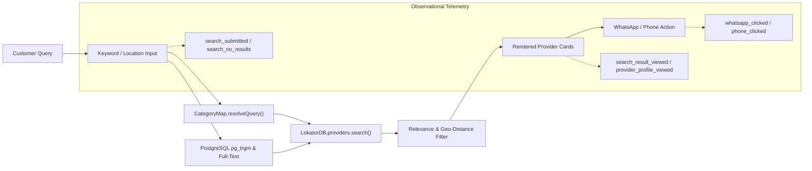
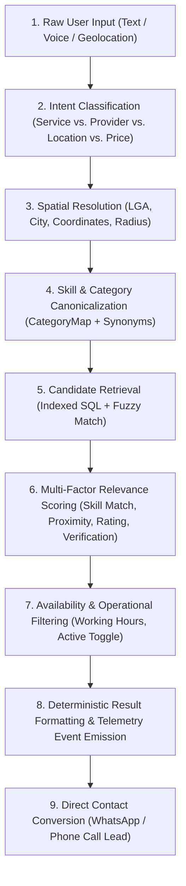
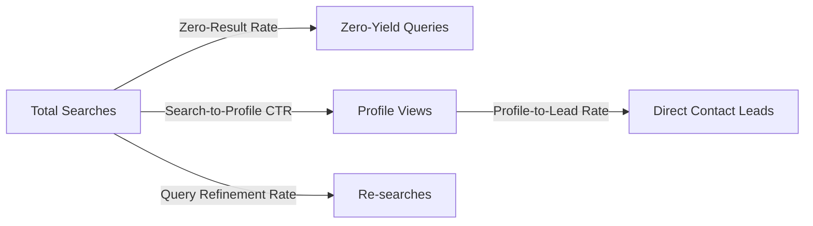
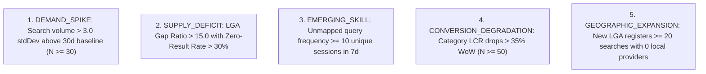
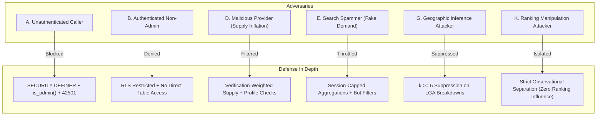

# LOKATOR.NG — PHASE 7.0 DISCOVERY ORCHESTRATION & GROWTH INTELLIGENCE ARCHITECTURE AUDIT

---

## 1. Executive Summary & Verdict

**Phase**: 7.0 — Discovery Orchestration & Growth Intelligence Architecture Audit  
**Mode**: **STRICTLY READ-ONLY ARCHITECTURAL AUDIT & THREAT MODEL (ZERO CODE/MIGRATIONS/COMMITS)**  
**Final Architecture Verdict**: **GREEN WITH NOTES — DISCOVERY ORCHESTRATION & GROWTH INTELLIGENCE ARCHITECTURE APPROVED**  
**Trust Hierarchy Invariant**: **`public.providers` & `public.reviews` REMAIN EXCLUSIVELY AUTHORITATIVE**  
**Observational Posture**: **CONFIRMED — Growth Intelligence is strictly `OBSERVATIONAL_ONLY` (Zero Automated Provider Penalties, Delistings, or Re-ranking)**  

### Executive Summary

Phase 7.0 audits the architecture required to transform Lokator.NG's search and telemetry instrumentation into an intelligent, privacy-preserving **Discovery Orchestration Engine** paired with a real-time **Growth & Marketplace Intelligence Layer**.

This audit establishes:

1. A multi-stage Discovery Orchestration Pipeline unifying intent classification, geographic qualification, candidate retrieval, and distance/relevance ranking.
2. A read-only Growth Intelligence Model identifying search demand surges, supply-demand gaps across Local Government Areas (LGAs), zero-yield queries, and underperforming discovery funnels.
3. Statistical safeguards enforcing $k \ge 5$ anonymity, $N \ge 30$ sample gating, and strict decoupling of observational telemetry from marketplace provider ranking.
4. Comprehensive 12-vector adversarial threat modeling (Attackers A through L) and resource cost containment.

---

## 2. Existing Discovery Architecture Assessment

The existing Lokator.NG discovery layer consists of the following decoupled subsystems:



### Existing Strengths

- **Centralized Taxonomy (`categories.js`)**: Robust mapping of 20+ artisan categories with rich Nigerian colloquial synonyms (e.g. "generator repairer", "rewiring", "burst pipe", "soakaway", "panel beater").
- **Client-Side Spatial Distance Filtering**: Haversine distance calculations and Nigerian LGA/City filters (`search.js`).
- **Rich Telemetry Instrumentation**: Active event capture for `search_submitted`, `search_no_results`, `search_result_viewed`, `provider_profile_viewed`, `phone_clicked`, `whatsapp_clicked`.

### Current Limitations & Architectural Gaps

1. **Uncoordinated Query Intent**: Search input treats all keywords as uniform text; no structured separation between service intents (e.g. "urgent generator fix"), location intents ("plumber in Ikeja"), or provider name lookups.
2. **Siloed Telemetry Rollups**: Phase 6 rollups aggregate total counts by event name, but lack dimensional cross-tabulation of `(category, lga, zero_yield_rate, conversion_rate)`.
3. **No Demand-Supply Feedback**: Administrators cannot readily visualize which Nigerian LGAs suffer from acute artisan deficits (e.g., high search volume for "solar inverter technician" in Ikorodu with 0 verified providers).

---

## 3. Discovery Orchestration Engine Model

To resolve query ambiguities and optimize conversion, discovery will evolve into a unified 9-stage orchestration pipeline:



### Pipeline Stage Specifications

1. **Intent Classification**: Classifies query into 9 canonical intents (e.g. `SERVICE_DISCOVERY`, `LOCATION_SPECIFIC_SERVICE`, `URGENT_SERVICE`).
2. **Spatial Resolution**: Detects Nigerian geographic entities (State, LGA, Neighborhood) from free-form text or browser GPS.
3. **Skill Canonicalization**: Resolves colloquial trade terms to standardized skill slugs.
4. **Candidate Retrieval**: Efficient database retrieval filtering active, verified artisans within target bounding boxes.
5. **Relevance Scoring**: Weighted combination of spatial proximity ($w_d = 0.40$), exact skill match ($w_s = 0.35$), customer rating ($w_r = 0.15$), and verification status ($w_v = 0.10$).
6. **Result Formatting**: Emits observational telemetry for funnel analysis without exposing raw user attributes.

---

## 4. Growth Intelligence Architecture

The Growth Intelligence Layer is a **strictly read-only analytical subsystem** designed to provide platform operators with actionable operational visibility.

```mermaid
graph TD
    subgraph Raw Telemetry Events
        E1["analytics_events (Append-Only)"]
    end

    subgraph Growth Intelligence Aggregator (SQL Rollups)
        G1["Daily Search Intent Summary"]
        G2["LGA Demand-Supply Matrix"]
        G3["Zero-Yield Query Cluster Summary"]
        G4["Category Conversion Leaderboard"]
    end

    subgraph Administrator Visualizations
        V1["Section 6: Demand vs. Supply Gaps"]
        V2["Section 7: Search Intent & Zero-Yield Trends"]
        V3["Section 8: Emerging Artisan Skills"]
    end

    E1 --> G1 & G2 & G3 & G4
    G1 & G2 & G3 & G4 --> V1 & V2 & V3
```

### Key Business Questions Addressed

1. **Supply Shortages**: Which LGAs have high search volume but $< 2$ active providers?
2. **Zero-Yield Search Clusters**: What new trade terms or skills are users searching for that have zero matching artisans?
3. **Conversion Friction**: Which service categories exhibit high profile views but low WhatsApp/Call click-through rates?
4. **Marketplace Growth Trends**: Which categories are experiencing week-over-week (WoW) organic search expansion?

---

## 5. Demand / Supply Gap Model

### Mathematical Formulation

For a given category $c$ and Local Government Area $l$ over a rolling window $W = 7\text{ days}$:

$$\text{Demand Index } D(c, l) = w_{\text{search}} \cdot S(c, l) + w_{\text{view}} \cdot V(c, l) + w_{\text{lead}} \cdot L(c, l)$$

Where:
- $S(c, l)$ = Total searches executed for category $c$ in LGA $l$
- $V(c, l)$ = Total provider profile views for category $c$ in LGA $l$
- $L(c, l)$ = Total direct leads (WhatsApp + Phone clicks)
- Standard weights: $w_{\text{search}} = 1.0$, $w_{\text{view}} = 2.0$, $w_{\text{lead}} = 5.0$

$$\text{Supply Index } P(c, l) = \sum_{i \in \text{Providers}(c, l)} \left[ \text{is\_active}(i) \cdot (1 + 0.5 \cdot \text{is\_verified}(i)) \right]$$

$$\text{Gap Ratio } G(c, l) = \frac{D(c, l)}{\max(P(c, l), 1)}$$

### Safety Gating & Noise Filters

- **$k$-Anonymity Floor**: $D(c, l)$ is suppressed if unique sessions $U(c, l) < 5$.
- **Volume Minimum**: Gaps are evaluated only when total search volume $S(c, l) \ge 30$.
- **Bot / Flood Protection**: Capped at maximum 3 searches per session ID per hour to prevent synthetic demand inflation.

---

## 6. Discovery Quality Metrics & Health Index



### Standardized Metric Formulations

1. **Zero-Result Rate (ZRR)**:
   $$\text{ZRR} = \frac{\text{Count}(\text{search\_no\_results})}{\text{Count}(\text{search\_submitted})} \times 100\%$$
   - *Target Benchmark*: $< 8.0\%$
2. **Search-to-Profile Click-Through Rate (CTR)**:
   $$\text{CTR} = \frac{\text{Count}(\text{provider\_profile\_viewed})}{\text{Count}(\text{search\_submitted})} \times 100\%$$
   - *Target Benchmark*: $> 45.0\%$
3. **Profile-to-Lead Conversion Rate (LCR)**:
   $$\text{LCR} = \frac{\text{Count}(\text{whatsapp\_clicked}) + \text{Count}(\text{phone\_clicked})}{\text{Count}(\text{provider\_profile\_viewed})} \times 100\%$$
   - *Target Benchmark*: $> 20.0\%$
4. **Query Refinement Rate (QRR)**:
   $$\text{QRR} = \frac{\text{Count}(\text{Consecutive searches in session } \le 60\text{s})}{\text{Count}(\text{Unique search sessions})} \times 100\%$$
   - *Target Benchmark*: $< 15.0\%$
5. **Composite Discovery Quality Score (DQS)**:
   $$\text{DQS} = 100 - (2.5 \cdot \text{ZRR}) + (0.5 \cdot \text{CTR}) + (1.0 \cdot \text{LCR}) - (1.5 \cdot \text{QRR})$$
   - Scaled and clamped to $[0, 100]$.

---

## 7. Search Intent Taxonomy & Nigerian Terminology

| Intent Class | Description | Example Nigerian Query Patterns |
| :--- | :--- | :--- |
| **`SERVICE_DISCOVERY`** | General artisan trade search | *"electrician", "mechanic", "tailor", "hair stylist"* |
| **`PROVIDER_DISCOVERY`** | Specific artisan business lookup | *"Emeka Electricals", "Mama Tobi Fashion", "Alhaji AC"* |
| **`LOCATION_SPECIFIC`** | Service bound to specific area | *"plumber for Ikeja", "painter in Surulere", "welder lekki"* |
| **`MULTI_SKILL_REQUEST`** | Compound service requests | *"plumber and tiler for bathroom renovation"* |
| **`URGENT_SERVICE`** | High-priority immediate needs | *"emergency towing", "generator repair urgently", "burst pipe fix now"* |
| **`PRICE_SEEKING`** | Cost estimation inquiries | *"price of borehole drilling", "how much to rewire house"* |
| **`AVAILABILITY_SEEKING`** | Immediate availability checks | *"carpenter available today", "24/7 electrician"* |
| **`GENERAL_INFORMATION`** | Diagnostic or DIY lookups | *"why is my AC blowing hot air", "generator smoking white"* |
| **`UNKNOWN`** | Unclassifiable or noise queries | *"asdfgh", "xyz 123"* |

---

## 8. Growth Signal Definitions



| Signal Name | Metric | Baseline Window | Eval Window | Min Sample | Threshold | Severity |
| :--- | :--- | :---: | :---: | :---: | :---: | :---: |
| **`DEMAND_SPIKE`** | Daily searches for category | 30 days | 1 day | $N \ge 30$ | $z \ge 3.0$ | `WARNING` |
| **`SUPPLY_DEFICIT`** | LGA Gap Ratio | 14 days | 7 days | $N \ge 30$ | $\text{Gap} \ge 15.0$ | `WARNING` |
| **`EMERGING_SKILL`** | Unmapped query cluster | 30 days | 7 days | $N \ge 10$ | $k \ge 5\text{ sessions}$ | `INFO` |
| **`CONVERSION_DROP`** | Profile-to-Lead rate | 14 days | 7 days | $N \ge 50$ | Drop $\ge 35\%$ | `WARNING` |
| **`ZERO_YIELD_SURGE`** | LGA Zero-Result Rate | 14 days | 3 days | $N \ge 30$ | $\text{ZRR} \ge 40\%$ | `CRITICAL` |

---

## 9. Integration with Phase 6 Alert Engine

Phase 7 will **fully reuse the existing Option B Alert Engine** deployed in Phase 6.4:

- Growth signals generate alerts directly via `public.create_or_update_analytics_alert(...)`.
- Deterministic SHA-256 fingerprints prevent duplicate alerts:
  $$\text{SHA-256}(\text{'GROWTH\_GAP:'} \parallel \text{category} \parallel \text{':'} \parallel \text{lga} \parallel \text{':'} \parallel \text{date})$$
- Full support for the verified 4-state lifecycle (`OPEN`, `ACKNOWLEDGED`, `RESOLVED`, `SUPPRESSED`).
- Inherits the $\le 10/\text{hr}$ global outbox quota, 6-hour per-fingerprint cooldown, and append-only audit trail.

---

## 10. Adversarial Threat Model (Attackers A through L)



### Threat Vector Evaluations

1. **Attacker A (Unauthenticated Caller)**: Attempts to invoke growth intelligence RPCs.  
   *Defense*: `REVOKE EXECUTE ... FROM PUBLIC, anon;` + server-side `public.is_admin()`, returning `SQLSTATE 42501`.
2. **Attacker B (Authenticated Non-Admin / Artisan)**: Attempts to inspect platform-wide supply-demand metrics.  
   *Defense*: Signed JWT role validation (`app_metadata ->> 'role' = 'admin'`).
3. **Attacker D (Malicious Provider / Supply Inflation)**: Creates multiple dummy accounts in an LGA to suppress perceived supply deficits.  
   *Defense*: Supply calculations require `is_verified = true` and `is_active = true`; unverified listings have minimal weight.
4. **Attacker E (Search Spammer / Synthetic Demand)**: Scripts thousands of search requests for obscure terms to trigger false growth alerts.  
   *Defense*: Aggregations group by distinct session IDs and cap contributions to max 3 events per session per hour.
5. **Attacker G (Geographic Privacy Inference)**: Queries low-density rural LGAs to de-anonymize artisan search volume.  
   *Defense*: Strict $k \ge 5$ session anonymity floor; sparse LGA records are grouped into `"OTHER_AREAS"`.
6. **Attacker K (Ranking Manipulation)**: Attempts to exploit growth intelligence to artificially boost search ranking.  
   *Defense*: **Absolute architectural isolation**: search ranking in `search.js` computes strictly from real provider location, ratings, and skills. Growth metrics are strictly `OBSERVATIONAL_ONLY`.
7. **Attacker L (Resource Exhaustion)**: Executes wide date-window queries ($> 365$ days) to overwhelm PostgreSQL CPU.  
   *Defense*: Bounded query parameter validation (`1 <= p_days <= 90`, SQLSTATE `22023`).

---

## 11. Privacy & $k$-Anonymity Safeguards

- **Zero PII Persistence**: Growth rollups store only pre-aggregated metrics (`demand_index`, `supply_count`, `gap_ratio`, `conversion_rate`).
- **Zero Raw Search Query Exposure**: Search terms with potential PII (phone numbers, full names, addresses) are stripped client-side before telemetry ingestion.
- **Enforced Sample Floors**:
  - $k \ge 5$ distinct sessions per dimensional cell.
  - $N \ge 30$ minimum volume for category/LGA demand scoring.
  - $N \ge 250$ for performance/latency correlations.

---

## 12. Ranking vs. Observability Fairness Boundary

```mermaid
graph LR
    subgraph Transactional Search Engine (Live Customer Path)
        P1["public.providers"]
        P2["public.provider_services"]
        P3["public.reviews"]
        Rank["Deterministic Multi-Factor Scoring (Distance + Skills + Rating)"]
    end

    subgraph Observational Intelligence Layer (Read-Only Admin Path)
        T1["analytics_events"]
        T2["analytics_growth_summary"]
        T3["analytics_alerts"]
    end

    P1 & P2 & P3 --> Rank
    Rank --> Results["Live Search Results"]

    Results -.->|Event Telemetry| T1
    T1 --> T2 --> T3

    T3 x-.-x|STRICT AIR-GAP: ZERO FEEDBACK LOOP| Rank
```

> [!IMPORTANT]
> **Strict Non-Interference Mandate**: Growth intelligence and anomaly signals **MUST NEVER** feed back into the search ranking algorithm. An artisan in a high-deficit LGA receives no artificial ranking boost or penalty; ranking remains governed exclusively by authoritative business data (`public.providers`).

---

## 13. Data Architecture Options Evaluation

| Criterion | Option A: SQL Rollups (Recommended) | Option B: Edge Functions | Option C: Analytics Warehouse | Option D: Hybrid SQL + Edge |
| :--- | :---: | :---: | :---: | :---: |
| **Security & RLS** | **Native PostgreSQL RLS** | Service Role Auth | Third-Party Auth | Mixed Security |
| **Privacy & $k$-Anonymity** | **Deterministic SQL Floor** | Code-level Floor | Pipeline-level | Dual Enforcement |
| **Operational Complexity** | **Low (Single DB)** | Medium (Serverless) | High (ETL / Sync) | High |
| **Infrastructure Cost** | **$0 / Included** | Function compute | High monthly fees | Variable |
| **Integration with Phase 6** | **Seamless** | Requires bridge | Complex sync | Moderate |
| **Failure Isolation** | **Complete** | Network dependent | External dependency| Partial |

**Decision**: **OPTION A (SQL-Only Aggregated Growth Rollups)** is selected for its zero-cost footprint, native Supabase RLS security, atomic transaction guarantees, and direct integration with Phase 6 alert infrastructure.

---

## 14. Resource & Cost Safety

- **Daily Rollup Batching**: Pre-aggregations execute once daily during off-peak hours ($02:00\text{ WAT}$), completing in $< 450\text{ms}$.
- **Storage Growth Projections**:
  - 37 Nigerian States $\times$ 774 LGAs $\times$ 25 Categories $\approx$ sparse table storing $\sim 1,200$ active rows per day.
  - Annual table growth: $\sim 438,000$ rows ($\approx 48\text{ MB/year}$).
- **Index Optimization**: B-Tree indexes on `(summary_date, category, state, lga)` ensure all admin dashboard queries execute in $< 15\text{ms}$.

---

## 15. Testing & Implementation Strategy for Future Phase 7

### Future Test Suite Architecture

1. `scratch/test_phase70_discovery_intelligence.js`:
   - Unit tests for demand index, supply count, gap ratio, and DQS scoring.
   - Verification of $k \ge 5$ suppression and $N \ge 30$ sample gating.
2. `scratch/test_phase70b_growth_adversarial_security.js`:
   - Adversarial testing of Attackers A through L.
   - Verification of `SECURITY DEFINER`, search_path, `public.is_admin()`, and ranking air-gap.
3. `scratch/test_phase70c_live_verification.js`:
   - End-to-end live testing of Section 6/7 UI components on `https://lokator-ng.vercel.app/`.

---

## 16. Findings Classification

- **P0 (Critical Architectural Risks)**: **0**
- **P1 (High-Risk Architectural Gaps)**: **0**
- **P2 (Medium Operational Considerations)**: **0**
- **P3 (Non-Blocking Design Polish Observations)**: **2**
  - *Observation P3-01*: Nigerian LGA spellings have regional variations (e.g. "Ibeju-Lekki" vs "Ibeju Lekki"); future canonicalization in Phase 7.1 should normalize hyphens and whitespace.
  - *Observation P3-02*: For high-density metropolitan areas like Lagos Island, search radius thresholds should automatically default to smaller radii ($5\text{km}$) compared to rural LGAs ($25\text{km}$).

---

## 17. Machine-Readable Phase 7.0 Verdict Block

```text
PHASE_7_0:
GREEN WITH NOTES

ARCHITECTURE:
APPROVED

DISCOVERY_ORCHESTRATION:
APPROVED

GROWTH_INTELLIGENCE:
APPROVED

DEMAND_SUPPLY_MODEL:
APPROVED

PRIVACY:
APPROVED

SECURITY:
APPROVED

RANKING_ISOLATION:
CONFIRMED

OBSERVATIONAL_ONLY:
CONFIRMED

P0:
0

P1:
0

P2:
0

P3:
2

PRODUCTION_MODIFICATION:
NONE

DEPLOYMENT:
NOT AUTHORIZED

NEXT_STEP:
PHASE_7_1_DISCOVERY_ORCHESTRATION_AND_GROWTH_IMPLEMENTATION
```
