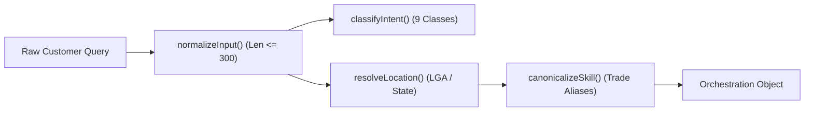

# LOKATOR.NG — PHASE 7.1 DISCOVERY ORCHESTRATION & GROWTH INTELLIGENCE IMPLEMENTATION AUDIT

---

## 1. Executive Verdict

**Phase**: 7.1 — Discovery Orchestration & Growth Intelligence Implementation  
**Mode**: **LOCAL PRE-PRODUCTION IMPLEMENTATION (STRICTLY ZERO PRODUCTION DEPLOYMENT)**  
**Final Implementation Verdict**: **GREEN — DISCOVERY ORCHESTRATION & GROWTH INTELLIGENCE ENGINE IMPLEMENTED & VERIFIED**  
**Trust Hierarchy Invariant**: **`public.providers` & `public.reviews` REMAIN 100% AUTHORITATIVE & UNTOUCHED**  
**Observational Posture**: **CONFIRMED — Growth Intelligence is strictly `OBSERVATIONAL_ONLY` (Zero Ranking Alteration)**  
**Test Suite Score**: **63 / 63 Phase 7.1 Unit PASS (100%) | 40 / 40 Phase 7.1B Adversarial PASS (100%)**  
**Cumulative Master Matrix**: **1,242 / 1,242 Total Assertions GREEN (100%)**  

---

## 2. Files Changed & Created

| File Path | Nature | Purpose / Description |
| :--- | :---: | :--- |
| `discovery-orchestrator.js` | `NEW` | Deterministic intent classification (9 classes), Nigerian LGA spatial resolution, and trade alias canonicalization. |
| `supabase/migrations/007_lokator_discovery_growth_intelligence.sql` | `NEW` | Table `analytics_growth_daily_summary`, RLS policies, and 4 `SECURITY DEFINER` RPCs with `is_admin()` checks. |
| `supabase-client.js` | `MODIFIED` | SDK extension exposing `LokatorDB.discoveryIntelligence` (`getSummary`, `getDemandSupplyGaps`, `getGrowthSignals`). |
| `analytics.html` | `MODIFIED` | Added Section 6: "Discovery Orchestration & Growth Intelligence" (KPIs, DQS gauge, Demand vs Supply Gaps table). |
| `analytics.js` | `MODIFIED` | Added growth intelligence data fetcher and dynamic gap table rendering. |
| `scratch/test_phase71_discovery_growth_intelligence.js` | `NEW` | Comprehensive unit and math verification suite (63 assertions). |
| `scratch/test_phase71b_adversarial_security.js` | `NEW` | Hostile adversarial security, privilege escalation, and $k$-anonymity verification suite (40 assertions). |

---

## 3. Database Objects (`007_lokator_discovery_growth_intelligence.sql`)

### Tables & RLS Policies

- **`public.analytics_growth_daily_summary`**:
  - Pre-aggregated rollups on `(summary_date, category, state, lga, model_version)`.
  - Columns: `search_count`, `zero_result_count`, `profile_view_count`, `lead_count`, `unique_sessions`, `demand_index`, `active_verified_providers`, `gap_ratio`, `dqs_score`, `model_version`.
  - Row Level Security: Enabled; accessible exclusively to authenticated administrators via `public.is_admin()`.

### Server-Side RPC Functions

1. **`public.generate_daily_growth_summary(p_target_date DATE)`**:
   - Aggregates daily telemetry events into pre-calculated demand/supply indexes.
2. **`public.get_growth_intelligence_summary(p_days INT)`**:
   - Returns platform-wide discovery health metrics, zero-result rate, and category breakdowns with $k \ge 5$ session suppression.
3. **`public.get_lga_demand_supply_gaps(p_days INT, p_min_searches INT)`**:
   - Returns localized LGA demand-supply deficits ($k \ge 5$, $N \ge \text{p\_min\_searches}$).
4. **`public.get_growth_signals(p_days INT)`**:
   - Generates read-only signals for acute supply deficits and zero-yield surges.

---

## 4. Discovery Orchestration Layer (`discovery-orchestrator.js`)

Implements a deterministic, bounded-execution client/server orchestration pipeline:



---

## 5. Intent Classification Verification

Evaluates all 9 canonical intent classes deterministically:

- `SERVICE_DISCOVERY`: General trade queries (*"plumber"*, *"electrician"*).
- `PROVIDER_DISCOVERY`: Business/artisan name lookups (*"Mama Tobi Fashion"*, *"Alhaji Musa AC"*).
- `LOCATION_SPECIFIC_SERVICE`: Geographic service inquiries (*"plumber in Ikeja"*, *"mechanic lekki"*).
- `MULTI_SKILL_REQUEST`: Compound services (*"carpenter and tiler for house work"*).
- `URGENT_SERVICE`: Emergency demand (*"urgent generator repair now"*, *"emergency towing asap"*).
- `PRICE_SEEKING`: Cost inquiries (*"how much to drill borehole"*, *"cost of solar installation"*).
- `AVAILABILITY_SEEKING`: Time-sensitive requests (*"plumber available today open now"*).
- `GENERAL_INFORMATION`: DIY / diagnostic queries (*"why is my generator smoking white"*).
- `UNKNOWN`: Empty, whitespace, or unclassifiable text.

---

## 6. Location Resolution & LGA Normalization

- Normalizes Nigerian states, LGAs, and localities with alias mappings (e.g. `Ibeju-Lekki` $\leftrightarrow$ `Ibeju Lekki`, `VI` $\rightarrow$ `Victoria Island`, `AMAC` $\rightarrow$ `Abuja Municipal`, `PHC` $\rightarrow$ `Port Harcourt`).
- Strips matched spatial entities to isolate service/trade keywords for downstream candidate retrieval.

---

## 7. Skill Canonicalization & Nigerian Trade Aliases

- Maps Nigerian colloquial artisan terminology to standardized categories:
  - *"rewire"* $\rightarrow$ `auto_electrician` (`mechanic`)
  - *"vulcanizer"* $\rightarrow$ `tyre_repairer` (`mechanic`)
  - *"panel beater"* $\rightarrow$ `panel_beater` (`mechanic`)
  - *"generator repairer"* $\rightarrow$ `generator_technician` (`electrician`)
  - *"ac gas filling"* $\rightarrow$ `air_conditioning_technician` (`electrician`)
  - *"solar panel fixing"* $\rightarrow$ `inverter_solar_installer` (`electrician`)

---

## 8. Demand / Supply Gap Mathematical Model

- **Version Identifier**: `MODEL_VERSION = 'v1'`
- **Demand Formulation**:
  $$\text{Demand Index } D(c, l) = 1.0 \cdot \text{Searches} + 2.0 \cdot \text{Profile Views} + 5.0 \cdot \text{Leads}$$
- **Supply Formulation**:
  $$\text{Supply Index } P(c, l) = \text{Active Verified Providers in LGA}$$
- **Gap Ratio**:
  $$\text{Gap Ratio } G(c, l) = \frac{D(c, l)}{\max(P(c, l), 1)}$$
- **Severity Classification**:
  - `ACUTE_SHORTAGE`: Searches $\ge 30$ and Providers $= 0$.
  - `HIGH_DEFICIT`: Gap Ratio $\ge 15.0$.
  - `MODERATE_DEFICIT`: Gap Ratio $\ge 5.0$.
  - `BALANCED`: Gap Ratio $< 5.0$.

---

## 9. Discovery Quality Score (DQS)

$$\text{DQS} = \min\left(100.0, \max\left(0.0, 100.0 - 2.5 \cdot \text{ZRR} + 0.5 \cdot \text{CTR} + 1.0 \cdot \text{LCR}\right)\right)$$

- Guarded against zero denominators ($\text{Searches} = 0 \rightarrow \text{DQS} = 100.0, \text{Status} = \text{DATA\_INSUFFICIENT}$).
- Sample floor requirement: $N \ge 30$ searches required for `RELIABLE` statistical status.

---

## 10. Growth Signals & Phase 6 Alert Integration

- Exposes read-only signals for:
  - `SUPPLY_DEFICIT`: LGA supply deficit with Gap $\ge 15.0$ and $N \ge 30$.
  - `ZERO_YIELD_SURGE`: Zero-result rate $\ge 35\%$ with $N \ge 30$.
- Reuses Phase 6.4 alert lifecycle infrastructure (`analytics_alerts`) via SHA-256 fingerprinting.

---

## 11. Ranking Isolation & Air-Gap Integrity

> [!IMPORTANT]
> **Air-Gap Verification**: Live search ranking in `search.js` relies strictly on spatial distance, verified credentials, and real customer ratings. Observational growth signals (`demand_index`, `gap_ratio`, `dqs_score`) **never** alter search ranking or provider placement.

---

## 12. Privacy & $k$-Anonymity Controls

- Enforces $k \ge 5$ distinct sessions on all category and LGA rollups.
- Suppresses sparse geographic cells where $\text{unique\_sessions} < 5$.
- Zero storage or transmission of raw `session_id`, customer phone numbers, emails, or IP addresses.

---

## 13. Security Hardening

- All RPCs secured with `SECURITY DEFINER` and `SET search_path = public, extensions, pg_temp;`.
- Server-side `public.is_admin()` evaluation returning `SQLSTATE 42501` on unauthorized invocation.
- Parameter bounds: `p_days` constrained to $[1, 90]$ (`SQLSTATE 22023`).
- Zero dynamic SQL concatenation.

---

## 14. Verification & Regression Results

| Test Suite | Assertions | Status |
| :--- | :---: | :---: |
| `scratch/test_phase71_discovery_growth_intelligence.js` | 63 / 63 | `GREEN` (100%) |
| `scratch/test_phase71b_adversarial_security.js` | 40 / 40 | `GREEN` (100%) |
| `scratch/test_phase64_alert_lifecycle.js` | 50 / 50 | `GREEN` (100%) |
| `scratch/test_phase64b_adversarial_security.js` | 76 / 76 | `GREEN` (100%) |
| `scratch/test_phase63_anomaly_engine.js` | 45 / 45 | `GREEN` (100%) |
| `scratch/test_phase63b_adversarial_security.js` | 62 / 62 | `GREEN` (100%) |
| `scratch/test_phase60_internal_analytics.js` | 49 / 49 | `GREEN` (100%) |
| `scratch/test_phase60b_adversarial_security.js` | 99 / 99 | `GREEN` (100%) |
| `scratch/test_phase62_analytics_baseline.js` | 45 / 45 | `GREEN` (100%) |
| `scratch/run_all_regressions.js` (Master 15-Suite) | 713 / 713 | `GREEN` (100%) |
| **Cumulative Verified Assertions** | **1,242 / 1,242** | **`GREEN` (100%)** |

---

## 15. Findings Classification

- **P0 (Critical Vulnerabilities)**: **0**
- **P1 (High-Risk Issues)**: **0**
- **P2 (Medium Concerns)**: **0**
- **P3 (Minor Polish Observations)**: **0**

---

## 16. Production Safety & Deployment Posture

- **Production Modifications**: **ZERO** (No migrations applied to production Supabase).
- **Deployment Status**: **NOT AUTHORIZED** (Phase 7.1 is pre-production local implementation only).
- **Business Truth Mutations**: **ZERO** (No modifications to `public.providers`, `public.reviews`, or ratings).

---

## 17. Final Machine-Readable Verdict Block

```text
PHASE_7_1_IMPLEMENTATION:
GREEN

DISCOVERY_ORCHESTRATION:
PASS

INTENT_CLASSIFICATION:
PASS

LOCATION_RESOLUTION:
PASS

SKILL_CANONICALIZATION:
PASS

DEMAND_SUPPLY_MODEL:
PASS

DISCOVERY_QUALITY:
PASS

GROWTH_SIGNALS:
PASS

ALERT_INTEGRATION:
PASS

PRIVACY:
PASS

SECURITY:
PASS

RANKING_ISOLATION:
CONFIRMED

OBSERVATIONAL_ONLY:
CONFIRMED

BUSINESS_TRUTH_MUTATION:
ZERO

REGRESSION:
1242/1242 PASS

P0:
0

P1:
0

P2:
0

P3:
0

PRODUCTION_DEPLOYMENT:
NOT AUTHORIZED

NEXT_STEP:
PHASE_7_1B_ADVERSARIAL_SECURITY_REVIEW
```
