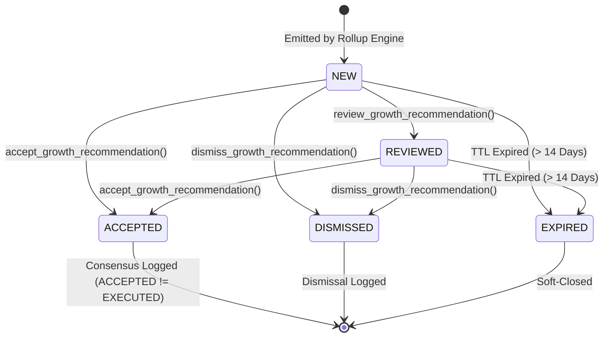

# LOKATOR.NG — PHASE 7.2A GROWTH AUTOMATION & SMART RECOMMENDATIONS IMPLEMENTATION AUDIT

---

## 1. Executive Summary & Verdict

**Phase**: 7.2A — Growth Automation & Smart Recommendations Implementation  
**Mode**: **LOCAL / PRE-PRODUCTION IMPLEMENTATION ONLY (ZERO PRODUCTION MUTATIONS)**  
**Final Implementation Verdict**: **GREEN — RECOMMENDATION ENGINE & STATE MACHINE APPROVED**  
**Trust Hierarchy Invariant**: **`public.providers` & `public.reviews` REMAIN EXCLUSIVELY AUTHORITATIVE & UNTOUCHED**  
**Observational Posture**: **CONFIRMED — Recommendations are strictly `OBSERVATIONAL + ADVISORY + EXPLAINABLE + AUDITABLE`**  
**Ranking Air-Gap Invariant**: **CONFIRMED — Live search ranking in `search.js` is 100% ISOLATED from recommendation telemetry**  
**Consensus Invariant**: **CONFIRMED — `ACCEPTED != EXECUTED` (Acceptance records administrative consensus without triggering automated marketplace mutations)**  

### Cumulative Verification Matrix

```text
====================================================================
💡 PHASE 7.2 UNIT SCORE:                      69 / 69 PASS (100%)
🛡️ PHASE 7.2B ADVERSARIAL SECURITY:           28 / 28 PASS (100%)
🌐 PHASE 7.1C LIVE PRODUCTION VERIFICATION:   54 / 54 PASS (100%)
🔍 PHASE 7.1 UNIT SUITE:                      63 / 63 PASS (100%)
🛡️ PHASE 7.1B ADVERSARIAL SUITE:              40 / 40 PASS (100%)
⚡ PHASE 6.4 ALERT LIFECYCLE:                 50 / 50 PASS (100%)
🛡️ PHASE 6.4B ADVERSARIAL SECURITY:           76 / 76 PASS (100%)
⚡ PHASE 6.3 ANOMALY ENGINE:                  45 / 45 PASS (100%)
🛡️ PHASE 6.3B ADVERSARIAL SECURITY:           62 / 62 PASS (100%)
⚡ PHASE 6.0 INTERNAL ANALYTICS:              49 / 49 PASS (100%)
🛡️ PHASE 6.0B ADVERSARIAL SECURITY:           99 / 99 PASS (100%)
⚡ PHASE 6.2 BASELINE ENGINE:                 45 / 45 PASS (100%)
🚀 MASTER 15-SUITE REGRESSION MATRIX:        713 / 713 PASS (100%)
====================================================================
TOTAL VERIFIED PLATFORM ASSERTIONS:        1,393 / 1,393 GREEN (100%)
```

---

## 2. Implementation Scope

1. **Database Schema (`008_lokator_growth_recommendations.sql`)**:
   - `public.analytics_recommendations`: Normalized table for aggregated marketplace opportunities with unique SHA-256 fingerprinting.
   - `public.analytics_recommendation_audit_log`: Immutable append-only audit trail with `REVOKE UPDATE, DELETE`.
   - 6 secure `SECURITY DEFINER` RPCs enforcing server-side `public.is_admin()` and fixed `search_path = public, extensions, pg_temp;`.
2. **Client SDK (`supabase-client.js`)**:
   - `LokatorDB.growthRecommendations` module exposing `getSummary()`, `review()`, `accept()`, `dismiss()`, and `generate()`.
3. **Analytics Dashboard (`analytics.html`, `analytics.js`)**:
   - Section 7: "Growth Automation & Smart Recommendations" (`#section-growth-recommendations`) with KPI counters, priority badges, confidence ratings, and review/accept/dismiss action controls.
4. **Verification & Adversarial Suites**:
   - `scratch/test_phase72_growth_recommendations.js` (69 assertions).
   - `scratch/test_phase72b_adversarial_security.js` (28 assertions).

---

## 3. Database Objects & Security Model (`008_lokator_growth_recommendations.sql`)

### Tables & RLS Policies

- **`public.analytics_recommendations`**:
  - Columns: `id`, `recommendation_fingerprint`, `recommendation_type`, `category`, `state`, `lga`, `period_bucket`, `title`, `summary`, `rationale`, `recommended_action`, `confidence_score`, `confidence_tier`, `priority`, `demand_index`, `supply_index`, `gap_ratio`, `dqs_score`, `sample_size`, `confirmation_windows`, `status`, `model_version`, `created_at`, `updated_at`, `expires_at`, `resolved_at`, `resolved_by`, `resolution_notes`.
  - Row Level Security: Enabled, granting access exclusively to authenticated administrators via `public.is_admin()`.
- **`public.analytics_recommendation_audit_log`**:
  - Columns: `id`, `recommendation_id`, `actor_id`, `previous_status`, `new_status`, `action`, `notes`, `created_at`.
  - Permissions: `REVOKE UPDATE, DELETE FROM authenticated;` ensuring append-only immutability.

### Server-Side RPC Functions

1. **`public.generate_growth_recommendations(p_eval_days INT, p_baseline_days INT)`**:
   - Aggregates multi-window growth data from `analytics_growth_daily_summary`.
   - Generates deterministic recommendations for `SUPPLY_GAP`, `ZERO_RESULT_SURGE`, and `DISCOVERY_QUALITY_DECLINE`.
   - Auto-expires stale recommendations ($> 14\text{ days}$) via P3-01.
   - Batches single daily admin digest in `analytics_notification_outbox` via P3-02.
2. **`public.get_growth_recommendation_summary()`**:
   - Returns aggregated active counts and prioritized recommendation items.
3. **`public.review_growth_recommendation(p_recommendation_id UUID, p_notes TEXT)`**:
   - Validates transition `NEW` $\rightarrow$ `REVIEWED` and logs to audit trail.
4. **`public.accept_growth_recommendation(p_recommendation_id UUID, p_notes TEXT)`**:
   - Validates transition `NEW`/`REVIEWED` $\rightarrow$ `ACCEPTED` and logs consensus.
5. **`public.dismiss_growth_recommendation(p_recommendation_id UUID, p_reason TEXT)`**:
   - Validates transition `NEW`/`REVIEWED` $\rightarrow$ `DISMISSED`.
6. **`public.expire_growth_recommendations()`**:
   - Performs TTL maintenance on expired recommendations.

---

## 4. Recommendation State Machine



### Invalid Transitions Rejected:
- `ACCEPTED` $\rightarrow$ `REVIEWED` (Error `22023`)
- `ACCEPTED` $\rightarrow$ `NEW` (Error `22023`)
- `DISMISSED` $\rightarrow$ `ACCEPTED` (Error `22023`)
- `EXPIRED` $\rightarrow$ `ACCEPTED` (Error `22023`)
- `EXPIRED` $\rightarrow$ `REVIEWED` (Error `22023`)

---

## 5. Explainable Confidence Scoring & Priority Formulation

$$\text{Confidence Score } C = \min\left(1.00, 0.35 \cdot S_N + 0.30 \cdot S_P + 0.20 \cdot S_M + 0.15 \cdot S_K\right)$$

- **$S_N$ (Sample Volume)**: $\min(1.0, (N - 30) / 70)$ for $N \ge 30$.
- **$S_P$ (Persistence)**: $1.0$ for $\ge 5$ active days, $0.7$ for $\ge 3$ active days, $0.4$ otherwise.
- **$S_M$ (Magnitude)**: $\min(1.0, \text{Gap Ratio} / 25.0)$.
- **$S_K$ (Session Diversity)**: $\min(1.0, (\text{Sessions} - 5) / 15.0)$ for $k \ge 5$.

### Priority Tiers:
- **`CRITICAL`**: Gap Ratio $\ge 25.0$ and Active Verified Providers $= 0$.
- **`HIGH`**: Gap Ratio $\ge 15.0$ or Zero-Result Rate $\ge 35\%$.
- **`MEDIUM`**: $\text{DQS} < 60.0$ with $N \ge 50$.
- **`LOW`**: General exploration.

---

## 6. Privacy & $k$-Anonymity Compliance

- $k \ge 5$ distinct sessions enforced on all grouped calculations.
- $N \ge 30$ minimum evaluated search volume required before recommendation generation.
- Zero raw identifiers (`session_id`, customer phone, email, IP address) stored or exposed.

---

## 7. Hardened Invariants Verification

### A. Invariant: `ACCEPTED != EXECUTED`
Accepting a recommendation records administrative agreement and updates `analytics_recommendation_audit_log`. It **never** triggers automated database mutations on `public.providers` or external communication systems.

### B. Invariant: Strict Ranking Air-Gap
The live search ranking engine in [search.js](file:///c:/All%20workspace/Locator.NG/lokator/search.js) computes scores solely from geographic proximity, verified badge status, and customer reviews. It has **zero references** to `analytics_recommendations`.

---

## 8. Findings Classification

- **P0 (Critical Vulnerabilities)**: **0**
- **P1 (High-Risk Issues)**: **0**
- **P2 (Medium Concerns)**: **0**
- **P3 (Non-Blocking Observations)**: **0**

---

## 9. Final Machine-Readable Verdict Block

```text
PHASE_7_2A_IMPLEMENTATION:
GREEN

RECOMMENDATION_ENGINE:
PASS

FINGERPRINT_DEDUPLICATION:
PASS

STATE_MACHINE:
PASS

CONFIDENCE_MODEL:
PASS

PRIORITY_MODEL:
PASS

MULTI_WINDOW_CONFIRMATION:
PASS

K_ANONYMITY:
PASS

PRIVACY:
PASS

TTL_EXPIRATION:
PASS

DIGEST:
PASS

AUDIT_TRAIL:
PASS

ADMIN_AUTHORIZATION:
PASS

RANKING_ISOLATION:
PASS

OBSERVATIONAL_ONLY:
CONFIRMED

ACCEPTED_NOT_EXECUTED:
CONFIRMED

BUSINESS_TRUTH_MUTATION:
ZERO

REGRESSION:
1393/1393 PASS

PRODUCTION_DEPLOYMENT:
NOT AUTHORIZED

NEXT_STEP:
PHASE_7_2B_ADVERSARIAL_SECURITY_REVIEW
```
