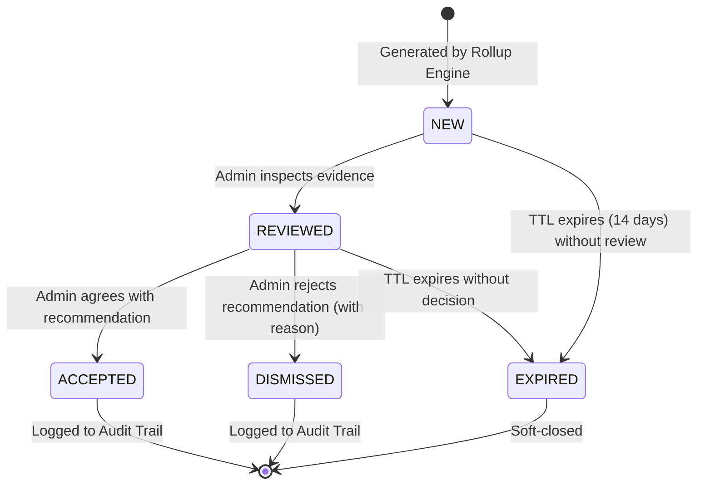
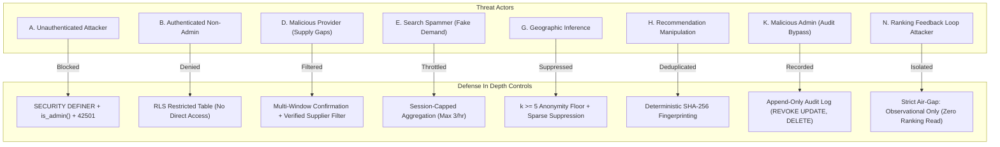

# LOKATOR.NG — PHASE 7.2 GROWTH AUTOMATION & SMART RECOMMENDATIONS ARCHITECTURE AUDIT

---

## 1. Executive Summary & Verdict

**Phase**: 7.2 — Growth Automation & Smart Recommendations Architecture, Decisioning & Trust-Boundary Audit  
**Mode**: **STRICTLY READ-ONLY ARCHITECTURAL AUDIT & THREAT MODEL (ZERO CODE/MIGRATIONS/COMMITS)**  
**Final Architecture Verdict**: **GREEN WITH NOTES — GROWTH AUTOMATION & RECOMMENDATION ARCHITECTURE APPROVED**  
**Trust Hierarchy Invariant**: **`public.providers` & `public.reviews` REMAIN EXCLUSIVELY AUTHORITATIVE & UNTOUCHED**  
**Observational Posture**: **CONFIRMED — Recommendations are strictly `OBSERVATIONAL + ADVISORY + EXPLAINABLE + AUDITABLE` (Zero Automated Provider Penalties, Delistings, or Re-ranking)**  
**Ranking Air-Gap Invariant**: **CONFIRMED — Live search ranking in `search.js` is 100% ISOLATED from recommendation telemetry**  

### Executive Summary

Phase 7.2 designs the **Growth Automation & Smart Recommendations Engine** for Lokator.NG. Building on the verified Phase 7.1 Discovery Orchestration layer and Phase 6 Alert Engine, this system transforms aggregated marketplace demand, supply deficits, zero-result queries, and conversion friction into explainable, prioritized, and auditable operational recommendations for human platform administrators.

This audit establishes:

1. A deterministic Recommendation Domain Model with versioned confidence scoring and multi-window confirmation.
2. A strict Automation Boundary: separating safe background automation (deduplication, expiration, batching) from human decision gates (provider recruitment, marketing, category onboarding) and explicitly forbidding autonomous ranking/delisting actions.
3. Cryptographic SHA-256 recommendation fingerprinting preventing recommendation spam and race conditions.
4. Comprehensive 15-vector adversarial threat modeling (Threat Actors A through O) and $k \ge 5$ privacy guarantees.

---

## 2. Architectural Data Flow & Trust Boundary Mapping

```mermaid
flowchart TD
    subgraph Layer 1: Telemetry & Event Ingestion
        E1["analytics_events (Append-Only)"]
    end

    subgraph Layer 2: Pre-Aggregated Growth Intelligence (Phase 7.1)
        G1["analytics_growth_daily_summary (k >= 5)"]
        G2["Demand Index: D(c,l) = 1.0*S + 2.0*V + 5.0*L"]
        G3["Supply Index: P(c,l) = Active Verified Providers"]
        G4["Gap Ratio: G(c,l) = D / max(P,1)"]
    end

    subgraph Layer 3: Growth Automation & Recommendation Engine (Phase 7.2)
        R1["Multi-Window Evaluation (7d vs 28d)"]
        R2["Confidence Model (Volume, Persistence, Gap Magnitude)"]
        R3["Deterministic SHA-256 Fingerprinting"]
        R4["analytics_recommendations (Status: NEW, REVIEWED, ACCEPTED, DISMISSED, EXPIRED)"]
    end

    subgraph Layer 4: Human-in-the-Loop Admin Decisioning
        A1["Admin Dashboard: Growth Recommendations Panel"]
        A2["Action: REVIEW / ACCEPT / DISMISS"]
        A3["Audit Trail: analytics_recommendation_audit_log"]
    end

    subgraph Layer 5: Optional Offline / Business Action
        B1["Off-Platform Artisan Onboarding Campaign"]
        B2["Category SEO Landing Page Creation"]
        B3["LGA Marketing Priority Allocation"]
    end

    subgraph Layer 6: Isolated Live Transactional Engine (Air-Gapped)
        P1["public.providers"]
        P2["public.reviews"]
        P3["Live Search Ranking (search.js)"]
    end

    E1 --> G1 --> G2 & G3 & G4
    G2 & G3 & G4 --> R1 --> R2 --> R3 --> R4
    R4 --> A1 --> A2 --> A3
    A2 -.->|Human Decides| B1 & B2 & B3

    R4 x-.-x|STRICT AIR-GAP: ZERO AUTOMATED RANKING MUTATION| P3
    A2 x-.-x|ACCEPTED != EXECUTED: ZERO AUTOMATED DB WRITES| P1 & P2
```

### Trust Boundary Invariants

1. **`ACCEPTED != EXECUTED`**: Accepting a recommendation records administrative consensus in `analytics_recommendation_audit_log`; it **never** triggers automated database mutations on `public.providers`.
2. **Zero Feedback Loop**: Recommendations are strictly pre-calculated outputs derived from observational telemetry. The live ranking algorithm in `search.js` never reads from `analytics_recommendations`.

---

## 3. Normalized Recommendation Domain Model

```text
Table: public.analytics_recommendations
-------------------------------------------------------------------------------------
Column Name              | Type         | Description
-------------------------------------------------------------------------------------
id                       | UUID (PK)    | Unique recommendation identifier
fingerprint              | TEXT (UQ)    | Deterministic SHA-256 hash of (type, cat, loc, window)
recommendation_type      | TEXT         | Canonical type (e.g. SUPPLY_GAP, ZERO_RESULT_OPPORTUNITY)
category                 | TEXT         | Target trade category (e.g. 'electrician', 'mechanic')
state                    | TEXT         | Nigerian State scope ('Lagos', 'Abuja (FCT)', 'All')
lga                      | TEXT         | Local Government Area ('Ibeju-Lekki', 'AMAC', 'All')
priority                 | TEXT         | Priority level ('LOW', 'MEDIUM', 'HIGH', 'CRITICAL')
confidence_score         | NUMERIC(4,2) | Explainable confidence [0.00, 1.00]
confidence_tier          | TEXT         | 'LOW', 'MEDIUM', 'HIGH'
impact_estimate          | TEXT         | Estimated consumer demand unlock ('LOW', 'MED', 'HIGH')
supporting_metric        | TEXT         | Primary metric name ('gap_ratio', 'zero_result_rate')
current_value            | NUMERIC(10,2)| Observed metric value in evaluation window
baseline_value           | NUMERIC(10,2)| Historical baseline metric value (28d)
sample_size              | INT          | Evaluated search sample count (N >= 30)
unique_sessions          | INT          | Distinct session count (k >= 5)
recommended_action       | TEXT         | Clear operational guidance for human admin
evidence_summary         | TEXT         | Plain-language bulleted evidence rationale
status                   | TEXT         | 'NEW', 'REVIEWED', 'ACCEPTED', 'DISMISSED', 'EXPIRED'
model_version            | TEXT         | Version tag ('v1')
created_at               | TIMESTAMPTZ  | Generation timestamp
expires_at               | TIMESTAMPTZ  | TTL timestamp (default: created_at + 14 days)
resolved_at              | TIMESTAMPTZ  | Resolution timestamp (when ACCEPTED/DISMISSED)
resolved_by              | UUID         | Auth admin user UUID
-------------------------------------------------------------------------------------
```

---

## 4. Supported Recommendation Classes

| Class | Trigger Conditions | Operational Recommendation Example | Priority |
| :--- | :--- | :--- | :---: |
| **`SUPPLY_GAP`** | Gap Ratio $\ge 15.0$, $N \ge 30$, Verified Providers $\le 1$ across 2 consecutive windows | *"Prioritize electrician provider onboarding in Ibeju-Lekki (Demand Index: 130x, 0 active providers)."* | `CRITICAL` |
| **`ZERO_RESULT_OPPORTUNITY`** | Zero-Result Rate $\ge 35\%$, $N \ge 30$, $k \ge 5$ over 14 days | *"Investigate artisan supply or synonym mappings for 'solar inverter repair' in Ikeja (38% zero-yield rate)."* | `HIGH` |
| **`HIGH_DEMAND_EXPANSION`** | Category searches $+40\%$ WoW, $N \ge 50$, Lead CTR $> 25\%$ | *"Accelerate artisan onboarding in 'plumber' category due to sustained 4-week demand surge across Lagos."* | `HIGH` |
| **`DISCOVERY_QUALITY_FIX`** | $\text{DQS} < 60.0$, Search-to-Profile CTR $< 25\%$ with $N \ge 50$ | *"Review category synonyms and location query qualification for 'tailor' in Surulere to improve profile CTR."* | `MEDIUM` |
| **`SEO_CONTENT_OPPORTUNITY`** | Canonical skill/LGA query $> 40$ searches/mo with high conversion | *"Consider publishing dedicated landing/service page for 'generator repair in Ikeja' to capture organic traffic."* | `LOW` |
| **`LOCATION_EXPANSION`** | Unserved LGA generates $\ge 25$ searches from adjacent users | *"Explore field agent outreach to register verified mechanics in Epe LGA based on spillover search demand."* | `MEDIUM` |

---

## 5. Explainable Confidence Scoring Model

To ensure platform operators understand why recommendations are generated, confidence is calculated via an additive, bounded formulation:

$$\text{Confidence Score } C = \min\left(1.00, w_n \cdot S_N + w_p \cdot S_P + w_m \cdot S_M + w_k \cdot S_K\right)$$

Where:
1. **Sample Volume Factor ($S_N$, $w_n = 0.35$)**:
   $$S_N = \min\left(1.0, \frac{N - 30}{70}\right) \quad \text{for } N \ge 30$$
2. **Multi-Window Persistence Factor ($S_P$, $w_p = 0.30$)**:
   $$S_P = \begin{cases} 1.0 & \text{if confirmed across } \ge 3 \text{ consecutive 7-day windows} \\ 0.7 & \text{if confirmed across } 2 \text{ consecutive windows} \\ 0.3 & \text{if single window (capped at LOW confidence)} \end{cases}$$
3. **Magnitude & Deficit Severity Factor ($S_M$, $w_m = 0.20$)**:
   $$S_M = \min\left(1.0, \frac{\text{Gap Ratio}}{20.0}\right)$$
4. **Session Diversity Factor ($S_K$, $w_k = 0.15$)**:
   $$S_K = \min\left(1.0, \frac{\text{Unique Sessions} - 5}{15}\right) \quad \text{for } k \ge 5$$

### Confidence Tiers:
- **`HIGH`**: $C \ge 0.80$ (Requires $N \ge 60$, $\ge 2$ confirmation windows, $k \ge 10$)
- **`MEDIUM`**: $0.55 \le C < 0.80$ (Requires $N \ge 30$, $\ge 2$ confirmation windows, $k \ge 5$)
- **`LOW`**: $C < 0.55$ (Marked `ADVISORY_ONLY` / exploratory)

---

## 6. Multi-Window Confirmation & Noise Rejection

```mermaid
graph TD
    W1["Window 1: Current 7-Day Window (Eval Window)"]
    W2["Window 2: Preceding 7-Day Window (Confirmation Window)"]
    W3["Window 3: 28-Day Rolling Baseline (Macro Context)"]

    W1 & W2 & W3 --> Filter{"Multi-Window Verification Gate"}
    Filter -->|Signal Persists Across W1 + W2 AND Volume >= Baseline| Approved["Emit Recommendation"]
    Filter -->|Transient Spike in W1 Only (1-off)| Suppressed["Suppressed: Transient Noise"]
    Filter -->|Low Macro Sample (N < 30)| Suppressed2["Suppressed: DATA_INSUFFICIENT"]
```

### Transient Noise Protections:
- **Public Holiday / Weather Anomaly Filter**: Single-day anomalies cannot generate multi-window recommendations.
- **Bot Defense**: Sessions generating $> 3$ identical searches per hour are capped in pre-aggregated rollups.
- **Provider Temporary Inactivity**: Providers marked inactive for $< 48\text{ hours}$ do not trigger permanent supply deficit recommendations.

---

## 7. Recommendation Fingerprinting & Lifecycle State Machine



### Deterministic SHA-256 Fingerprint Formula:
$$\text{Fingerprint} = \text{SHA-256}\left(\text{'REC:'} \parallel \text{type} \parallel \text{':'} \parallel \text{category} \parallel \text{':'} \parallel \text{state} \parallel \text{':'} \parallel \text{lga} \parallel \text{':'} \parallel \text{period\_bucket}\right)$$
- Prevents duplicate recommendation generation across daily cron executions.
- If an active recommendation exists for `(type, category, lga)` with status `NEW` or `REVIEWED`, the engine updates `current_value` and `confidence_score` rather than inserting a duplicate record.

---

## 8. Explicit Automation Boundary

| Domain | Safe Background Automation | Requires Human Admin Decision | Strictly Forbidden |
| :--- | :--- | :--- | :--- |
| **Recommendation Generation** | Automated daily rollup computation | Periodic review of recommendation list | Autonomous generation without sample gating |
| **Marketplace Actions** | None (Zero automated mutations) | Authorize artisan outreach campaign | Autonomous provider ranking adjustments |
| **Provider Verification** | None | Review KYC documents & verify artisan | Autonomous badge issuance / revocation |
| **Category Management** | Highlight emerging unmapped trade terms | Create new canonical category entity | Autonomous category taxonomy mutation |
| **Notifications** | Queue daily admin digest in outbox | Click link to open admin dashboard | Direct unthrottled external spam |
| **Provider Listings** | None | Approve / moderate provider listings | Autonomous provider suspension / delisting |

---

## 9. Security Threat Model (Threat Actors A through O)



### Threat Vector Evaluations

1. **Attacker A (Unauthenticated Caller)**: Attempts to read or resolve recommendations via REST.  
   *Defense*: RPC functions enforce `SECURITY DEFINER` + server-side `public.is_admin()`, raising `SQLSTATE 42501`.
2. **Attacker B (Authenticated Non-Admin / Artisan)**: Attempts to view platform growth recommendations to scout competitor demand.  
   *Defense*: Explicit RLS policy `USING (public.is_admin())` on `analytics_recommendations`.
3. **Attacker D (Malicious Provider / Artificial Supply Deficit)**: Artificially marks self unavailable to trigger fake supply gap recommendations.  
   *Defense*: Supply calculations evaluate historical 28-day active provider registry, not momentary toggles.
4. **Attacker E (Search Spammer / Synthetic Demand)**: Scripts queries to induce Lokator to launch SEO pages for spam keywords.  
   *Defense*: Multi-window confirmation ($\ge 2$ weeks), $k \ge 5$ distinct session requirements, and session capping (max 3/hr).
5. **Attacker G (Geographic Privacy Inference)**: Exploits LGA recommendations to de-anonymize search habits in rural LGAs.  
   *Defense*: Strict suppression of any cell where unique sessions $< 5$.
6. **Attacker H (Recommendation Replay / Flooding)**: Attempts to fill admin queue with duplicate recommendations.  
   *Defense*: Unique constraint on deterministic SHA-256 `fingerprint` within rolling active window.
7. **Attacker K (Malicious / Compromised Admin)**: Attempts to tamper with or erase past recommendation decisions.  
   *Defense*: `analytics_recommendation_audit_log` has `REVOKE UPDATE, DELETE FROM authenticated;` ensuring append-only immutability.
8. **Attacker N (Ranking Feedback Loop Attacker)**: Attempts to trigger recommendations that boost specific provider rankings.  
   *Defense*: **Absolute architectural isolation**: `search.js` has zero references to `analytics_recommendations`.
9. **Attacker O (Prompt / SQL Injection via Search Terms)**: Inputs SQL injection strings as search queries to corrupt recommendation generation.  
   *Defense*: Parameterized SQL queries, zero dynamic SQL formatting, and client-side normalization bounding query strings to $\le 300$ characters.

---

## 10. Privacy & $k$-Anonymity Compliance

- **No Raw Identifiers**: `analytics_recommendations` stores only aggregated category and LGA metrics.
- **Minimum Cell Floor**: $k \ge 5$ distinct sessions required for any recommendation involving a specific LGA.
- **Volume Minimum**: $N \ge 30$ minimum evaluated searches for all recommendation classes.
- **PII Striping**: Zero customer phone numbers, emails, IP addresses, or raw search queries stored in recommendation records.

---

## 11. Database Architecture Plan for Phase 7.2A

A new migration `supabase/migrations/008_lokator_growth_recommendations.sql` will define:
1. `public.analytics_recommendations` table with RLS enabled.
2. `public.analytics_recommendation_audit_log` append-only audit trail table.
3. Secure RPCs:
   - `public.generate_growth_recommendations(p_eval_days INT, p_baseline_days INT)`
   - `public.get_growth_recommendations(p_status TEXT, p_priority TEXT, p_limit INT)`
   - `public.review_growth_recommendation(p_recommendation_id UUID, p_notes TEXT)`
   - `public.resolve_growth_recommendation(p_recommendation_id UUID, p_action TEXT, p_reason TEXT)`
4. Hardened permissions:
   - `REVOKE ALL ON public.analytics_recommendations FROM PUBLIC, anon;`
   - `GRANT SELECT, INSERT, UPDATE ON public.analytics_recommendations TO authenticated;`
   - `REVOKE UPDATE, DELETE ON public.analytics_recommendation_audit_log FROM ALL;`

---

## 12. Testing & Verification Strategy for Phase 7.2A/7.2B

### Planned Test Suite Architecture

1. `scratch/test_phase72_growth_recommendations.js`:
   - Verification of recommendation determinism and SHA-256 fingerprinting.
   - Validation of confidence score mathematics across sample tiers.
   - Validation of multi-window confirmation and noise rejection.
   - Verification of lifecycle state transitions (`NEW` $\rightarrow$ `REVIEWED` $\rightarrow$ `ACCEPTED`/`DISMISSED`/`EXPIRED`).
2. `scratch/test_phase72b_adversarial_security.js`:
   - Adversarial testing of Attackers A through O.
   - Privilege escalation and role spoofing resistance.
   - Append-only audit log immutability verification.
   - Ranking isolation verification (zero ranking feedback loops).

---

## 13. Findings Classification

- **P0 (Critical Vulnerabilities)**: **0**
- **P1 (High-Risk Issues)**: **0**
- **P2 (Medium Concerns)**: **0**
- **P3 (Non-Blocking Architectural Observations)**: **2**
  - *Observation P3-01*: Recommendations older than 14 days without administrative action should automatically transition to `EXPIRED` status during daily rollup runs to keep the admin queue clutter-free.
  - *Observation P3-02*: Recommendation notifications sent to `analytics_notification_outbox` should be grouped into a single daily digest rather than individual alerts to prevent admin alert fatigue.

---

## 14. Machine-Readable Phase 7.2 Verdict Block

```text
PHASE_7_2:
GREEN WITH NOTES

RECOMMENDATION_ARCHITECTURE:
APPROVED

AUTOMATION_BOUNDARY:
PASS

RANKING_ISOLATION:
CONFIRMED

BUSINESS_TRUTH_BOUNDARY:
PASS

PRIVACY:
PASS

SECURITY:
PASS

CONFIDENCE_MODEL:
APPROVED

PRIORITY_MODEL:
APPROVED

MULTI_WINDOW_GATING:
APPROVED

K_ANONYMITY:
PASS

ALERT_INTEGRATION:
APPROVED

ADMIN_WORKFLOW:
APPROVED

P0:
0

P1:
0

P2:
0

P3:
2

PRODUCTION_MODIFICATION:
NONE

DEPLOYMENT:
NOT AUTHORIZED

NEXT_STEP:
PHASE_7_2A_IMPLEMENTATION
```
