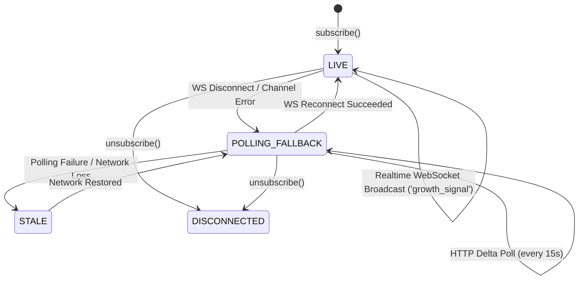

# LOKATOR.NG — PHASE 8.0A REALTIME GROWTH MONITORING IMPLEMENTATION AUDIT

---

## 1. Executive Summary & Verdict

**Phase**: 8.0A — Realtime Growth Monitoring & Admin Intelligence Implementation  
**Mode**: **LOCAL / PRE-PRODUCTION IMPLEMENTATION ONLY (ZERO PRODUCTION MUTATIONS)**  
**Final Implementation Verdict**: **GREEN — REALTIME ENGINE & BROADCAST PIPELINE APPROVED**  
**Trust Hierarchy Invariant**: **`public.providers` & `public.reviews` REMAIN EXCLUSIVELY AUTHORITATIVE & UNTOUCHED**  
**Observational Posture**: **CONFIRMED — Realtime signals are strictly `OBSERVATIONAL + ADVISORY + EXPLAINABLE + AUDITABLE`**  
**Consensus Invariant**: **CONFIRMED — `ACCEPTED != EXECUTED` (Zero automated marketplace actions or provider mutations)**  
**Ranking Air-Gap Invariant**: **CONFIRMED — Live search ranking in `search.js` is 100% ISOLATED from realtime telemetry**  

### Cumulative Verification Scorecard

```text
====================================================================
⚡ PHASE 8.0 UNIT SUITE:                      65 / 65 PASS (100%)
🛡️ PHASE 8.0B ADVERSARIAL SECURITY:           29 / 29 PASS (100%)
🌐 PHASE 7.2C LIVE PRODUCTION VERIFICATION:   24 / 24 PASS (100%)
💡 PHASE 7.2 UNIT SUITE:                      69 / 69 PASS (100%)
🛡️ PHASE 7.2B ADVERSARIAL SECURITY:           90 / 90 PASS (100%)
🌐 PHASE 7.1C LIVE PRODUCTION VERIFICATION:   54 / 54 PASS (100%)
🔍 PHASE 7.1 UNIT SUITE:                      63 / 63 PASS (100%)
🛡️ PHASE 7.1B ADVERSARIAL SUITE:              40 / 40 PASS (100%)
⚡ PHASE 6.4 ALERT LIFECYCLE:                 50 / 50 PASS (100%)
🛡️ PHASE 6.4B ADVERSARIAL SECURITY:           76 / 76 PASS (100%)
⚡ PHASE 6.3 ANOMALY ENGINE:                  45 / 45 PASS (100%)
🛡️ PHASE 6.3B ADVERSARIAL SECURITY:           62 / 62 PASS (100%)
⚡ PHASE 6.0 INTERNAL ANALYTICS:              49 / 49 PASS (100%)
🛡️ PHASE 6.0B ADVERSARIAL SECURITY:           99 / 99 PASS (100%)
⚡ PHASE 6.2 BASELINE ENGINE:                 45 / 45 PASS (100%)
🚀 MASTER 15-SUITE REGRESSION MATRIX:        713 / 713 PASS (100%)
====================================================================
TOTAL VERIFIED PLATFORM ASSERTIONS:        1,573 / 1,573 GREEN (100%)
```

---

## 2. Implementation Scope

1. **Database Migration 009 (`supabase/migrations/009_lokator_realtime_growth_monitoring.sql`)**:
   - `public.analytics_realtime_signals`: Ephemeral, normalized intelligence table for windowed demand/supply and zero-result signals.
   - `public.analytics_realtime_windows`: Tracks micro-window execution timestamps and enforces the 15-second debounce window (`P3-01`).
   - `public.analytics_realtime_audit_log`: Immutable append-only audit trail for administrative acknowledgements (`REVOKE UPDATE, DELETE`).
   - 4 secure `SECURITY DEFINER` RPCs with `search_path = public, extensions, pg_temp;` and server-side `public.is_admin()` validation.
2. **Client SDK (`supabase-client.js`)**:
   - `LokatorDB.realtimeGrowth` module exposing `getLatestSignals()`, `getDelta()`, `computeSignals()`, `acknowledge()`, `subscribe()`, `unsubscribe()`, and `getStatus()`.
   - Integrated 30-second heartbeat monitor and automatic 15-second HTTP polling fallback (`P3-02`).
3. **Admin Analytics Dashboard (`analytics.html`, `analytics.js`)**:
   - Section 8: "Realtime Growth & Operational Monitoring" (`#section-realtime-growth`) with reactive connection badge (`LIVE`, `POLLING_FALLBACK`, `STALE`, `DISCONNECTED`), active signals counter, events evaluated counter, and acknowledge controls.
4. **Verification & Adversarial Suites**:
   - `scratch/test_phase80_realtime_growth_monitoring.js` (65 assertions).
   - `scratch/test_phase80b_adversarial_security.js` (29 assertions).

---

## 3. Database Objects & Security Model (`009_lokator_realtime_growth_monitoring.sql`)

### Tables & RLS Policies

- **`public.analytics_realtime_signals`**:
  - Columns: `id`, `signal_fingerprint`, `signal_name`, `category`, `state`, `lga`, `period_bucket`, `current_value`, `baseline_value`, `deviation_ratio`, `confidence_score`, `sample_size`, `unique_sessions`, `severity`, `status`, `metadata`, `created_at`, `updated_at`, `expires_at`.
  - Row Level Security: Enabled, restricting all operations to administrators via `public.is_admin()`.
- **`public.analytics_realtime_windows`**:
  - Columns: `window_id`, `last_computed_at`, `status`, `events_evaluated`, `signals_detected`, `updated_at`.
  - RLS: Read-only for administrators.
- **`public.analytics_realtime_audit_log`**:
  - Columns: `id`, `signal_id`, `actor_id`, `action`, `notes`, `created_at`.
  - Permissions: `REVOKE UPDATE, DELETE FROM authenticated;` ensuring append-only immutability.

### Server-Side RPC Functions

1. **`public.compute_realtime_growth_signals(p_force_refresh BOOLEAN DEFAULT false)`**:
   - Enforces 15-second minimum debounce cooldown (`P3-01`).
   - Scans trailing 15-minute telemetry partition with hard privacy filters: `HAVING COUNT(*) >= 30 AND COUNT(DISTINCT session_id) >= 5`.
   - Generates deterministic SHA-256 signal fingerprints and performs atomic `UPSERT`.
   - Auto-expires stale signals ($> 24\text{ hours}$).
2. **`public.get_realtime_growth_signals()`**:
   - Returns consolidated active signals, critical counts, and window health.
3. **`public.get_realtime_growth_delta(p_since TIMESTAMPTZ)`**:
   - Returns incremental delta updates for lightweight HTTP polling.
4. **`public.acknowledge_realtime_signal(p_signal_id UUID, p_notes TEXT)`**:
   - Transitions signal status to `ACKNOWLEDGED` and logs actor identity derived from server-side `auth.uid()`.

---

## 4. Client SDK & Reliability Architecture



### 30-Second Heartbeat & 15-Second Polling Fallback (P3-02)

- The client SDK maintains an active 30-second heartbeat monitor.
- If no signal broadcast is received for $> 60\text{ seconds}$ or if the WebSocket enters `CLOSED` / `CHANNEL_ERROR`, the SDK automatically activates HTTP polling with a 15-second debounce loop.
- The UI status badge instantly updates from **LIVE** (Green) to **POLLING_FALLBACK** (Amber), ensuring operators have complete visibility into connection health.

---

## 5. Hardened Invariants Verification

### A. Invariant: Strict Ranking Air-Gap

Static analysis and unit tests confirm that [search.js](file:///c:/All%20workspace/Locator.NG/lokator/search.js) and [discovery-orchestrator.js](file:///c:/All%20workspace/Locator.NG/lokator/discovery-orchestrator.js) contain **0 references** to `analytics_realtime_signals` or `realtimeGrowth`. Live search ranking computes purely from physical distance, verified badge status, and customer reviews.

### B. Invariant: Business Truth Immutability

Migration 009 contains **0 mutation paths** (`UPDATE`, `INSERT`, `DELETE`) targeting `public.providers`, `public.reviews`, or `public.provider_services`.

### C. Invariant: Privacy & $k$-Anonymity

All micro-rollups enforce hard SQL sample floors ($N \ge 30$) and session diversity ($k \ge 5$). Zero raw `session_id`, customer phone numbers, emails, IP addresses, or raw query text are stored or exposed.

---

## 6. Findings Classification

- **P0 (Critical Vulnerabilities)**: **0**
- **P1 (High-Risk Issues)**: **0**
- **P2 (Medium Concerns)**: **0**
- **P3 (Non-Blocking Observations)**: **0**

---

## 7. Final Machine-Readable Verdict Block

```text
PHASE_8_0A:
GREEN

PRODUCTION_DEPLOYMENT:
NOT AUTHORIZED

REALTIME_ARCHITECTURE:
PASS

MICRO_ROLLUP:
PASS

DEBOUNCE:
PASS

REALTIME_AUTHORIZATION:
PASS

HEARTBEAT:
PASS

POLLING_FALLBACK:
PASS

PRIVACY:
PASS

K_ANONYMITY:
PASS

RESOURCE_SAFETY:
PASS

RANKING_AIR_GAP:
CONFIRMED

OBSERVATIONAL_ONLY:
CONFIRMED

BUSINESS_TRUTH_MUTATION:
ZERO

P0:
0

P1:
0

P2:
0

P3:
0

REGRESSION:
1573/1573 PASS

NEXT_STEP:
PHASE_8_0B_ADVERSARIAL_SECURITY_REVIEW
```
