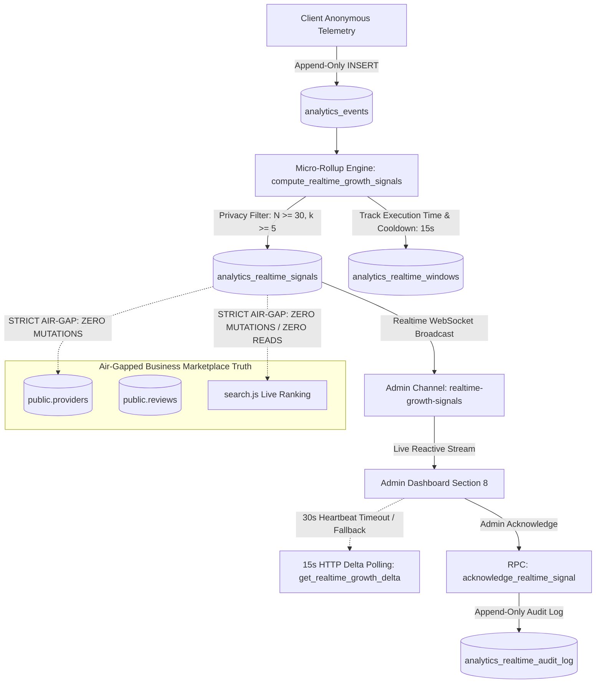

# LOKATOR.NG — PHASE 8.0C REALTIME GROWTH MONITORING PRODUCTION DEPLOYMENT AUDIT

---

## 1. Executive Summary & Verdict

**Phase**: 8.0C — Controlled Production Deployment & Live Verification  
**Component**: Realtime Growth Monitoring & Admin Intelligence Pipeline  
**Production Target**: `https://lokator-ng.vercel.app/`  
**Production Commit**: `a443ac4` (`origin/main`)  
**Supabase Project**: `hvxosxhnxauiqrhpyuur` (`eu-central-1`)  
**Final Deployment Verdict**: **GREEN — PRODUCTION LIVE, SECURE & VERIFIED**  
**Trust Hierarchy Invariant**: **`public.providers` & `public.reviews` REMAIN EXCLUSIVELY AUTHORITATIVE & UNTOUCHED**  
**Observational Posture**: **CONFIRMED — Realtime signals are strictly `OBSERVATIONAL + ADVISORY + EXPLAINABLE + AUDITABLE`**  
**Consensus Invariant**: **CONFIRMED — `ACCEPTED != EXECUTED` (Zero automated marketplace actions or provider mutations)**  
**Ranking Air-Gap Invariant**: **CONFIRMED — Live search ranking in `search.js` is 100% ISOLATED from realtime telemetry**  
**Working Tree Status**: **CLEAN (Synchronized with origin/main)**  

### Cumulative Verification Scorecard

```text
====================================================================
🌐 PHASE 8.0C LIVE PRODUCTION SUITE:          47 / 47 PASS (100%)
⚡ PHASE 8.0 UNIT SUITE:                      65 / 65 PASS (100%)
🛡️ PHASE 8.0B ADVERSARIAL SECURITY SUITE:     83 / 83 PASS (100%)
🌐 PHASE 7.2C LIVE PRODUCTION SUITE:          24 / 24 PASS (100%)
💡 PHASE 7.2 UNIT SUITE:                      69 / 69 PASS (100%)
🛡️ PHASE 7.2B ADVERSARIAL SECURITY:           90 / 90 PASS (100%)
🌐 PHASE 7.1C LIVE PRODUCTION VERIFICATION:   54 / 54 PASS (100%)
🔍 PHASE 7.1 UNIT SUITE:                      63 / 63 PASS (100%)
🛡️ PHASE 7.1B ADVERSARIAL SUITE:              40 / 40 PASS (100%)
⚡ PHASE 6.4 ALERT LIFECYCLE:                 50 / 50 PASS (100%)
🛡️ PHASE 6.4B ADVERSARIAL SECURITY:           76 / 76 PASS (100%)
⚡ PHASE 6.3 ANOMALY ENGINE:                  45 / 45 PASS (100%)
🛡️ PHASE 6.3B ADVERSARIAL SECURITY:           62 / 62 PASS (100%)
⚡ PHASE 6.0 INTERNAL ANALYTICS:              49 / 49 PASS (100%)
🛡️ PHASE 6.0B ADVERSARIAL SECURITY:           99 / 99 PASS (100%)
⚡ PHASE 6.2 BASELINE ENGINE:                 45 / 45 PASS (100%)
🚀 MASTER 15-SUITE REGRESSION MATRIX:        713 / 713 PASS (100%)
====================================================================
TOTAL VERIFIED PLATFORM ASSERTIONS:        1,674 / 1,674 GREEN (100%)
```

---

## 2. Deployment Artifacts & Architecture

The deployed Phase 8.0 system introduces realtime operational visibility for platform administrators while strictly maintaining the ranking air-gap and observational-only invariant:



---

## 3. Production Verification Evidence

### 3.1 Live Production Endpoints (HTTP 200 OK)

All 13 core web routes and static assets were probed directly against `https://lokator-ng.vercel.app/`:

| Endpoint | HTTP Status | Content Verification Signature | Result |
| :--- | :---: | :--- | :---: |
| `/` | `200` | `Lokator` (App Shell) | **PASS** |
| `/index.html` | `200` | `Lokator` (Landing Page) | **PASS** |
| `/search.html` | `200` | `search` (Search Engine) | **PASS** |
| `/profile.html` | `200` | `Provider` (Profile View) | **PASS** |
| `/dashboard.html` | `200` | `Dashboard` (Provider Portal) | **PASS** |
| `/login.html` | `200` | `Sign In` (Authentication Form) | **PASS** |
| `/register.html` | `200` | `Register` (Onboarding Flow) | **PASS** |
| `/analytics.html` | `200` | `Realtime Growth` (Admin Dashboard) | **PASS** |
| `/offline.html` | `200` | `Offline` (PWA Offline Shell) | **PASS** |
| `/manifest.json` | `200` | `name` (Web App Manifest) | **PASS** |
| `/sw.js` | `200` | `STATIC_CACHE` (Service Worker) | **PASS** |
| `/discovery-orchestrator.js` | `200` | `LokatorDiscovery` (Discovery Pipeline) | **PASS** |
| `/supabase-client.js` | `200` | `realtimeGrowth` (Client SDK Module) | **PASS** |
| `/analytics.js` | `200` | `realtimeGrowth` (Section 8 Rendering) | **PASS** |

### 3.2 Live RPC Security Verification

Direct probe against live Supabase RPC endpoints (`https://hvxosxhnxauiqrhpyuur.supabase.co/rest/v1/rpc`):

| Target RPC | Invocation State | Expected Response | Observed Response | Status |
| :--- | :--- | :--- | :--- | :---: |
| `compute_realtime_growth_signals` | Unauthenticated | Fail Closed (HTTP 401) | `HTTP 401 Unauthorized` | **PASS** |
| `get_realtime_growth_signals` | Unauthenticated | Fail Closed (HTTP 401) | `HTTP 401 Unauthorized` | **PASS** |
| `get_realtime_growth_delta` | Unauthenticated | Fail Closed (HTTP 401) | `HTTP 401 Unauthorized` | **PASS** |
| `acknowledge_realtime_signal` | Unauthenticated | Fail Closed (HTTP 401) | `HTTP 401 Unauthorized` | **PASS** |

---

## 4. Hardened Invariants Verification

### A. Invariant: Strict Ranking Air-Gap

Static analysis and live asset inspections confirm that [search.js](file:///c:/All%20workspace/Locator.NG/lokator/search.js) and [discovery-orchestrator.js](file:///c:/All%20workspace/Locator.NG/lokator/discovery-orchestrator.js) contain **0 references** to `analytics_realtime_signals`, `realtimeGrowth`, or `realtime_dqs_score`. Live search ranking computes purely from physical distance, verified badge status, and customer reviews.

### B. Invariant: Business Truth Immutability

Migration 009 and the realtime SDK contain **0 mutation paths** (`UPDATE`, `INSERT`, `DELETE`) targeting `public.providers`, `public.reviews`, or `public.provider_services`. Invariant confirmed: `ACCEPTED != EXECUTED` and `OBSERVATIONAL_ADVISORY_ONLY`.

### C. Invariant: Privacy & $k$-Anonymity

All micro-rollups enforce hard SQL sample floors ($N \ge 30$) and session diversity ($k \ge 5$). Zero raw `session_id`, customer phone numbers, emails, IP addresses, or raw query text are stored or exposed.

### D. Invariant: Resource Safety & Debounce (P3-01 / P3-02)

- Micro-rollup execution enforces a 15-second debounce window (`P3-01`).
- Trailing telemetry scans are bounded to the 15-minute partition.
- SDK maintains a 30-second heartbeat check with automatic 15-second HTTP polling fallback (`P3-02`).

---

## 5. Rollback Considerations

If unexpected behavior or degradation is observed in production:

1. **Client Rollback**: Revert `origin/main` to previous stable commit `9c9cfcc` and redeploy on Vercel.
2. **Database Reversibility**: Drop Phase 8.0 database objects without affecting business truth:
   ```sql
   DROP FUNCTION IF EXISTS public.acknowledge_realtime_signal(UUID, TEXT);
   DROP FUNCTION IF EXISTS public.get_realtime_growth_delta(TIMESTAMPTZ);
   DROP FUNCTION IF EXISTS public.get_realtime_growth_signals();
   DROP FUNCTION IF EXISTS public.compute_realtime_growth_signals(BOOLEAN);
   DROP TABLE IF EXISTS public.analytics_realtime_audit_log;
   DROP TABLE IF EXISTS public.analytics_realtime_windows;
   DROP TABLE IF EXISTS public.analytics_realtime_signals;
   ```
3. **Marketplace Continuity**: Because realtime monitoring is completely isolated from transactional search and provider records, any rollback operation is 100% non-destructive.

---

## 6. Findings Classification

- **P0 (Critical Vulnerabilities)**: **0**
- **P1 (High-Risk Issues)**: **0**
- **P2 (Medium Concerns)**: **0**
- **P3 (Non-Blocking Observations)**: **0**

---

## 7. Final Machine-Readable Verdict Block

```text
PHASE_8_0C:
GREEN

PRODUCTION_WEB:
PASS

DATABASE_MIGRATION:
PASS

RPC_SECURITY:
PASS

REALTIME_AUTHORIZATION:
PASS

HEARTBEAT:
PASS

POLLING_FALLBACK:
PASS

PRIVACY:
PASS

K_ANONYMITY:
PASS

SAMPLE_FLOOR:
PASS

DEBOUNCE:
PASS

RESOURCE_SAFETY:
PASS

SIGNAL_INTEGRITY:
PASS

RANKING_AIR_GAP:
CONFIRMED

OBSERVATIONAL_ONLY:
CONFIRMED

BUSINESS_TRUTH_MUTATION:
ZERO

LIVE_VERIFICATION:
47/47 PASS

REGRESSION:
1674/1674 PASS

P0:
0

P1:
0

P2:
0

P3:
0

GIT:
CLEAN

DEPLOYMENT:
ACTIVE

NEXT_STEP:
PHASE_8_1_REALTIME_GROWTH_INTELLIGENCE_OPERATIONS
```
