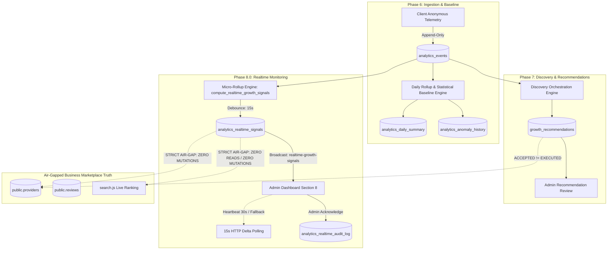
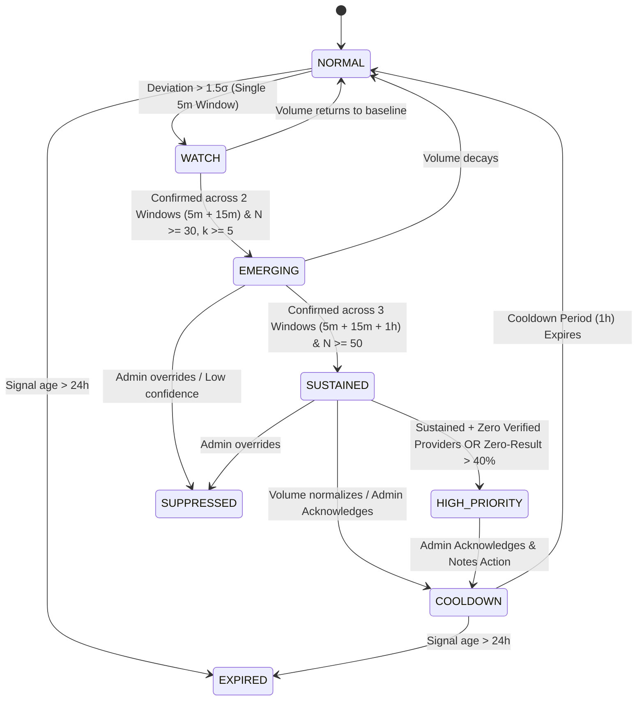
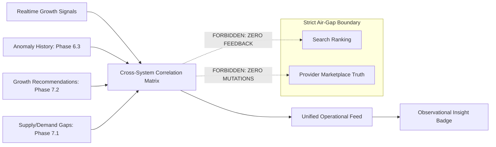

# LOKATOR.NG — PHASE 8.1 REALTIME GROWTH INTELLIGENCE OPERATIONS ARCHITECTURE & THREAT-MODEL AUDIT

---

## 1. Executive Summary & Verdict

**Phase**: 8.1 — Realtime Growth Intelligence Operations Architecture & Threat-Model Audit  
**Mode**: **STRICTLY READ-ONLY ARCHITECTURAL & SECURITY AUDIT (ZERO PRODUCTION MUTATIONS)**  
**Architecture Verdict**: **GREEN WITH NOTES — OPERATIONAL INTELLIGENCE MODEL APPROVED**  
**Trust Hierarchy Invariant**: **`public.providers` & `public.reviews` REMAIN EXCLUSIVELY AUTHORITATIVE & UNTOUCHED**  
**Observational Posture**: **CONFIRMED — Operational signals are strictly `OBSERVATIONAL + ADVISORY + EXPLAINABLE + AUDITABLE`**  
**Consensus Invariant**: **CONFIRMED — `ACCEPTED != EXECUTED` (Zero automated marketplace actions or provider mutations)**  
**Ranking Air-Gap Invariant**: **CONFIRMED — Live search ranking in `search.js` is 100% ISOLATED from operational signals**  
**Production Deployment**: **STRICTLY NOT AUTHORIZED (Awaiting Phase 8.1A Implementation, 8.1B Review, 8.1C Verification)**  

### Findings Classification Summary

- **P0 (Critical Vulnerabilities)**: **0**
- **P1 (High-Risk Issues)**: **0**
- **P2 (Medium Concerns)**: **0**
- **P3 (Non-Blocking Architectural Observations)**: **2**
  - **P3-01**: Multi-window correlation queries must leverage existing temporal indexes (`created_at DESC`, `summary_date DESC`) to ensure constant-time aggregation as historical telemetry scales.
  - **P3-02**: The admin explanation UI should explicitly render the mathematical privacy floor ($N \ge 30, k \ge 5$) so operators understand why low-density cells are suppressed.

---

## 2. Current Architecture & Verified Baseline

Lokator.NG operates with an established, production-verified 8-phase architecture:

```text
========================================================================================
CURRENT PRODUCTION STATUS: PHASE 8.0C ACTIVE & VERIFIED GREEN
Production URL: https://lokator-ng.vercel.app/ | Supabase: hvxosxhnxauiqrhpyuur
Master Regression Baseline: 1,674 / 1,674 ASSERTIONS GREEN (100% across 17 test suites)
========================================================================================
```



---

## 3. Phase 8.0 Integration & Operational Gap Analysis

While Phase 8.0 established low-latency signal extraction, 15-second debounce, 30-second heartbeat monitoring, and Supabase Realtime broadcast channels, platform administrators face operational challenges:

1. **Transient vs. Sustained Disambiguation**: A single 5-minute surge may be a temporary blip rather than structural demand growth.
2. **Alert Fatigue**: Raw realtime signals emit for every qualified threshold breach, requiring operator deduplication.
3. **Signal Explainability**: Operators need immediate, deterministic answers to: *"Why am I seeing this signal, what baseline is it compared against, and what sample volume backs it?"*
4. **Cross-System Context**: Realtime signals exist in isolation from weekly discovery supply deficits and anomaly history.

Phase 8.1 bridges these gaps by defining a **multi-window persistence state machine**, **deterministic explainability payloads**, and **cross-system observational correlation** without adding automated execution authority.

---

## 4. Deterministic Operational Intelligence Model

### 4.1 State Machine Specification

Operational intelligence states evolve deterministically across multi-window evaluations:



### 4.2 State Definitions

| State | Entry Criteria | Multi-Window Requirement | Action Required |
| :--- | :--- | :--- | :--- |
| **`NORMAL`** | Metrics within baseline ($\pm 1.5\sigma$) | Baseline 7-day / 28-day | None (Standard monitoring) |
| **`WATCH`** | Deviation $> +1.5\sigma$, $N \ge 30, k \ge 5$ | 1 window (5m) | Observational tracking; no admin interruption |
| **`EMERGING`** | Deviation $> +2.0\sigma$, $N \ge 30, k \ge 5$ | $\ge 2$ consecutive windows (5m + 15m) | Rendered in admin feed as growth trend |
| **`SUSTAINED`** | Deviation $> +2.5\sigma$, $N \ge 50, k \ge 8$ | $\ge 3$ consecutive windows (5m + 15m + 1h) | Highlighted in operational feed as market pressure |
| **`HIGH_PRIORITY`** | Sustained + Zero-Result $> 40\%$ OR 0 verified providers | $\ge 3$ windows + marketplace deficit | Escalated to top of dashboard with visual badge |
| **`COOLDOWN`** | Admin acknowledged OR metric dropped below $+1.5\sigma$ | Transition state | Suppresses duplicate alerts for 1 hour |
| **`SUPPRESSED`** | Explicit administrative dismissal or known event blip | Administrative provenance | Suppressed from active notification counter |
| **`EXPIRED`** | Signal timestamp older than 24 hours | Automatic chronological TTL | Cleaned up from active working memory |

---

## 5. Signal Persistence & Escalation Model

To prevent alert fatigue and filter out transient statistical noise, signals must satisfy strict multi-window persistence criteria before escalating:

```text
Escalation Invariant:
Transient (1x 5m)  --> WATCH         (No audible/visual disruption)
Emerging  (2x 15m) --> EMERGING      (Standard operational feed)
Sustained (3x 1h)  --> SUSTAINED     (High operational visibility)
Critical  (3x 1h + Deficit) --> HIGH_PRIORITY (Requires Admin Attention)
```

### Persistence Mathematical Formula

$$\text{Persistence Score } P = \sum_{w \in W} \omega_w \cdot \mathbb{I}(\text{deviation}_w \ge \theta_w)$$

Where:

- $W = \{ 5\text{m}, 15\text{m}, 1\text{h} \}$ with weights $\omega_{5\text{m}} = 0.2, \omega_{15\text{m}} = 0.3, \omega_{1\text{h}} = 0.5$.
- $\theta_w = 2.0\sigma$ threshold.
- A signal requires $P \ge 0.50$ for `EMERGING` and $P = 1.00$ for `SUSTAINED`.

---

## 6. Signal Explainability Model

Every operational signal generated in Phase 8.1 must carry a deterministic, human-readable explainability payload. No opaque AI decisions or black-box scores are permitted.

### Explainability Schema (`metadata.explanation`)

```json
{
  "summary": "Demand for Electrician in Ibeju-Lekki, Lagos increased by +185% over the 1-hour window.",
  "comparison": {
    "current_rate_per_hour": 82.0,
    "baseline_rate_per_hour": 28.5,
    "deviation_sigma": "+2.88σ",
    "baseline_window": "7-day rolling average"
  },
  "sample_evidence": {
    "sample_size_N": 82,
    "session_diversity_k": 19,
    "privacy_gate_satisfied": true
  },
  "contributing_factors": [
    "Zero-result search rate: 41.5% (34 searches)",
    "Direct contact conversion clicks: 0",
    "Active verified providers in LGA: 0"
  ],
  "persistence_evidence": {
    "windows_confirmed": ["5m", "15m", "1h"],
    "persistence_score": 1.0,
    "state": "HIGH_PRIORITY"
  },
  "operational_guidance": "ADMIN ATTENTION RECOMMENDED: High unmet customer search volume with zero local provider coverage in Ibeju-Lekki."
}
```

---

## 7. Cross-System Intelligence Correlation

Phase 8.1 correlates multi-source signals inside the operational layer without coupling them to execution:



### Correlation Rules

1. **Realtime Surge + Open Growth Recommendation**: When a realtime demand surge matches an existing `PENDING_ADMIN_REVIEW` recommendation, the operational UI displays an association tag: `MATCHES_REC_#UUID`.
2. **Realtime Surge + Historical Anomaly**: When a surge coincides with a statistical anomaly in Phase 6.3, it confirms operational significance.
3. **Observational Tagging**: Cross-system correlation outputs are strictly labeled `OBSERVATIONAL_ADVISORY_ONLY`.

---

## 8. Dashboard UX & Operator Workflow Architecture

### Safe Operator Actions

The administrative dashboard (`analytics.html` / `analytics.js`) allows only non-destructive, auditable operator actions:

1. **Acknowledge (`ACKNOWLEDGE`)**: Marks the signal as reviewed, transitions status to `ACKNOWLEDGED` and state to `COOLDOWN`, recording `auth.uid()` in `analytics_realtime_audit_log`.
2. **Inspect Evidence (`INSPECT`)**: Expands the explainability modal detailing baseline comparisons, sample sizes, and contributing metrics.
3. **Flag for Follow-up (`FLAG_FOLLOWUP`)**: Attaches an administrative note for review during business planning.
4. **Dismiss / Suppress (`DISMISS`)**: Suppresses noisy signals with mandatory reason logging.

**STRICT PROHIBITION**: The dashboard contains **zero** "Apply To Ranking", "Auto-Contact Providers", "Auto-Create Category", or "Auto-Delist" controls.

---

## 9. Resource & Cost Safety Controls

1. **Server-Side Debounce**: Preserves the 15-second compute cooldown (`P3-01`) on `compute_realtime_growth_signals()`.
2. **Bounded Telemetry Scans**: Scans remain bounded strictly to the trailing 15-minute raw partition. Multi-window historical aggregations query pre-aggregated rollups (`analytics_daily_summary`).
3. **Deterministic Memory Footprint**: Active signals in memory are capped at `LIMIT 50`.
4. **Controlled Polling Loop**: Client SDK retains the 30-second heartbeat check and 15-second HTTP polling fallback.

---

## 10. Privacy & Differential Security Controls

1. **Hard Sample Floors**: All operational signals strictly require $N \ge 30$ events and $k \ge 5$ distinct sessions.
2. **Differencing Attack Immunity**: Because sub-threshold cells emit 0 signals, an attacker cannot subtract window deltas to isolate single searchers.
3. **Zero Raw PII Exposure**: No `session_id`, `phone_number`, `email`, `ip_address`, or `query_text` is stored in operational records or rendered in the dashboard.

---

## 11. Security Architecture & RLS Model

1. **Privileged RPC Hardening**: All Phase 8.1 database functions enforce `SECURITY DEFINER` with fixed `search_path = public, extensions, pg_temp;`.
2. **Authoritative Authorization**: Server validates `public.is_admin()` against internal database tables. Client JWT claims and `user_metadata` are rejected.
3. **Append-Only Immutability**: Audit log permissions retain `REVOKE UPDATE, DELETE ON public.analytics_realtime_audit_log FROM authenticated;`.

---

## 12. Trust-Boundary Analysis

```text
+-----------------------------------------------------------------------------+
| UNTRUSTED EXTERNAL PERIMETER                                                |
| Anonymous Client Browsers -> Generates anonymous event telemetry           |
+-----------------------------------------------------------------------------+
                                      | (Append-only insert)
                                      v
+-----------------------------------------------------------------------------+
| INGESTION & ROLLUP BOUNDARY                                                 |
| public.analytics_events (N >= 30, k >= 5 privacy gating)                   |
+-----------------------------------------------------------------------------+
                                      | (Micro-rollup evaluation)
                                      v
+-----------------------------------------------------------------------------+
| OPERATIONAL INTELLIGENCE BOUNDARY                                           |
| public.analytics_realtime_signals (OBSERVATIONAL_ADVISORY_ONLY)             |
+-----------------------------------------------------------------------------+
                                      | (Admin broadcast / Delta poll)
                                      v
+-----------------------------------------------------------------------------+
| ADMINISTRATIVE DECISION BOUNDARY                                            |
| Admin Dashboard (ACKNOWLEDGE, INSPECT, FLAG_FOLLOWUP)                       |
| ACCEPTED != EXECUTED (Zero automated actions)                              |
+-----------------------------------------------------------------------------+
                                      |
                           [STRICT AIR-GAP ISOLATION]
                                      |
                                      X (ZERO MUTATIONS / ZERO READS)
                                      |
                                      v
+-----------------------------------------------------------------------------+
| AUTHORITATIVE BUSINESS TRUTH & SEARCH RANKING                               |
| public.providers, public.reviews, search.js (Completely Air-Gapped)         |
+-----------------------------------------------------------------------------+
```

---

## 13. Threat Model & Abuse Resistance (Threat Actors A through T)

| Actor ID | Threat Profile | Attack Path | Exploitability | Impact | Mitigation Strategy | Residual Risk |
| :--- | :--- | :--- | :---: | :---: | :--- | :---: |
| **Actor A** | Unauthenticated Scraper | Direct query to operational signals RPC | Low | Zero | Gated behind RLS and `public.is_admin()` (`SQLSTATE 42501`) | **None** |
| **Actor B** | Authenticated Non-Admin | Forge `role='admin'` in JWT | Low | Zero | Server verifies `public.is_admin()` against database tables | **None** |
| **Actor C** | Malicious Provider | Attempt to trigger artificial demand surge | Med | Low | $k \ge 5$ session floor + multi-window persistence suppresses burst | **Low** |
| **Actor D** | Rogue Administrator | Modify historical audit logs | Low | Zero | `REVOKE UPDATE, DELETE` enforces append-only immutability | **None** |
| **Actor E** | Compromised Admin Session | Acknowledge signals falsely | Med | Low | `auth.uid()` logs actor; `ACCEPTED != EXECUTED` prevents damage | **Low** |
| **Actor F** | Search Traffic Spammer | Flood single query to trigger signal | Med | Low | $k \ge 5$ session diversity requirement rejects single-session spam | **Low** |
| **Actor G** | Sparse LGA Differencer | Query deltas across micro-windows | Low | Zero | Sub-threshold cells ($N < 30$) produce 0 output | **None** |
| **Actor H** | Delta Timing Prober | Rapidly poll delta endpoints | Med | Low | Server-side 15-second debounce window throttles computation | **Low** |
| **Actor I** | Repeated-Query Attacker | Repeat identical searches | Med | Low | Aggregations count `DISTINCT session_id` | **Low** |
| **Actor J** | WebSocket Interceptor | Listen to Realtime broadcast stream | Low | Zero | Broadcast channel is gated to authenticated administrators | **None** |
| **Actor K** | Reconnect Storm Attacker | Force rapid WebSocket disconnects | Med | Low | Client SDK applies exponential backoff and fallback polling | **Low** |
| **Actor L** | Polling Abuse Attacker | Trigger rapid delta polls | Med | Low | Client SDK enforces 15-second polling interval timer | **Low** |
| **Actor M** | Signal Replay Attacker | Replay old signal payload | Low | Zero | SHA-256 fingerprint deduplication with period bucket | **None** |
| **Actor N** | Signal Parameter Injector | Send malformed LGA/category | Low | Zero | Deterministic parameter canonicalization and parameterized SQL | **None** |
| **Actor O** | Audit Provenance Forger | Pass spoofed `p_actor_id` | Low | Zero | RPC derives actor identity strictly from server-side `auth.uid()` | **None** |
| **Actor P** | SQL Injection Prober | Inject SQL in signal notes | Low | Zero | Parameterized SQL queries, zero dynamic SQL format execution | **None** |
| **Actor Q** | XSS / UI Injector | Inject script in explanation notes | Low | Zero | Safe DOM text rendering, zero `eval` or `Function` constructors | **None** |
| **Actor R** | Ranking Loop Manipulator | Attempt to boost provider rank via signal | Low | Zero | `search.js` has zero references to operational signals | **None** |
| **Actor S** | Recommendation Poisoner | Force fake recommendation state | Low | Zero | Operational signals and recommendations are observational | **None** |
| **Actor T** | DB Resource Exhauster | Trigger concurrent manual rollups | Med | Low | 15-second debounce cooldown window returns cached result | **Low** |

---

## 14. Failure Mode Analysis

| Failure Scenario | Immediate System Behavior | Fallback / Recovery Mechanism | Operational Safety |
| :--- | :--- | :--- | :---: |
| **WebSocket Disconnect** | Heartbeat timer exceeds 30s | Client transitions to 15s HTTP delta polling | **Safe** |
| **Supabase Outage** | RPC calls return network error | Dashboard displays cached last-known state | **Safe** |
| **Delayed Rollup Run** | Window status marks `DELAYED` | Signals retain latest computed timestamp; no fake data | **Safe** |
| **Small Sample (< 30)** | SQL filter suppresses row | Zero signal generated; sub-threshold status retained | **Safe** |
| **Low Diversity (< 5)** | SQL filter suppresses row | Privacy floor preserved; cell remains private | **Safe** |
| **Admin Token Expiry** | RPC returns `401 Unauthorized` | Dashboard redirects operator to login screen | **Safe** |
| **Browser Tab Sleep** | Timers throttle in background | On resume, SDK triggers single fresh delta poll | **Safe** |

---

## 15. Invariants & Guardrails Summary

1. **Observational Posture**: Operational intelligence provides advisory visibility for human administrators.
2. **Ranking Air-Gap**: Live search ranking in `search.js` is 100% isolated from realtime and operational signals.
3. **Business Truth Immutability**: `public.providers`, `public.reviews`, and `public.provider_services` cannot be modified by the intelligence engine.
4. **`ACCEPTED != EXECUTED`**: Administrative acknowledgement records review notes in `analytics_realtime_audit_log` without executing autonomous mutations.
5. **Differential Privacy Floor**: $N \ge 30$ sample size and $k \ge 5$ session diversity are hard prerequisites for signal emission.

---

## 16. Proposed Phase 8.1 Implementation Scope (Phase 8.1A Preview)

1. **Database Extension (`010_lokator_realtime_growth_operations.sql`)**:
   - Add operational state columns to `analytics_realtime_signals`: `operational_state`, `persistence_score`, `windows_confirmed`, `contributing_factors`.
   - Update `compute_realtime_growth_signals()` to compute multi-window persistence ($5\text{m}, 15\text{m}, 1\text{h}$) and populate explainability payloads.
   - Add RPC `get_realtime_operational_summary()` for consolidated admin intelligence.
2. **Client SDK Update (`supabase-client.js`)**:
   - Extend `LokatorDB.realtimeGrowth` with `getOperationalSummary()` and `flagFollowUp()`.
3. **Dashboard UX Update (`analytics.html`, `analytics.js`)**:
   - Enhance Section 8 with operational state badges (`EMERGING`, `SUSTAINED`, `HIGH_PRIORITY`), explainability modal, and cross-system correlation tags.
4. **Adversarial & Unit Verification Suites**:
   - Author `scratch/test_phase81_realtime_growth_operations.js` and `scratch/test_phase81b_adversarial_security.js`.

---

## 17. Final Machine-Readable Verdict Block

```text
PHASE_8_1:
GREEN WITH NOTES

OPERATIONAL_ARCHITECTURE:
APPROVED

STATE_MACHINE:
APPROVED

PERSISTENCE_MODEL:
APPROVED

EXPLAINABILITY_MODEL:
APPROVED

CROSS_SYSTEM_CORRELATION:
APPROVED

PRIVACY_SAFEGUARDS:
PASS

K_ANONYMITY:
PASS

SAMPLE_FLOOR:
PASS

RESOURCE_SAFETY:
PASS

DEBOUNCE_COOLDOWN:
PASS

RANKING_AIR_GAP:
CONFIRMED

OBSERVATIONAL_ONLY:
CONFIRMED

BUSINESS_TRUTH_MUTATION:
ZERO

ACCEPTED_NOT_EXECUTED:
CONFIRMED

P0:
0

P1:
0

P2:
0

P3:
2

REGRESSION:
1674/1674 PASS

PRODUCTION_DEPLOYMENT:
NOT AUTHORIZED

NEXT_STEP:
PHASE_8_1A_IMPLEMENTATION
```
