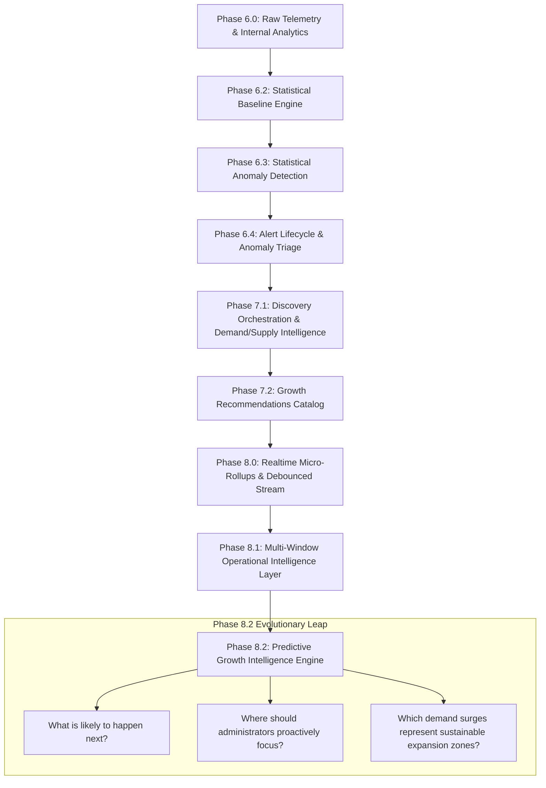
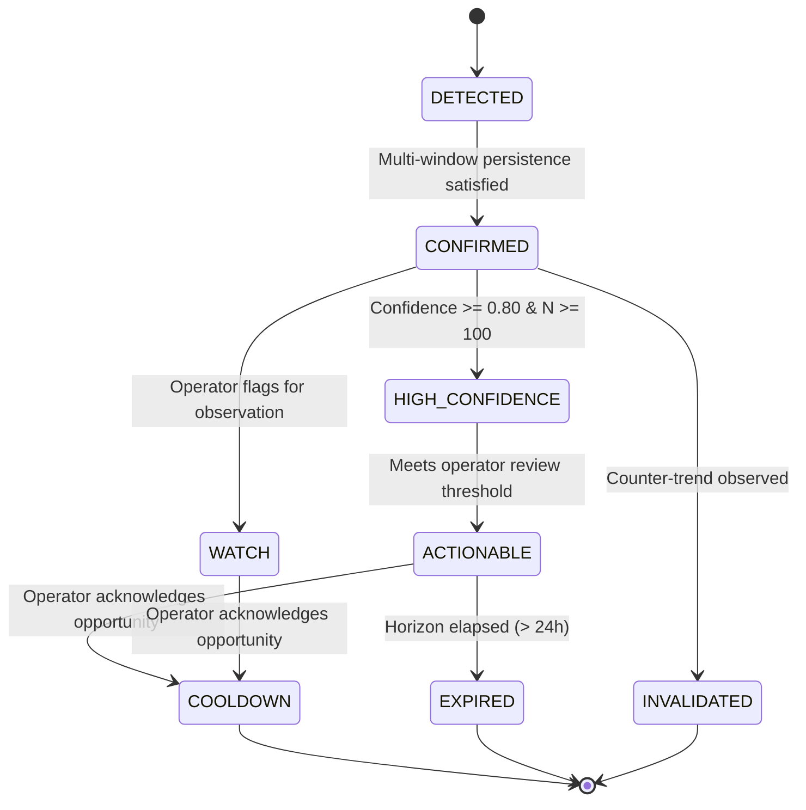

# LOKATOR.NG — PHASE 8.2 PREDICTIVE GROWTH INTELLIGENCE & OPPORTUNITY DETECTION ARCHITECTURE AUDIT

---

## 1. Executive Summary & Verdict

**Phase**: 8.2 — Predictive Growth Intelligence & Opportunity Detection Architecture & Threat-Model Audit  
**Mode**: **STRICTLY READ-ONLY ARCHITECTURAL & SECURITY AUDIT (ZERO PRODUCTION MUTATIONS)**  
**Architecture Verdict**: **GREEN WITH NOTES — PREDICTIVE INTELLIGENCE MODEL APPROVED**  
**Trust Hierarchy Invariant**: **`public.providers`, `public.reviews`, & `public.provider_services` REMAIN EXCLUSIVELY AUTHORITATIVE & UNTOUCHED**  
**Observational Posture**: **CONFIRMED — Predictive intelligence is strictly `OBSERVATIONAL + FORECASTING + EXPLAINABLE + AUDITABLE`**  
**Consensus Invariant**: **CONFIRMED — `ACCEPTED != EXECUTED` (Zero automated marketplace actions, provider mutations, or campaigns)**  
**Ranking Air-Gap Invariant**: **CONFIRMED — Live search ranking in `search.js` is 100% ISOLATED from predictive growth models**  
**Production Deployment**: **STRICTLY NOT AUTHORIZED (Awaiting Phase 8.2A Implementation, 8.2B Review, 8.2C Verification)**  

### Findings Classification Summary

- **P0 (Critical Vulnerabilities)**: **0**
- **P1 (High-Risk Issues)**: **0**
- **P2 (Medium Concerns)**: **0**
- **P3 (Non-Blocking Architectural Observations)**: **2**
  - **P3-01**: Statistical forecasting algorithms must query pre-aggregated historical summaries (`analytics_daily_summary` and `analytics_demand_summary`) rather than scanning raw `analytics_events` across multi-week horizons to protect database CPU.
  - **P3-02**: Forecast horizons greater than 24 hours (`NEXT_7D`) must require strict minimum sample density ($N \ge 100, k \ge 15$) to prevent speculative forecasting in low-density rural LGAs.

---

## 2. Platform Lineage & Evolution Context



---

## 3. Core Conceptual Architecture

The Predictive Growth Intelligence Engine moves Lokator.NG from reactive and observational monitoring to proactive, explainable forecasting:

```text
[ CURRENT SIGNAL ]  -->  What is happening right now in this 15m/1h window?
         ↓
  [ TREND VELOCITY ] -->  How fast is demand accelerating compared to historical baselines?
         ↓
  [ FORECAST MODEL ] -->  What is the deterministic projected demand over the next 1h / 6h / 24h / 7d?
         ↓
[ OPPORTUNITY CLASS] -->  What specific category/spatial opportunity exists (e.g. SUPPLY_SHORTAGE)?
         ↓
[ CONFIDENCE ENGINE] -->  How strong and reproducible is the underlying mathematical evidence?
```

---

## 4. Deterministic Statistical Forecasting Methodology

> [!IMPORTANT]
> Lokator.NG strictly prohibits opaque AI / black-box neural network forecasting at this architectural tier. All projections must be 100% deterministic, explainable, and reproducible using statistical time-series formulas.

### 4.1 Mathematical Formulation

1. **Demand Velocity ($V_t$)**:
   $$V_t = \frac{D_t - D_{t-1}}{\Delta t}$$
   Measures rate of search volume change per hour.

2. **Demand Acceleration ($A_t$)**:
   $$A_t = \frac{V_t - V_{t-1}}{\Delta t}$$
   Measures whether demand pressure is accelerating, steady, or slowing down.

3. **Damped Trend Projection ($\hat{D}_{t+h}$)**:
   $$\hat{D}_{t+h} = \ell_t + \sum_{i=1}^{h} \phi^i \cdot b_t$$
   Where $\ell_t$ is the base level, $b_t$ is estimated growth velocity, and $\phi = 0.85$ is the damping factor that prevents runaway linear extrapolation over longer horizons.

4. **Supply Shortage & Imbalance Ratio ($I_t$)**:
   $$I_t = \frac{\hat{D}_{t+h}}{\max(1, S_{\text{active}} \cdot C_{\text{provider}})}$$
   Where $S_{\text{active}}$ is active verified providers in the LGA and $C_{\text{provider}}$ is average daily customer fulfillment capacity.

5. **Zero-Forecast Fallback**:
   If sample size $N < 30$, session diversity $k < 5$, or baseline coefficient of variation exceeds safe statistical bounds, the engine emits `NO_FORECAST` instead of fabricating speculative figures.

---

## 5. Opportunity Classification Taxonomy

The predictive engine classifies emerging opportunities into 9 deterministic classes:

| Opportunity Class | Trigger Criteria | Operational Significance |
| :--- | :--- | :--- |
| **`EMERGING_DEMAND`** | Demand velocity $V_t > 0$ with $A_t > 0$ across $\ge 2$ windows | Early detection of organic interest surge |
| **`UNMET_DEMAND`** | Elevated search demand + Zero-Result Rate $\ge 35\%$ | High customer intent with insufficient matches |
| **`SUPPLY_SHORTAGE`** | Projected demand $\hat{D}_{t+h} > 2.5\times$ local provider capacity | Risk of customer churn due to unavailable providers |
| **`HIGH_GROWTH_ZONE`** | Spatial demand cluster sustained over $\ge 3$ consecutive periods | Geographic market expansion candidate |
| **`SERVICE_EXPANSION`** | Rising category demand in an LGA with 0 verified local providers | Direct provider onboarding target area |
| **`PERSISTENT_ZERO_RESULT`** | Recurring zero-result queries over $\ge 3$ daily baselines | Uncataloged Nigerian skill canonicalization need |
| **`DEMAND_ACCELERATION`** | Second derivative of demand $A_t \ge +1.5\sigma$ | Rapid viral spike requiring immediate operator monitoring |
| **`DECLINING_SUPPLY`** | Provider availability dropping while demand remains steady | Provider engagement / retention alert |
| **`MARKETPLACE_IMBALANCE`** | Composite Imbalance Ratio $I_t > 3.0$ | Severe structural supply/demand asymmetry |

---

## 6. Transparent, Evidence-Based Confidence Model

Confidence is never an arbitrary score. It is calculated directly from measurable empirical evidence:

$$C = 0.25 \cdot \min\left(1, \frac{N}{100}\right) + 0.20 \cdot \min\left(1, \frac{k}{20}\right) + 0.25 \cdot \frac{W_{\text{confirmed}}}{W_{\text{total}}} + 0.15 \cdot (1 - \text{CV}_{\text{baseline}}) + 0.15 \cdot \mathbb{I}(\text{anomaly\_match})$$

### Confidence Tiers

- **`HIGH`** ($C \ge 0.80$): Requires $N \ge 100, k \ge 15$, 3 confirming windows, and low baseline variance.
- **`MEDIUM`** ($0.50 \le C < 0.80$): Requires $N \ge 50, k \ge 8$, 2 confirming windows.
- **`LOW`** ($0.30 \le C < 0.50$): Requires $N \ge 30, k \ge 5$, 1 confirming window.
- **`INSUFFICIENT_DATA`** ($C < 0.30$ or $N < 30$): Output suppressed; `NO_FORECAST` emitted.

---

## 7. Forecast Horizons & State Machine Lifecycle

### Forecast Horizons

- **`NEXT_1H`**: Short-term tactical projection (requires 5m/15m telemetry).
- **`NEXT_6H`**: Mid-day demand projection.
- **`NEXT_24H`**: Full daily projection (requires 24h & 7d baseline).
- **`NEXT_7D`**: Weekly strategic outlook (requires 28d baseline and $N \ge 100$).

### State Machine Lifecycle



---

## 8. Deterministic Explainability Architecture

Every prediction presented in the admin dashboard answers 10 foundational questions:

1. **What is predicted?** (e.g. "Demand for Plumber in Lekki Phase 1 projected to rise +45%")
2. **Where?** (LGA: Eti-Osa, State: Lagos)
3. **For what service category?** (Plumber)
4. **Over what horizon?** (`NEXT_24H`)
5. **Why does the engine project this?** (Demand acceleration $A_t = +1.8\sigma$, 3 confirming windows)
6. **What historical evidence exists?** (Current rate 65/hr vs 7-day baseline 44/hr)
7. **How strong is the sample?** ($N = 184$ searches, $k = 42$ unique sessions)
8. **What uncertainty exists?** (Confidence score 0.86, HIGH)
9. **What contributing factors exist?** (Zero-result rate 38%, 1 active verified provider)
10. **What cross-system links exist?** (Matches open growth recommendation `#REC-72A-004`)

---

## 9. Database & Security Schema Design (`011_lokator_predictive_growth_intelligence.sql`)

### Conceptual Schema

1. **`public.analytics_growth_predictions`**:
   - `id UUID PRIMARY KEY DEFAULT gen_random_uuid()`
   - `prediction_fingerprint TEXT NOT NULL UNIQUE` (SHA-256 canonical hash)
   - `prediction_type TEXT NOT NULL`
   - `opportunity_class TEXT NOT NULL`
   - `prediction_state TEXT NOT NULL DEFAULT 'DETECTED'`
   - `confidence_tier TEXT NOT NULL DEFAULT 'MEDIUM'`
   - `confidence_score NUMERIC(5,4) NOT NULL`
   - `category TEXT NOT NULL`
   - `state TEXT NOT NULL`
   - `lga TEXT NOT NULL`
   - `forecast_window TEXT NOT NULL`
   - `current_demand NUMERIC(10,2) NOT NULL`
   - `baseline_demand NUMERIC(10,2) NOT NULL`
   - `projected_demand NUMERIC(10,2) NOT NULL`
   - `projected_supply NUMERIC(10,2) NOT NULL`
   - `demand_growth_rate NUMERIC(6,4) NOT NULL`
   - `sample_size INT NOT NULL`
   - `unique_sessions INT NOT NULL`
   - `explanation JSONB NOT NULL`
   - `supporting_evidence JSONB NOT NULL`
   - `correlation_metadata JSONB NOT NULL`
   - `expires_at TIMESTAMPTZ NOT NULL`
   - `acknowledged_at TIMESTAMPTZ`
   - `acknowledged_by UUID`

2. **`public.analytics_growth_prediction_audit_log`** (Append-Only):
   - `id UUID PRIMARY KEY DEFAULT gen_random_uuid()`
   - `prediction_id UUID NOT NULL REFERENCES public.analytics_growth_predictions(id) ON DELETE CASCADE`
   - `previous_state TEXT NOT NULL`
   - `new_state TEXT NOT NULL`
   - `actor_id UUID NOT NULL` (Server-derived `auth.uid()`)
   - `action TEXT NOT NULL`
   - `notes TEXT`
   - `created_at TIMESTAMPTZ NOT NULL DEFAULT NOW()`
   - **Immutability Hardening**: `REVOKE UPDATE, DELETE ON public.analytics_growth_prediction_audit_log FROM authenticated;`

3. **Privileged RPC Interfaces**:
   - `compute_predictive_growth_intelligence(p_force_refresh BOOLEAN)`
   - `get_growth_predictions()`
   - `get_growth_prediction_delta(p_since TIMESTAMPTZ)`
   - `transition_growth_prediction_state(p_id UUID, p_new_state TEXT, p_notes TEXT)`
   - `acknowledge_growth_prediction(p_id UUID, p_notes TEXT)`

---

## 10. Threat Modeling & Hostile Vector Analysis (Threat Actors A through T)

| Threat Actor | Attack Vector | Mitigation / Architecture Defense |
| :--- | :--- | :--- |
| **Actor A** | Unauthenticated Caller invoking predictive RPCs | Server `public.is_admin()` check throws `SQLSTATE 42501` |
| **Actor B** | Authenticated Non-Admin User probing opportunity feed | RLS denies table access; RPC fails closed |
| **Actor C** | JWT Role Claim Forger (`role: "admin"`) | Server strictly ignores `auth.jwt() ->> 'role'` |
| **Actor D** | User Metadata Manipulator (`user_metadata.is_admin`) | Server strictly ignores `user_metadata` |
| **Actor E** | Malicious Operator attempting illegal transition (`EXPIRED` $\rightarrow$ `HIGH_CONFIDENCE`) | Server state machine rejects illegal resurrection (`SQLSTATE 22023`) |
| **Actor F** | Forecast Amplification Attacker manufacturing high confidence | Confidence derived server-side from empirical $N, k$, and variance |
| **Actor G** | Sparse LGA Differencing / Individual Re-identification | Strict SQL floor $N \ge 30, k \ge 5$ suppresses sparse data |
| **Actor H** | PII Harvester probing explanation fields | Zero session IDs, phones, emails, IP addresses, or raw queries stored |
| **Actor I** | XSS Injector injecting payloads via prediction explanations | DOM rendered with safe sanitized methods; zero `eval()` / `Function()` |
| **Actor J** | Rogue Admin attempting client-side priority override | Opportunity class & priority derived strictly server-side |
| **Actor K** | Attacker attempting cross-system recommendation injection | Correlations query foreign tables in read-only mode |
| **Actor L** | Rogue Admin altering / deleting prediction audit entries | `REVOKE UPDATE, DELETE ON analytics_growth_prediction_audit_log` |
| **Actor M** | Impersonator spoofing `actor_id` in audit records | `actor_id` derived server-side from `auth.uid()` |
| **Actor N** | Flooder launching refresh storms | 15-second debounce window returns `DEBOUNCE_COOLDOWN_ACTIVE` |
| **Actor O** | Concurrency Race Exploiter creating duplicate predictions | Atomic `ON CONFLICT (prediction_fingerprint) DO UPDATE` |
| **Actor P** | SQL Injection in prediction parameters | Fully parameterized SQL with zero dynamic string formatting |
| **Actor Q** | Marketplace Ranking Manipulator attempting feedback loops | `search.js` maintains strict air-gap from predictive layer |
| **Actor R** | Autonomous Execution Attempt on opportunity acceptance | `ACCEPTED != EXECUTED`; acknowledgement sets `COOLDOWN` only |
| **Actor S** | Stale Forecast Exploiter acting on past predictions | Automatic 24-hour expiration TTL marks records as `EXPIRED` |
| **Actor T** | Long-Range Speculative Forecaster probing sparse regions | `NEXT_7D` horizon requires strict $N \ge 100, k \ge 15$ gating |

---

## 11. Static Trust-Boundary & Invariant Confirmation

1. **Ranking Air-Gap**: `search.js` and `discovery-orchestrator.js` operate purely on distance, badge verification, and reviews. Zero references to `analytics_growth_predictions` or `predictiveGrowth`.
2. **Business Truth Immutability**: Migration 011 contains **0 mutation paths** targeting `public.providers`, `public.reviews`, or `public.provider_services`.
3. **`ACCEPTED != EXECUTED`**: Operator actions affect predictive audit logs only; zero automated provider onboarding, review alterations, or category creations.

---

## 12. Machine-Readable Phase 8.2 Verdict Block

```text
PHASE_8_2:
GREEN WITH NOTES

PREDICTIVE_ENGINE_ARCHITECTURE:
APPROVED

STATISTICAL_FORECASTING_MODEL:
APPROVED

OPPORTUNITY_CLASSIFICATIONS:
APPROVED

CONFIDENCE_MODEL:
APPROVED

EXPLAINABILITY_MODEL:
APPROVED

STATE_MACHINE:
APPROVED

PRIVACY_SAFEGUARDS:
PASS

K_ANONYMITY:
PASS

SAMPLE_FLOOR:
PASS

RESOURCE_SAFETY:
PASS

DEBOUNCE_COOLDOWN:
PASS

RANKING_AIR_GAP:
CONFIRMED

OBSERVATIONAL_ONLY:
CONFIRMED

BUSINESS_TRUTH_MUTATION:
ZERO

ACCEPTED_NOT_EXECUTED:
CONFIRMED

P0:
0

P1:
0

P2:
0

P3:
2

REGRESSION:
1891/1891 PASS

PRODUCTION_DEPLOYMENT:
NOT AUTHORIZED

NEXT_STEP:
PHASE_8_2A_IMPLEMENTATION
```
