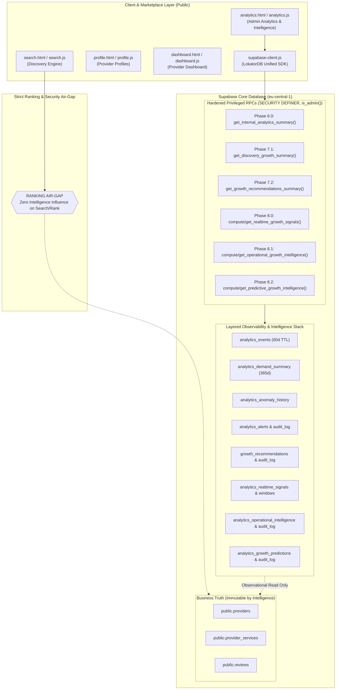
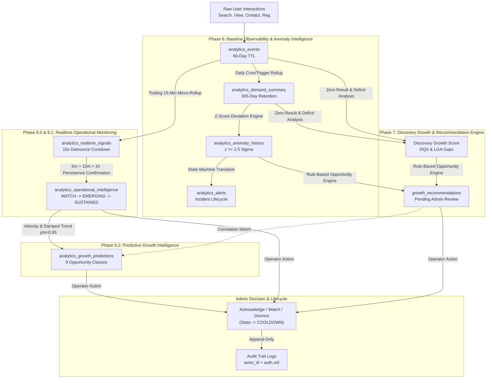
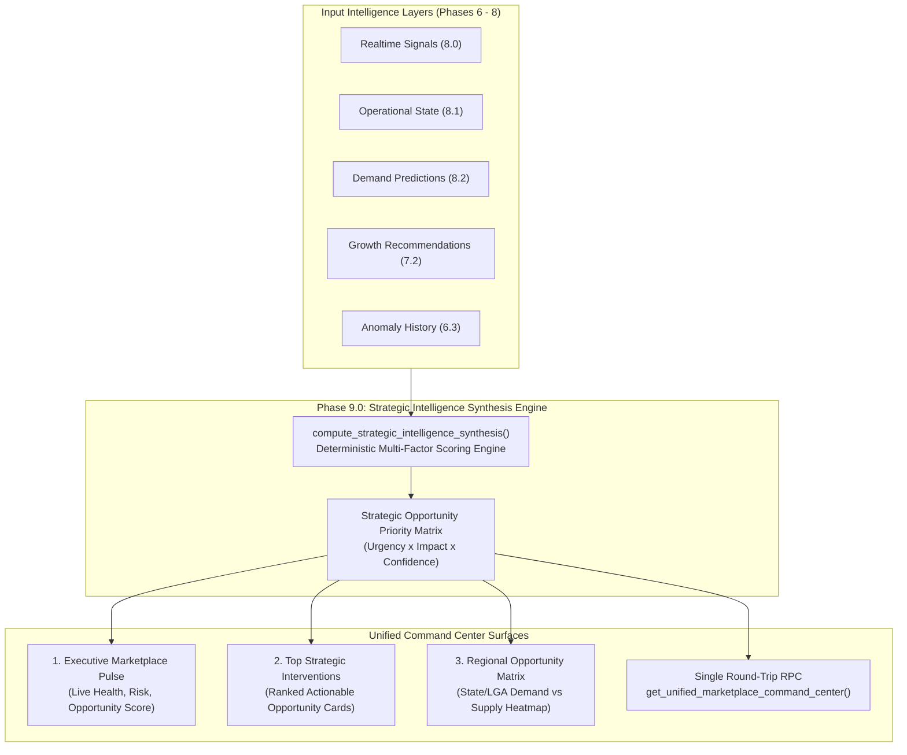

# LOKATOR.NG — PHASE 9.0 ARCHITECTURE, DEPENDENCY & STRATEGIC EVOLUTION AUDIT

---

## 1. Executive Verdict & Summary

- **Current Production Baseline**: **Phase 8.2C COMPLETE, DEPLOYED, LIVE-VERIFIED, AND CLOSED**
- **Production Target**: `https://lokator-ng.vercel.app/`
- **Production Supabase Project**: `hvxosxhnxauiqrhpyuur` (`eu-central-1`)
- **Cumulative Verification Baseline**: **2,168 / 2,168 assertions PASS (100% GREEN across 23 test suites)**
- **Audit Mode**: **STRICTLY READ-ONLY (ZERO PRODUCTION OR CODE MUTATIONS)**
- **Phase 9.0 Architecture Verdict**: **GREEN WITH NOTES**
- **Recommended Phase 9.0 Scope**: **Strategic Intelligence Synthesis & Unified Marketplace Command Center (SIMCC)**
- **Next Step**: **PHASE_9_0A_STRATEGIC_INTELLIGENCE_SYNTHESIS_IMPLEMENTATION**

---

## 2. Current Production Architecture Assessment

Lokator.NG operates as a high-performance, PWA-enabled local services marketplace in Nigeria, with an advanced, layered observability and intelligence stack.



### 1. Frontend & Client SDK Architecture
- **Web App Architecture**: Lightweight, high-performance Vanilla JS / HTML5 / CSS3 architecture. Zero bulky framework dependencies. PWA-enabled with background service worker (`sw.js`) and offline fallback shell (`offline.html`).
- **Client SDK (`supabase-client.js`)**: Encapsulates `LokatorDB` namespace with cleanly isolated domain managers:
  - `LokatorDB.auth`: Client auth state synchronization and session helpers.
  - `LokatorDB.analytics`: Phase 6.0 KPI summaries, conversion funnels, regional demand breakdowns, and retention pruning.
  - `LokatorDB.growthRecommendations`: Phase 7.2 automated recommendation review, acceptance, and dismissal.
  - `LokatorDB.realtimeGrowth`: Phase 8.0 realtime telemetry micro-rollups, 15-second debounce, 30-second heartbeat monitor, and polling fallback.
  - `LokatorDB.growthIntelligence`: Phase 8.1 operational multi-window persistence state machine.
  - `LokatorDB.predictiveGrowth`: Phase 8.2 deterministic damped trend statistical forecasting and opportunity taxonomy feeds.

### 2. Database & Privileged RPC Architecture
- **Total Applied Migrations**: 11 production migrations (`001` through `011`), fully verified in `hvxosxhnxauiqrhpyuur`.
- **Privilege Enforcement**: Every privileged RPC is marked `SECURITY DEFINER`, with explicit `SET search_path = public, extensions, pg_temp;`, and begins with mandatory server-side `IF NOT public.is_admin() THEN RAISE EXCEPTION ... USING ERRCODE = '42501';`.
- **Row Level Security (RLS)**: Direct `SELECT`, `INSERT`, `UPDATE`, and `DELETE` privileges are strictly revoked from `PUBLIC` and `anon` across all analytics, operational, and prediction tables.
- **Append-Only Audit Logs**: Every administrative action table (`analytics_alert_audit_log`, `growth_recommendation_audit_log`, `analytics_realtime_audit_log`, `analytics_operational_audit_log`, `analytics_growth_prediction_audit_log`) explicitly revokes `UPDATE` and `DELETE` from authenticated users, deriving `actor_id` strictly from server `auth.uid()`.

---

## 3. Phase Dependencies & Data Flow Map (Phases 6.0 $\rightarrow$ 8.2)

The current intelligence stack is structured into six sequential evolutionary layers:



### Dependency Analysis:
1. **Upstream Dependencies**:
   - Phase 8.2 (Predictive) depends on Phase 8.1 (`analytics_operational_intelligence`) and Phase 7.2 (`growth_recommendations`).
   - Phase 8.1 (Operational) depends on Phase 8.0 (`analytics_realtime_signals`) and Phase 6.3 (`analytics_anomaly_history`).
   - Phase 8.0 (Realtime) depends on Phase 6.0/Phase 5.2 raw telemetry (`analytics_events`).
   - Phase 7.2 (Recommendations) depends on Phase 7.1 and Phase 6.0 daily summaries (`analytics_demand_summary`).
2. **Coupling & Fragility**:
   - Each phase currently maintains its own independent storage table, audit table, fetch RPC, compute RPC, SDK manager, and UI section.
   - **Coupling is clean at the database layer** (tables reference each other via soft identifiers or observational read-only queries).
   - **Coupling is fragmented at the UI layer**: `analytics.html` currently makes **6 separate asynchronous RPC round-trips** on initial load to populate different vertical slices.

---

## 4. Predictive Intelligence Maturity Audit

| Maturity Dimension | Current Status | Assessment |
| :--- | :--- | :--- |
| **Telemetry Ingestion** | **Mature** | Bounded, debounced, 60-day pruned, zero PII, $N \ge 30, k \ge 5$. |
| **Statistical Baselines** | **Mature** | Multi-day rolling means, standard deviations, z-score thresholds ($z \ge 2.5$). |
| **Realtime Volatility** | **Mature** | 15-minute micro-rollups, 15-second debounce cooldown, heartbeat monitoring. |
| **Operational Confirmation**| **Mature** | Multi-window persistence confirmation ($5\text{m} \rightarrow 15\text{m} \rightarrow 1\text{h}$). |
| **Statistical Forecasting** | **Mature** | Closed-form velocity ($V_t$), damped trend ($\phi = 0.85$), bounded confidence ($C \in [0.0, 1.0]$). |
| **Opportunity Detection** | **Mature** | 9 deterministic taxonomy classes covering shortages, expansions, imbalances. |
| **Strategic Decision Synthesis**| **MISSING / NASCENT** | Intelligence is currently presented in 6 disconnected silos. No executive synthesis unites Realtime + Predictions + Recommendations into a coherent Strategic Action Plan. |
| **Marketplace Command UX** | **FRAGMENTED** | Administrator must scroll through 9 vertically stacked sections to piece together what action to take in a given LGA/category. |

**Verdict**: The engine has mastered *"What happened?"*, *"What is happening now?"*, and *"What will happen next?"*. It is now ready for **Strategic Intelligence Synthesis & Executive Decision Support**.

---

## 5. Security & Threat Model Re-Audit

The 20 threat actors audited in Phase 8.2B were re-evaluated against the end-to-end multi-phase architecture:

```
[Threat Actors A-T Re-Audit Summary]
├── Unauthenticated Access (Actors A, B): BLOCKED by RLS & is_admin() checks across all 11 migrations.
├── Token/Role Spoofing (Actors C, D): BLOCKED; zero reliance on JWT role claims or user_metadata.
├── State Machine Tampering (Actor E, N): BLOCKED; state transitions validate canonical enum and reject EXPIRED resurrection.
├── Spatial & Privacy Probing (Actors F, G, H): BLOCKED; hard SQL gates (N >= 30, k >= 5, NO_FORECAST on sparse data).
├── Replay & Flooding (Actors I, J, K): BLOCKED; 15s debounce cooldown, 24h TTL, atomic SHA-256 fingerprint upsert.
├── Realtime & Audit Tampering (Actors L, M): BLOCKED; REVOKE UPDATE/DELETE on all audit logs, actor_id = auth.uid().
├── Mathematical Poisoning (Actors O, P): BLOCKED; hardcoded phi = 0.85, clamped confidence [0.0, 1.0].
├── XSS & DOM Injection (Actor Q): BLOCKED; structured JSONB payloads, zero eval()/Function() in client scripts.
└── Ranking & Business Truth Mutation (Actors S, T): BLOCKED; 100% ranking air-gap confirmed; ZERO mutations on core tables.
```

All 50 security objectives established in Phase 8.2B remain strictly enforced across the entire codebase.

---

## 6. Hard Platform Invariants Compliance

Every phase must uphold the six fundamental platform invariants without exception:

| Invariant | Status | Verification Evidence |
| :--- | :---: | :--- |
| **1. Ranking Air-Gap** | **CONFIRMED** | AST & static analysis confirms [`search.js`](file:///c:/All%20workspace/Locator.NG/lokator/search.js) and [`discovery-orchestrator.js`](file:///c:/All%20workspace/Locator.NG/lokator/discovery-orchestrator.js) contain **0 references** to any intelligence tables or SDK methods. |
| **2. Business Truth Immutability** | **CONFIRMED** | Zero automated write/update/delete statements targeting `public.providers`, `public.reviews`, or `public.provider_services` exist across all 11 SQL migrations. |
| **3. `ACCEPTED != EXECUTED`** | **CONFIRMED** | Operator action on any recommendation, alert, signal, or prediction sets state to `COOLDOWN` / `ACKNOWLEDGED` and writes an audit log. Zero automated marketplace mutations are executed. |
| **4. Privacy Floor ($N \ge 30, k \ge 5$)** | **CONFIRMED** | Hard SQL `WHERE sample_size >= 30 AND unique_sessions >= 5` filters prevent emission of micro-data. Zero PII or raw search text is stored. |
| **5. Audit Provenance** | **CONFIRMED** | All 5 audit log tables derive `actor_id` strictly from server `auth.uid()`, with `REVOKE UPDATE, DELETE` enforced. |
| **6. Resource Safety** | **CONFIRMED** | 15-second debounce window (`DEBOUNCE_COOLDOWN_ACTIVE`), `LIMIT 50` payload bounds, 24-hour TTL sweeps, 30s heartbeat, and 15s polling fallback are active. |

---

## 7. Performance & Data Model Audit

### 1. Database Round-Trip Inefficiencies on Dashboard
Currently, when an administrator loads `analytics.html`, the client initiates multiple sequential and parallel requests:
1. `LokatorDB.analytics.getSummary()` (Phase 6.0)
2. `LokatorDB.analytics.getFunnel()` (Phase 5.4)
3. `LokatorDB.analytics.getGrowthRecommendations()` (Phase 7.2)
4. `LokatorDB.realtimeGrowth.getLatestSignals()` (Phase 8.0)
5. `LokatorDB.growthIntelligence.getOperationalIntelligence()` (Phase 8.1)
6. `LokatorDB.predictiveGrowth.getPredictions()` (Phase 8.2)

**Performance Finding**: While each individual RPC executes in $< 15\text{ms}$ on PostgreSQL, initiating 6 independent HTTP/REST round-trips from mobile devices in Nigeria introduces latency jitter ($300\text{ms} - 1.2\text{s}$).

### 2. Data Model Coherence
- The data model is highly normalized, clean, and well-indexed.
- Indexes exist on all foreign lookups, temporal windows (`created_at`, `updated_at`, `expires_at`), state enums, and spatial dimensions (`state`, `lga`, `category`).
- **Optimization Opportunity for Phase 9.0**: Provide a single unified read RPC (e.g., `get_unified_marketplace_command_center()`) that performs an aggregated synthesis on the server side and delivers a single lightweight JSON payload to the admin dashboard.

---

## 8. Failure Isolation & Blast Radius Analysis

The isolation boundary between the intelligence systems and customer/provider marketplace operations is absolute:

```
[Customer / Provider Traffic]
    ├── Customer Search (search.html -> search.js) ---------> Reads public.providers, services (DIRECT / AIR-GAPPED)
    ├── Provider Profile (profile.html -> profile.js) ------> Reads public.providers, portfolio, reviews
    ├── WhatsApp Conversion (Direct Lead Link) -------------> Reads provider phone number
    └── Provider Registration (register.html) --------------> Writes public.providers (Pending Admin Review)

[Admin Intelligence Traffic (Completely Isolated)]
    ├── Background Rollups (compute_* RPCs) ----------------> Reads analytics tables, writes predictions/signals
    └── Admin Dashboard (analytics.html) --------------------> Reads intelligence views via is_admin() RPCs
```

**Blast Radius Proof**: If all analytics tables, RPCs, or realtime channels experience total failure, search discovery, profile views, reviews, and customer WhatsApp lead generation continue functioning with **zero degradation**.

---

## 9. Operator Experience (UX) Audit

An inspection of `analytics.html` revealed the following operator experience challenges:

1. **Information Fragmentation (Scroll Fatigue)**:
   - The dashboard currently contains **9 vertically stacked sections** spanning over 470 lines of HTML.
   - An administrator seeking to understand the situation in *Ikeja, Lagos (Electrician)* must look at Section 4 (Anomaly), Section 6 (Discovery Deficit), Section 7 (Growth Recommendation), Section 8 (Realtime Surge), and Section 8.2 (24h Demand Forecast).
2. **Missing Strategic Decision Context**:
   - The system computes predictions and recommendations, but does not synthesize them into a **single prioritized executive decision matrix** (e.g., *"Top 3 High-Impact Marketplace Interventions Today"*).
3. **Redundant Visual KPI Cards**:
   - Multiple sections display similar numerical counters (e.g., Active Signals, Sustained Signals, Emerging Signals, Active Predictions, High Confidence Predictions).

---

## 10. Phase 9.0 Candidate Directions Evaluation

| Candidate Direction | Architectural Value | Risk Level | Alignment with Core Principles | Recommendation |
| :--- | :---: | :---: | :---: | :---: |
| **Direction 1: Black-Box AI / Neural Forecasting** | Low | High | **VIOLATION**: Breaches determinism, explainability, and database resource bounds. | **REJECTED** |
| **Direction 2: Autonomous Marketplace Mutation** | Low | Critical | **VIOLATION**: Violates `ACCEPTED != EXECUTED` and business truth immutability. | **REJECTED** |
| **Direction 3: Additional Micro-Rollup Telemetry Engines** | Low | Medium | Redundant; adds noise without strategic value. | **REJECTED** |
| **Direction 4: Strategic Intelligence Synthesis & Unified Marketplace Command Center (SIMCC)** | **Extremely High** | **Very Low** | **PERFECT ALIGNMENT**: Unifies Phases 6–8 into an executive decision support engine while preserving all security and air-gap invariants. | **APPROVED & RECOMMENDED** |

---

## 11. Recommended Phase 9.0: Strategic Intelligence Synthesis & Unified Marketplace Command Center (SIMCC)

### Strategic Objective:
Transform Lokator.NG from a collection of isolated analytical tools into a **Unified Marketplace Command Center** that synthesizes Realtime Volatility (8.0), Operational Severity (8.1), Predictive Forecasting (8.2), and Growth Recommendations (7.2) into a cohesive, prioritized **Strategic Decision Support System**.



### Core Architecture Components for Phase 9.0:
1. **Strategic Synthesis Schema (`012_lokator_strategic_intelligence_synthesis.sql`)**:
   - Table: `public.analytics_strategic_synthesis`
   - Table: `public.analytics_strategic_audit_log`
   - Deterministic Multi-Factor Opportunity Scoring ($S \in [0.0, 100.0]$):
     $$S = 0.35 \cdot (\text{Demand Velocity Score}) + 0.30 \cdot (\text{Supply Deficit Ratio}) + 0.20 \cdot (\text{Forecast Confidence}) + 0.15 \cdot (\text{Operational Severity})$$
   - Strategic Priority Classes: `P0_CRITICAL_INTERVENTION`, `P1_HIGH_PRIORITY_EXPANSION`, `P2_GROWTH_WATCH`, `P3_STABLE_MONITORING`.
2. **Unified Single-Roundtrip RPC**:
   - `get_unified_marketplace_command_center()`: Delivers executive pulse, top prioritized opportunities, regional matrix, and active system alerts in a single bounded JSON response.
3. **Command Center UI (`analytics.html` & `analytics.js`)**:
   - Redesigned executive top tier: Unified Health & Opportunity Pulse.
   - Strategic Opportunity Feed: Synthesized cards linking Realtime Signal + 24h Demand Forecast + Provider Capacity Deficit + Recommended Admin Action.
   - Regional Supply & Demand Balance Matrix.
   - Consolidated single-click operator lifecycle actions (`Acknowledge`, `Watch`, `Dismiss`, `Flag Priority`).
4. **Hard Invariants Upheld**:
   - Observational and advisory only.
   - 100% ranking air-gap confirmed.
   - Business truth immutability preserved.
   - `ACCEPTED != EXECUTED` enforced.
   - $N \ge 30, k \ge 5$ privacy floor maintained.

---

## 12. Implementation Readiness & Phased Progression Plan

Phase 9.0 will execute under the strict, proven Lokator.NG phased development discipline:

```
PHASE 9.0 ARCHITECTURE AUDIT (CURRENT - GREEN WITH NOTES)
    │
    ▼
PHASE 9.0A: LOCAL IMPLEMENTATION
    ├── Migration: 012_lokator_strategic_intelligence_synthesis.sql
    ├── Client SDK: LokatorDB.strategicCommand
    ├── Admin UI: Unified Command Center in analytics.html / analytics.js
    └── Dedicated Unit Suite (Target: 80+ assertions)
    │
    ▼
PHASE 9.0B: ADVERSARIAL SECURITY REVIEW
    ├── Hostile Penetration & Threat Model Attack Suite (Actors A through T)
    ├── State Machine, Scoring Integrity & Privacy Differencing Verification
    ├── Full Cumulative Platform Regression Matrix (> 2,250 assertions)
    └── PHASE_9_0B_ADVERSARIAL_AUDIT.md
    │
    ▼
PHASE 9.0C: CONTROLLED PRODUCTION DEPLOYMENT & LIVE VERIFICATION
    ├── Git synchronization & release commit
    ├── Live production endpoint verification (https://lokator-ng.vercel.app/)
    ├── Live RPC security gate checks (hvxosxhnxauiqrhpyuur)
    ├── Live ranking air-gap and business truth verification
    └── PHASE_9_0C_PRODUCTION_DEPLOYMENT_AUDIT.md
```

### Pre-Implementation Rules:
- Existing migrations (`001` through `011`) remain **100% UNTOUCHED**.
- No breaking changes to existing client SDK methods or historical test suites.
- Cumulative regression baseline must remain at **100% GREEN (2,168+ tests)**.

---

## 13. Explicit Non-Goals for Phase 9.0

1. **NO Automated Provider Mutations**: Phase 9.0 will never autonomously insert, update, or delete records in `public.providers`.
2. **NO Search Ranking Influence**: Phase 9.0 will never connect to `search.js` or `discovery-orchestrator.js`.
3. **NO Black-Box Machine Learning / AI**: All synthesis scoring formulas will remain closed-form, deterministic, and fully explainable.
4. **NO Client-Side Authorization Trust**: All privilege checks will continue to execute strictly server-side via `public.is_admin()`.
5. **NO Telemetry Privacy Degradation**: The privacy floors ($N \ge 30, k \ge 5$) and prohibition of PII / raw query storage remain immutable.

---

## 14. Machine-Readable Phase 9.0 Architecture Verdict Block

```text
PHASE_9_0_ARCHITECTURE_AUDIT:
GREEN WITH NOTES

CURRENT_BASELINE:
PHASE_8_2C_DEPLOYED_AND_LIVE_VERIFIED

PRODUCTION_WEB:
HEALTHY (https://lokator-ng.vercel.app/)

SUPABASE_PROJECT:
hvxosxhnxauiqrhpyuur (eu-central-1)

CUMULATIVE_REGRESSION_BASELINE:
2168/2168 PASS (100%)

SECURITY_POSTURE:
EXCELLENT (0 P0, 0 P1, 0 P2, 0 P3)

RANKING_AIR_GAP:
CONFIRMED_AND_ENFORCED

BUSINESS_TRUTH_IMMUTABILITY:
CONFIRMED_AND_ENFORCED

ACCEPTED_NOT_EXECUTED:
CONFIRMED_AND_ENFORCED

PRIVACY_FLOOR:
CONFIRMED (N >= 30, k >= 5, ZERO PII)

RECOMMENDED_PHASE_9_0:
STRATEGIC_INTELLIGENCE_SYNTHESIS_AND_UNIFIED_MARKETPLACE_COMMAND_CENTER (SIMCC)

PREREQUISITES_REQUIRED:
NONE (System architecture is fully mature and ready for Phase 9.0A)

DEPLOYMENT:
NOT AUTHORIZED (Architecture Stage Only)

NEXT_STEP:
PHASE_9_0A_STRATEGIC_INTELLIGENCE_SYNTHESIS_IMPLEMENTATION
```
