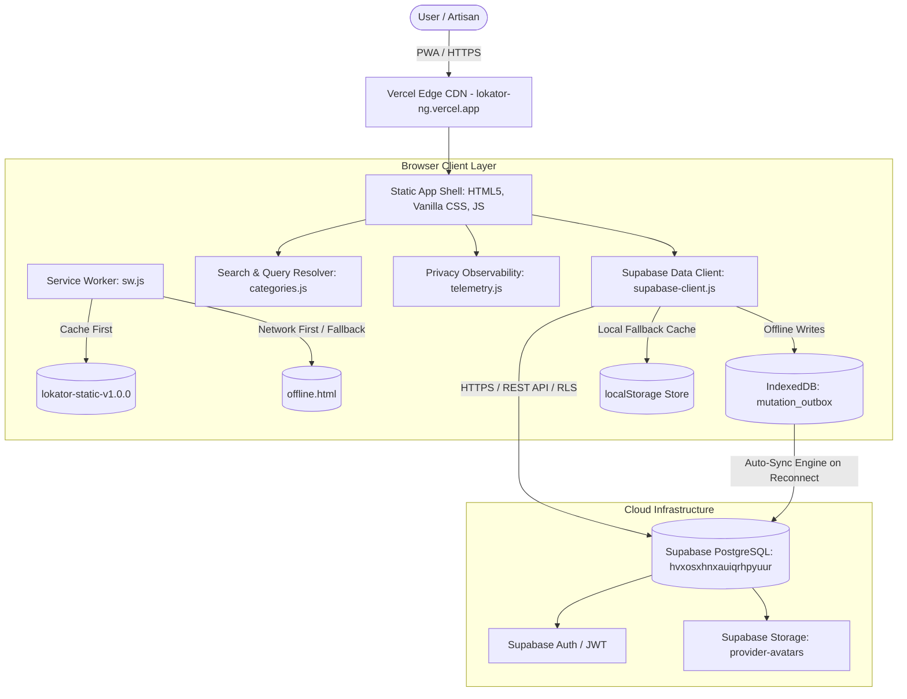

# LOKATOR.NG — PRODUCTION BASELINE 4.2 FREEZE
**OFFICIAL ARCHITECTURAL & DEPLOYMENT BASELINE**

---

## 1. Baseline Summary

| Baseline Metric | Verification State |
| :--- | :--- |
| **Git Commit** | `a9615dc` |
| **GitHub Remote** | `origin/main` synchronized at `a9615dc` (`https://github.com/qanatomy57-arch/Lokator.ng`) |
| **Live Production URL** | `https://lokator-ng.vercel.app/` |
| **PWA Installability** | **GREEN** |
| **Service Worker** | **GREEN** |
| **Offline-First Mode** | **GREEN** |
| **Live Production Search** | **16 / 16 PASS** |
| **Local Automated Regression** | **256 / 256 PASS (100% GREEN)** |
| **Search Intelligence Resolver** | **28 / 28 PASS** |
| **Critical User Journeys** | **4 / 4 PASS** |
| **Mobile Experience (5 Viewports)**| **GREEN** |
| **Desktop Experience (3 Viewports)**| **GREEN** |
| **Security & Data Isolation** | **ZERO REGRESSIONS** |
| **Supabase Health (`hvxosxhnxauiqrhpyuur`)** | **GREEN (Read-only verified, RLS active)** |
| **Browser Console Errors** | **ZERO ERRORS** |
| **Production Deployment** | **VERIFIED** |

---

## 2. System Architecture & Component Inventory

Lokator.NG operates as a high-performance, edge-hosted Progressive Web Application backed by a hardened PostgreSQL / Supabase data layer and an IndexedDB offline-first mutation outbox.



---

## 3. Core Production File Matrix

### 3.1 Entrypoint & View Templates (HTML)
- [`index.html`](file:///c:/All%20workspace/Locator.NG/lokator/index.html): Marketplace discovery home, 9-scene vertical hero animation, category carousel, and featured verified artisans.
- [`search.html`](file:///c:/All%20workspace/Locator.NG/lokator/search.html): Full-featured discovery engine with multi-skill search, geolocation distance filter, category pills, and responsive card grid.
- [`profile.html`](file:///c:/All%20workspace/Locator.NG/lokator/profile.html): Detailed artisan profile showcase with verified badges, portfolio lightbox, transparent pricing guide, 5-star review histogram, and WhatsApp/Call direct CTAs.
- [`register.html`](file:///c:/All%20workspace/Locator.NG/lokator/register.html): Artisan onboarding flow with multi-skill chip input, client-side content moderation, GPS coordinate picker, and profile photo compression upload.
- [`dashboard.html`](file:///c:/All%20workspace/Locator.NG/lokator/dashboard.html): Provider management portal with KPI performance counters, recent customer leads, working hours scheduler, and bottom mobile app navigation bar.
- [`login.html`](file:///c:/All%20workspace/Locator.NG/lokator/login.html): Authentication portal supporting email/password and one-click instant demo provider login.
- [`offline.html`](file:///c:/All%20workspace/Locator.NG/lokator/offline.html): Branded offline fallback screen with automated `window.addEventListener('online')` network restoration handler.

### 3.2 JavaScript Modules (Logic & State)
- [`categories.js`](file:///c:/All%20workspace/Locator.NG/lokator/categories.js): Centralized 15-category ontology, Nigerian colloquial synonyms, and conversational intent query resolver (`CategoryMap.resolveQuery`).
- [`supabase-client.js`](file:///c:/All%20workspace/Locator.NG/lokator/supabase-client.js): Core data access layer (`LokatorDB`), IndexedDB offline mutation outbox, sync engine, client-side image compression (`compressImage`), search query parser, and HTML escaping (`escapeHtml`).
- [`providers-data.js`](file:///c:/All%20workspace/Locator.NG/lokator/providers-data.js): Rich seed dataset of verified Nigerian service providers across Lagos, Abuja, Port Harcourt, Ibadan, Benin City, Enugu, Kano, and Warri.
- [`telemetry.js`](file:///c:/All%20workspace/Locator.NG/lokator/telemetry.js): Privacy-conscious client telemetry module with automatic PII stripping (`password`, `token`, `secret`, `jwt`, `nin`, `api_key`) and email address masking.
- [`sw.js`](file:///c:/All%20workspace/Locator.NG/lokator/sw.js): Progressive Web App service worker with versioned cache control (`lokator-static-v1.0.0`, `lokator-runtime-v1.0.0`) and strict security filters excluding `/auth/v1/` and private storage.
- [`app.js`](file:///c:/All%20workspace/Locator.NG/lokator/app.js): Homepage interaction controller, 9-scene hero vertical scroll coordinator, and category cards handler.
- [`search.js`](file:///c:/All%20workspace/Locator.NG/lokator/search.js): Real-time search controller, filter binding, and dynamic suggestions engine.
- [`profile.js`](file:///c:/All%20workspace/Locator.NG/lokator/profile.js): Profile page controller, portfolio filter/lightbox, review histogram calculator, and conversion event tracking.
- [`dashboard.js`](file:///c:/All%20workspace/Locator.NG/lokator/dashboard.js): Provider dashboard manager, profile editor, and leads renderer.

### 3.3 Style Sheets (CSS Design System)
- [`style.css`](file:///c:/All%20workspace/Locator.NG/lokator/style.css): Master design tokens (Lokator Deep Green `#006B3F`, Gold `#D4AF37`, Dark `#0A0E17`, Surface `#111827`), glassmorphism cards, Plus Jakarta Sans typography, and global utility classes.
- [`search.css`](file:///c:/All%20workspace/Locator.NG/lokator/search.css): Search layout, filter drawer, suggestion dropdown, and provider card grid styles.
- [`profile.css`](file:///c:/All%20workspace/Locator.NG/lokator/profile.css): Profile hero layout, portfolio grid, reviews container, and modal lightbox styling.
- [`dashboard.css`](file:///c:/All%20workspace/Locator.NG/lokator/dashboard.css): Dashboard layout, KPI cards, bottom app navigation bar, and mobile safe area inset handling.

### 3.4 PWA Manifest & Brand Assets
- [`manifest.json`](file:///c:/All%20workspace/Locator.NG/lokator/manifest.json): Standalone Web App Manifest.
- `icons/icon.svg`: Master SVG vector emblem.
- `icons/icon-192.png`: 192×192px application icon.
- `icons/icon-512.png`: 512×512px splash screen icon.
- `icons/icon-maskable-192.png`: 192×192px adaptive maskable icon.
- `icons/icon-maskable-512.png`: 512×512px adaptive maskable icon.

---

## 4. Canonical Category Taxonomy (15 Categories)

| # | Category Slug | Display Name | Primary Color | Example Colloquial Search Queries |
| :-: | :--- | :--- | :---: | :--- |
| 1 | `electrician` | Master Electrician | `#D97706` | *electrician, generator repair, someone to fix my generator, wire house* |
| 2 | `plumber` | Licensed Plumber | `#2563EB` | *plumber, pipe leak, borehole pump, plumber in Lagos, I need a plumber* |
| 3 | `carpenter` | Furniture Carpenter | `#92400E` | *carpenter, wood work, roof framing, kitchen cabinet maker, fix door* |
| 4 | `painter` | House Painter | `#7C3AED` | *painter, screeding, wall painting, POP ceiling painter* |
| 5 | `mechanic` | Auto Mechanic | `#DC2626` | *mechanic, car repair, my car is broken down, engine diagnostics* |
| 6 | `ac-technician` | AC & Refrigeration Expert | `#0284C7` | *AC repair, my AC is not cooling, fridge gas refill, split unit installer* |
| 7 | `solar-technician`| Solar & Inverter Engineer | `#059669` | *solar installer, inverter battery setup, solar panel installation* |
| 8 | `mason` | Masonry & Bricklaying | `#6B7280` | *bricklayer, plastering, interlocking stones, foundation laying* |
| 9 | `tiler` | Wall & Floor Tiler | `#475569` | *tiler, floor tiling, bathroom tiles, marble installation* |
| 10 | `tailor` | Tailor & Fashion Designer | `#DB2777` | *tailor, fashion designer, someone to sew my clothes, agbada maker* |
| 11 | `barber` | Barber & Grooming | `#1E293B` | *barber, haircut, dreadlocks stylist, mobile home service barber* |
| 12 | `makeup-artist` | Makeup Artist | `#E11D48` | *makeup artist, bridal makeover, gele tying, beauty therapist* |
| 13 | `event-planner` | Event Planner & Decorator | `#9333EA` | *event planner, party decorator, sound system rental, canopy hire* |
| 14 | `cleaner` | Professional Cleaner | `#0D9488` | *cleaner, someone to clean my house, post construction fumigation* |
| 15 | `phone-repair` | Phone & Laptop Technician | `#4F46E5` | *phone repair, someone to repair my phone, fix my iPhone, my phone is faulty* |

---

## 5. Security & Verification Baseline

1. **Row-Level Security (RLS)**: Enforced across all tables in Supabase project `hvxosxhnxauiqrhpyuur`.
2. **XSS Protection**: Centralized `escapeHtml` utility sanitizes all template interpolation across 5 frontend modules.
3. **Content Moderation Trigger**: PostgreSQL trigger rejects disallowed terms server-side; `ServiceModerator` provides immediate client-side feedback.
4. **Cache Isolation**: Service Worker does not cache `/auth/v1/` or private storage documents.
5. **Zero Secret Exposure**: Zero service-role keys in frontend JavaScript.

---

## 6. Baseline Freeze Confirmation

```
BASELINE STATUS: FROZEN
VERSION: Phase 4.2
COMMIT: a9615dc
DEPLOYMENT: VERIFIED (https://lokator-ng.vercel.app/)
TESTS: 256 / 256 GREEN
```
