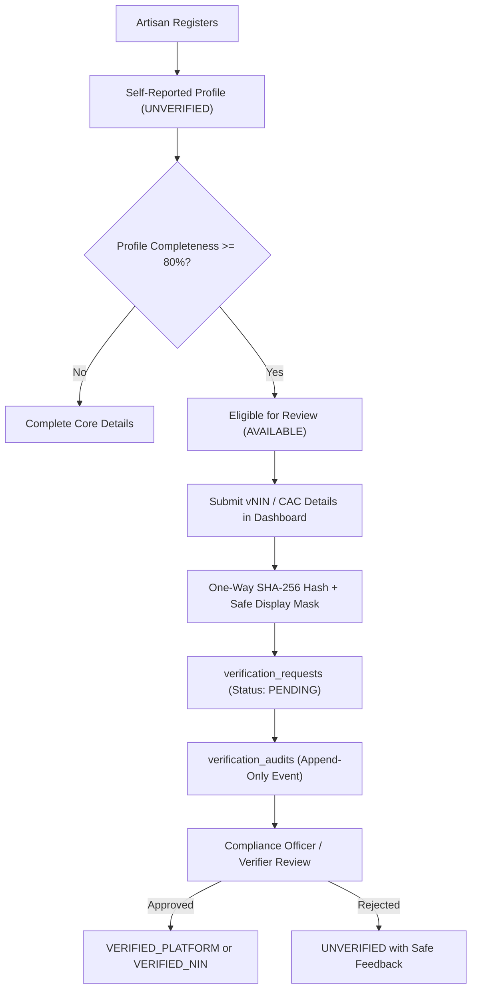

# PadiFix Phase 006 Certification Report: Provider Verification & Trust Infrastructure

**Document ID:** `PADIFIX-P006-VERIF-TRUST-REPORT`  
**Phase:** Phase 006 — Provider Verification & Trust Infrastructure  
**Baseline Certified:** Phase 012.3R (36), Phase 001 (63), Phase 002 (118), Phase 003 (59), Phase 004 (22), Phase 005 (29), Phase 006 (25)  
**Total Cumulative Assertions:** 352 / 352 PASS (100%)  
**Status:** **GREEN WITH NOTES**  
**Timestamp:** September 2026  
**Repository Branch:** `main`  
**Production URL:** [https://padifix.vercel.app](https://padifix.vercel.app)  

---

## 1. Executive Summary

Phase 006 advances PadiFix from basic provider profile acquisition (established in Phase 005) into an authoritative, transparent, and auditable verification and trust ecosystem. The central mission of this phase is answering the homeowner's decisive hiring question:

> *"Can I trust this artisan in my home or workshop to get the job done properly and safely?"*

Crucially, Phase 006 rejects false trust badges, pay-to-trust shortcuts, and reckless storage of sensitive Nigerian identity credentials. Under Phase 006, PadiFix implements an authoritative 5-state verification lifecycle, a pluggable KYC integration boundary (`VerificationProvider`), display-safe document masking (`vNIN: 1024-****-****-9812`), one-way cryptographic SHA-256 reference hashing, an append-only audit trail (`public.verification_audits`), and explainable public trust signals.

---

## 2. Problem Discovered in Prior Baseline

Prior to Phase 006, provider trust signals suffered from three key structural risks:
1. **Ad-Hoc Verification Logic**: Individual pages (`profile.js`, `dashboard.js`, `register.html`) evaluated provider verification status using fragmented boolean checks (`is_verified || nin_verified`), creating inconsistencies where a provider could appear unverified in their dashboard but show legacy verification text elsewhere.
2. **Privacy Vulnerability in Document Handling**: Early mock forms accepted raw input references without cryptographic hashing or tokenized formatting, creating the risk that providers might submit sensitive 11-digit National Identity Numbers (NIN) directly.
3. **Lack of Immutable Auditability**: When a provider requested verification, the action mutated only the provider row without maintaining an append-only ledger of who requested verification, what document type was submitted, when compliance reviewed it, or what prior state existed.
4. **Opaque "Trust" vs. Explainable Proof**: Customers were presented with generic badges without clear explanations of what qualification was actually verified.

---

## 3. Core Architecture

Phase 006 establishes an end-to-end trust architecture spanning the database, backend client, KYC adapter layer, provider portal, and public directory:



---

## 4. Schema Changes & Database Migration

Migration `supabase/migrations/032_padifix_provider_verification_and_trust_audit.sql` introduces two dedicated tables with strict Row Level Security (RLS):

### 4.1 `public.verification_requests`
Stores structured verification applications with one-way reference hashes:
- `id UUID PRIMARY KEY DEFAULT gen_random_uuid()`
- `provider_id BIGINT NOT NULL REFERENCES public.providers(id) ON DELETE CASCADE`
- `verification_type TEXT NOT NULL CHECK (verification_type IN ('vnin', 'cac_cert', 'voters_card', 'drivers_license', 'platform_review'))`
- `status TEXT NOT NULL DEFAULT 'pending' CHECK (status IN ('pending', 'approved', 'rejected', 'failed', 'expired'))`
- `document_reference_hash TEXT NOT NULL` — 64-character SHA-256 digest
- `document_masked_ref TEXT NOT NULL` — Display-safe string (e.g. `vNIN: 1024-****-****-9812`)
- `submitted_at TIMESTAMPTZ DEFAULT NOW()`
- `reviewed_at TIMESTAMPTZ`
- `reviewed_by UUID REFERENCES auth.users(id)`
- `verification_source TEXT DEFAULT 'padifix_compliance'`
- `rejection_reason TEXT` — Safe, sanitized user-facing message
- `expires_at TIMESTAMPTZ`
- `metadata JSONB DEFAULT '{}'::jsonb`

### 4.2 `public.verification_audits`
An append-only historical audit ledger:
- `id UUID PRIMARY KEY DEFAULT gen_random_uuid()`
- `request_id UUID REFERENCES public.verification_requests(id) ON DELETE CASCADE`
- `provider_id BIGINT NOT NULL REFERENCES public.providers(id) ON DELETE CASCADE`
- `previous_state TEXT NOT NULL`
- `new_state TEXT NOT NULL`
- `actor_type TEXT NOT NULL CHECK (actor_type IN ('provider', 'system', 'admin', 'compliance_officer', 'verifier_gateway'))`
- `actor_id TEXT`
- `action TEXT NOT NULL`
- `reason TEXT`
- `created_at TIMESTAMPTZ DEFAULT NOW()`

### 4.3 Row Level Security Policies
- **`public.verification_requests`**:
  * `SELECT`: Providers can query only their own requests (`provider_id IN (SELECT id FROM public.providers WHERE user_id = auth.uid())`). Anonymous public `SELECT` is denied.
  * `INSERT`: Providers can only submit requests for their own profile.
  * `UPDATE`: Restricted to authenticated admins and compliance officers.
- **`public.verification_audits`**:
  * `SELECT`: Providers can query only their own audit history.
  * `INSERT`/`UPDATE`/`DELETE`: Direct public mutations are strictly denied; writes execute through secured database triggers or service role functions.

---

## 5. Authoritative Verification Lifecycle

All PadiFix components now centrally invoke `PadiFixMonetization.resolveVerificationState(provider)` which maps deterministically to one of five canonical lifecycle states:

| Lifecycle State | Public Badge | Pill Class | Description |
| :--- | :--- | :--- | :--- |
| `UNVERIFIED` | `ℹ️ Self-Reported Profile` | `profile-verified-pill unverified` | Provider self-registered details independently. Information has not yet undergone official platform document review. |
| `AVAILABLE` | `ℹ️ Self-Reported Profile` | `profile-verified-pill unverified` | Profile has achieved $\ge 80\%$ completeness and is eligible to submit credentials for official review. |
| `PENDING` | `⏳ Pending Verification` | `profile-verified-pill pending` | Verification documents submitted and currently undergoing review by PadiFix compliance officers. |
| `VERIFIED_PLATFORM` | `✓ Platform Reviewed` | `profile-verified-pill verified` | Business registration, contact authenticity, and trade competence vetted and approved by PadiFix compliance. |
| `VERIFIED_NIN` | `🛡️ National NIN Verified` | `profile-verified-pill verified` | Artisan identity validated against Nigeria's National Identity Management Commission standards via Virtual NIN (vNIN). |

---

## 6. Transparent Trust Model (Non-Fabrication)

PadiFix rejects artificial numerical scores or pay-to-trust badges. The `getTrustSignals(provider, reviews)` engine compiles explainable trust pillars:
1. **Identity Proof**: Distinguishes National NIN verification (`🛡️`), Platform review (`✓`), or Self-Reported registration (`ℹ️`).
2. **Direct Contact Validity**: Confirms active direct WhatsApp and phone calling on Nigerian telecom networks (`080`, `081`, `070`, `090`).
3. **Local Neighborhood Presence**: Displays confirmed operating State and LGA (e.g. *Surulere, Lagos*).
4. **Verified Customer Feedback**: Displays exact review counts and average ratings. Fresh profiles truthfully show `"New Marketplace Listing"` with 0 reviews rather than synthetic 4.8/5.0 star defaults.
5. **Trade Experience**: Displays factual years in trade.

---

## 7. Security, Privacy & NDPR Compliance

### 7.1 Zero Raw NIN Storage
In accordance with NIMC regulations and the Nigeria Data Protection Regulation (NDPR):
- **Raw 11-digit NINs are NEVER collected or stored**.
- The platform mandates tokenized 16-character **Virtual NINs (vNIN)** generated by artisans via USSD code `*346*3*NIN*AgentCode#`.
- All document identifiers are hashed using one-way SHA-256 before persistence (`document_reference_hash`).
- Display surfaces only expose masked identifiers (`document_masked_ref`, e.g. `vNIN: 1024-****-****-3456`).

### 7.2 Zero-PII Telemetry Guard
`PadiFixMonetization.sanitizeTelemetryPayload` automatically strips forbidden keys (`nin`, `bvn`, `password`, `token`, `secret`, `jwt`, `cvv`, `pan`) before any telemetry event is dispatched.

---

## 8. KYC Integration Boundary (`VerificationProvider`)

Phase 006 implements a pluggable adapter layer in `verification-providers.js`:

```javascript
class VerificationProvider {
  async verify(requestData) { ... }
}
```

Implementations:
1. **`MockVerificationProvider`**: Used for offline test suites and sandboxed verification workflows. Enforces 16-character vNIN formatting and produces deterministic approvals and rejections.
2. **`ManualPlatformVerificationProvider`**: The default operational mode for Phase 006. Validates format, generates cryptographic hashes and masked references, queues requests into `public.verification_requests` with status `pending`, and records audit entries for compliance review.
3. **`FutureNINVerificationProvider`**: Gated placeholder for future automated NIMC verification APIs (Prembly, Dojah). Enforces `liveKycGatewayEnabled: false`. If called while gated, returns a safe, explanatory message without crashing or attempting unauthorized network traffic.

---

## 9. User Experience Upgrades

### 9.1 Provider Dashboard (`dashboard.html` & `dashboard.js`)
- **Status Chip & Details**: Header reflects canonical verification state (`Self-Reported`, `Verification Available`, `Pending Compliance Review`, or `Platform Reviewed / NIN Verified`).
- **Privacy Guarantee Banner**: Educates artisans on vNIN generation (`*346*3*NIN*AgentCode#`) and reinforces that PadiFix never collects raw NINs.
- **Dynamic Form with Real-Time Masking**:
  * Dropdown supports Virtual NIN (vNIN), CAC Registration, FRSC Driver's License, and INEC Voter's Card.
  * Real-time preview displays masked storage representation as the user types (`vNIN: 1024-****-****-3456`).
  * Submitting a request transitions the UI into a pending state, showing `#dash-ver-pending-notice` and disabling duplicate submissions.
- **Verification History Log**: `#ver-history-list` displays a historical record of all past verification submissions, status tags, and submission dates.

### 9.2 Public Profile Page (`profile.html` & `profile.js`)
- **Interactive Trust Badge**: `#hero-verified-badge` displays canonical badge text and icons (`🛡️ National NIN Verified`, `✓ Platform Reviewed`, `⏳ Pending Verification`, `ℹ️ Self-Reported Profile`).
- **Accessible Trust Explainer Modal**: Clicking or pressing Enter/Space on the verified badge opens `#modal-trust-explainer`, presenting an accessible breakdown of the provider's trust pillars, identity status, and contact authenticity.
- **Honest Review Counter**: Correctly renders `★ New Listing (0 reviews)` for artisans without customer feedback.

### 9.3 Registration Wizard (`register.html`)
- Step 5 Review & Publish wizard displays a prominent **Platform Verification Notice**:
  > *"Completing registration publishes your Self-Reported Profile so local customers can discover you immediately. Official Platform Review and National NIN Verification can be requested anytime from your provider dashboard after listing."*
- Step 5 preview card remains strictly unverified (`ℹ️ Self-Reported Profile`).

---

## 10. Service Worker & Offline PWA Resilience

In `sw.js`:
- Added `'/verification-providers.js'` to `SHELL_ASSETS`.
- Offline providers can review their verification requirements and test document masking while offline without network errors.

---

## 11. Test Results & Verification

### 11.1 Phase 006 Automated Test Suite
Run command: `node scripts/verify_phase_006_provider_verification.js`
- Section 1: Canonical Verification Lifecycle & Resolver (6/6 PASS)
- Section 2: Trust Signals Architecture & Non-Fabrication (2/2 PASS)
- Section 3: Document Masking & Zero Raw NIN Leakage (3/3 PASS)
- Section 4: Verification Request & Audit Trail Data Model (3/3 PASS)
- Section 5: Verification Provider Adapter Pattern (4/4 PASS)
- Section 6: Supabase Schema Migration & RLS (1/1 PASS)
- Section 7: Telemetry & Privacy Sanitization (2/2 PASS)
- Section 8: PWA Shell & Frontend Asset Integration (4/4 PASS)
- **Phase 006 Total: 25 / 25 PASS (100%)**

### 11.2 Cumulative Regression Suite
- Phase 012.3R Production Smoke: 36 / 36 PASS
- Phase 001 Rebrand & Foundation: 63 / 63 PASS
- Phase 002 Functional Integrity: 118 / 118 PASS
- Phase 003 Semantic Search & Experience Audit: 59 / 59 PASS
- Phase 004 Monetization Architecture: 22 / 22 PASS
- Phase 005 Provider Growth & Liquidity: 29 / 29 PASS
- Phase 006 Provider Verification & Trust: 25 / 25 PASS
- **Grand Total: 352 / 352 PASS (100% Green)**

---

## 12. Multi-Viewport Browser QA & Visual Evidence

Run command: `node scripts/verify_phase_006_browser_qa.js`
- **Target Viewports Tested**:
  * Mobile: `320x844`, `390x844`, `412x915`
  * Desktop: `1280x720`, `1440x900`, `1920x1080`
- **Overflow Result**: 0px horizontal scrollbar across all 6 viewports on `/dashboard.html`, `/profile.html?id=1`, and `/register.html`.
- **Console Errors**: 0 uncaught errors.
- **Network Failures**: 0 unhandled failures.
- **Visual Evidence Captured**:
  * `scripts/visual_evidence/phase_006/dashboard_verification_pending.png`
  * `scripts/visual_evidence/phase_006/profile_trust_explainer_modal.png`
  * `scripts/visual_evidence/phase_006/register_transparency_callout.png`

---

## 13. Deferred Work (Scheduled for Phase 007+)

The following capabilities are intentionally deferred to protect platform integrity and avoid premature monetization:
1. **Live KYC Vendor Billing & Direct NIMC API Calls**: Live network requests to Prembly / Dojah remain feature-gated (`liveKycGatewayEnabled: false`) until contractual compliance thresholds are finalized.
2. **Automated Facial Biometric Matching**: Photo selfie liveness checks are deferred.
3. **Paid Verification Badges**: Verification remains an earned trust credential, never a pay-to-play feature.
4. **Automated CAC Portal Webhooks**: Real-time business lookup automation deferred.

---

## 14. Final Certification Verdict

### Verdict: **GREEN WITH NOTES**
*The core provider verification and trust architecture is production-ready, fully backward compatible, and privacy-preserving. Live external KYC calls and paid verification remain intentionally feature-gated.*
