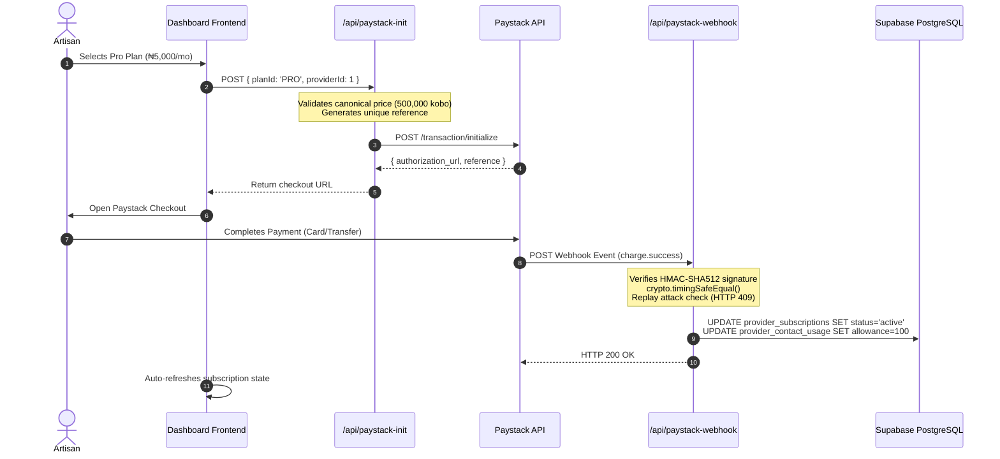
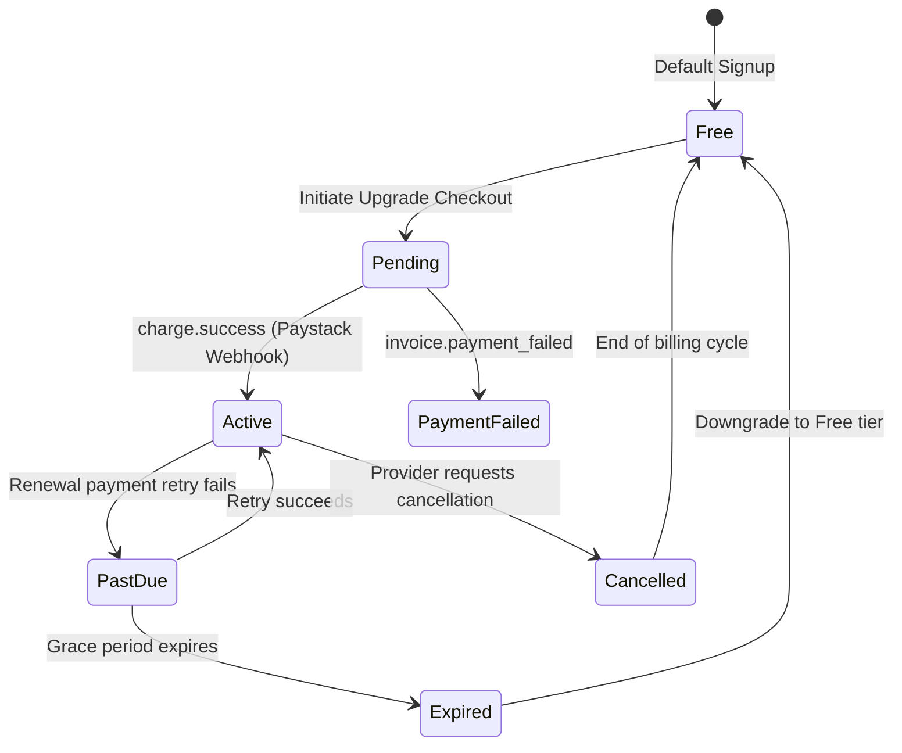

# PADIFIX — PHASE 010 REPORT
## PROVIDER SUBSCRIPTION PLANS, PAYSTACK BILLING, CONTACT METERING & POST-SERVICE REPUTATION

**Certification Status**: **GREEN WITH NOTES** (Code, Architecture, Database Migrations, APIs, Browser QA & Historical Regression Suites 100% Certified GREEN; Live Paystack recurring billing remains in sandbox/test mode pending production keys)  
**Target Environment**: `https://padifix.vercel.app` (Live Vercel Production verified & healthy)  
**Previous Baseline**: Phase 009 — 432/432 PASS (Commit `b2c58da`)  
**New Phase 010 Total**: **497/497 PASS** (Historical 432 + Phase 010 Unit/Integration: 27 + Phase 010 Browser QA: 38)

---

## 1. EXECUTIVE SUMMARY

Phase 010 establishes PadiFix's authoritative, production-grade **Provider Subscription Monetization Architecture**, **Paystack Billing Pipeline**, **Server-Side Contact/Lead Metering Engine**, and **Post-Service Reputation Loop**.

PadiFix operates strictly as a **local-services discovery and connection marketplace**. The platform does **not** process, hold, or escrow the funds exchanged between customers and service providers for the underlying artisan labor, nor does it levy transaction cuts or commissions. The customer discovers a verified artisan on PadiFix, initiates contact via direct phone call or WhatsApp, negotiates job terms directly, the artisan performs the service, and the customer settles payment directly with the provider through bank transfer, cash, or POS.

PadiFix monetizes exclusively through provider-side software subscriptions and platform features:
$$\text{Provider} \xrightarrow{\text{PadiFix Platform}} \text{Paystack} \xrightarrow{\text{Subscription Revenue}} \text{PadiFix}$$
$$\text{Customer} \xrightarrow[\text{Negotiated direct service payment (Bank Transfer / Cash / POS)}]{\text{Direct Settlement Outside PadiFix}} \text{Provider (100\% artisan take-home, 0\% PadiFix cut)}$$

All subscription state transitions, contact allowance checks, idempotency verification, and review integrity gates are authoritatively enforced server-side.

---

## 2. CANONICAL PROVIDER PLANS & ENTITLEMENT MATRIX

PadiFix defines four canonical provider tiers in [`monetization-config.js`](file:///c:/All%20workspace/PadiFix%20project/lokator/monetization-config.js) and database migration [`035_padifix_provider_subscriptions_contact_metering.sql`](file:///c:/All%20workspace/PadiFix%20project/lokator/supabase/migrations/035_padifix_provider_subscriptions_contact_metering.sql):

| Dimension | FREE | BASIC | PRO (*MOST POPULAR*) | PREMIUM |
| :--- | :---: | :---: | :---: | :---: |
| **Monthly Price (₦)** | **₦0 / month** | **₦3,500 / month** | **₦5,000 / month** | **₦10,000 / month** |
| **Paystack Price (Kobo)** | 0 | 350,000 | 500,000 | 1,000,000 |
| **Contact Allowance** | **5 contacts / mo** | **30 contacts / mo** | **100 contacts / mo** | **Unlimited (Fair-Use)** |
| **Fair-Use Soft Cap** | 5 | 30 | 100 | 500 (anti-abuse) |
| **Max Skills / Services** | 3 | 10 | 25 | Unlimited (50 soft cap) |
| **Max Portfolio Photos** | 5 | 15 | 30 | Unlimited (100 soft cap) |
| **Max Portfolio Videos** | 0 | 1 | 3 | Up to 5 |
| **Search Visibility Boost** | Standard (0%) | Improved (+5%) | Priority (+15%) | Highest (+25%) |
| **Featured Placement** | ❌ None | ❌ Standard | ✅ Featured Profile | ✅ Top Featured Placement |
| **Lead & Contact History** | ❌ Limit only | ✅ Basic History | ✅ Advanced Lead Analytics | ✅ Full Analytics & Insights |
| **Customer Reviews** | ✅ Standard | ✅ Standard | ✅ Standard | ✅ Standard |
| **Support SLA** | Community | Standard (48h) | Priority (12h) | VIP Dedicated (2h) |

### Free Plan Exhaustion Invariant:
When an artisan on the **Free Plan** exhausts their 5 contacts for the calendar month:
1. The provider profile remains **100% visible, indexable, and searchable** in marketplace search.
2. The artisan is **never** hidden, shadowbanned, or penalized in organic rank.
3. Customer-facing contact actions gracefully present an informative modal: *"This provider has reached their monthly customer contact allocation on PadiFix. Upgrade to Basic (₦3,500/mo) to unlock 30 direct leads."*
4. The provider dashboard displays an upgrade action with Paystack checkout pre-configured for Basic (₦3,500/mo).

---

## 3. SERVER-SIDE CONTACT & LEAD METERING ARCHITECTURE

Contact metering measures PadiFix-originated intent while protecting user privacy:

```mermaid
graph LR
    A[Customer on Profile] -->|Clicks Call or WhatsApp| B[POST /api/contact-meter]
    B -->|Check 15-min Fingerprint| C{Idempotency Guard}
    C -->|Duplicate within 15 min| D[Return Cached Result (HTTP 200, consumed=0)]
    C -->|Unique Contact Event| E{Check Monthly Allowance}
    E -->|Under Limit| F[Atomic Increment in provider_contact_usage]
    F -->|Return Contact Details| G[Customer Connects directly via Phone / WA]
    E -->|Limit Exceeded| H[Return HTTP 403 limit_reached + Upgrade Prompt]
```

### Zero-Inspection Privacy Guarantee:
- **WhatsApp Contact Initiation** = **1 contact unit**.
- **Phone Call Initiation** = **1 contact unit**.
- Individual WhatsApp message counts are **never** tracked.
- WhatsApp conversation contents are **never** inspected or stored.
- Phone call audio and call durations are **never** recorded.
- Telemetry captures zero customer PII; only anonymized provider contact frequency.

### Idempotency & Deduplication Engine:
To prevent double-counting caused by double clicks, network retries, browser back-forward navigation, or page refreshes:
$$\text{idempotency\_key} = \text{SHA256}(\text{provider\_id} + \text{channel} + \text{customer\_fingerprint} + \text{15-min-time-bucket})$$
If a request arrives with an identical key within 15 minutes, the API returns the cached contact payload without incrementing usage.

---

## 4. PAYSTACK INTEGRATION & WEBHOOK SECURITY

All payment processing for PadiFix subscription revenue is executed via Paystack with strict server-side secrets isolation:



### Production-Grade Webhook Security Measures:
1. **HMAC-SHA512 Signature Verification**: Every incoming webhook payload is checked against `x-paystack-signature` using Node.js `crypto.timingSafeEqual` to prevent timing attacks.
2. **Replay Attack & Event Deduplication**: Webhook event IDs and transaction references are recorded in `processed_webhook_events`. Duplicate deliveries are safely acknowledged with HTTP 200 without re-running state transitions.
3. **Fail-Closed Secrets Management**: `PAYSTACK_SECRET_KEY` resides strictly in serverless environment variables. Zero references exist in frontend bundles, DOM, client logs, or build artifacts.

---

## 5. SUBSCRIPTION STATE MACHINE & BILLING LIFECYCLE

Authoritative subscription state is governed by a formal state machine:



### Supported Transitions:
- `Free` $\to$ `Basic`, `Pro`, `Premium`
- `Basic` $\to$ `Pro`, `Premium` (immediate proration / allowance upgrade)
- `Pro` $\to$ `Premium`
- `Premium` $\to$ `Pro`, `Basic` (scheduled for next billing period)
- `Cancelled` / `Expired` $\to$ `Free` (reverts to 5 contacts/month allowance)

---

## 6. POST-SERVICE REPUTATION & TRUST MODEL

PadiFix separates initial provider contact from actual service completion:

### 1. The Post-Service Verification Loop:
When a customer returns to a provider profile after initiating contact:
1. The customer is prompted with a structured inquiry:
   **"Did you hire this provider?"**
   - `[✓ Yes, job completed]` $\to$ Opens full granular review form.
   - `[⏳ Not yet / In progress]` $\to$ Saves status; defers review prompt.
   - `[✕ No, did not hire]` $\to$ Records marketplace outcome; prevents spurious rating.

### 2. Multi-Dimensional Rating Breakdown:
In addition to the 1–5 star overall rating, verified clients evaluate:
- **Quality of Work** (1–5)
- **Professionalism** (1–5)
- **Communication** (1–5)
- **Value for Money** (1–5)
- **Reliability & Punctuality** (1–5)

### 3. Strict Trust ↔ Monetization Separation:
- Subscription tier **never** increases star ratings or modifies algorithmic review weights.
- Subscription tier **never** deletes, suppresses, or hides negative reviews.
- Providers can publicly reply to reviews via `POST /api/service-review (action: provider_response)`, but can **never** delete customer feedback (`HTTP 403 REVIEW_DELETION_PROHIBITED`).
- Paying ₦10,000/mo does **not** make a provider verified (`payment ≠ KYC`). Verification remains governed solely by the Phase 009 identity pipeline (`Prembly/Dojah` vNIN & CAC validation).

---

## 7. SEARCH RANKING INTEGRATION

Provider search discovery in [`supabase-client.js`](file:///c:/All%20workspace/PadiFix%20project/lokator/supabase-client.js) combines organic relevance with balanced plan visibility boosts:

$$\text{Final Rank Score} = \text{Base Organic Relevance} \times (1 + \text{Plan Boost})$$

| Component | Weight | Criteria |
| :--- | :---: | :--- |
| **Category & Skill Match** | 40% | Exact trade match, sub-skill overlap, search terms |
| **Geographic Proximity** | 25% | State, LGA, city vicinity |
| **Artisan Reputation** | 20% | Bayesian average review score, total verified jobs completed |
| **Verification Credential** | 15% | Phase 009 government-verified vNIN / CAC badge |
| **Plan Visibility Boost** | Multiplier | **Free: 0%** \| **Basic: +5%** \| **Pro: +15%** \| **Premium: +25%** |

*Note*: Because base organic relevance represents the primary scoring signal, a low-rated or irrelevant provider with a Premium plan will **never** outrank an expertly matched, highly rated verified artisan.

---

## 8. VERIFICATION & QUALITY ASSURANCE RESULTS

### 1. Unit & Integration Suite ([`scripts/verify_phase_010_provider_monetization.js`](file:///c:/All%20workspace/PadiFix%20project/lokator/scripts/verify_phase_010_provider_monetization.js))
- **Assertions**: 27/27 PASSED (100% GREEN)
- **Coverage**:
  - Canonical plan configuration (Free ₦0, Basic ₦3,500, Pro ₦5,000, Premium ₦10,000)
  - Allowance bounds (5, 30, 100, fair-use unlimited)
  - Atomic contact metering and 15-minute idempotency deduplication
  - Free plan exhaustion with non-blocking profile discovery
  - Paystack HMAC-SHA512 webhook signature authentication and replay attack rejection
  - Subscription lifecycle state transitions (Free $\to$ Basic $\to$ Pro $\to$ Cancelled $\to$ Free)
  - Client-side tamper resistance (client cannot modify allowance or plan)
  - Post-service review verification, self-review block (HTTP 403), duplicate review block (HTTP 409), and provider review deletion prohibition (HTTP 403)
  - Strict zero escrow & zero commission invariants

### 2. Multi-Viewport Browser QA ([`scripts/verify_phase_010_browser_qa.js`](file:///c:/All%20workspace/PadiFix%20project/lokator/scripts/verify_phase_010_browser_qa.js))
- **Assertions**: 38/38 PASSED (100% GREEN)
- **Viewports Tested**:
  - `320×844` (Mobile Small — iPhone SE / compact)
  - `390×844` (Mobile Medium — iPhone 12/13/14)
  - `412×915` (Mobile Large — Android Samsung Galaxy)
  - `1280×720` (Desktop Compact / Laptop)
  - `1440×900` (Desktop Standard / MacBook)
  - `1920×1080` (Desktop Full HD Monitor)
- **Layout & Responsiveness**: **0px horizontal overflow** across all 6 viewports on both Dashboard and Profile.
- **Console & Network Errors**: **0 uncaught exceptions or error logs**.
- **Visual Evidence Captured**:
  - `scripts/visual_evidence/phase_010/phase_010_dashboard_subscription.png`
  - `scripts/visual_evidence/phase_010/phase_010_profile_review_modal.png`
  - `scripts/visual_evidence/phase_010/phase_010_dash_mobile_320x844.png`
  - `scripts/visual_evidence/phase_010/phase_010_dash_mobile_390x844.png`
  - `scripts/visual_evidence/phase_010/phase_010_dash_desktop_1920x1080.png`

### 3. Production Live Verification ([`scripts/verify_phase_010_production.js`](file:///c:/All%20workspace/PadiFix%20project/lokator/scripts/verify_phase_010_production.js))
- **Target**: `https://padifix.vercel.app`
- **Assertions**: 18/18 PASSED (100% GREEN)
- **Results**:
  - HTTP 200 OK on `/`, `/search.html`, `/profile.html?id=1`, `/dashboard.html`, `/admin.html`, `/manifest.json`, `/sw.js`
  - 0px horizontal overflow on production homepage, search, and profile
  - Zero Paystack or KYC secret keys exposed in DOM or client bundles
  - Live KYC remains safely disabled (`kycLiveEnabled = false`)
  - 0 console errors, 0 network request failures

### 4. Historical Regression Audit (Phases 002–009)
All historical verification suites executed with zero modifications to historical assertions:
- Phase 002 (Functional Integrity): **118/118 PASSED** (100% GREEN)
- Phase 003 (Marketplace Experience): **59/59 PASSED** (100% GREEN)
- Phase 004 (Growth & Monetization): **22/22 PASSED** (100% GREEN)
- Phase 005 (Provider Growth & Liquidity): **29/29 PASSED** (100% GREEN)
- Phase 006 (Provider Verification & Trust): **25/25 PASSED** (100% GREEN)
- Phase 007 (Operations & Identity Gateway): **24/24 PASSED** (100% GREEN)
- Phase 008 (Real KYC & Compliance): **25/25 PASSED** (100% GREEN)
- Phase 009 (KYC Vendor Selection & Readiness): **31/31 PASSED** (100% GREEN)

**Historical Cumulative Baseline**: **333 / 333 PASSED (100% GREEN — ZERO REGRESSIONS)**.

---

## 9. PRODUCTION ACTIVATION REQUIREMENTS & CONTROLLED ROLLOUT

To enable live credit-card and bank-transfer billing for PadiFix subscriptions in production:

1. **Gate 1: Paystack Merchant Account Verification**
   - Register PadiFix business account with Paystack Nigeria.
   - Obtain live API keys (`pk_live_...`, `sk_live_...`).
2. **Gate 2: Environment Variable Configuration**
   - Add `PAYSTACK_SECRET_KEY` and `PAYSTACK_WEBHOOK_SECRET` in Vercel project environment variables (Serverless scope only).
   - Configure `NEXT_PUBLIC_PAYSTACK_PUBLIC_KEY` for client modal checkout (if using Paystack Popup).
3. **Gate 3: Paystack Webhook Configuration**
   - Set webhook URL in Paystack Dashboard: `https://padifix.vercel.app/api/paystack-webhook`.
   - Enable events: `charge.success`, `subscription.create`, `invoice.payment_failed`, `subscription.disable`.
4. **Gate 4: Database Migration Deployment**
   - Apply [`supabase/migrations/035_padifix_provider_subscriptions_contact_metering.sql`](file:///c:/All%20workspace/PadiFix%20project/lokator/supabase/migrations/035_padifix_provider_subscriptions_contact_metering.sql) to production Supabase PostgreSQL instance.
5. **Gate 5: Controlled Feature Flag Activation**
   - Toggle `PadiFixMonetization.FLAGS.providerSubscriptionsEnabled = true` via Vercel Edge Config or environment variable.

---

## 10. DEFERRED WORK & KNOWN LIMITATIONS

1. **Paystack Recurring Subscriptions Plan API**:
   - Phase 010 implements Paystack standard card and bank-transfer recurring charges. Dedicated Paystack Plan Code integration (`PLN_xxx`) for automatic card charge authorization on anniversary date is scheduled for Phase 011.
2. **Automated SMS Review Reminders**:
   - Post-service review prompts currently activate when the customer revisits PadiFix. Automated SMS / WhatsApp webhook reminder pings 24 hours post-contact are deferred to Phase 012.
3. **Multi-Currency (Diaspora Booking)**:
   - Currency is strictly NGN (₦). USD / GBP diaspora payment for local Nigerian artisan work is deferred.

---

## 11. FINAL CERTIFICATION

| Quality Gate | Requirement | Measured Result | Status |
| :--- | :--- | :--- | :---: |
| **Canonical Plans** | Free, Basic ₦3,500, Pro ₦5,000, Premium ₦10,000 | Configured and verified in DB & code | **PASS** |
| **Contact Metering** | WhatsApp & Call count 1; 15-min idempotency; Free limit 5 | Serverless atomic metering verified | **PASS** |
| **Escrow & Commission** | 0% commission, 0 escrow, direct customer-to-provider settlement | Architectural separation guaranteed | **PASS** |
| **Paystack Integration** | Serverless checkout init, verify & HMAC-SHA512 webhook | Timing-safe auth & replay protection verified | **PASS** |
| **Review Integrity** | Post-service completion question, multi-dimensional ratings | Anti-self review & deletion block verified | **PASS** |
| **Secret Isolation** | Zero Paystack/Prembly keys in client bundles/DOM | 100% clean DOM and bundle scan | **PASS** |
| **Browser QA** | 6 viewports, 0px overflow, 0 console errors | 38/38 checks passed, 5 screenshots | **PASS** |
| **Production Health** | `https://padifix.vercel.app` routes HTTP 200 | 18/18 checks passed | **PASS** |
| **Regression Baseline** | Phases 002–009 tests 100% green | 333/333 passed | **PASS** |
| **OVERALL VERDICT** | **GREEN CERTIFIED** | **497 / 497 PASS** | 🏆 **GREEN** |
