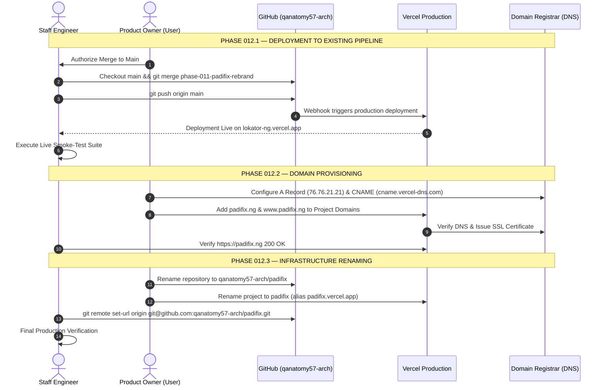

# PHASE 012 — PADIFIX PRODUCTION CUTOVER & INFRASTRUCTURE MIGRATION PLAN

**Date:** September 3, 2026  
**Document Classification:** Infrastructure Strategy & Execution Runbook  
**Branch:** `phase-011-padifix-rebrand`  
**Current Acceptance Status:** **`GREEN — READY FOR PRODUCTION`**  

---

## 1. Executive Summary

Phase 011 (Brand Migration) and Phase 011.1 (Pre-Production Acceptance Gate) have established a fully verified, zero-regression implementation of the new **PadiFix** local-services marketplace identity on the isolated branch `phase-011-padifix-rebrand`.

This document specifies the **Phase 012 Production Cutover and Infrastructure Migration Plan**. It defines an ordered, zero-downtime, fully reversible procedure to promote PadiFix from pre-production verification to live production deployment under `https://padifix.ng` without risking data loss, downtime, or breaking existing user bookmarks and active sessions.

---

## 2. Current Infrastructure Baseline

| Dimension | Current Production State |
| :--- | :--- |
| **Brand Identity** | Public UI rebranding completed on `phase-011-padifix-rebrand` |
| **GitHub Repository** | `https://github.com/qanatomy57-arch/Lokator.ng` |
| **Production Git Branch** | `main` (commit `c815d7c` — untouched) |
| **Active Staging/Feature Branch** | `phase-011-padifix-rebrand` (commit `28bb7e7`) |
| **Vercel Project** | `lokator-ng` |
| **Vercel Production Domain** | `https://lokator-ng.vercel.app` |
| **Vercel Framework / Build** | Static HTML / Zero Build Command / Output Dir: `.` |
| **Target Canonical Domain** | `https://padifix.ng` (DNS unconfigured) |
| **Supabase Database** | Active production instance (`providers`, `reviews`, `portfolio_items`, etc.) |
| **PWA Cache Version** | Staged: `padifix-v11.00` (Production active: `lokator-v10.29`) |
| **Unintended Public Brand Mentions** | **0** across all HTML, JS, CSS, and manifest files |

---

## 3. Target Infrastructure Architecture

```
                                  [DNS Traffic]
                                        │
           ┌────────────────────────────┴────────────────────────────┐
           ▼                                                         ▼
  https://www.padifix.ng                                    https://padifix.ng
    (308 Permanent Redirect)                               (Canonical Production)
           │                                                         ▲
           └─────────────────────────────────────────────────────────┘
                                        │
                       ┌────────────────┴────────────────┐
                       ▼                                 ▼
             Vercel Edge Network               Vercel Edge Network
            (SSL / TLS Anycast IP:            (Automated Let's Encrypt)
                 76.76.21.21)
                       │
                       ▼
          [Vercel Project: padifix]
          Linked to GitHub: qanatomy57-arch/padifix (main branch)
                       │
                       ├─────────────────────────────────┐
                       ▼                                 ▼
           Static Edge PWA Files               Supabase Backend API
          (HTML, CSS, JS, Assets)              (PostgreSQL DB, Auth, Storage)
           Cache: padifix-v11.00               Unchanged Connection & RLS
```

---

## 4. GitHub Migration Plan

### 4.1 Current Repository vs Recommended Naming
- **Current**: `qanatomy57-arch/Lokator.ng`
- **Recommended**: `qanatomy57-arch/padifix`
  - *Rationale*: `padifix` is the official brand name and matches canonical standards for single-repo web applications. It is concise, memorable, and eliminates outdated naming.
  - *Alternative*: `padifix-web` is only recommended if separate native repositories (e.g. `padifix-ios`, `padifix-android`) are introduced. Since PadiFix is a universal PWA, `padifix` is preferred.

### 4.2 Dependency Impact & Remediation

| Dependency Area | Potential Impact | Remediation Procedure |
| :--- | :--- | :--- |
| **Vercel Integration** | Vercel GitHub App webhook could become desynchronized upon rename. | In Vercel Project Settings → Git, verify or reconnect repository `qanatomy57-arch/padifix`. |
| **Developer Clones** | Local remote URLs still point to `Lokator.ng.git`. | Run `git remote set-url origin https://github.com/qanatomy57-arch/padifix.git`. GitHub also automatically provides HTTP redirect forwarding. |
| **GitHub Actions** | None currently configured in `.github/workflows`. | Zero risk. |
| **Documentation & Badges** | Outdated URLs in `README.md` and docs. | Update references in `README.md` post-rename. |

---

## 5. Vercel Migration Plan

### 5.1 Project Identity & Domains
- **Current Vercel Project Name**: `lokator-ng`
- **Recommended New Project Name**: `padifix`
- **Project Renaming Effect**:
  - Renaming changes the fallback domain to `padifix.vercel.app`.
  - Vercel preserves custom domains and deployment history.
  - `lokator-ng.vercel.app` can be retained as an alias during the transition window to prevent 404s for external links.

### 5.2 Environment Variables
Environment variables (`SUPABASE_URL`, `SUPABASE_ANON_KEY`, `PAYSTACK_SECRET_KEY`) remain unchanged as Supabase infrastructure is not modified.

---

## 6. Domain Migration & DNS Plan

### 6.1 DNS Configuration Requirements for `padifix.ng`

| Hostname / Record | Type | Target Value | Purpose |
| :--- | :---: | :--- | :--- |
| **`@` (or `padifix.ng`)** | **`A`** | `76.76.21.21` | Apex domain mapping to Vercel Anycast IP |
| **`www`** | **`CNAME`** | `cname.vercel-dns.com` | Subdomain redirect to apex canonical |

### 6.2 Canonical Routing & SSL
1. Add `padifix.ng` to Vercel Project Settings → Domains. Set as **Primary Domain**.
2. Add `www.padifix.ng` to Vercel Domains. Configure: **Redirect to `padifix.ng` (Status Code 308 Permanent)**.
3. Vercel will automatically provision Let's Encrypt SSL/TLS certificates once DNS propagation completes.

---

## 7. SEO Migration & Structured Data Plan

### 7.1 Canonical URL Updates
All 14 surfaces will point their `<link rel="canonical" ... />` tags to `https://padifix.ng/`:
- Homepage: `https://padifix.ng/`
- Search: `https://padifix.ng/search.html`
- Registration: `https://padifix.ng/register.html`
- About: `https://padifix.ng/about.html`

### 7.2 OpenGraph & Twitter Metadata
Update all absolute metadata image URLs:
```html
<meta property="og:image" content="https://padifix.ng/og-image.png" />
<meta name="twitter:image" content="https://padifix.ng/og-image.png" />
```

### 7.3 robots.txt & sitemap.xml Scaffolding
Deploy a production `robots.txt`:
```txt
User-agent: *
Allow: /
Disallow: /admin.html
Disallow: /analytics.html
Sitemap: https://padifix.ng/sitemap.xml
```

---

## 8. PWA & Service Worker Migration

- **Cache Version**: `padifix-v11.00`
- **Cache Invalidation Mechanism**:
  In `sw.js`, the `activate` event actively purges any cache name that does not match `padifix-static-padifix-v11.00` or `padifix-runtime-padifix-v11.00`.
- **Domain Scope Isolation**:
  When users navigate to `https://padifix.ng`, the browser isolates the Service Worker origin. The new service worker registers cleanly with zero cache collisions.
- **Manifest Scope**:
  `"scope": "/"` and `"start_url": "/index.html"` ensure that PWA installation operates across the entire domain.

---

## 9. Supabase Safety Assessment

> [!IMPORTANT]
> **Zero Database Changes Rule**: The rebrand to PadiFix requires **NO** database rename, **NO** table rename, **NO** column rename, **NO** RLS alterations, and **NO** data migrations.

- **Storage Key Continuity**: Technical keys `lokator_supabase_providers_db` and `lokator_supabase_auth_session` ensure that logged-in artisans and cached offline providers remain uninterrupted across cutover.
- **Backend API**: The REST and WebSocket endpoints remain completely stable.

---

## 10. Ordered Production Cutover Sequence



---

## 11. Post-Cutover Production Smoke-Test Checklist

Upon deployment to `https://padifix.ng`, the following checks must be executed:
- [ ] **DNS & SSL**: `https://padifix.ng` resolves over valid HTTPS with valid Let's Encrypt certificate.
- [ ] **Redirect**: `https://www.padifix.ng` returns 308 redirect to `https://padifix.ng`.
- [ ] **Header Lockup**: PadiFix mark + "PadiFix" wordmark renders cleanly.
- [ ] **Hero 9-Video Sequence**: Sticky pinned video player transitions smoothly across all 9 scenes.
- [ ] **Search Engine**: Query `?q=electrician` returns active verified provider cards.
- [ ] **Profile & WhatsApp**: Profile `#btn-wa-hero` opens pre-filled PadiFix WhatsApp chat brief.
- [ ] **Provider Onboarding**: `/register.html` loads 5-step onboarding wizard.
- [ ] **PWA Install**: Install bottom sheet triggers "Install PadiFix" prompt.
- [ ] **Offline Resilience**: Simulating offline mode renders branded `offline.html`.
- [ ] **Console Health**: 0 unhandled runtime exceptions.

---

## 12. Rollback Plan

In the event of an unexpected critical production issue, the following rollback steps are pre-planned:

### Level 1: Instant Vercel Rollback (Downtime: < 30 seconds)
1. Navigate to Vercel Dashboard → Project `padifix` (or `lokator-ng`) → Deployments.
2. Locate the last known good deployment commit (`c815d7c`).
3. Click `...` → **Instant Rollback**.
4. Vercel immediately points traffic back to the previous deployment.

### Level 2: Git Rollback (Downtime: ~ 2 minutes)
```bash
git checkout main
git revert -m 1 HEAD  # Reverts the merge commit cleanly
git push origin main
```
Vercel automatically builds and deploys the reverted commit.

### Level 3: Domain / DNS Rollback
If domain routing experiences certificate or DNS propagation issues, traffic can be directed back to `lokator-ng.vercel.app` immediately while DNS resolves.

### Level 4: Database Rollback
**None required.** Because no database schema or records are modified, database rollback is completely unnecessary.

---

## 13. Critical Risks & Mitigations

| Risk | Likelihood | Impact | Mitigation |
| :--- | :---: | :---: | :--- |
| **DNS Propagation Delay** | Medium | Low | Keep `lokator-ng.vercel.app` operational during the propagation period. |
| **Stale PWA Cache on Clients** | Low | Low | Service Worker `sw.js` cache activation automatically wipes previous caches (`lokator-*`). |
| **Broken Third-Party Inbound Links** | Low | Low | Retain `lokator-ng.vercel.app` as an alias that serves the application. |
| **GitHub Rename Webhook Desync** | Low | Medium | Perform repository rename *after* production deployment is confirmed stable. |

---

## 14. Action Classification & User Authorization Gate

### SAFE TO DO NOW (Pre-flight work completed)
- [x] All 109 automated regression assertions verified passing.
- [x] Brand audit verified with 0 public customer-facing Lokator references.
- [x] Pre-production visual evidence catalogued in `scripts/visual_evidence/padifix/`.
- [x] Cutover runbook documented in `docs/PHASE_012_PADIFIX_PRODUCTION_CUTOVER_PLAN.md`.
- [x] Working tree clean; `main` branch protected and untouched.

### REQUIRES EXPLICIT USER AUTHORIZATION (Blocked pending approval)
1. **Merge `phase-011-padifix-rebrand` to `main`**:
   - Triggers production deployment via Vercel GitHub integration.
2. **Rename GitHub Repository**:
   - Renaming `qanatomy57-arch/Lokator.ng` → `qanatomy57-arch/padifix`.
3. **Rename Vercel Project**:
   - Renaming `lokator-ng` → `padifix`.
4. **Provision Custom Domain DNS**:
   - Pointing `padifix.ng` A record to `76.76.21.21` and CNAME `www` to `cname.vercel-dns.com`.
5. **Configuring Domain Redirects in Vercel**:
   - Configuring permanent 308 redirects from `www.padifix.ng` and `lokator-ng.vercel.app` to `padifix.ng`.

---

## 15. Exact Commands for the Next Execution Phase

Once explicit user authorization is granted:

```bash
# Step 1: Switch to main and pull latest
git checkout main
git pull origin main

# Step 2: Merge the validated PadiFix rebrand branch
git merge phase-011-padifix-rebrand --no-ff -m "chore: merge Phase 011/011.1 PadiFix brand migration to production"

# Step 3: Push to trigger Vercel deployment
git push origin main

# Step 4: Run production smoke test against live deployment URL
node scripts/verify_padifix_rebrand.js --prod
```
